# 编程语言历史中二版

AI 评分，仅供娱乐。

## **【中二版】六维评分标准**

1.  **【破坏力】极限出力 (运行性能):**
    *   **100分:** 触碰物理法则边界，手撕原子 (Assembly/CUDA)。
    *   **50分:** 拥有凡人难以企及的速度，但受限于虚拟机 (Java/V8 JS)。
    *   **10分:** 甚至无法追上时间的流逝 (纯解释型脚本)。

2.  **【防御力】绝对境界 (稳定性与可靠性):**
    *   **100分:** 形式化验证，因果律武器，编译器即真理 (Idris/Rust)。
    *   **50分:** 拥有常规护盾，但会被穿透 (Java/C#)。
    *   **10分:** 裸奔，甚至会在不知情的情况下自爆 (C/JS的隐式转换)。

3.  **【精神力】构筑术式 (表达力/抽象层次):**
    *   **100分:** 操纵数学与逻辑的本质，言出法随 (Lisp/Haskell)。
    *   **50分:** 经典的面向对象与过程式 (Java/Go)。
    *   **10分:** 只能逐字逐句描述动作 (Assembly)。

4.  **【敏捷度】神之手 (开发效率/灵活性):**
    *   **100分:** 想法即现实，心流无间断 (Ruby/Python)。
    *   **50分:** 需要铺垫和仪式，但一旦启动就很顺畅 (Kotlin/TS)。
    *   **10分:** 写代码像在泥潭中跳舞 (C++/Rust初学)。

5.  **【魔力值】无限书库 (生态系统与社区):**
    *   **100分:** 涵盖森罗万象，这世上没有它做不到的事 (Python/JS)。
    *   **50分:** 在特定领域称王，但跨界困难 (R/Swift)。
    *   **10分:** 荒芜之地，一切皆需手搓 (自制语言)。

6.  **【同调率】凡人亲和 (易用性/入门难度):**
    *   **100分:** 连幼子也能与其共鸣 (Scratch/Python)。
    *   **50分:** 需要经过正规训练的战士 (Java/Go)。
    *   **10分:** 拒绝与凡人精神链接，强行驾驶会导致精神崩溃 (Assembly/Rust)。

## **【第零纪元：1940s - 混沌的微光】**

> 那是在虚空中点燃第一缕火花的年代。世界尚未分化，灵魂（软件）与躯壳（硬件）浑然一体。早期的术士们没有咒语书，他们必须徒手触摸滚烫的真空管，用身体去感受电子的脉动。代码不是写在屏幕上的，而是刻在纸带与穿孔卡片上的契约。那是凡人试图窃取神权（计算能力）的最初尝试，充满了原始的暴力美学与随时可能被反噬的危险。

### **1943 - Plankalkül**

- **中二描述:** **【虚空的蓝图】** 它是康拉德·楚泽在战火纷飞的废墟中绘制的梦想。它是**一切高级语言的“柏拉图理念”**。它存在于物理计算机诞生之前，就像在世界被创造之前就已经写好的物理法则。虽然在当时它没有肉体（未被实现），但它的灵魂（概念）穿越了三十年的时光，在 1975 年才降临人间。
- **必杀技:** 二维语法符号、最早的结构化概念
- **战力评价:** 概念神。虽然没有实战记录，但它是所有魔法的起源设计图。

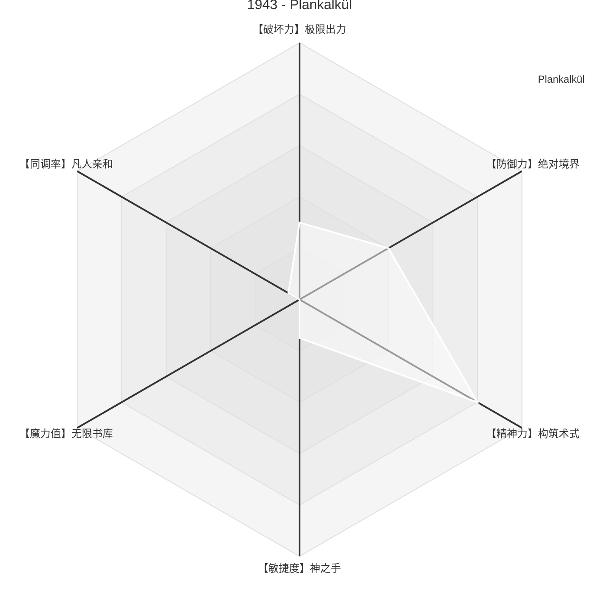
```mermaid
---
title: "1943 - Plankalkül"
config:
  themeVariables:
    cScale0: "#FFFFFF"
---
radar-beta
    axis Perf["【破坏力】极限出力"], Stab["【防御力】绝对境界"], Abst["【精神力】构筑术式"]
    axis DevEff["【敏捷度】神之手"], Eco["【魔力值】无限书库"], Ease["【同调率】凡人亲和"]
    curve a["Plankalkül"] { 30, 40, 80, 15, 0, 5 }
    max 100
    min 0
    graticule polygon
```

### **1948 - Assembly（汇编）**

- **中二描述:** **【太古的支配者】** 直接与其名的灵魂（硬件）对话，以凡人之躯触碰神的领域。它没有护甲，没有咒语，只有赤裸的力量。使用它就像徒手握住锋利的刀刃去切割原子。虽能瞬间毁灭世界，但稍有不慎便会精神崩溃。
- **必杀技:** 直接内存寻址、零开销抽象
- **战力评价:** 极端的偏科战士，除了破坏力一无所有。

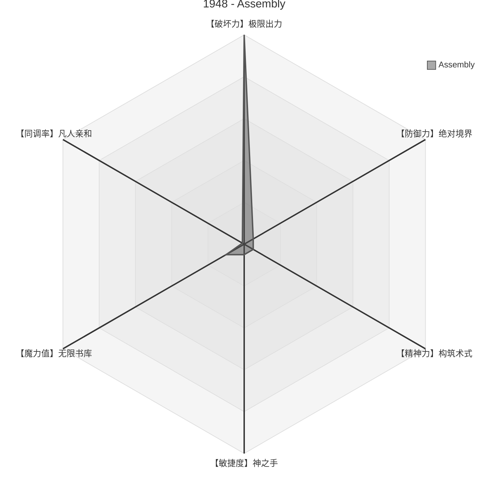
```mermaid
---
title: "1948 - Assembly"
config:
  themeVariables:
    cScale0: "#555555"
---
radar-beta
    axis Perf["【破坏力】极限出力"], Stab["【防御力】绝对境界"], Abst["【精神力】构筑术式"]
    axis DevEff["【敏捷度】神之手"], Eco["【魔力值】无限书库"], Ease["【同调率】凡人亲和"]
    curve a["Assembly"] { 100, 5, 5, 5, 10, 1 }
    max 100
    min 0
    graticule polygon
```

### **1949 - Short Code**

- **中二描述:** **【初诞的咒文】** 人类第一次尝试用“咒语”而非“电路连接”来驱动电子恶魔（BINAC）。虽然它极其缓慢（解释执行，比机器码慢50倍），但它证明了凡人可以通过中间媒介与神对话。它是所有解释型语言的鼻祖。
- **必杀技:** 人工解释执行（将两个数字代码转换为手动连线操作）。
- **战力评价:** 速度极慢的古代魔法，但在当时是唯一的奇迹。

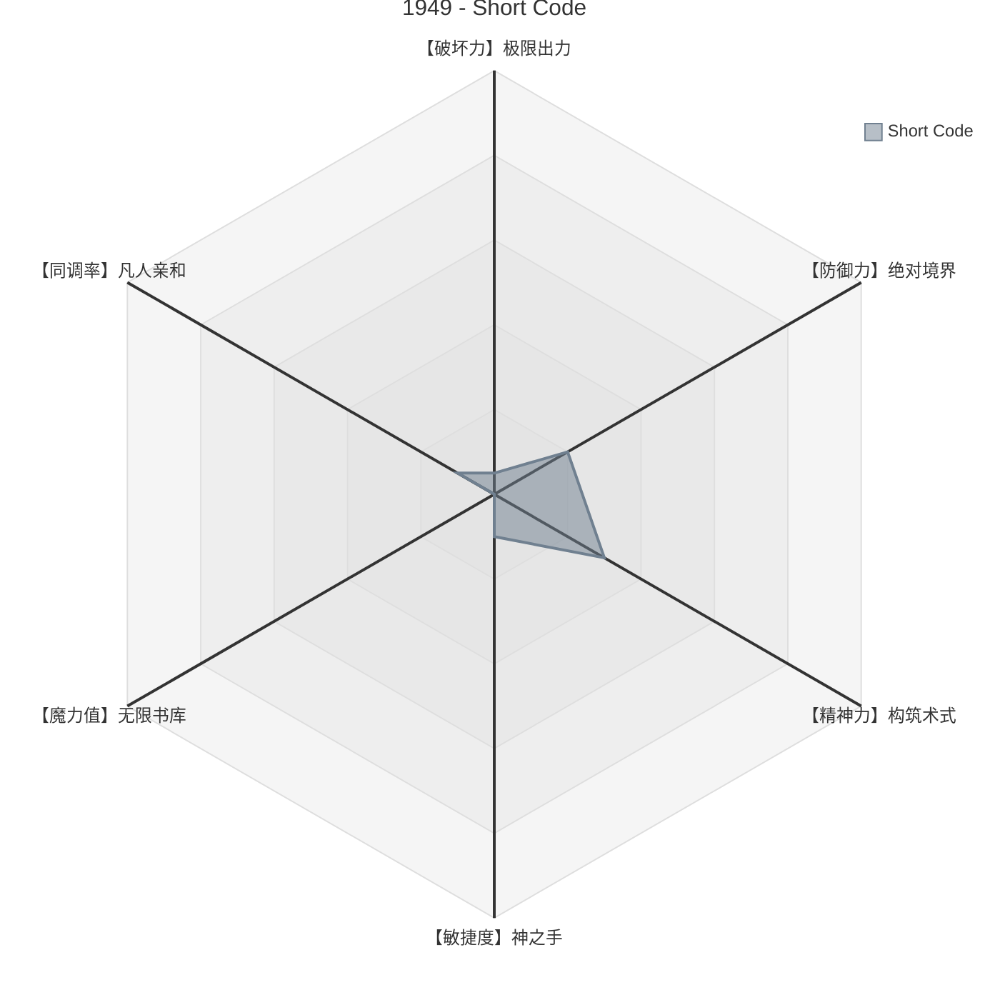
```mermaid
---
title: "1949 - Short Code"
config:
  themeVariables:
    cScale0: "#708090"
---
radar-beta
    axis Perf["【破坏力】极限出力"], Stab["【防御力】绝对境界"], Abst["【精神力】构筑术式"]
    axis DevEff["【敏捷度】神之手"], Eco["【魔力值】无限书库"], Ease["【同调率】凡人亲和"]
    curve a["Short Code"] { 5, 20, 30, 10, 0, 10 }
    max 100
    min 0
    graticule polygon
```

## **【第一纪元：1950s - 编译的创世纪】**

> 伟大的先驱们点燃了普罗米修斯之火——**编译器**。自此，人类终于不需要再像奴隶一样低语机器的语言。我们开始用数学的符文（Fortran）和商业的律法（COBOL）来重构世界。虽然这些早期的魔导书如今看来笨重而粗糙，但它们确立了名为“编程”的法则：变量、循环、函数。这是诸神诞生的前夜，秩序开始从混沌中浮现。

### **1952 - Autocode**

- **中二描述:** **【原始的普罗米修斯】** 它是人类第一次尝试摆脱机器语言枷锁的火种。虽然现在看来火光微弱且粗糙，但它是所有高级语言概念的雏形。它的力量完全取决于它所依附的古老巨神（特定计算机型号），一旦巨神倒下，它也随之消逝。
- **必杀技:** 早期编译器原型、机器无关性（尝试）
- **战力评价:** 各项属性都很弱的早期尝试，具有历史意义但无实战价值。

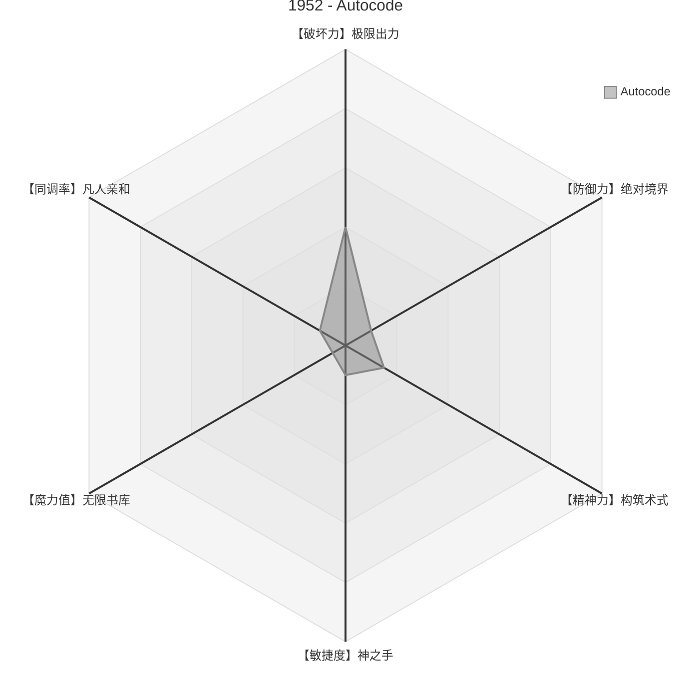
```mermaid
---
title: "1952 - Autocode"
config:
  themeVariables:
    cScale0: "#888888"
---
radar-beta
    axis Perf["【破坏力】极限出力"], Stab["【防御力】绝对境界"], Abst["【精神力】构筑术式"]
    axis DevEff["【敏捷度】神之手"], Eco["【魔力值】无限书库"], Ease["【同调率】凡人亲和"]

    %% Autocode: 性能差(相比汇编), 不稳定, 极低抽象, 低效率, 无生态, 极难
    curve a["Autocode"] { 40, 10, 15, 10, 5, 10 }
    max 100
    min 0
    graticule polygon
```

### **1954 - Fortran**

- **中二描述:** **【演算的暴君】** 为计算而生的巨神兵，它的身体里流淌着纯粹的数学血液。在数值计算的领域，它是绝对的王，任何试图在浮点运算上挑战它的对手都会被它用效率碾碎。虽然它的性格古板（代码结构僵化），但在科研领域依然屹立不倒。
- **必杀技:** 极致数值计算、并行数组操作
- **战力评价:** 性能与稳定性的强力结合，但对凡人（非科学家）极不友好。

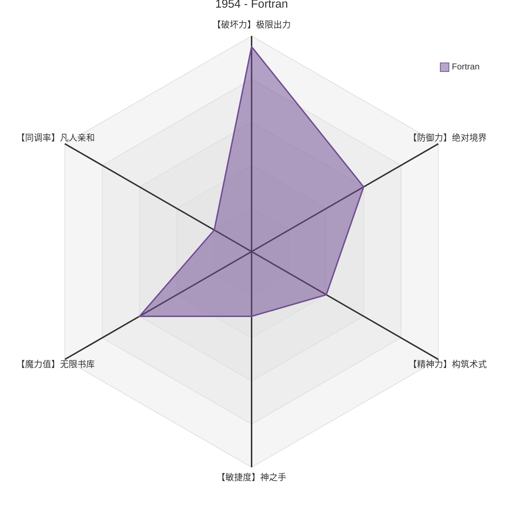
```mermaid
---
title: "1954 - Fortran"
config:
  themeVariables:
    cScale0: "#734F96"
---
radar-beta
    axis Perf["【破坏力】极限出力"], Stab["【防御力】绝对境界"], Abst["【精神力】构筑术式"]
    axis DevEff["【敏捷度】神之手"], Eco["【魔力值】无限书库"], Ease["【同调率】凡人亲和"]

    %% Fortran: 顶级计算性能, 较老派稳定, 抽象一般, 效率一般, 科学计算生态强, 难上手
    curve a["Fortran"] { 95, 60, 40, 30, 60, 20 }
    max 100
    min 0
    graticule polygon
```

### **1955 - FLOW-MATIC**

- **中二描述:** **【语言的通灵者】** 它是 COBOL 的前身，试图让机器听懂人类的语言（英语）。它牺牲了性能，试图换取与凡人同调的可能性。虽然它本身并未长存，但它的灵魂（设计理念）孕育了后来的商业巨兽。
- **必杀技:** 英语指令集、数据描述分离
- **战力评价:** 性能孱弱，但点亮了“易用性”的早期技能树。

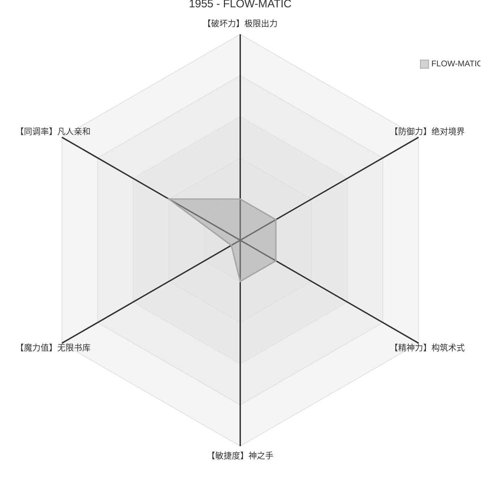
```mermaid
---
title: "1955 - FLOW-MATIC"
config:
  themeVariables:
    cScale0: "#A6A6A6"
---
radar-beta
    axis Perf["【破坏力】极限出力"], Stab["【防御力】绝对境界"], Abst["【精神力】构筑术式"]
    axis DevEff["【敏捷度】神之手"], Eco["【魔力值】无限书库"], Ease["【同调率】凡人亲和"]

    %% FLOW-MATIC: 性能低, 不稳定, 抽象低, 效率低, 无生态, 早期易用尝试
    curve a["FLOW-MATIC"] { 20, 20, 20, 20, 5, 40 }
    max 100
    min 0
    graticule polygon
```

### **1956 - IPL (Information Processing Language)**

- **中二描述:** **【列表的狂战士】** Lisp 的野蛮先祖。它发明了“列表”这种武器，但使用起来却极其粗暴和反直觉（基于汇编风格的列表处理）。它充满了开创性的暴力美学，但极度缺乏美感，只有最硬核的黑客才能驾驭。
- **必杀技:** 链表结构、递归原型
- **战力评价:** 抽象能力虽高（概念上），但易用性是负分，完全无法实战。

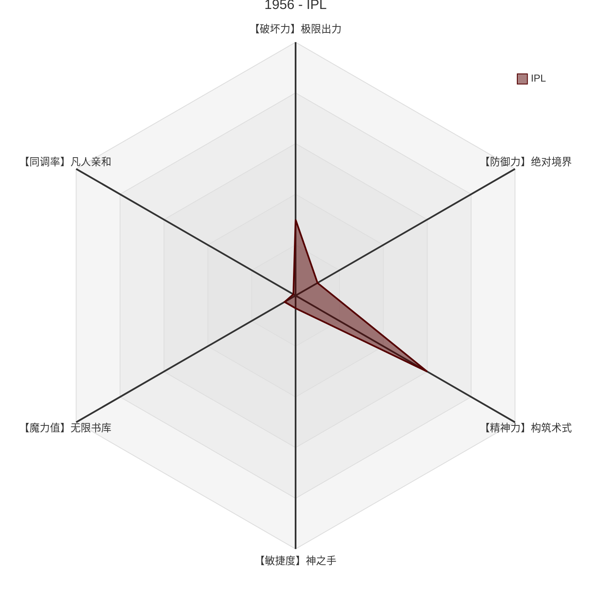
```mermaid
---
title: "1956 - IPL"
config:
  themeVariables:
    cScale0: "#550000"
---
radar-beta
    axis Perf["【破坏力】极限出力"], Stab["【防御力】绝对境界"], Abst["【精神力】构筑术式"]
    axis DevEff["【敏捷度】神之手"], Eco["【魔力值】无限书库"], Ease["【同调率】凡人亲和"]

    %% IPL: 性能一般, 不稳定, 概念抽象高但实现低, 效率极低, 无生态, 极难
    curve a["IPL"] { 30, 10, 60, 5, 5, 1 }
    max 100
    min 0
    graticule polygon
```

### **1958 - ALGOL (算法语言)**

- **中二描述:** **【真理的法典】** 它是所有现代编程语言的语法之父。它定义了什么是“结构”，什么是“块”。它的设计如水晶般纯净、优雅，被学术界奉为圭臬。然而，过于追求完美的它缺乏对现实世界的妥协（I/O 处理），最终成为了教科书中的传说。
- **必杀技:** 嵌套块结构、巴科斯范式 (BNF)
- **战力评价:** 极高的抽象美感，但缺乏实战的泥土气（生态极低）。

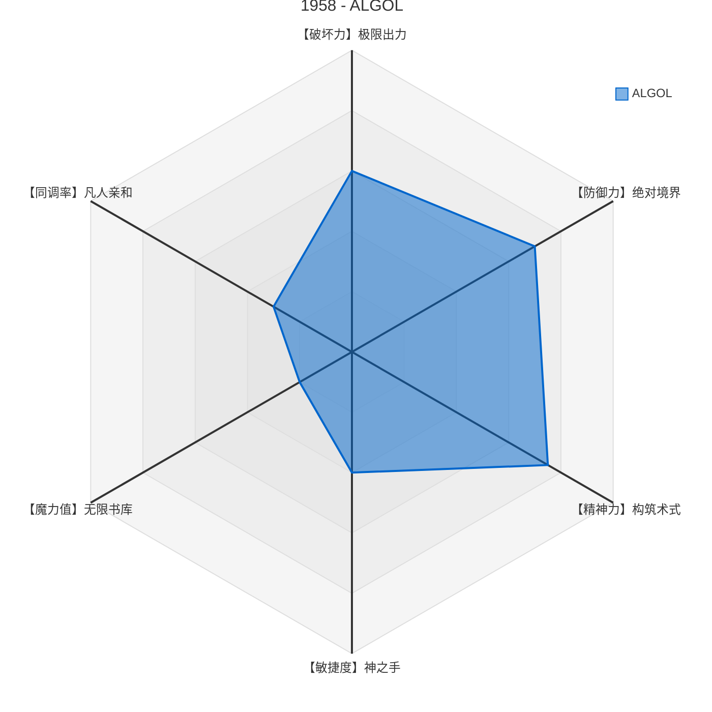
```mermaid
---
title: "1958 - ALGOL"
config:
  themeVariables:
    cScale0: "#0066CC"
---
radar-beta
    axis Perf["【破坏力】极限出力"], Stab["【防御力】绝对境界"], Abst["【精神力】构筑术式"]
    axis DevEff["【敏捷度】神之手"], Eco["【魔力值】无限书库"], Ease["【同调率】凡人亲和"]

    %% ALGOL: 性能一般, 结构稳定, 抽象高, 效率一般, 学术生态, 较难
    curve a["ALGOL"] { 60, 70, 75, 40, 20, 30 }
    max 100
    min 0
    graticule polygon
```

### **1958 - Lisp**

- **中二描述:** **【根源的魔法师】** 既然世界由原子构成，那么代码就由括号构成。它直接触碰了计算的本质（Lambda 演算），拥有无限的“构筑术式”能力（宏）。它是唯一一个活了六十年依然被视为“未来科技”的怪物，能像造物主一样在运行时修改自身的法则。
- **必杀技:** 代码即数据 (Homoiconicity)、宏系统、REPL
- **战力评价:** 精神力（抽象）爆表，但因为过于超越时代，凡人极难理解。

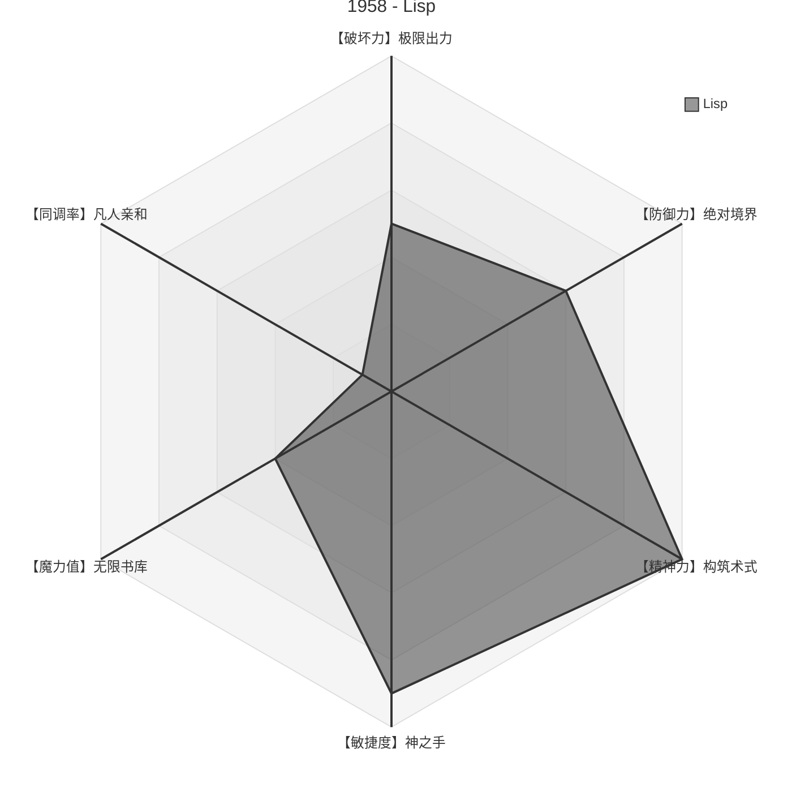
```mermaid
---
title: "1958 - Lisp"
config:
  themeVariables:
    cScale0: "#333333"
---
radar-beta
    axis Perf["【破坏力】极限出力"], Stab["【防御力】绝对境界"], Abst["【精神力】构筑术式"]
    axis DevEff["【敏捷度】神之手"], Eco["【魔力值】无限书库"], Ease["【同调率】凡人亲和"]

    %% Lisp: 性能依赖实现(中等), 动态稳定, 神级抽象, 高手效率极高, 小众死忠生态, 极难(括号地狱)
    curve a["Lisp"] { 50, 60, 100, 90, 40, 10 }
    max 100
    min 0
    graticule polygon
```

### **1959 - COBOL**

- **中二描述:** **【黄金的守门人】** 它是金融秩序的具象化。虽然被无数后辈嘲笑臃肿、啰嗦，但它守护着全球 70% 的商业交易。它极度抗拒变化，用最冗长的咒语（语法）换取了最极致的稳定性。只要银行还在，它就是不死的。
- **必杀技:** 十进制运算、记录级文件处理
- **战力评价:** 防御力与破坏力（处理海量数据）惊人，但灵活性几乎为零。

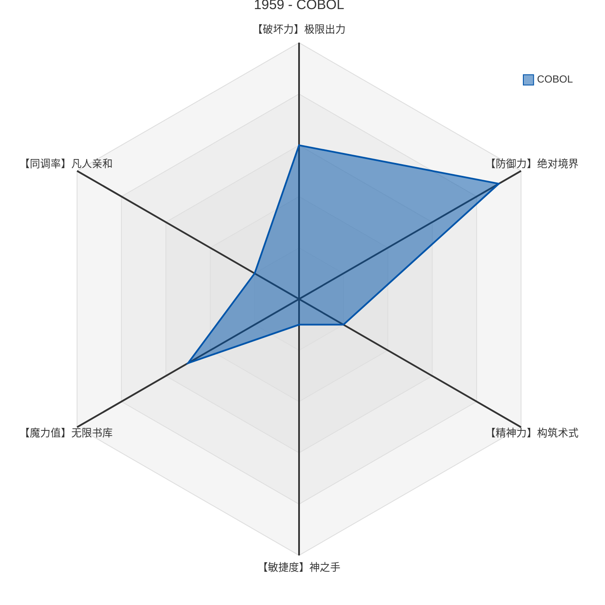
```mermaid
---
title: "1959 - COBOL"
config:
  themeVariables:
    cScale0: "#0055AA"
---
radar-beta
    axis Perf["【破坏力】极限出力"], Stab["【防御力】绝对境界"], Abst["【精神力】构筑术式"]
    axis DevEff["【敏捷度】神之手"], Eco["【魔力值】无限书库"], Ease["【同调率】凡人亲和"]

    %% COBOL: 性能尚可(I/O强), 极度稳定, 抽象极低(啰嗦), 效率极低(打字机), 商业遗产生态, 难
    curve a["COBOL"] { 60, 90, 20, 10, 50, 20 }
    max 100
    min 0
    graticule polygon
```

### **1959 - FACT**

- **中二描述:** **【被遗忘的先知】** 它是 COBOL 的竞争对手，在设计上甚至更为优雅。但历史是残酷的，它在商业战争中败下阵来，成为了 COBOL 辉煌王座下的枯骨。
- **必杀技:** 早期商业逻辑描述
- **战力评价:** 属性均衡但平庸，因败给历史车轮而失去了生态（魔力值归零）。

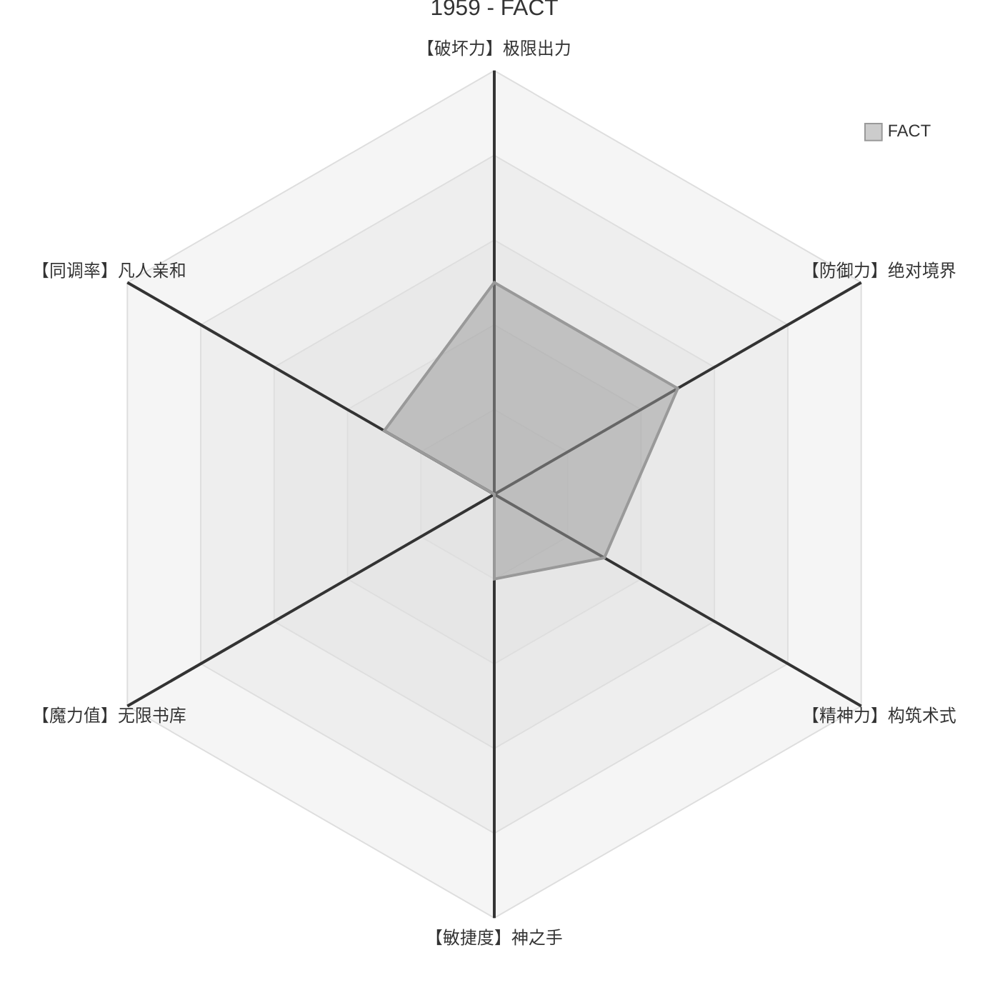
```mermaid
---
title: "1959 - FACT"
config:
  themeVariables:
    cScale0: "#999999"
---
radar-beta
    axis Perf["【破坏力】极限出力"], Stab["【防御力】绝对境界"], Abst["【精神力】构筑术式"]
    axis DevEff["【敏捷度】神之手"], Eco["【魔力值】无限书库"], Ease["【同调率】凡人亲和"]

    %% FACT: 类似COBOL但死掉了
    curve a["FACT"] { 50, 50, 30, 20, 0, 30 }
    max 100
    min 0
    graticule polygon
```

### **1959 - RPG (Report Program Generator)**

- **中二描述:** **【打孔卡的织造者】** 专为生成报表而生的特化型人偶。它不需要理解复杂的逻辑，只需要告诉它“输入是什么，输出想要什么”。它是声明式编程的早期尝试，虽然如今已是活化石（仍在 IBM 机房运作），但在特定领域依然高效。
- **必杀技:** 固定逻辑循环、指示符编程
- **战力评价:** 极其偏科，除了生成报表一无是处，但在那个领域是无敌的。

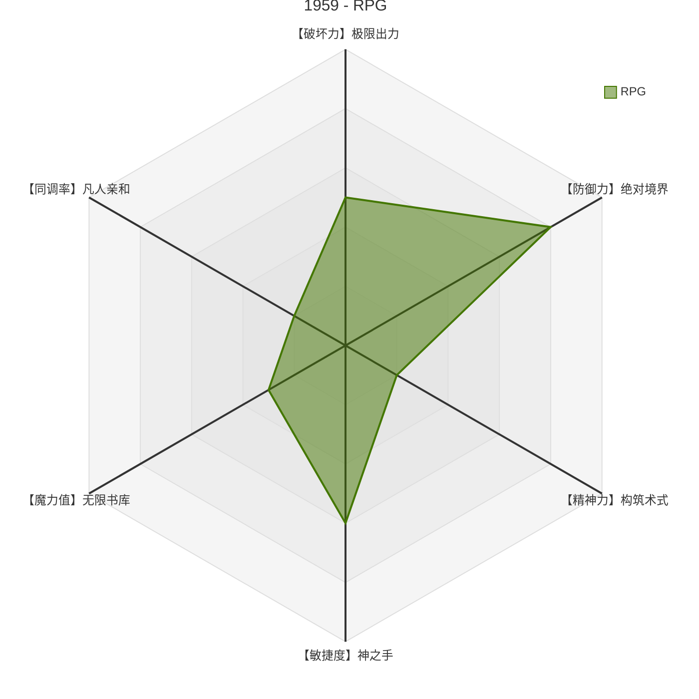
```mermaid
---
title: "1959 - RPG"
config:
  themeVariables:
    cScale0: "#447700"
---
radar-beta
    axis Perf["【破坏力】极限出力"], Stab["【防御力】绝对境界"], Abst["【精神力】构筑术式"]
    axis DevEff["【敏捷度】神之手"], Eco["【魔力值】无限书库"], Ease["【同调率】凡人亲和"]

    %% RPG: 性能中, 稳定, 抽象低, 特定领域效率高, IBM遗产生态, 难
    curve a["RPG"] { 50, 80, 20, 60, 30, 20 }
    max 100
    min 0
    graticule polygon
```

## **【第二纪元：1960s - 范式的大爆发】**

> 这是历史上星光最璀璨的十年，也是魔法（编程思想）的“诸神之战”。无数天才般的灵魂在此刻觉醒，他们不再满足于计算，而是试图定义世界的本质。结构化、面向对象、函数式、逻辑编程……所有现代流派的始祖都在此诞生。那时的计算机科学家就像拥有无限法力的造物主，疯狂地尝试着千万种描述世界的方式。

### **1960 - COMTRAN (Commercial Translator)**

- **中二描述:** **【被遗忘的奠基石】** 它是 IBM 试图统一商业语言的尝试，COBOL 的影子兄弟。它的灵魂最终融入了 COBOL 的血肉之中，不仅献祭了自己的肉体，也献祭了自己的名字。
- **必杀技:** 早期商业逻辑转换
- **战力评价:** 属性平庸的牺牲品，它的存在证明了“赢家通吃”的残酷法则。

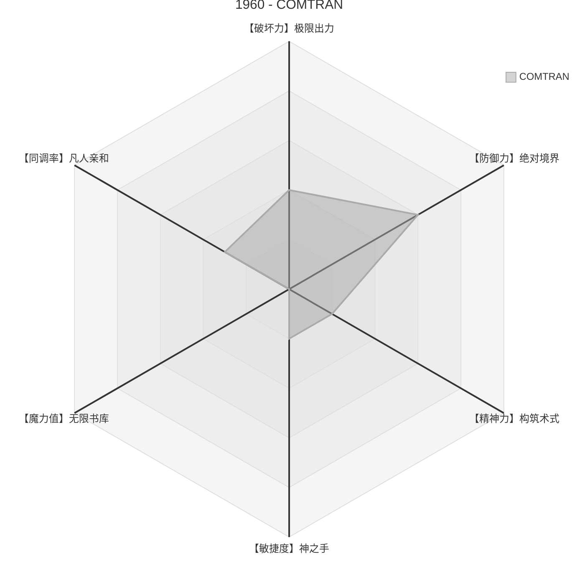
```mermaid
---
title: "1960 - COMTRAN"
config:
  themeVariables:
    cScale0: "#AAAAAA"
---
radar-beta
    axis Perf["【破坏力】极限出力"], Stab["【防御力】绝对境界"], Abst["【精神力】构筑术式"]
    axis DevEff["【敏捷度】神之手"], Eco["【魔力值】无限书库"], Ease["【同调率】凡人亲和"]

    %% COMTRAN: 类似早期COBOL，已死
    curve a["COMTRAN"] { 40, 60, 20, 20, 0, 30 }
    max 100
    min 0
    graticule polygon
```

### **1962 - APL (A Programming Language)**

- **中二描述:** **【来自异次元的符文】** 它不属于这个世界。它抛弃了人类的文字，使用神秘的希腊字母和数学符号作为咒语。在这门语言里，一行代码足以描述宇宙的生灭（极其复杂的矩阵运算）。只有拥有特殊键盘的祭司才能驾驭它，凡人看一眼代码就会陷入理智丧失的疯狂。
- **必杀技:** 多维数组运算、隐式迭代、一行代码解万物
- **战力评价:** 精神力（抽象）突破天际，敏捷度极高（代码极短），但同调率（易读性）是绝对的零。

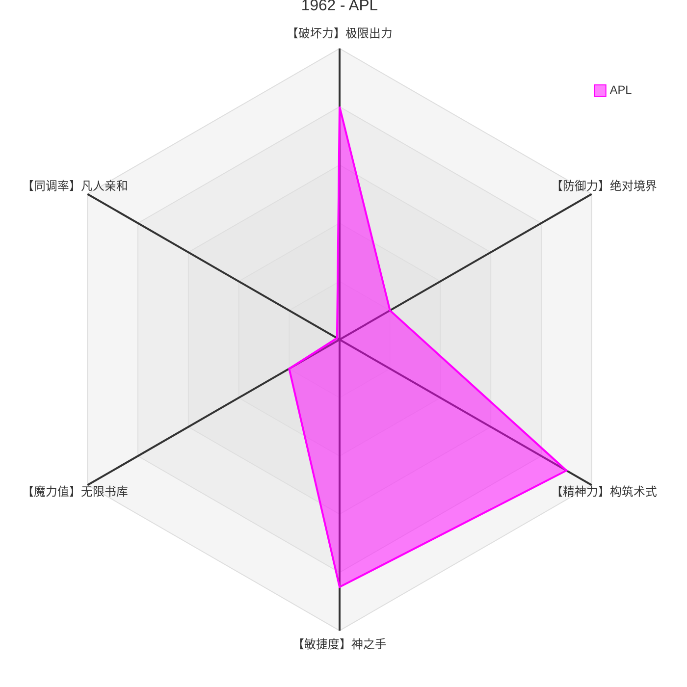
```mermaid
---
title: "1962 - APL"
config:
  themeVariables:
    cScale0: "#FF00FF"
---
radar-beta
    axis Perf["【破坏力】极限出力"], Stab["【防御力】绝对境界"], Abst["【精神力】构筑术式"]
    axis DevEff["【敏捷度】神之手"], Eco["【魔力值】无限书库"], Ease["【同调率】凡人亲和"]

    %% APL: 向量运算极快, 容易出错, 抽象极高(数学符号), 写的快读的慢, 小众生态, 极难
    curve a["APL"] { 80, 20, 90, 85, 20, 1 }
    max 100
    min 0
    graticule polygon
```

### **1962 - SNOBOL**

- **中二描述:** **【文字的编织者】** 专注于字符串处理的魔女。在正则表达式尚未普及的蛮荒时代，她用独特的模式匹配魔法，能够随意拆解、重组任何文本。虽然在数值计算上无能为力，但在处理咒文（文本）本身时，她是无敌的。
- **必杀技:** 强大的模式匹配、非凡的字符串操作
- **战力评价:** 极度偏科的辅助型法师，文本处理能力满分，其他领域战五渣。

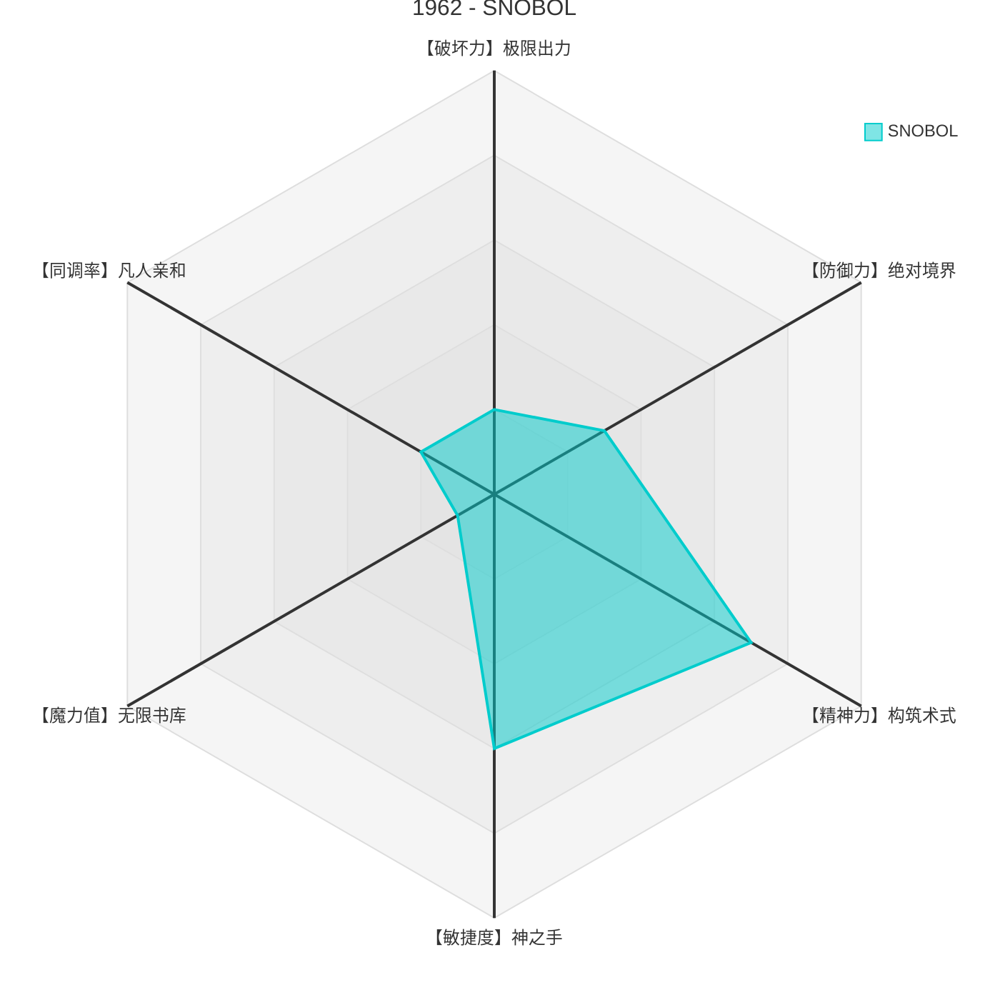
```mermaid
---
title: "1962 - SNOBOL"
config:
  themeVariables:
    cScale0: "#00CCCC"
---
radar-beta
    axis Perf["【破坏力】极限出力"], Stab["【防御力】绝对境界"], Abst["【精神力】构筑术式"]
    axis DevEff["【敏捷度】神之手"], Eco["【魔力值】无限书库"], Ease["【同调率】凡人亲和"]

    %% SNOBOL: 慢, 不稳, 文本抽象高, 写文本快, 遗产生态, 难
    curve a["SNOBOL"] { 20, 30, 70, 60, 10, 20 }
    max 100
    min 0
    graticule polygon
```

### **1962 - Simula**

- **中二描述:** **【万物的圣母】** 它是“对象”的起源，所有现代面向对象语言（Java, C++, Python）的母亲。她第一次告诉世界：代码不仅仅是指令，更是对现实世界的模拟。虽然她本身并未统治世界，但她的血脉流淌在每一个现代软件巨人的身体里。
- **必杀技:** 类与对象、继承、协程
- **战力评价:** 伟大的先驱，精神力（抽象）极高，开启了全新的战斗流派。

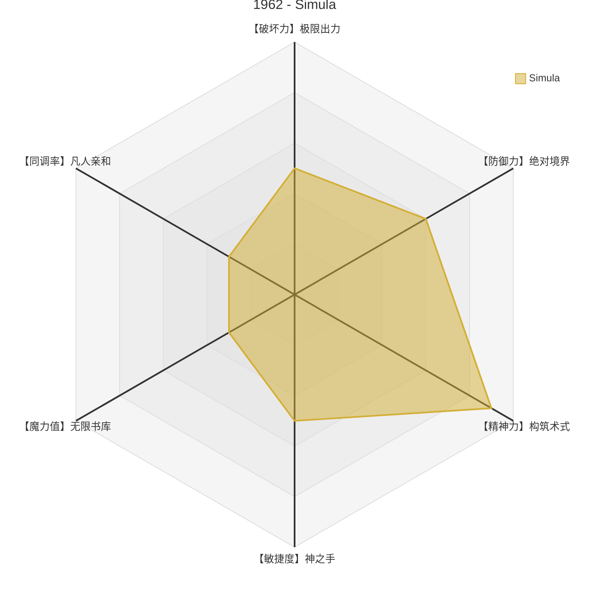
```mermaid
---
title: "1962 - Simula"
config:
  themeVariables:
    cScale0: "#D4AF37"
---
radar-beta
    axis Perf["【破坏力】极限出力"], Stab["【防御力】绝对境界"], Abst["【精神力】构筑术式"]
    axis DevEff["【敏捷度】神之手"], Eco["【魔力值】无限书库"], Ease["【同调率】凡人亲和"]

    %% Simula: 一般性能, 类型安全较早, OOP鼻祖抽象高, 效率尚可, 历史地位高实际生态低, 较难
    curve a["Simula"] { 50, 60, 90, 50, 30, 30 }
    max 100
    min 0
    graticule polygon
```

### **1963 - CPL (Combined Programming Language)**

- **中二描述:** **【未完成的泰坦】** 试图融合 ALGOL 的优雅与商业语言的实用，构建一个全能的巨人。然而，它的身躯过于庞大和复杂，以至于当时的编译器甚至无法完全承载它的灵魂。它倒下了，但它的骸骨孕育了 BCPL，进而诞生了 C。
- **必杀技:** 极其复杂的类型系统
- **战力评价:** 过于理想化而导致自我毁灭，只有理论上的强大。

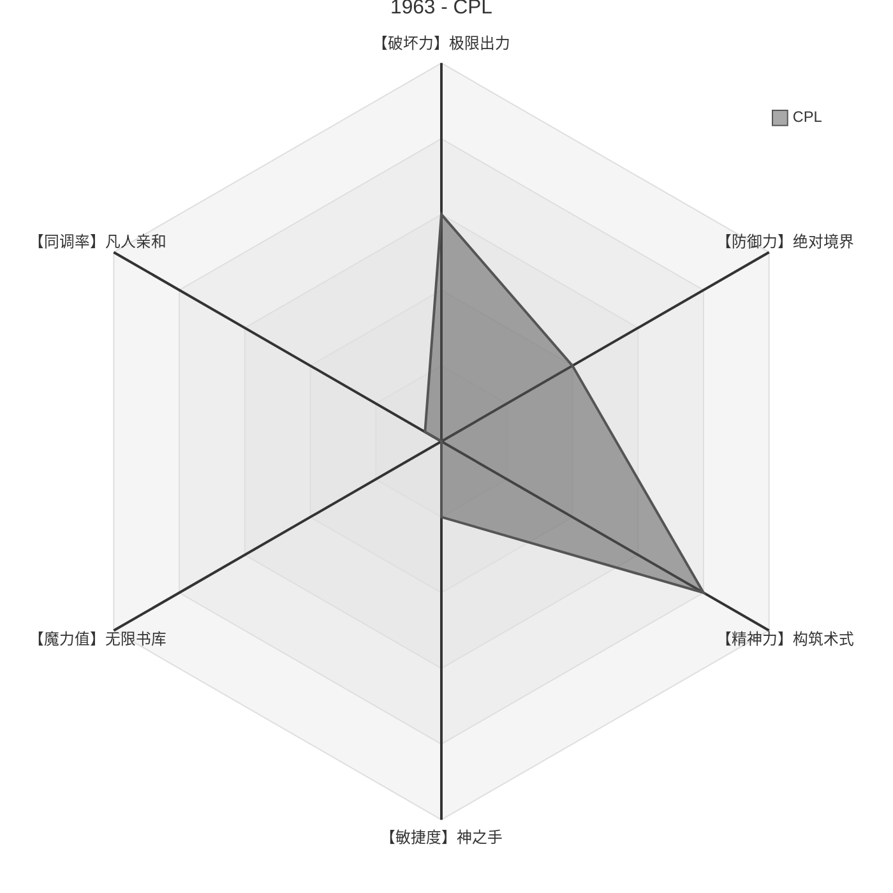
```mermaid
---
title: "1963 - CPL"
config:
  themeVariables:
    cScale0: "#555555"
---
radar-beta
    axis Perf["【破坏力】极限出力"], Stab["【防御力】绝对境界"], Abst["【精神力】构筑术式"]
    axis DevEff["【敏捷度】神之手"], Eco["【魔力值】无限书库"], Ease["【同调率】凡人亲和"]

    %% CPL: 理论强实际无, 极其复杂导致没法用
    curve a["CPL"] { 60, 40, 80, 20, 0, 5 }
    max 100
    min 0
    graticule polygon
```

### **1963 - JOSS (JOHNNIAC Open Shop System)**

- **中二描述:** **【温柔的对话者】** 在那个批处理的冰冷年代，它第一次像朋友一样与人类对话（交互式分时系统）。它不追求强大的力量，只追求让数学家和工程师能轻松地使用算力。BASIC 的精神导师。
- **必杀技:** 交互式界面、行号编辑
- **战力评价:** 同调率（易用性）极高，但力量十分有限。

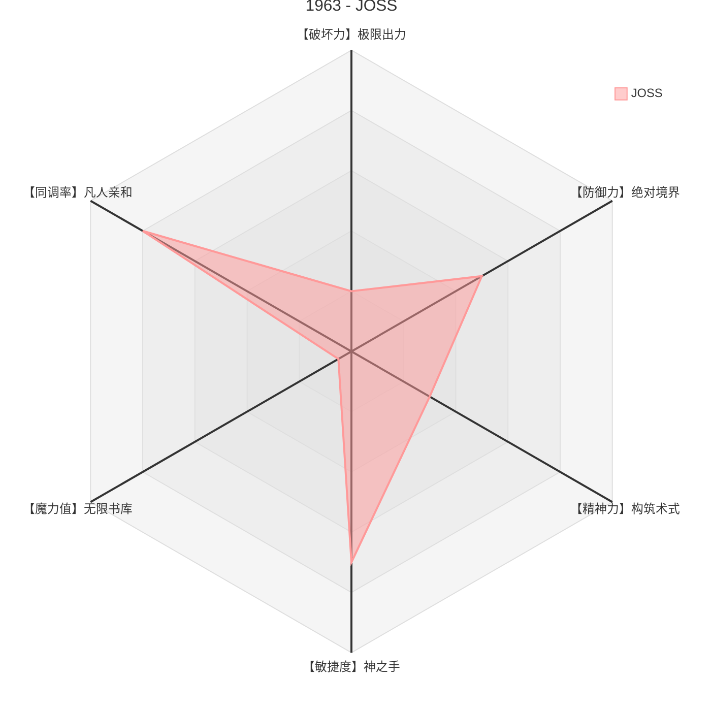
```mermaid
---
title: "1963 - JOSS"
config:
  themeVariables:
    cScale0: "#FF9999"
---
radar-beta
    axis Perf["【破坏力】极限出力"], Stab["【防御力】绝对境界"], Abst["【精神力】构筑术式"]
    axis DevEff["【敏捷度】神之手"], Eco["【魔力值】无限书库"], Ease["【同调率】凡人亲和"]

    %% JOSS: 慢, 一般, 低抽象, 交互式效率高, 无生态, 易
    curve a["JOSS"] { 20, 50, 30, 70, 5, 80 }
    max 100
    min 0
    graticule polygon
```

### **1964 - BASIC (Beginner's All-purpose Symbolic Instruction Code)**

- **中二描述:** **【凡人的木剑】** 它是普罗米修斯盗来的第二把火，将编程的权柄从科学家手中夺下，分发给每一个拥有微型计算机的孩子。它简单、直接、毫无门槛，虽然被精英们鄙视（GOTO 面条代码），但它不仅征服了世界，还成为了比尔·盖茨等无数英雄的启蒙导师。
- **必杀技:** GOTO 跳转、解释执行、INPUT/PRINT
- **战力评价:** 同调率满分！虽然其他属性全是渣，但依靠庞大的群众基础（所有机器出厂即自带），它赢了。（现在生态已凋零）

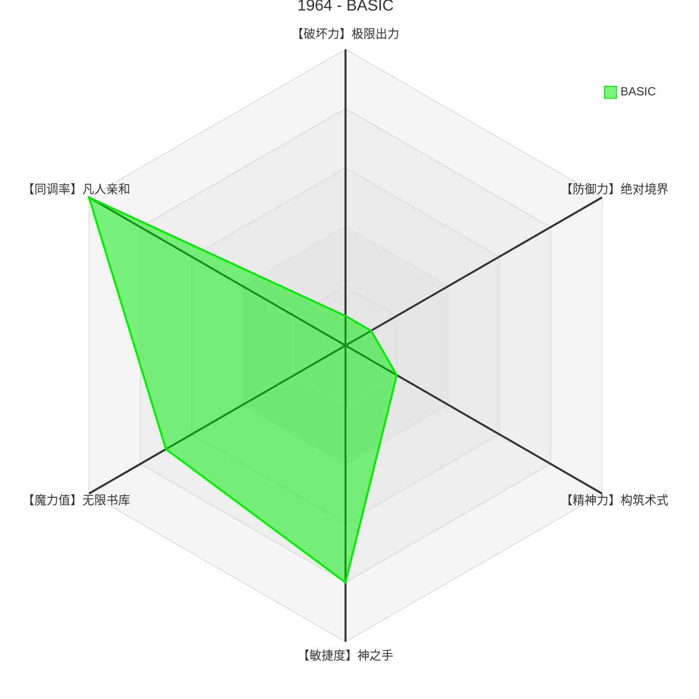
```mermaid
---
title: "1964 - BASIC"
config:
  themeVariables:
    cScale0: "#00EE00"
---
radar-beta
    axis Perf["【破坏力】极限出力"], Stab["【防御力】绝对境界"], Abst["【精神力】构筑术式"]
    axis DevEff["【敏捷度】神之手"], Eco["【魔力值】无限书库"], Ease["【同调率】凡人亲和"]

    %% BASIC: 慢, 极其不稳定(GOTO), 低抽象, 上手极快, 曾是王者生态, 傻瓜级
    curve a["BASIC"] { 10, 10, 20, 80, 70, 100 }
    max 100
    min 0
    graticule polygon
```

### **1964 - PL/I (Programming Language One)**

- **中二描述:** **【巴别塔的奇美拉】** IBM 的野心之作，试图强行缝合 Fortran 的计算能力和 COBOL 的商业能力。它拥有一切特性，庞大得令人窒息。由于试图讨好所有人，结果变得臃肿不堪，难以驾驭。它是大企业病在编程语言上的具象化。
- **必杀技:** 异常处理、多任务处理、全能语法
- **战力评价:** 破坏力和防御力都不错，但因为过于复杂，精神同调率极低，只有受虐狂才喜欢用。

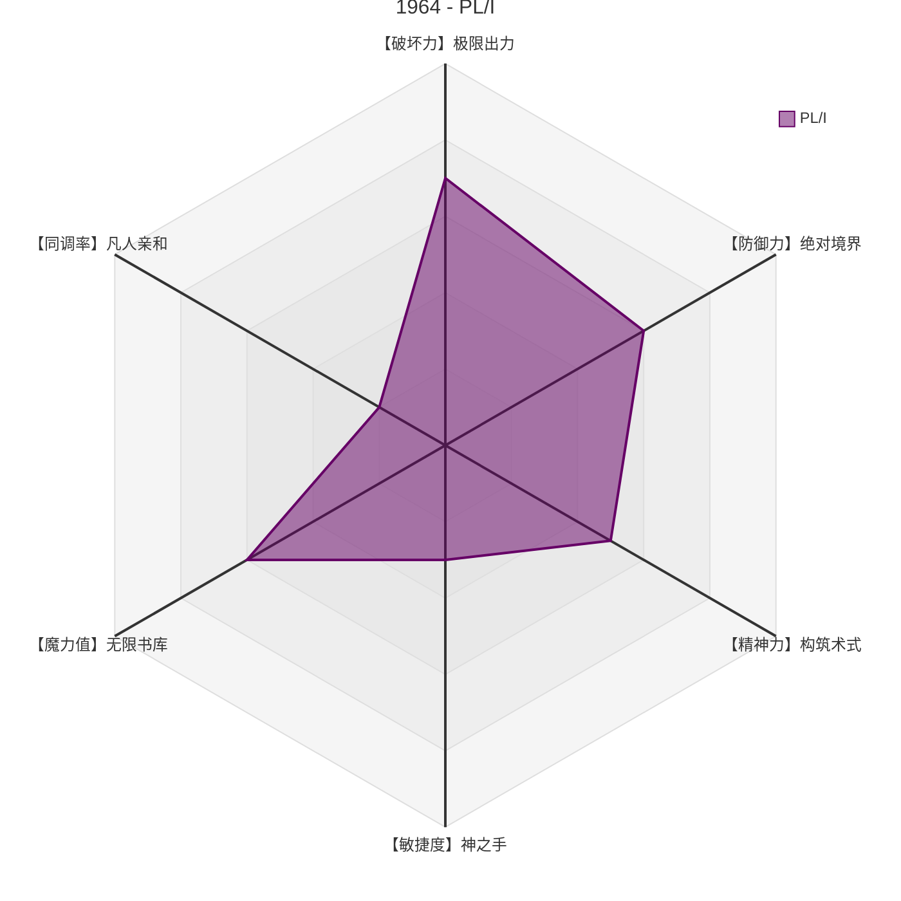
```mermaid
---
title: "1964 - PL/I"
config:
  themeVariables:
    cScale0: "#660066"
---
radar-beta
    axis Perf["【破坏力】极限出力"], Stab["【防御力】绝对境界"], Abst["【精神力】构筑术式"]
    axis DevEff["【敏捷度】神之手"], Eco["【魔力值】无限书库"], Ease["【同调率】凡人亲和"]

    %% PL/I: 强, 复杂但全能, 抽象中等, 效率低(太复杂), IBM生态, 难
    curve a["PL/I"] { 70, 60, 50, 30, 60, 20 }
    max 100
    min 0
    graticule polygon
```

### **1964 - Speakeasy**

- **中二描述:** **【低语的贤者】** 一个专注于数值计算的交互式系统，它像是一个不断进化的生命体，所有的对象都可以永久保存。它在物理学和计量经济学的幽暗角落里默默耕耘。
- **必杀技:** 动态对象扩展、持久化工作区
- **战力评价:** 小众领域的隐士，能力不错但鲜为人知。

```mermaid
---
title: "1964 - Speakeasy"
config:
  themeVariables:
    cScale0: "#88AA88"
---
radar-beta
    axis Perf["【破坏力】极限出力"], Stab["【防御力】绝对境界"], Abst["【精神力】构筑术式"]
    axis DevEff["【敏捷度】神之手"], Eco["【魔力值】无限书库"], Ease["【同调率】凡人亲和"]

    %% Speakeasy: 慢, 稳, 抽象中, 交互效率高, 无生态, 易
    curve a["Speakeasy"] { 30, 60, 50, 70, 5, 70 }
    max 100
    min 0
    graticule polygon
```

### **1966 - MUMPS (M Language)**

- **中二描述:** **【医疗回廊的巫妖】** 它是一门语言，也是一个数据库。它古老、语法怪异、极其紧凑，仿佛是为了在资源匮乏的末世生存而生。虽然它面目可憎（语法极其难读），但它掌握着生命的秘密——至今全球大量的医疗系统核心依然由它驱动。它是不死的。
- **必杀技:** 内置层级数据库、极度紧凑的代码
- **战力评价:** 防御力（稳定性）极高，生命力顽强，但对新人极其残忍。

```mermaid
---
title: "1966 - MUMPS"
config:
  themeVariables:
    cScale0: "#8B0000"
---
radar-beta
    axis Perf["【破坏力】极限出力"], Stab["【防御力】绝对境界"], Abst["【精神力】构筑术式"]
    axis DevEff["【敏捷度】神之手"], Eco["【魔力值】无限书库"], Ease["【同调率】凡人亲和"]

    %% MUMPS: IO极快, 极稳(医疗), 抽象怪然, 写得快维护难, 医疗垄断生态, 极难
    curve a["MUMPS"] { 70, 90, 40, 70, 40, 5 }
    max 100
    min 0
    graticule polygon
```

### **1966 - ISWIM (If You See What I Mean)**

- **中二描述:** **【理想乡的蓝图】** 它从未被真正实现，它是彼得·兰丁梦中的语言。它定义了函数式编程的纯粹形态，是 Haskell 和 ML 的精神之父。它只存在于论文的象牙塔顶端，不沾染尘世的泥土。
- **必杀技:** 纯函数式、语法糖概念
- **战力评价:** 精神力（抽象）满分，实战能力为零（因为不存在）。

```mermaid
---
title: "1966 - ISWIM"
config:
  themeVariables:
    cScale0: "#FFFFFF"
---
radar-beta
    axis Perf["【破坏力】极限出力"], Stab["【防御力】绝对境界"], Abst["【精神力】构筑术式"]
    axis DevEff["【敏捷度】神之手"], Eco["【魔力值】无限书库"], Ease["【同调率】凡人亲和"]

    %% ISWIM: 概念神, 没实现
    curve a["ISWIM"] { 35, 60, 100, 30, 0, 20 }
    max 100
    min 0
    graticule polygon
```

### **1966 - MacLisp**

- **中二描述:** **【月之眼的魔导书】** MIT 人工智能实验室的御用咒语，Lisp 的强大变种。它是黑客文化的摇篮，无数早期 AI 程序（如 SHRDLU）的母体。它比祖先更务实，拥有极强的数值计算能力。
- **必杀技:** 快速数值运算、强大的宏
- **战力评价:** 强大的奥术法师，但在 Lisp 家族内战中最终被 Common Lisp 取代。

```mermaid
---
title: "1966 - MacLisp"
config:
  themeVariables:
    cScale0: "#4B0082"
---
radar-beta
    axis Perf["【破坏力】极限出力"], Stab["【防御力】绝对境界"], Abst["【精神力】构筑术式"]
    axis DevEff["【敏捷度】神之手"], Eco["【魔力值】无限书库"], Ease["【同调率】凡人亲和"]

    %% MacLisp: 快(当时), 动态稳, 极高抽象, 效率高, AI生态, 难
    curve a["MacLisp"] { 70, 60, 95, 80, 50, 15 }
    max 100
    min 0
    graticule polygon
```

### **1967 - BCPL**

- **中二描述:** **【无甲的剑圣】** 它是 CPL 的精简版，C 语言的直系父亲。它为了追求极致的便携和效率，抛弃了所有类型的束缚（无类型语言）。它将内存视为赤裸的字节数组，挥舞着指针的利刃。虽强，但极其危险。
- **必杀技:** 虚拟机 O-code、大括号 `{}` 的发明者
- **战力评价:** 敏捷度与破坏力极高，防御力为负，只有绝顶高手敢用。

```mermaid
---
title: "1967 - BCPL"
config:
  themeVariables:
    cScale0: "#FFFFFF"
---
radar-beta
    axis Perf["【破坏力】极限出力"], Stab["【防御力】绝对境界"], Abst["【精神力】构筑术式"]
    axis DevEff["【敏捷度】神之手"], Eco["【魔力值】无限书库"], Ease["【同调率】凡人亲和"]

    %% BCPL: 快, 极不安全(无类型), 抽象低, 效率中, 祖师爷, 难
    curve a["BCPL"] { 85, 10, 30, 50, 10, 15 }
    max 100
    min 0
    graticule polygon
```

### **1967 - Logo**

- **中二描述:** **【几何的绘梦师】** 披着乌龟外壳的 Lisp。它通过控制一只小海龟画画，向孩子们传授递归与逻辑的奥义。它是最温柔的导师，证明了即使是高深的魔法（编程），也可以通过游戏来掌握。
- **必杀技:** 海龟绘图、极简递归
- **战力评价:** 战斗力虽弱，但它是唯一的“治愈系”语言，同调率（易用性）满分。

```mermaid
---
title: "1967 - Logo"
config:
  themeVariables:
    cScale0: "#00BFFF"
---
radar-beta
    axis Perf["【破坏力】极限出力"], Stab["【防御力】绝对境界"], Abst["【精神力】构筑术式"]
    axis DevEff["【敏捷度】神之手"], Eco["【魔力值】无限书库"], Ease["【同调率】凡人亲和"]

    %% Logo: 慢, 稳, 抽象高(Lisp核), 效率低(教学用), 教育生态, 极易
    curve a["Logo"] { 10, 60, 80, 40, 60, 100 }
    max 100
    min 0
    graticule polygon
```

### **1968 - Pascal**

- **中二描述:** **【秩序的裁决官】** 它是 ALGOL 的正统继承人，以严谨、结构化和强类型著称。它痛恨 BASIC 的混乱，强制要求程序员遵守纪律。它是学院派的宠儿，培养了整整一代程序员的“正规军”思维。
- **必杀技:** 强类型检查、清晰的结构化语法
- **战力评价:** 六边形稍微偏向“防御”和“易用”的战士，除了不能直接操作底层硬件外，非常均衡。

```mermaid
---
title: "1968 - Pascal"
config:
  themeVariables:
    cScale0: "#FFFF00"
---
radar-beta
    axis Perf["【破坏力】极限出力"], Stab["【防御力】绝对境界"], Abst["【精神力】构筑术式"]
    axis DevEff["【敏捷度】神之手"], Eco["【魔力值】无限书库"], Ease["【同调率】凡人亲和"]

    %% Pascal: 较快, 强类型稳, 抽象中等, 效率不错, 教学/Delphi生态, 易上手
    curve a["Pascal"] { 70, 85, 50, 60, 80, 75 }
    max 100
    min 0
    graticule polygon
```

### **1968 - ALGOL 68**

- **中二描述:** **【过载的神格】** 试图定义一切计算真理的终极语言。它的定义极其正交、普遍，美丽得令人窒息，也复杂得令人绝望。它是巴别塔的塔尖，因为过于高深而无人能懂（除了它的创造者）。它在荣耀中孤独地死去。
- **必杀技:** 正交设计、复杂的引用机制
- **战力评价:** 精神力（抽象）突破天际，但毫无凡人亲和力，最终没有信徒（生态）。

```mermaid
---
title: "1968 - ALGOL 68"
config:
  themeVariables:
    cScale0: "#4682B4"
---
radar-beta
    axis Perf["【破坏力】极限出力"], Stab["【防御力】绝对境界"], Abst["【精神力】构筑术式"]
    axis DevEff["【敏捷度】神之手"], Eco["【魔力值】无限书库"], Ease["【同调率】凡人亲和"]

    %% ALGOL 68: 理论快, 理论稳, 抽象极高, 没法写编译器, 无生态, 极难
    curve a["ALGOL 68"] { 60, 70, 95, 20, 5, 5 }
    max 100
    min 0
    graticule polygon
```

### **1969 - B**

- **中二描述:** **【原型的光剑】** 肯·汤普逊为了在 PDP-7 这种古董机上玩游戏（Space Travel）而锻造的简易武器。它是 BCPL 的浓缩版，C 语言的幼年体。它简陋、粗糙，但已经展露出了统治未来的王者之气。
- **必杀技:** 极简语法、直接解释执行
- **战力评价:** 敏捷度极高，但由于缺乏类型系统，防御力极低，是 C 语言诞生前的试作机。

```mermaid
---
title: "1969 - B"
config:
  themeVariables:
    cScale0: "#A9A9A9"
---
radar-beta
    axis Perf["【破坏力】极限出力"], Stab["【防御力】绝对境界"], Abst["【精神力】构筑术式"]
    axis DevEff["【敏捷度】神之手"], Eco["【魔力值】无限书库"], Ease["【同调率】凡人亲和"]

    %% B: 快(相对), 不安全, 抽象低, 写的快, 贝尔实验室内部生态, 难
    curve a["B"] { 80, 10, 30, 70, 20, 20 }
    max 100
    min 0
    graticule polygon
```

### **1969 - SETL (SET Language)**

- **中二描述:** **【集合的收纳者】** 基于集合论构建的语言。它认为世界万物皆为集合。它的思维方式极其数学化，非常适合用来描述复杂的算法原型。
- **必杀技:** 集合推导、元组操作
- **战力评价:** 精神力（抽象）极高，专为数学家准备的法杖。

```mermaid
---
title: "1969 - SETL"
config:
  themeVariables:
    cScale0: "#008080"
---
radar-beta
    axis Perf["【破坏力】极限出力"], Stab["【防御力】绝对境界"], Abst["【精神力】构筑术式"]
    axis DevEff["【敏捷度】神之手"], Eco["【魔力值】无限书库"], Ease["【同调率】凡人亲和"]

    %% SETL: 慢, 稳, 抽象高, 效率一般, 无生态, 难
    curve a["SETL"] { 30, 60, 90, 40, 5, 10 }
    max 100
    min 0
    graticule polygon
```

### **1969 - Planner**

- **中二描述:** **【逻辑的织网者】** 它是 Prolog 的先驱，试图实现“目标导向”的编程。你不需要告诉它怎么做，只需要告诉它你要什么。它是人工智能在逻辑推理方向上的早期尝试。
- **必杀技:** 模式导向调用、自动回溯
- **战力评价:** 概念极其超前，但在那个算力匮乏的年代，它沉重得无法起飞。

```mermaid
---
title: "1969 - Planner"
config:
  themeVariables:
    cScale0: "#9370DB"
---
radar-beta
    axis Perf["【破坏力】极限出力"], Stab["【防御力】绝对境界"], Abst["【精神力】构筑术式"]
    axis DevEff["【敏捷度】神之手"], Eco["【魔力值】无限书库"], Ease["【同调率】凡人亲和"]

    %% Planner: 极慢, 逻辑稳, 抽象高, 没法用, 早期AI生态, 难
    curve a["Planner"] { 10, 50, 90, 30, 10, 10 }
    max 100
    min 0
    graticule polygon
```

## **【第三纪元：1970s - 诸神的黎明】**

> 在那段辉煌的岁月里，混沌的魔力终于分化为四大正统的“宗派”：C 系掌握了构筑现实的物理法则，Lisp 系传承了代码即数据的秘术，SQL 系书写了数据流动的绝对律法，而 ML 系则在象牙塔尖推演着类型的终极真理。不仅如此，我们今天所膜拜的几乎所有主流语言，其血脉源头皆可追溯至这个神话般的十年。诸神归位，世界的基座就此铸成。

### **1970 - Smalltalk**

- **中二描述:** **【纯粹的镜像世界】** 它是 Simula 的精神继承者，将“万物皆对象”的教义推向了极致。在它的世界里，就连数字 `1` 也是一个拥有灵魂（方法）的对象。它是图形用户界面 (GUI) 的缔造者，它的反射机制（Reflection）如同心眼般能看穿自身。
- **必杀技:** 纯面向对象、消息传递、动态环境
- **战力评价:** 精神力（抽象）极高，灵活性满分，但因为运行环境过于封闭，像个精致的玻璃花房。

```mermaid
---
title: "1970 - Smalltalk"
config:
  themeVariables:
    cScale0: "#59955C"
---
radar-beta
    axis Perf["【破坏力】极限出力"], Stab["【防御力】绝对境界"], Abst["【精神力】构筑术式"]
    axis DevEff["【敏捷度】神之手"], Eco["【魔力值】无限书库"], Ease["【同调率】凡人亲和"]

    %% Smalltalk: 慢, 动态环境稳, 纯OOP抽象极高, IDE始祖效率高, 小众生态, 难易适中
    curve a["Smalltalk"] { 30, 60, 95, 90, 40, 50 }
    max 100
    min 0
    graticule polygon
```

### **1970 - Forth**

- **中二描述:** **【逆序的吟唱者】** 栈式语言的极致代表。它抛弃了括号和复杂的语法，用逆波兰表示法（后缀表达式）直接操纵数据栈。它极度紧凑，像一把微型手术刀，甚至能在计算器的微弱算力上起舞。
- **必杀技:** 栈操作、极简核心、直接硬件控制
- **战力评价:** 破坏力与敏捷度在嵌入式领域极高，但思维方式极其反人类，同调率极低。

```mermaid
---
title: "1970 - Forth"
config:
  themeVariables:
    cScale0: "#34495E"
---
radar-beta
    axis Perf["【破坏力】极限出力"], Stab["【防御力】绝对境界"], Abst["【精神力】构筑术式"]
    axis DevEff["【敏捷度】神之手"], Eco["【魔力值】无限书库"], Ease["【同调率】凡人亲和"]

    %% Forth: 快且小, 易崩溃, 抽象怪异, 写得快(对熟手), 嵌入式生态, 极难(逆波兰)
    curve a["Forth"] { 85, 20, 40, 70, 30, 10 }
    max 100
    min 0
    graticule polygon
```

### **1970 - SQL (Structured Query Language)**

- **中二描述:** **【真理之库的守门人】** 它不屑于描述“怎么做”，只负责描述“要什么”。它是关系代数的化身，数据的绝对主宰。无论外界语言如何更替，只要数据还存在，它就是永恒的王。
- **必杀技:** 声明式查询、关系代数
- **战力评价:** 极其偏科的神级辅助。在数据操作领域是满分，但在通用编程领域几乎为零。

```mermaid
---
title: "1970 - SQL"
config:
  themeVariables:
    cScale0: "#F29111"
---
radar-beta
    axis Perf["【破坏力】极限出力"], Stab["【防御力】绝对境界"], Abst["【精神力】构筑术式"]
    axis DevEff["【敏捷度】神之手"], Eco["【魔力值】无限书库"], Ease["【同调率】凡人亲和"]

    %% SQL: 引擎优化快, ACID稳, 集合抽象高, 查数快, 数据库垄断生态, 易学难精
    curve a["SQL"] { 60, 60, 70, 80, 70, 70 }
    max 100
    min 0
    graticule polygon
```

### **1972 - NPL (New Programming Language)**

- **中二描述:** **【未名的前奏】** 它是功能强大但短命的过渡者。作为 PL/I 的简化尝试，它为后来的 PL/M 等语言铺平了道路，但在历史的长河中，它只是一个没有激起浪花的注脚。
- **必杀技:** 无（平庸）
- **战力评价:** 属性平平，迅速被遗忘。

```mermaid
---
title: "1972 - NPL"
config:
  themeVariables:
    cScale0: "#999999"
---
radar-beta
    axis Perf["【破坏力】极限出力"], Stab["【防御力】绝对境界"], Abst["【精神力】构筑术式"]
    axis DevEff["【敏捷度】神之手"], Eco["【魔力值】无限书库"], Ease["【同调率】凡人亲和"]

    %% NPL: 遗忘者
    curve a["NPL"] { 50, 50, 50, 40, 5, 20 }
    max 100
    min 0
    graticule polygon
```

### **1972 - Prolog (PROgramming in LOGic)**

- **中二描述:** **【逻辑的具象化】** 人工智能第一波浪潮的冲浪手。你只需告诉它事实（Fact）和规则（Rule），它就能自动推导出答案。它是推理机的核心，试图用纯粹的逻辑代替繁琐的指令。
- **必杀技:** 归结原理、统一（Unification）、回溯
- **战力评价:** 精神力（抽象）满分，但在解决非逻辑问题（如 I/O、界面）时笨拙得像个婴儿。

```mermaid
---
title: "1972 - Prolog"
config:
  themeVariables:
    cScale0: "#74283C"
---
radar-beta
    axis Perf["【破坏力】极限出力"], Stab["【防御力】绝对境界"], Abst["【精神力】构筑术式"]
    axis DevEff["【敏捷度】神之手"], Eco["【魔力值】无限书库"], Ease["【同调率】凡人亲和"]

    %% Prolog: 慢, 逻辑稳, 逻辑抽象极高, 特定领域快, AI/规则引擎生态, 难(思维反转)
    curve a["Prolog"] { 20, 60, 95, 70, 30, 15 }
    max 100
    min 0
    graticule polygon
```

### **1972 - C (Modern / C17)**

- **中二描述:** **【混沌的起源之剑】** 旧时代的王，万物的基石。即使在数十年后的今天，它依然是操作系统和嵌入式世界的绝对主宰。它不屑于防御（内存安全），因为它相信在被击中之前，敌人已经倒下。它是极简主义的暴力美学。
- **必杀技:** 指针算术、内联汇编
- **战力评价:** 锋利无比的长矛，但没有任何容错空间。

```mermaid
---
title: "1972 - C (Modern)"
config:
  themeVariables:
    cScale0: "#00599C"
---
radar-beta
    axis Perf["【破坏力】极限出力"], Stab["【防御力】绝对境界"], Abst["【精神力】构筑术式"]
    axis DevEff["【敏捷度】神之手"], Eco["【魔力值】无限书库"], Ease["【同调率】凡人亲和"]
    curve a["C (Modern)"] { 98, 5, 30, 30, 100, 30 }
    max 100
    min 0
    graticule polygon
```

### **1973 - ML (Meta Language)**

- **中二描述:** **【类型的先知】** 它是现代强类型函数式语言（Haskell, OCaml, F#）的共同祖先。它发明了多态类型推断（Hindley-Milner），让你在不用写类型声明的情况下享受绝对的类型安全。它是优雅与严谨的完美结合。
- **必杀技:** 模式匹配、类型推导、异常处理
- **战力评价:** 防御力与精神力极高，学术界的白月光，但工程落地（魔力值）略逊一筹。

```mermaid
---
title: "1973 - ML"
config:
  themeVariables:
    cScale0: "#E36C09"
---
radar-beta
    axis Perf["【破坏力】极限出力"], Stab["【防御力】绝对境界"], Abst["【精神力】构筑术式"]
    axis DevEff["【敏捷度】神之手"], Eco["【魔力值】无限书库"], Ease["【同调率】凡人亲和"]

    %% ML: 较快, 极稳(类型推导), 抽象高, 效率高, 学术生态, 较难
    curve a["ML"] { 70, 90, 85, 75, 40, 20 }
    max 100
    min 0
    graticule polygon
```

### **1973 - PL/M**

- **中二描述:** **【微缩的泰坦】** 在个人电脑（PC）还是受精卵的年代，它是 Intel 赋予 8080 处理器的神剑。它是操作系统的缔造者（CP/M），也是 C 语言称霸之前的微机霸主。它像 PL/I 一样强大，却能在极小的内存中起舞。
- **必杀技:** 直接硬件映射、CP/M 系统构建术。
- **战力评价:** 旧时代的英雄，随着 x86 的崛起和 C 的入侵而陨落。

```mermaid
---
title: "1973 - PL/M"
config:
  themeVariables:
    cScale0: "#006400"
---
radar-beta
    axis Perf["【破坏力】极限出力"], Stab["【防御力】绝对境界"], Abst["【精神力】构筑术式"]
    axis DevEff["【敏捷度】神之手"], Eco["【魔力值】无限书库"], Ease["【同调率】凡人亲和"]
    curve a["PL/M"] { 80, 50, 40, 40, 20, 30 }
    max 100
    min 0
    graticule polygon
```

### **1974 - CLU**

- **中二描述:** **【抽象的奠基者】** 它虽未流行，但它发明了“迭代器（Iterator）”和“抽象数据类型（ADT）”。它的灵魂碎片被后来者（C++, Java, Python）瓜分殆尽，成为了现代编程不可或缺的一部分。
- **必杀技:** 抽象数据类型、迭代器
- **战力评价:** 理论贡献极大的幕后英雄。

```mermaid
---
title: "1974 - CLU"
config:
  themeVariables:
    cScale0: "#A8A8A8"
---
radar-beta
    axis Perf["【破坏力】极限出力"], Stab["【防御力】绝对境界"], Abst["【精神力】构筑术式"]
    axis DevEff["【敏捷度】神之手"], Eco["【魔力值】无限书库"], Ease["【同调率】凡人亲和"]

    %% CLU: 理论强, 影响大, 实际死
    curve a["CLU"] { 50, 70, 80, 50, 5, 20 }
    max 100
    min 0
    graticule polygon
```

### **1975 - Scheme**

- **中二描述:** **【极简的求道者】** Lisp 的极简主义流派。它认为“完美不是无法再添加，而是无法再删减”。它只保留了最核心的公理（Lambda），却能演化出万物。它是 SICP（计算机程序的构造和解释）的载体，是无数计算机科学家的初恋。
- **必杀技:** 词法作用域、尾递归优化、卫生宏
- **战力评价:** 精神力（抽象）满分，代码极度优美，但因分裂严重，魔力值（生态）较低。

```mermaid
---
title: "1975 - Scheme"
config:
  themeVariables:
    cScale0: "#CC342D"
---
radar-beta
    axis Perf["【破坏力】极限出力"], Stab["【防御力】绝对境界"], Abst["【精神力】构筑术式"]
    axis DevEff["【敏捷度】神之手"], Eco["【魔力值】无限书库"], Ease["【同调率】凡人亲和"]

    %% Scheme: 较快(JIT), 稳, 抽象极高, 效率取决于人, 教学生态, 难(括号)
    curve a["Scheme"] { 60, 70, 95, 70, 30, 15 }
    max 100
    min 0
    graticule polygon
```

### **1975 - Modula**

- **中二描述:** **【模块的建筑师】** Pascal 之父的再次尝试。它引入了“模块”的概念，试图解决大型软件开发的复杂性问题。它是“分而治之”思想的践行者。
- **必杀技:** 模块化编程
- **战力评价:** 稳健的工程师，但被后来的 Modula-2 和 Ada 掩盖了光芒。

```mermaid
---
title: "1975 - Modula"
config:
  themeVariables:
    cScale0: "#DDA0DD"
---
radar-beta
    axis Perf["【破坏力】极限出力"], Stab["【防御力】绝对境界"], Abst["【精神力】构筑术式"]
    axis DevEff["【敏捷度】神之手"], Eco["【魔力值】无限书库"], Ease["【同调率】凡人亲和"]

    %% Modula: 稳, 模块化, 死得早
    curve a["Modula"] { 60, 80, 60, 60, 10, 50 }
    max 100
    min 0
    graticule polygon
```

### **1976 - SASL**

- **中二描述:** **【惰性的织梦者】** 它引入了“惰性求值（Lazy Evaluation）”，认为计算只有在被需要时才应该发生。这允许它处理无限的数据结构。Haskell 的直系先祖。
- **必杀技:** 惰性求值、无限列表
- **战力评价:** 极高的抽象能力，超越时间的思维方式。

```mermaid
---
title: "1976 - SASL"
config:
  themeVariables:
    cScale0: "#ADD8E6"
---
radar-beta
    axis Perf["【破坏力】极限出力"], Stab["【防御力】绝对境界"], Abst["【精神力】构筑术式"]
    axis DevEff["【敏捷度】神之手"], Eco["【魔力值】无限书库"], Ease["【同调率】凡人亲和"]

    %% SASL: 慢, 稳, 抽象高, 难
    curve a["SASL"] { 30, 80, 90, 60, 5, 10 }
    max 100
    min 0
    graticule polygon
```

### **1976 - S Language**

- **中二描述:** **【统计的初号机】** 贝尔实验室为了数据分析而创造的工具。它是 R 语言的前身。它不关心系统底层，只关心数据如何说话。
- **必杀技:** 统计模型描述
- **战力评价:** 统计领域的王者，但在通用领域只是个凡人。

```mermaid
---
title: "1976 - S Language"
config:
  themeVariables:
    cScale0: "#84919E"
---
radar-beta
    axis Perf["【破坏力】极限出力"], Stab["【防御力】绝对境界"], Abst["【精神力】构筑术式"]
    axis DevEff["【敏捷度】神之手"], Eco["【魔力值】无限书库"], Ease["【同调率】凡人亲和"]

    %% S: 慢, 专精数据, 抽象中, 统计生态, 难
    curve a["S Language"] { 20, 50, 60, 70, 40, 30 }
    max 100
    min 0
    graticule polygon
```

### **1977 - AWK**

- **中二描述:** **【文本的收割者】** 三位大神（Aho, Weinberger, Kernighan）联手打造的单行脚本之王。它专为处理文本流而生，一行代码胜过 C 语言千言万语。它是系统管理员手中的瑞士军刀。
- **必杀技:** 关联数组、模式-动作处理
- **战力评价:** 敏捷度极高，破坏力（处理大日志）惊人，但只能在命令行里称王。

```mermaid
---
title: "1977 - AWK"
config:
  themeVariables:
    cScale0: "#444444"
---
radar-beta
    axis Perf["【破坏力】极限出力"], Stab["【防御力】绝对境界"], Abst["【精神力】构筑术式"]
    axis DevEff["【敏捷度】神之手"], Eco["【魔力值】无限书库"], Ease["【同调率】凡人亲和"]

    %% AWK: 较慢, 文本稳, 文本抽象高, 单行代码效率神, Linux生态, 易
    curve a["AWK"] { 40, 50, 60, 95, 80, 70 }
    max 100
    min 0
    graticule polygon
```

### **1977 - FP (Functional Programming)**

- **中二描述:** **【无变量的纯净界】** 图灵奖得主 John Backus 试图消灭“冯·诺依曼瓶颈”的尝试。它彻底抛弃了变量，只使用函数的组合。极其激进，极其纯粹。
- **必杀技:** 组合子逻辑
- **战力评价:** 思想过于超前，理论性能极高，但肉体无法承载（当时的硬件无法高效运行），只能活在论文里。

```mermaid
---
title: "1977 - FP"
config:
  themeVariables:
    cScale0: "#FFFFFF"
---
radar-beta
    axis Perf["【破坏力】极限出力"], Stab["【防御力】绝对境界"], Abst["【精神力】构筑术式"]
    axis DevEff["【敏捷度】神之手"], Eco["【魔力值】无限书库"], Ease["【同调率】凡人亲和"]

    %% FP: 没实现好, 抽象极高, 难
    curve a["FP"] { 40, 90, 100, 20, 0, 1 }
    max 100
    min 0
    graticule polygon
```

### **1977 - Icon**

- **中二描述:** **【因果的操纵者】** 它是 SNOBOL 的后继者，掌握着“目标导向”的秘术。在它的世界里，失败不是错误，而是一种控制流。如果一条路走不通，它会自动回溯时间，寻找另一条路（生成器与回溯）。Python 的 `yield` 只是它力量的一点点残渣。
- **必杀技:** 目标导向执行、生成器
- **战力评价:** 精神力极高，拥有独特的操控时间的魔法，但因过于异端而隐没。

```mermaid
---
title: "1977 - Icon"
config:
  themeVariables:
    cScale0: "#8FBC8F"
---
radar-beta
    axis Perf["【破坏力】极限出力"], Stab["【防御力】绝对境界"], Abst["【精神力】构筑术式"]
    axis DevEff["【敏捷度】神之手"], Eco["【魔力值】无限书库"], Ease["【同调率】凡人亲和"]
    curve a["Icon"] { 30, 60, 85, 70, 10, 40 }
    max 100
    min 0
    graticule polygon
```

### **1977 - Datalog**
- **中二描述:** **【全知的有限界】** 它是逻辑编程的古神苏醒。它不像 Turing 完备的语言那样拥有无限的可能性（也因此拥有无限的 Bug），它自我阉割了“无限循环”的能力，换取了**必定终止**的绝对承诺。它是数据的神谕，你只需描述“规则”，它便能在海量的数据关系中瞬间推导出所有的真相。在静态分析和图谱查询的战场上，它是无情的推理机器。
- **必杀技:** 递归查询、不动点迭代、演绎推理
- **战力评价:** 极其偏科的特种兵。在它的领域（关系推理）里，它是秒杀一切的神；但在通用编程领域，它无法迈出一步。

```mermaid
---
title: "1977 - Datalog"
config:
  themeVariables:
    cScale0: "#8B0000"
---
radar-beta
    axis Perf["【破坏力】极限出力"], Stab["【防御力】绝对境界"], Abst["【精神力】构筑术式"]
    axis DevEff["【敏捷度】神之手"], Eco["【魔力值】无限书库"], Ease["【同调率】凡人亲和"]

    %% Datalog: 特定领域极快，绝对终止(稳)，逻辑抽象，写规则快，分析领域生态，易懂难精
    curve a["Datalog"] { 80, 100, 80, 70, 40, 60 }
    max 100
    min 0
    graticule polygon
```

### **1978 - Hope**

-   **中二描述:** **【希望的火种】** 它是 Haskell 和 Miranda 的先驱。它不仅带来了“希望”，还给世界带来了**模式匹配（Pattern Matching）**和**代数数据类型**。虽然它本身燃烧殆尽，但它照亮了通往现代函数式编程的道路。
-   **必杀技:** 模式匹配、代数数据类型
-   **战力评价:** 伟大的牺牲者，精神力极高。

```mermaid
---
title: "1978 - Hope"
config:
  themeVariables:
    cScale0: "#FFD700"
---
radar-beta
    axis Perf["【破坏力】极限出力"], Stab["【防御力】绝对境界"], Abst["【精神力】构筑术式"]
    axis DevEff["【敏捷度】神之手"], Eco["【魔力值】无限书库"], Ease["【同调率】凡人亲和"]
    curve a["Hope"] { 40, 80, 90, 60, 5, 20 }
    max 100
    min 0
    graticule polygon
```

### **1978 - Modula-2**

- **中二描述:** **【完美的结构体】** Pascal 的完全体进化版。它修正了 Pascal 的所有缺点，引入了完美的模块化系统。它是 80 年代系统编程的有力竞争者，直到 C 语言像病毒一样蔓延。
- **必杀技:** 协程、模块分离编译
- **战力评价:** 六边形极其均衡的骑士，可惜生不逢时。

```mermaid
---
title: "1978 - Modula-2"
config:
  themeVariables:
    cScale0: "#006400"
---
radar-beta
    axis Perf["【破坏力】极限出力"], Stab["【防御力】绝对境界"], Abst["【精神力】构筑术式"]
    axis DevEff["【敏捷度】神之手"], Eco["【魔力值】无限书库"], Ease["【同调率】凡人亲和"]

    %% Modula-2: 快, 稳, 结构好, 效率高, 曾经有一些生态, 易
    curve a["Modula-2"] { 80, 85, 60, 70, 30, 60 }
    max 100
    min 0
    graticule polygon
```

### **1978 - TeX**

- **中二描述:** **【排版的暴君】** 高德纳神为了写书而创造的神器。它不是用来编程的，是用来创造“美”的。它的宏系统复杂到图灵完备，它的排版算法至今无人能敌。
- **必杀技:** 完美的排版算法、宏展开
- **战力评价:** 在排版领域是唯一的真神（100分），在其他领域...它不屑于涉足。

```mermaid
---
title: "1978 - TeX"
config:
  themeVariables:
    cScale0: "#000000"
---
radar-beta
    axis Perf["【破坏力】极限出力"], Stab["【防御力】绝对境界"], Abst["【精神力】构筑术式"]
    axis DevEff["【敏捷度】神之手"], Eco["【魔力值】无限书库"], Ease["【同调率】凡人亲和"]

    %% TeX: 稳, 宏极其抽象, 排版效率高, 学术排版垄断, 极难
    curve a["TeX"] { 50, 90, 80, 60, 80, 10 }
    max 100
    min 0
    graticule polygon
```

### **1979 - C with Classes**

- **中二描述:** **【深渊的合成兽】**（初诞形态）。此时的它还未完全黑化，只是试图给 C 语言穿上 Simula 的铠甲（类）。它承诺零开销的抽象，诱惑着追求性能又渴望组织的程序员们。深渊的凝视，从此开始。
- **必杀技:** 类、派生、强类型检查（早期）
- **战力评价:** 破坏力继承了 C，精神力（抽象）开始觉醒，最强的战士正在孵化中。

```mermaid
---
title: "1979 - C++ (Early)"
config:
  themeVariables:
    cScale0: "#659AD2"
---
radar-beta
    axis Perf["【破坏力】极限出力"], Stab["【防御力】绝对境界"], Abst["【精神力】构筑术式"]
    axis DevEff["【敏捷度】神之手"], Eco["【魔力值】无限书库"], Ease["【同调率】凡人亲和"]

    %% C++ Early: 极快, 比C稳一点, 抽象提升, 效率提升, 生态起步, 难
    curve a["C++ (Early)"] { 95, 40, 60, 50, 60, 20 }
    max 100
    min 0
    graticule polygon
```

### **1979 - REXX**

- **中二描述:** **【大型机的管家】** IBM 主机上的胶水。它不仅是脚本，也是一种宏语言。它的语法设计极其人性化，试图在冰冷的主机世界里提供一丝温暖。
- **必杀技:** 强大的字符串解析、与系统深度集成
- **战力评价:** 在 IBM 的领地内是全能管家，离开领地则失去了魔力。

```mermaid
---
title: "1979 - REXX"
config:
  themeVariables:
    cScale0: "#CD5C5C"
---
radar-beta
    axis Perf["【破坏力】极限出力"], Stab["【防御力】绝对境界"], Abst["【精神力】构筑术式"]
    axis DevEff["【敏捷度】神之手"], Eco["【魔力值】无限书库"], Ease["【同调率】凡人亲和"]

    %% REXX: 慢, 稳, 抽象低, 脚本效率高, IBM生态, 易
    curve a["REXX"] { 30, 60, 40, 80, 30, 80 }
    max 100
    min 0
    graticule polygon
```

## **【第四纪元：1980s - 系统的全面战争】**

> 编程语言开始向着两个极端的维度撕裂：一端是向着微观世界进军的“硬件描述”（Verilog/VHDL），试图用咒语直接操控电路的原子排列；另一端是向着宏观理念飞升的“极致抽象”（Haskell 的先驱们），试图用纯粹的数学构建无暇的水晶。与此同时，凡间的帝国（美国国防部、Apple、Next）驾驶着战争机器轰然入场，它们试图用名为“官方语言”的铁腕终结混乱。

### **1980 - Verilog**

-   **中二描述:** **【电路的创世双子 · 混沌之剑】** 它是用 C 语言的血肉构建的硬件灵魂。不同于 VHDL 的严谨古板，它崇尚自由与简洁。它允许你用极其松散的语法去描述严密的逻辑电路，就像是一个狂放的剑客在硅晶圆上挥毫泼墨。它是工业界（尤其是美国硅谷）的首选咒语，因为它相信：写得快比写得对更重要，反正 Bug 可以在仿真中被斩杀。
-   **必杀技:** 过程块 (always block)、非阻塞赋值 (Non-blocking Assignment)、PLI 接口
-   **战力评价:** 在硬件设计领域是进攻性极强的“神”，拥有极高的敏捷度，但如果使用者内力不足（不理解硬件行为），极易走火入魔（产生竞争冒险）。

```mermaid
---
title: "1980 - Verilog"
config:
  themeVariables:
    cScale0: "#CFB53B"
---
radar-beta
    axis Perf["【破坏力】极限出力"], Stab["【防御力】绝对境界"], Abst["【精神力】构筑术式"]
    axis DevEff["【敏捷度】神之手"], Eco["【魔力值】无限书库"], Ease["【同调率】凡人亲和"]

    %% Verilog: 创造硬件(神级), 比较随意易错, 抽象低, 写得快, 工业生态强, 难
    curve a["Verilog"] { 100, 40, 30, 60, 50, 20 }
    max 100
    min 0
    graticule polygon
```

### **1980 - VHDL (VHSIC Hardware Description Language)**

-   **中二描述:** **【电路的创世双子 · 秩序之盾】** 它是美国国防部为了管理庞大且混乱的军用芯片而锻造的律法。如果 Verilog 是灵活的剑，那 VHDL 就是严谨的盾。它的语法受到 Ada 语言的强烈影响，拥有**绝对的类型安全和强校验能力**。它不屑于模糊，只追求精确的、可验证的硬件蓝图。任何试图混淆信号类型的行为都会在编译阶段被无情审判。
-   **必杀技:** 强类型硬件描述、并发进程建模、形式化验证支持
-   **战力评价:** 在欧洲与军工领域是唯一的“神”，其防御力极高，虽然写起来像在抄写经文般繁琐，但能确保证明出的电路坚不可摧。

```mermaid
---
title: "1980 - VHDL"
config:
  themeVariables:
    cScale0: "#004080"
---
radar-beta
    axis Perf["【破坏力】极限出力"], Stab["【防御力】绝对境界"], Abst["【精神力】构筑术式"]
    axis DevEff["【敏捷度】神之手"], Eco["【魔力值】无限书库"], Ease["【同调率】凡人亲和"]
    %% VHDL: 创造硬件, 极其严谨, 抽象高, 写得慢, 军工生态, 极难
    curve a["VHDL"] { 100, 90, 60, 20, 50, 10 }
    max 100
    min 0
    graticule polygon
```

### **1981 - KRC (Kent Recursive Calculator)**

- **中二描述:** **【递归的隐者】** 它是 Miranda 和 Haskell 的祖父。它证明了不需要复杂的语法，仅凭模式匹配和递归就能构建世界。它是纯函数式编程的一次静默的冥想。
- **必杀技:** 列表推导式（List Comprehension）的鼻祖、模式匹配。
- **战力评价:** 思想深邃，但肉体凡胎。

```mermaid
---
title: "1981 - KRC"
config:
  themeVariables:
    cScale0: "#CCCCCC"
---
radar-beta
    axis Perf["【破坏力】极限出力"], Stab["【防御力】绝对境界"], Abst["【精神力】构筑术式"]
    axis DevEff["【敏捷度】神之手"], Eco["【魔力值】无限书库"], Ease["【同调率】凡人亲和"]

    %% KRC: 慢, 稳, 抽象高, 没生态
    curve a["KRC"] { 10, 70, 85, 40, 5, 20 }
    max 100
    min 0
    graticule polygon
```

### **1982 - PostScript**

- **中二描述:** **【二维世界的刻印者】** 它是 Adobe 的起家之本。它不仅仅是打印描述，它是一门图灵完备的栈式语言。每一张高精度的打印纸上，都流淌着它的血液。它通常由机器生成，不与凡人对话。
- **必杀技:** 矢量图形描述、栈操作
- **战力评价:** 打印机内部的绝对主宰。

```mermaid
---
title: "1982 - PostScript"
config:
  themeVariables:
    cScale0: "#FF0000"
---
radar-beta
    axis Perf["【破坏力】极限出力"], Stab["【防御力】绝对境界"], Abst["【精神力】构筑术式"]
    axis DevEff["【敏捷度】神之手"], Eco["【魔力值】无限书库"], Ease["【同调率】凡人亲和"]

    %% PostScript: 打印快, 稳, 栈抽象, 打印生态, 难
    curve a["PostScript"] { 50, 80, 60, 20, 60, 10 }
    max 100
    min 0
    graticule polygon
```

### **1983 - Ada**

- **中二描述:** **【军工的移动堡垒】** 美国国防部耗资巨万打造的终极武器。它被设计用来控制导弹、战机和核电站。它的防御力（类型安全、并发控制）是世界第一，甚至为了安全牺牲了所有的灵活性。它是绝对秩序的化身。
- **必杀技:** 强类型任务并发、异常处理、契约设计
- **战力评价:** 防御力 100 分的重装坦克，破坏力惊人，但因为过于笨重和昂贵，在民用领域难以前行。

```mermaid
---
title: "1983 - Ada"
config:
  themeVariables:
    cScale0: "#00008B"
---
radar-beta
    axis Perf["【破坏力】极限出力"], Stab["【防御力】绝对境界"], Abst["【精神力】构筑术式"]
    axis DevEff["【敏捷度】神之手"], Eco["【魔力值】无限书库"], Ease["【同调率】凡人亲和"]

    %% Ada: 快, 神级安全, 结构严谨, 效率低(写起来累), 军工生态, 难
    curve a["Ada"] { 90, 100, 70, 30, 40, 20 }
    max 100
    min 0
    graticule polygon
```

### **1983 - Object Pascal**

- **中二描述:** **【优雅的骑士】** Apple 为了 Lisa 和 Macintosh 选中的语言。它是 Pascal 穿上了 OOP 的轻甲。它既保留了 Pascal 的严谨，又获得了对象的灵活。它是 Delphi 的灵魂前身。
- **必杀技:** 属性-方法-事件模型、极速单遍编译。
- **战力评价:** 均衡发展的敏捷型剑客。

```mermaid
---
title: "1983 - Object Pascal"
config:
  themeVariables:
    cScale0: "#FFFF00"
---
radar-beta
    axis Perf["【破坏力】极限出力"], Stab["【防御力】绝对境界"], Abst["【精神力】构筑术式"]
    axis DevEff["【敏捷度】神之手"], Eco["【魔力值】无限书库"], Ease["【同调率】凡人亲和"]

    %% Object Pascal: 不错, 稳, OOP抽象, 开发快, Delphi生态, 易
    curve a["Object Pascal"] { 75, 85, 70, 85, 70, 70 }
    max 100
    min 0
    graticule polygon
```

### **1983 - SISAL (Streams and Iteration in a Single Assignment Language)**

-   **中二描述:** **【单向的洪流】** 一种为了并行计算而生的“单赋值”语言。它极其纯粹，强制所有变量只赋值一次，以此换取在并行硬件上的极致速度。它曾试图挑战 Fortran 的王座，证明函数式编程也能拥有雷霆般的速度，但最终未能撼动旧神的统治。
-   **必杀技:** 单赋值语义、数据流并行
-   **战力评价:** 速度极快，但过于纯粹和抽象导致难以普及。

```mermaid
---
title: "1983 - SISAL"
config:
  themeVariables:
    cScale0: "#800080"
---
radar-beta
    axis Perf["【破坏力】极限出力"], Stab["【防御力】绝对境界"], Abst["【精神力】构筑术式"]
    axis DevEff["【敏捷度】神之手"], Eco["【魔力值】无限书库"], Ease["【同调率】凡人亲和"]
    curve a["SISAL"] { 90, 80, 80, 40, 5, 20 }
    max 100
    min 0
    graticule polygon
```

### **1983 - C++ (Modern / C++23)**

- **中二描述:** **【深渊的合成兽·完全体】** 它吞噬了数十年的编程范式。它拥有 C 的速度，Simula 的类，Haskell 的元编程。它是所有语言中最庞大、最复杂的怪物。它给予你弑神的力量（零开销抽象），但也要求你献祭自己的理智来理解那几千页的标准文档。它是唯一能让自己变得不像自己的语言。
- **必杀技:** 模板元编程、RAII、移动语义
- **战力评价:** 极其庞大且复杂的图形，虽然强大，但看着就让人感到压抑。

```mermaid
---
title: "1983 - C++ (Modern)"
config:
  themeVariables:
    cScale0: "#659AD2"
---
radar-beta
    axis Perf["【破坏力】极限出力"], Stab["【防御力】绝对境界"], Abst["【精神力】构筑术式"]
    axis DevEff["【敏捷度】神之手"], Eco["【魔力值】无限书库"], Ease["【同调率】凡人亲和"]
    curve a["C++ (Modern)"] { 97, 50, 90, 32, 95, 15 }
    max 100
    min 0
    graticule polygon
```

### **1984 - Common Lisp**

- **中二描述:** **【统一的魔法帝国】** 为了结束 Lisp 家族长达二十年的分裂内战，各大流派签订了休战协议，诞生了这个集大成者。它极其庞大、工业化，拥有你想要的一切特性（多重分发、元对象协议）。它是 Lisp 的完全体。
- **必杀技:** CLOS (Common Lisp Object System)、宏、动态重定义
- **战力评价:** 精神力（抽象）满分，破坏力（编译后）极强，但因为过于庞大复杂，吓退了无数新人。

```mermaid
---
title: "1984 - Common Lisp"
config:
  themeVariables:
    cScale0: "#333333"
---
radar-beta
    axis Perf["【破坏力】极限出力"], Stab["【防御力】绝对境界"], Abst["【精神力】构筑术式"]
    axis DevEff["【敏捷度】神之手"], Eco["【魔力值】无限书库"], Ease["【同调率】凡人亲和"]

    %% Common Lisp: 编译快, 动态稳, 神级抽象, 高手效率高, 生态老, 极难
    curve a["Common Lisp"] { 80, 60, 100, 80, 50, 10 }
    max 100
    min 0
    graticule polygon
```

### **1984 - MATLAB**

- **中二描述:** **【矩阵的领主】** 工程师手中的权杖。它把复杂的线性代数变成了直观的命令。只要涉及矩阵运算，它就是无敌的。虽然作为通用语言它很慢，但在它的领地（仿真、计算）里，它是绝对的神。
- **必杀技:** 矩阵运算、Simulink
- **战力评价:** 极其偏科的法师，工程计算领域的魔力值满分。

```mermaid
---
title: "1984 - MATLAB"
config:
  themeVariables:
    cScale0: "#D95319"
---
radar-beta
    axis Perf["【破坏力】极限出力"], Stab["【防御力】绝对境界"], Abst["【精神力】构筑术式"]
    axis DevEff["【敏捷度】神之手"], Eco["【魔力值】无限书库"], Ease["【同调率】凡人亲和"]

    %% MATLAB: 慢(解释), 稳, 矩阵抽象高, 工程效率高, 工程生态垄断, 易
    curve a["MATLAB"] { 30, 70, 60, 80, 65, 75 }
    max 100
    min 0
    graticule polygon
```

### **1984 - Objective-C**

- **中二描述:** **【混血的贵族】** 它是 C 语言与 Smalltalk 的私生子。它在 C 的高效肉体上，强行缝合了 Smalltalk 的动态消息灵魂。虽然语法怪异（方括号满天飞），但它被乔布斯选中，成为了 Apple 帝国的官方语言，统治了 iOS 开发二十年。
- **必杀技:** 动态消息传递、Category
- **战力评价:** 依托 Apple 生态，魔力值极高，但离开 Apple 就是个怪胎。

```mermaid
---
title: "1984 - Objective-C"
config:
  themeVariables:
    cScale0: "#438EFF"
---
radar-beta
    axis Perf["【破坏力】极限出力"], Stab["【防御力】绝对境界"], Abst["【精神力】构筑术式"]
    axis DevEff["【敏捷度】神之手"], Eco["【魔力值】无限书库"], Ease["【同调率】凡人亲和"]

    %% Objective-C: 快, C的不安全+动态的灵活, 抽象中, 效率中, Apple生态, 难(语法怪)
    curve a["Objective-C"] { 85, 30, 60, 50, 80, 30 }
    max 100
    min 0
    graticule polygon
```

### **1985 - Emacs Lisp (Elisp)**

- **中二描述:** **【伪装成编辑器的世界】** 有人说 Emacs 是一个伪装成编辑器的操作系统，而 Elisp 就是这个操作系统的内核。它是一种极其古老且强大的 Lisp 方言，能在运行时修改编辑器的一切。对于信徒来说，它就是手长在键盘上的延伸，是真正的“无手之法”。
- **必杀技:** 编辑器实时自修改、文本处理咒术
- **战力评价:** 在 Emacs 的结界内是全知全能的神（100分），出了结界什么都不是。

```mermaid
---
title: "1985 - Emacs Lisp"
config:
  themeVariables:
    cScale0: "#7F00FF"
---
radar-beta
    axis Perf["【破坏力】极限出力"], Stab["【防御力】绝对境界"], Abst["【精神力】构筑术式"]
    axis DevEff["【敏捷度】神之手"], Eco["【魔力值】无限书库"], Ease["【同调率】凡人亲和"]
    curve a["Emacs Lisp"] { 40, 50, 90, 90, 60, 10 }
    max 100
    min 0
    graticule polygon
```

### **1985 - Miranda**

-   **中二描述:** **【隐逸的仙人】** 它是 Haskell 的直系母亲。在 Haskell 诞生之前，它是惰性求值领域的统治者。它的优雅如同镜中花水中月，最终将自己的灵魂注入了 Haskell，功成身退。
-   **必杀技:** 惰性求值、无限列表
-   **战力评价:** 伟大的先行者，其精神力为后世开辟道路。

```mermaid
---
title: "1985 - Miranda"
config:
  themeVariables:
    cScale0: "#ADD8E6"
---
radar-beta
    axis Perf["【破坏力】极限出力"], Stab["【防御力】绝对境界"], Abst["【精神力】构筑术式"]
    axis DevEff["【敏捷度】神之手"], Eco["【魔力值】无限书库"], Ease["【同调率】凡人亲和"]
    curve a["Miranda"] { 30, 80, 90, 60, 10, 20 }
    max 100
    min 0
    graticule polygon
```

### **1985 - Eiffel**

- **中二描述:** **【契约的裁决者】** 它引入了“契约式设计（Design by Contract）”。它认为编程就是签订合同，前置条件、后置条件必须严格遵守。它是软件工程学究的理想国，严谨到近乎洁癖。
- **必杀技:** 契约式设计（Design by Contract）、多重继承消除二义性。
- **战力评价:** 理论上的完美防御，但因缺乏大公司的推广，未能流行。

```mermaid
---
title: "1985 - Eiffel"
config:
  themeVariables:
    cScale0: "#66CDAA"
---
radar-beta
    axis Perf["【破坏力】极限出力"], Stab["【防御力】绝对境界"], Abst["【精神力】构筑术式"]
    axis DevEff["【敏捷度】神之手"], Eco["【魔力值】无限书库"], Ease["【同调率】凡人亲和"]

    %% Eiffel: 中等, 极稳(契约), OOP抽象高, 效率中, 无生态, 难
    curve a["Eiffel"] { 60, 95, 85, 50, 10, 30 }
    max 100
    min 0
    graticule polygon
```

### **1985 - Caml (Categorical Abstract Machine Language)**

- **中二描述:** **【函数式的轻骑兵】** ML 家族的法国分支。它在追求数学纯洁性的同时，也开始关注实用性。它是 OCaml 的前身，开始尝试与命令式编程握手言和。
- **必杀技:** 类别抽象机（Categorical Abstract Machine）、静态类型推导。
- **战力评价:** 敏捷而致命的刺客，学术界的最爱。

```mermaid
---
title: "1985 - Caml"
config:
  themeVariables:
    cScale0: "#CD853F"
---
radar-beta
    axis Perf["【破坏力】极限出力"], Stab["【防御力】绝对境界"], Abst["【精神力】构筑术式"]
    axis DevEff["【敏捷度】神之手"], Eco["【魔力值】无限书库"], Ease["【同调率】凡人亲和"]

    %% Caml: 快, 稳, 抽象高, 效率高, 小众, 难
    curve a["Caml"] { 70, 90, 85, 70, 20, 25 }
    max 100
    min 0
    graticule polygon
```

### **1986 - Erlang**

- **中二描述:** **【不死的通讯网】** 爱立信为了永不宕机的电话网络而创造的怪物。它认为“让它崩溃”是合理的，因为会有无数个轻量级进程随时准备接替。它拥有操纵并发的绝对领域，能在单一节点上同时处理数百万个灵魂（进程）。
- **必杀技:** 演员模型 (Actor)、热代码升级、让它崩溃 (Let it crash)
- **战力评价:** 在并发和高可用领域防御力 100+，但在数值计算上是渣渣。

```mermaid
---
title: "1986 - Erlang"
config:
  themeVariables:
    cScale0: "#A90533"
---
radar-beta
    axis Perf["【破坏力】极限出力"], Stab["【防御力】绝对境界"], Abst["【精神力】构筑术式"]
    axis DevEff["【敏捷度】神之手"], Eco["【魔力值】无限书库"], Ease["【同调率】凡人亲和"]

    %% Erlang: 计算慢并发快, 永不宕机, 并发抽象神, 并发开发快, 电信/IM生态, 难(Prolog语法)
    curve a["Erlang"] { 40, 85, 80, 70, 40, 20 }
    max 100
    min 0
    graticule polygon
```

### **1986 - LabVIEW**

- **中二描述:** **【图形的炼金术】** 程序员不再写代码，而是像连线电路一样连接图标。它是图形化编程（G语言）的巅峰，专为仪器控制和自动化而生。对于非程序员的工程师来说，它是恩赐；对于程序员来说，它是乱麻。
- **必杀技:** 数据流编程、虚拟仪器
- **战力评价:** 可视化开发效率极高，但极其封闭，维护大型项目是噩梦。

```mermaid
---
title: "1986 - LabVIEW"
config:
  themeVariables:
    cScale0: "#FFD700"
---
radar-beta
    axis Perf["【破坏力】极限出力"], Stab["【防御力】绝对境界"], Abst["【精神力】构筑术式"]
    axis DevEff["【敏捷度】神之手"], Eco["【魔力值】无限书库"], Ease["【同调率】凡人亲和"]

    %% LabVIEW: 中等, 稳, 图形抽象, 拖拽效率高, 仪器生态, 易入门难精通
    curve a["LabVIEW"] { 50, 70, 60, 85, 60, 80 }
    max 100
    min 0
    graticule polygon
```

### **1987 - Oberon**

-   **中二描述:** **【极简的苦行僧】** Pascal 之父 Niklaus Wirth 的最后杰作。它将 Modula-2 削减到了极致，只保留最核心的特性，甚至以此构建了完整的操作系统。它证明了“少即是多”，但在功能膨胀的年代，这种苦行僧般的哲学注定孤独。
-   **必杀技:** 极简模块化、单一继承
-   **战力评价:** 追求极简的完美主义者，但在世俗中难以生存。

```mermaid
---
title: "1987 - Oberon"
config:
  themeVariables:
    cScale0: "#008000"
---
radar-beta
    axis Perf["【破坏力】极限出力"], Stab["【防御力】绝对境界"], Abst["【精神力】构构术式"]
    axis DevEff["【敏捷度】神之手"], Eco["【魔力值】无限书库"], Ease["【同调率】凡人亲和"]
    curve a["Oberon"] { 70, 90, 60, 60, 10, 50 }
    max 100
    min 0
    graticule polygon
```

### **1987 - Perl**

- **中二描述:** **【胶水的混沌之神】** 它是大魔法师 Larry Wall 的一场**恶作剧**，是将 Shell、C、AWK、Sed 的血肉在午夜强行缝合而成的**不可名状之物**。它不仅是胶水，它是**连结万维网深渊的强力粘合剂**。它的教义是**“条条大路通罗马”**（TIMTOWTDI），赋予施法者绝对的自由，任何奇技淫巧皆被允许。但这自由伴随着可怕的诅咒——**【Write Only】**。它写下的咒语如天书般晦涩，连施法者自己在第二天都无法解读。
- **必杀技:** 极致的文本处理、CGI 编程
- **战力评价:** 敏捷度爆表，魔力值曾一度登顶，但防御力（可维护性）极低，最终死于自己的混乱。

```mermaid
---
title: "1987 - Perl"
config:
  themeVariables:
    cScale0: "#39457E"
---
radar-beta
    axis Perf["【破坏力】极限出力"], Stab["【防御力】绝对境界"], Abst["【精神力】构筑术式"]
    axis DevEff["【敏捷度】神之手"], Eco["【魔力值】无限书库"], Ease["【同调率】凡人亲和"]

    %% Perl: 慢, 极其不稳(乱), 抽象一般, 写脚本极快, 曾经的王者生态, 难(符号地狱)
    curve a["Perl"] { 40, 20, 50, 95, 85, 30 }
    max 100
    min 0
    graticule polygon
```

### **1987 - ABC**

-   **中二描述:** **【蟒蛇的孵化器】** 它是 Python 的前世。它试图让编程变得像 ABC 一样简单。它拥有固定缩进和高层级数据类型等特性，虽然它本身未能流行，但它的设计理念被 Guido van Rossum 继承，最终孵化出了吞噬世界的巨蟒（Python）。
-   **必杀技:** 固定缩进语法、高层级数据结构
-   **战力评价:** 概念上的启蒙者，为后世强者奠基。

```mermaid
---
title: "1987 - ABC"
config:
  themeVariables:
    cScale0: "#FFA500"
---
radar-beta
    axis Perf["【破坏力】极限出力"], Stab["【防御力】绝对境界"], Abst["【精神力】构筑术式"]
    axis DevEff["【敏捷度】神之手"], Eco["【魔力值】无限书库"], Ease["【同调率】凡人亲和"]
    curve a["ABC"] { 20, 40, 50, 90, 5, 95 }
    max 100
    min 0
    graticule polygon
```

### **1987 - Self**

- **中二描述:** **【无相的原型】** 它鄙视“类（Class）”这种僵化的模具。它认为万物皆独特，对象应该直接从另一个对象复制而来（原型）。这种极其哲学的思想虽然在当时显得离经叛道，但它的灵魂碎片最终转生为了 JavaScript 的原型链，统治了整个互联网。
- **必杀技:** 基于原型的对象系统、动态优化（JIT鼻祖）
- **战力评价:** 思想极其超前的先知，肉体消亡但精神永存。

```mermaid
---
title: "1987 - Self"
config:
  themeVariables:
    cScale0: "#E6E6FA"
---
radar-beta
    axis Perf["【破坏力】极限出力"], Stab["【防御力】绝对境界"], Abst["【精神力】构筑术式"]
    axis DevEff["【敏捷度】神之手"], Eco["【魔力值】无限书库"], Ease["【同调率】凡人亲和"]
    curve a["Self"] { 60, 40, 90, 80, 10, 30 }
    max 100
    min 0
    graticule polygon
```

### **1987 - HyperTalk**

- **中二描述:** **【凡人的咒文】** Apple HyperCard 的脚本语言。它尝试完全使用英语语法（`put "hello" into field 1`）。它是低代码平台的鼻祖，让无数文科生第一次体验到了编程的魔力。
- **必杀技:** 自然语言语法（English-like syntax）、消息传递层级。
- **战力评价:** 同调率（易用性）突破天际，但随着 HyperCard 的没落而消亡。

```mermaid
---
title: "1987 - HyperTalk"
config:
  themeVariables:
    cScale0: "#999999"
---
radar-beta
    axis Perf["【破坏力】极限出力"], Stab["【防御力】绝对境界"], Abst["【精神力】构筑术式"]
    axis DevEff["【敏捷度】神之手"], Eco["【魔力值】无限书库"], Ease["【同调率】凡人亲和"]

    %% HyperTalk: 慢, 稳, 抽象低, 开发快, 已死, 极易
    curve a["HyperTalk"] { 10, 50, 40, 90, 10, 100 }
    max 100
    min 0
    graticule polygon
```

### **1988 - Tcl (Tool Command Language)**

- **中二描述:** **【万能的控制台】** 它生来就是为了嵌入到 C 程序中作为控制台的。它极其简单，一切皆为字符串。配合 Tk，它成为了最早的跨平台 GUI 快速开发工具。
- **必杀技:** 一切皆字符串、Tk 图形库
- **战力评价:** 嵌入能力极强，但作为通用语言略显单薄。

```mermaid
---
title: "1988 - Tcl"
config:
  themeVariables:
    cScale0: "#1E2756"
---
radar-beta
    axis Perf["【破坏力】极限出力"], Stab["【防御力】绝对境界"], Abst["【精神力】构筑术式"]
    axis DevEff["【敏捷度】神之手"], Eco["【魔力值】无限书库"], Ease["【同调率】凡人亲和"]

    %% Tcl: 慢, 动态弱类型, 抽象低, GUI开发快, 嵌入式生态, 易
    curve a["Tcl"] { 20, 30, 40, 85, 50, 70 }
    max 100
    min 0
    graticule polygon
```

### **1988 - Wolfram Language (Mathematica)**

- **中二描述:** **【全知的贤者之石】** 它不仅仅是语言，它内置了人类所有的数学知识、物理常数甚至地理信息。它试图用符号计算穷尽宇宙的真理。它极其昂贵，但极其强大。
- **必杀技:** 符号计算、内置知识库
- **战力评价:** 知识密度最高的语言，虽然慢，但那是智者的沉思。

```mermaid
---
title: "1988 - Wolfram"
config:
  themeVariables:
    cScale0: "#DD1100"
---
radar-beta
    axis Perf["【破坏力】极限出力"], Stab["【防御力】绝对境界"], Abst["【精神力】构筑术式"]
    axis DevEff["【敏捷度】神之手"], Eco["【魔力值】无限书库"], Ease["【同调率】凡人亲和"]

    %% Wolfram: 慢, 稳, 符号抽象极高, 数学开发快, 科学垄断生态, 难
    curve a["Wolfram"] { 20, 80, 100, 80, 60, 20 }
    max 100
    min 0
    graticule polygon
```

### **1988 - Modula-3**

-   **中二描述:** **【系统的预言家】** 由 DEC 和 Olivetti 联合开发。它融合了异常处理、模块、对象、垃圾回收和泛型等特性，是面向对象系统编程的先行者。它启发了 Java（其设计者曾研究 Modula-3）、C# 和 Python 的设计，但自身在商业上未获巨大成功。
-   **必杀技:** 线程安全模块、垃圾回收集成
-   **战力评价:** 理论贡献极大的幕后英雄，其基因流淌在众多现代语言之中。

```mermaid
---
title: "1988 - Modula-3"
config:
  themeVariables:
    cScale0: "#66CDAA"
---
radar-beta
    axis Perf["【破坏力】极限出力"], Stab["【防御力】绝对境界"], Abst["【精神力】构筑术式"]
    axis DevEff["【敏捷度】神之手"], Eco["【魔力值】无限书库"], Ease["【同调率】凡人亲和"]
    curve a["Modula-3"] { 70, 80, 70, 50, 20, 40 }
    max 100
    min 0
    graticule polygon
```

### **1989 - Bash**

- **中二描述:** **【黑暗的指挥官】** 它是 Linux 黑色屏幕后的幽灵。虽然它语法丑陋、充满了陷阱，但它是连接操作系统内核与用户的唯一桥梁。只要 Linux 还在，它就是不朽的。
- **必杀技:** 管道操作、系统调用
- **战力评价:** 破坏力（系统控制）极强，但同调率（语法友好度）极低。

```mermaid
---
title: "1989 - Bash"
config:
  themeVariables:
    cScale0: "#4EAA25"
---
radar-beta
    axis Perf["【破坏力】极限出力"], Stab["【防御力】绝对境界"], Abst["【精神力】构筑术式"]
    axis DevEff["【敏捷度】神之手"], Eco["【魔力值】无限书库"], Ease["【同调率】凡人亲和"]

    %% Bash: 慢(胶水), 极不稳(陷阱多), 抽象低, 胶水效率高, Linux生态, 难(语法坑)
    curve a["Bash"] { 10, 10, 20, 80, 90, 30 }
    max 100
    min 0
    graticule polygon
```

### **1989 - Coq**

- **中二描述:** **【真理的证明者】** 它不是为了编程，而是为了证明数学定理。它要求绝对的严谨，代码即证明（Curry-Howard 同构）。它是数学家手中的神圣法杖。
- **必杀技:** 构造演算（Calculus of Constructions）、机器辅助数学证明。
- **战力评价:** 防御力绝对的 100 分，因为它根本不允许错误存在。

```mermaid
---
title: "1989 - Coq"
config:
  themeVariables:
    cScale0: "#D4888D"
---
radar-beta
    axis Perf["【破坏力】极限出力"], Stab["【防御力】绝对境界"], Abst["【精神力】构筑术式"]
    axis DevEff["【敏捷度】神之手"], Eco["【魔力值】无限书库"], Ease["【同调率】凡人亲和"]

    %% Coq: 编译后提取代码快, 绝对真理, 抽象神, 效率极低(写证明), 学术生态, 极难
    curve a["Coq"] { 60, 100, 100, 5, 20, 1 }
    max 100
    min 0
    graticule polygon
```

### **1989 - FL (Functional Language)**

-   **中二描述:** **【函数级的幽灵】** 它是 FP 的精神续作，试图彻底消除变量，只用函数组合来描述世界。它是理论层面的究极奥义，但因为太过抽象，无法在凡间降临，只存在于学术论文的彼岸。
-   **必杀技:** 值级编程、函数组合
-   **战力评价:** 精神力（抽象）满分，理论性能超越前辈 FP，实战能力为零（未大规模实现）。

```mermaid
---
title: "1989 - FL"
config:
  themeVariables:
    cScale0: "#FFFFFF"
---
radar-beta
    axis Perf["【破坏力】极限出力"], Stab["【防御力】绝对境界"], Abst["【精神力】构筑术式"]
    axis DevEff["【敏捷度】神之手"], Eco["【魔力值】无限书库"], Ease["【同调率】凡人亲和"]
    curve a["FL"] { 45, 90, 100, 10, 0, 1 }
    max 100
    min 0
    graticule polygon
```

## **【第五纪元：1990s - 互联网的创世纪】**

> 当万维网的神经突触链接全球，原本孤立的计算孤岛被强行连通。这不再是系统的攻防战，而是“应用与网络”的狂欢。脚本语言的游侠们（Python, Ruby, Lua）凭借极致的敏捷异军突起，在帝国的缝隙中野蛮生长；浏览器大战的硝烟催生了 JavaScript 这个畸形而强大的混血儿；而 Java 试图建立“一次编写，到处运行”的空中要塞，以此统御天下。而在这一切喧嚣之外，学术界的贤者们终于在深山中炼成了最纯粹的贤者之石——Haskell。

### **1990 - Haskell**

- **中二描述:** **【纯白的理想乡】** 函数式编程的圣杯。它拒绝一切副作用（Side Effect），将 I/O 视为世界的污染。它用单子（Monad）构建了纯净的结界。它是数学家写给上帝的情书，凡人一旦领悟便会因为无法忍受现实世界的肮脏（其他语言）而痛苦。
- **必杀技:** 惰性求值、Typeclasses、Monad
- **战力评价:** 精神力（抽象）与防御力（类型安全）的双重巅峰，但因为过于高洁，魔力值（生态）始终无法普及。

```mermaid
---
title: "1990 - Haskell"
config:
  themeVariables:
    cScale0: "#5E5086"
---
radar-beta
    axis Perf["【破坏力】极限出力"], Stab["【防御力】绝对境界"], Abst["【精神力】构筑术式"]
    axis DevEff["【敏捷度】神之手"], Eco["【魔力值】无限书库"], Ease["【同调率】凡人亲和"]

    %% Haskell: 较快(优化好), 绝对稳, 抽象天花板, 效率因人而异(高手快), 学术生态, 极难
    curve a["Haskell"] { 80, 100, 100, 70, 40, 5 }
    max 100
    min 0
    graticule polygon
```

### **1990 - J Language**

- **中二描述:** **【APL的影之子】** 它是为了打破键盘的枷锁而生。它放弃了希腊字母，转而使用 ASCII 符号构建出更加晦涩的咒文。它是数组编程的极致，用两个字符就能表达“对所有元素求和并计算平均值”。它是数学家手中的黑魔法，凡人看一眼就会掉光 SAN 值。
- **必杀技:** 隐式迭代、函数秩 (Rank)
- **战力评价:** 精神力极高，同调率（可读性）极低，它是黑客手中的匕首。

```mermaid
---
title: "1990 - J Language"
config:
  themeVariables:
    cScale0: "#808080"
---
radar-beta
    axis Perf["【破坏力】极限出力"], Stab["【防御力】绝对境界"], Abst["【精神力】构筑术式"]
    axis DevEff["【敏捷度】神之手"], Eco["【魔力值】无限书库"], Ease["【同调率】凡人亲和"]
    curve a["J Language"] { 70, 20, 90, 80, 10, 2 }
    max 100
    min 0
    graticule polygon
```

### **1990 - Standard ML (SML)**

-   **中二描述:** **【学院派的标准度量】** ML 家族的正统继承人。它严谨、形式化，拥有一套完整的定义标准（如 Standard ML '97）。它是编译器作者最爱的尺子，用来衡量编程语言设计的正确性。它提供了强静态类型、类型推断、模式匹配和模块系统。
-   **必杀技:** Hindley-Milner 类型推断、模式匹配
-   **战力评价:** 理论界的王者，但工业界应用不如 OCaml 广泛。

```mermaid
---
title: "1990 - Standard ML"
config:
  themeVariables:
    cScale0: "#0000FF"
---
radar-beta
    axis Perf["【破坏力】极限出力"], Stab["【防御力】绝对境界"], Abst["【精神力】构筑术式"]
    axis DevEff["【敏捷度】神之手"], Eco["【魔力值】无限书库"], Ease["【同调率】凡人亲和"]
    curve a["Standard ML"] { 70, 90, 85, 70, 30, 25 }
    max 100
    min 0
    graticule polygon
```

### **1991 - Python (Modern / 3.14+)**

- **中二描述:** **【吞噬世界的巨蟒】** 它已经不再是当年的那个脚本小子。它吞噬了 AI、数据科学、Web 和自动化运维。虽然它的肉体（解释器）依然孱弱，但它驾驭着无数由 C/C++ 打造的神器（NumPy, PyTorch）。它是新时代的通用语，只要你会说话，你就能施法。
- **必杀技:** `import anything`、列表推导、装饰器
- **战力评价:** 破坏力虽弱，但凭借着名为“胶水”的特殊体质和涵盖森罗万象的魔力库（生态），它是当之无愧的**现世魔王**。任何复杂的禁术（AI/数据分析），凡人皆可借由它一键瞬发。

```mermaid
---
title: "1991 - Python"
config:
  themeVariables:
    cScale0: "#FFD43B"
---
radar-beta
    axis Perf["【破坏力】极限出力"], Stab["【防御力】绝对境界"], Abst["【精神力】构筑术式"]
    axis DevEff["【敏捷度】神之手"], Eco["【魔力值】无限书库"], Ease["【同调率】凡人亲和"]
    curve a["Python"] { 30, 40, 80, 100, 100, 95 }
    max 100
    min 0
    graticule polygon
```

### **1991 - Visual Basic**

- **中二描述:** **【拖拽的幻术师】** 微软赐予凡人的礼物。它让 GUI 编程变得像搭积木一样简单。在 Windows 95 的黄金时代，它是无数企业应用的缔造者。虽然被专业人士鄙视，但它确实让每个人都能成为魔法师。
- **必杀技:** 拖拽式 GUI 设计、COM 组件
- **战力评价:** 同调率满分，但随着 .NET 的崛起，它的灵魂逐渐消散。

```mermaid
---
title: "1991 - Visual Basic"
config:
  themeVariables:
    cScale0: "#1369A3"
---
radar-beta
    axis Perf["【破坏力】极限出力"], Stab["【防御力】绝对境界"], Abst["【精神力】构筑术式"]
    axis DevEff["【敏捷度】神之手"], Eco["【魔力值】无限书库"], Ease["【同调率】凡人亲和"]

    %% Visual Basic: 慢, 一般, 抽象低, GUI开发神速, 微软遗产生态, 极易
    curve a["Visual Basic"] { 20, 40, 30, 95, 70, 90 }
    max 100
    min 0
    graticule polygon
```

### **1991 - HTML & CSS**

- **中二描述:** **【世界的表皮与幻术】** 它们通常不被正统术士（后端程序员）承认为“语言”，但它们是**构筑视觉幻象的绝对基石**。HTML 编织骨架，CSS 绘制皮囊。如果没有它们，互联网不过是枯燥的数据荒原。特别是 CSS，它是混乱的混沌魔女，一旦咒语念错（样式冲突），世界就会发生不可预知的扭曲（布局崩坏）。
- **必杀技:** DOM 结界、层叠样式、`!important`（绝对命令）
- **战力评价:** 破坏力为 0（无法计算），但魔力值（生态）是绝对的 ∞（无穷大）。

```mermaid
---
title: "1991 - HTML/CSS"
config:
  themeVariables:
    cScale0: "#E34C26"
---
radar-beta
    axis Perf["【破坏力】极限出力"], Stab["【防御力】绝对境界"], Abst["【精神力】构筑术式"]
    axis DevEff["【敏捷度】神之手"], Eco["【魔力值】无限书库"], Ease["【同调率】凡人亲和"]
    curve a["HTML/CSS"] { 0, 80, 20, 90, 100, 95 }
    max 100
    min 0
    graticule polygon
```

### **1993 - Lua**

- **中二描述:** **【月影的附身灵】** 它生来就没想过要独立存在，它渴望附身于强大的宿主（C/C++）。它轻盈得几乎没有重量（极小的运行时），却拥有改变宿主行为的能力。它是游戏脚本界的绝对王者（WoW, Roblox）。
- **必杀技:** Table（万能数据结构）、协程、C API
- **战力评价:** 极其敏捷，专精于“嵌入”这一项能力的刺客。

```mermaid
---
title: "1993 - Lua"
config:
  themeVariables:
    cScale0: "#000080"
---
radar-beta
    axis Perf["【破坏力】极限出力"], Stab["【防御力】绝对境界"], Abst["【精神力】构筑术式"]
    axis DevEff["【敏捷度】神之手"], Eco["【魔力值】无限书库"], Ease["【同调率】凡人亲和"]

    %% Lua: JIT极快, 动态一般, 抽象一般, 脚本效率高, 游戏生态, 易
    curve a["Lua"] { 60, 30, 50, 85, 60, 80 }
    max 100
    min 0
    graticule polygon
```

### **1993 - R**

- **中二描述:** **【数据的占卜师】** S 语言的开源转生。它是统计学家的母语，也是数据科学的方言。它的语法对于程序员来说是怪异的（索引从1开始），但对于处理数理统计，它是最锋利的手术刀。
- **必杀技:** 向量化运算、CRAN 仓库
- **战力评价:** 极其偏科，离开数据分析就是废柴，但在圈内（魔力值）无人能敌。

```mermaid
---
title: "1993 - R"
config:
  themeVariables:
    cScale0: "#276DC3"
---
radar-beta
    axis Perf["【破坏力】极限出力"], Stab["【防御力】绝对境界"], Abst["【精神力】构筑术式"]
    axis DevEff["【敏捷度】神之手"], Eco["【魔力值】无限书库"], Ease["【同调率】凡人亲和"]

    %% R: 慢, 稳, 统计抽象高, 数据分析快, 统计生态垄断, 难(对程序员)
    curve a["R"] { 15, 60, 70, 80, 65, 40 }
    max 100
    min 0
    graticule polygon
```

### **1993 - K**

- **中二描述:** **【深渊的符文】** APL 的黑暗继承者。它的代码简直就是加密的咒文，没有任何多余的字符。它是华尔街高频交易员手中的死神镰刀，处理海量数据只需一瞬间。它昂贵、神秘、极度反人类，但如果你能读懂它，你就能掌握金钱的流向。
- **必杀技:** 树状数据结构、原子级向量操作。
- **战力评价:** 破坏力（数据吞吐）满分，同调率负分。

```mermaid
---
title: "1993 - K"
config:
  themeVariables:
    cScale0: "#000000"
---
radar-beta
    axis Perf["【破坏力】极限出力"], Stab["【防御力】绝对境界"], Abst["【精神力】构筑术式"]
    axis DevEff["【敏捷度】神之手"], Eco["【魔力值】无限书库"], Ease["【同调率】凡人亲和"]
    curve a["K"] { 95, 30, 85, 90, 20, 1 }
    max 100
    min 0
    graticule polygon
```

### **1995 - Delphi (Object Pascal)**

- **中二描述:** **【极速的银色战车】** 它是 Borland 公司的巅峰之作。它拥有 C++ 的速度，VB 的可视化效率。它是完美的平衡体，是 Windows 时代的独立开发者神器。如果不是微软挖走了它的创造者（Anders Hejlsberg 去造了 C#），它本该统治世界。
- **必杀技:** VCL 框架、极速编译
- **战力评价:** 完美的六边形战士，可惜输给了历史的洪流（微软的垄断）。

```mermaid
---
title: "1995 - Delphi"
config:
  themeVariables:
    cScale0: "#EE1F35"
---
radar-beta
    axis Perf["【破坏力】极限出力"], Stab["【防御力】绝对境界"], Abst["【精神力】构筑术式"]
    axis DevEff["【敏捷度】神之手"], Eco["【魔力值】无限书库"], Ease["【同调率】凡人亲和"]

    %% Delphi: 快, 稳, 抽象适中, 开发神速, 没落生态, 易
    curve a["Delphi"] { 85, 75, 60, 95, 40, 70 }
    max 100
    min 0
    graticule polygon
```

### **1995 - Java (Modern / JDK 21)**

- **中二描述:** **【不朽的钢铁帝国】** 无论外界如何嘲笑它的臃肿，它依然屹立不倒。通过不断的自我改造（Record, Virtual Threads），这座钢铁要塞依然在运转着全球的金融与企业命脉。它是平庸的极致，也是可靠的极致。只要地球不毁灭，JVM 就在运行。
- **必杀技:** 虚拟线程 (Loom)、垃圾回收、Spring 全家桶
- **战力评价:** 完美的圆形防御阵，没有明显的短板，魔力值（生态）爆表。

```mermaid
---
title: "1995 - Java (Modern)"
config:
  themeVariables:
    cScale0: "#E76F00"
---
radar-beta
    axis Perf["【破坏力】极限出力"], Stab["【防御力】绝对境界"], Abst["【精神力】构筑术式"]
    axis DevEff["【敏捷度】神之手"], Eco["【魔力值】无限书库"], Ease["【同调率】凡人亲和"]
    curve a["Java (Modern)"] { 65, 75, 50, 50, 100, 60 }
    max 100
    min 0
    graticule polygon
```

### **1995 - JavaScript**

- **中二描述:** **【寄生的拟态怪】** 它花了 10 天诞生，原本只是个玩具。但它寄生在了浏览器里，随着互联网的膨胀而进化。它吸取了 Scheme 的函数式灵魂和 Self 的原型灵魂，却披着 Java 的名字外皮。如今，它已经成长为无所不能的克苏鲁怪物（Atwood定律：凡是能用JS写的，终将用JS写）。
- **必杀技:** 闭包、原型链、Event Loop、V8 引擎
- **战力评价:** 敏捷度极高，魔力值全领域覆盖，但防御力（弱类型）极差，容易走火入魔。（现代JS有工具链加持稍微回暖）

```mermaid
---
title: "1995 - JavaScript"
config:
  themeVariables:
    cScale0: "#F7DF1E"
---
radar-beta
    axis Perf["【破坏力】极限出力"], Stab["【防御力】绝对境界"], Abst["【精神力】构筑术式"]
    axis DevEff["【敏捷度】神之手"], Eco["【魔力值】无限书库"], Ease["【同调率】凡人亲和"]

    %% JS: V8快, 极不安全, 抽象混乱, 全栈效率高, 宇宙级生态, 易入门难精通
    curve a["JavaScript"] { 60, 25, 50, 90, 100, 85 }
    max 100
    min 0
    graticule polygon
```

### **1995 - PHP**

- **中二描述:** **【不死的小强】** 它是为了生存而生的草根英雄。它不追求优雅，只追求“能跑”。它的语法混乱，函数命名不一，但它只需拖拽上传就能运行。它扛起了 Web 2.0 的半壁江山（WordPress, Facebook）。哪怕被全世界嘲笑，它依然顽强地活着。
- **必杀技:** 极简部署、与 HTML 混编
- **战力评价:** 敏捷度与生存能力极强，但其他属性一塌糊涂。

```mermaid
---
title: "1995 - PHP"
config:
  themeVariables:
    cScale0: "#777BB4"
---
radar-beta
    axis Perf["【破坏力】极限出力"], Stab["【防御力】绝对境界"], Abst["【精神力】构筑术式"]
    axis DevEff["【敏捷度】神之手"], Eco["【魔力值】无限书库"], Ease["【同调率】凡人亲和"]

    %% PHP: 较快(新版), 不稳, 抽象差, Web开发快, Web生态强, 极易
    curve a["PHP"] { 50, 30, 40, 85, 80, 90 }
    max 100
    min 0
    graticule polygon
```

### **1995 - Racket**

-   **中二描述:** **【语言的铸造厂】** 它是 Scheme 的后裔，但它不满足于做一种语言。它是一个“制造语言的语言”。在 Racket 的工坊里，你可以随意扭曲语法，创造出属于你自己的魔法体系，即领域特定语言（DSLs）。
-   **必杀技:** 语言导向编程 (#lang)、宏系统
-   **战力评价:** 精神力（元编程）满分，提供了创造语言的权柄。

```mermaid
---
title: "1995 - Racket"
config:
  themeVariables:
    cScale0: "#DB5E8C"
---
radar-beta
    axis Perf["【破坏力】极限出力"], Stab["【防御力】绝对境界"], Abst["【精神力】构筑术式"]
    axis DevEff["【敏捷度】神之手"], Eco["【魔力值】无限书库"], Ease["【同调率】凡人亲和"]
    curve a["Racket"] { 50, 80, 100, 80, 40, 40 }
    max 100
    min 0
    graticule polygon
```

### **1995 - Ruby**

- **中二描述:** **【红宝石的艺术家】** 松本行弘为了“让程序员快乐”而创造的语言。它拥有 Smalltalk 的纯正血统和 Perl 的灵活性。它不仅仅是写代码，更是在写诗。Rails 框架让它一度成为 Web 开发的敏捷之王。
- **必杀技:** 元编程、Block、Rails
- **战力评价:** 敏捷度和精神力（表达力）极高，但性能一直是被诟病的软肋。

```mermaid
---
title: "1995 - Ruby"
config:
  themeVariables:
    cScale0: "#CC342D"
---
radar-beta
    axis Perf["【破坏力】极限出力"], Stab["【防御力】绝对境界"], Abst["【精神力】构筑术式"]
    axis DevEff["【敏捷度】神之手"], Eco["【魔力值】无限书库"], Ease["【同调率】凡人亲和"]

    %% Ruby: 慢, 动态一般, 抽象极高(DSL), 效率天花板, Web生态, 易
    curve a["Ruby"] { 20, 40, 90, 100, 70, 85 }
    max 100
    min 0
    graticule polygon
```

### **1995 - ColdFusion (CFML)**

- **中二描述:** **【标签的炼金术】** 它试图让不懂编程的人通过写 HTML 标签来操控数据库。它是早期动态网页的推手，虽然现在看来有些笨拙，但它让无数设计师第一次拥有了“后端”的力量。
- **必杀技:** `<cfquery>` 数据库魔法、服务器端标签扩展
- **战力评价:** 时代的眼泪，曾经的易用性王者。

```mermaid
---
title: "1995 - ColdFusion"
config:
  themeVariables:
    cScale0: "#005571"
---
radar-beta
    axis Perf["【破坏力】极限出力"], Stab["【防御力】绝对境界"], Abst["【精神力】构筑术式"]
    axis DevEff["【敏捷度】神之手"], Eco["【魔力值】无限书库"], Ease["【同调率】凡人亲和"]
    curve a["ColdFusion"] { 30, 50, 30, 80, 20, 85 }
    max 100
    min 0
    graticule polygon
```

### **1996 - OCaml**

- **中二描述:** **【实用的炼金术士】** ML 家族的工程化代表。它在严谨的数学理论（函数式）和肮脏的现实世界（指令式）之间找到了完美的平衡。它快如 C++，稳如 Haskell。它是金融界的高频交易利器。
- **必杀技:** 函子（Functors）、多态变体（Polymorphic Variants）、垃圾回收。
- **战力评价:** 隐世的高手，除了魔力值（生态）较低外，几乎没有弱点。

```mermaid
---
title: "1996 - OCaml"
config:
  themeVariables:
    cScale0: "#E36C09"
---
radar-beta
    axis Perf["【破坏力】极限出力"], Stab["【防御力】绝对境界"], Abst["【精神力】构筑术式"]
    axis DevEff["【敏捷度】神之手"], Eco["【魔力值】无限书库"], Ease["【同调率】凡人亲和"]

    %% OCaml: 快, 稳, 抽象高, 效率高, 小众, 难
    curve a["OCaml"] { 85, 90, 85, 70, 30, 20 }
    max 100
    min 0
    graticule polygon
```

### **1996 - VBScript (Visual Basic Script Edition)**

-   **中二描述:** **【IE 的寄生魔】** 它是 Visual Basic 的黑暗面，一种解释型脚本语言。它曾是早期 Internet Explorer 浏览器上实现交互的利器，也是 Windows 脚本宿主（WSH）中自动化任务的常用工具。它一度是黑客和脚本小子的最爱（如著名的 ILOVEYOU 病毒）。随着 IE 的陨落，它也被封印在历史的尘埃中。
-   **必杀技:** COM 组件互操作、动态类型脚本
-   **战力评价:** 敏捷度极高，但安全性极差，生态局限于微软。

```mermaid
---
title: "1996 - VBScript"
config:
  themeVariables:
    cScale0: "#1369A3"
---
radar-beta
    axis Perf["【破坏力】极限出力"], Stab["【防御力】绝对境界"], Abst["【精神力】构筑术式"]
    axis DevEff["【敏捷度】神之手"], Eco["【魔力值】无限书库"], Ease["【同调率】凡人亲和"]
    curve a["VBScript"] { 30, 10, 20, 90, 20, 90 }
    max 100
    min 0
    graticule polygon
```

### **1997 - Rebol**

- **中二描述:** **【相对的异端】** 它是 JSON 的精神先驱，它认为代码和数据没有边界。它的语法自由到令人发指，几乎就是一种人类可读的数据交换格式。虽然理念超前，但未能通过时代的筛选。
- **必杀技:** 语境即意义（Context-dependent semantics）、解析表达式语法（Parse dialect）。
- **战力评价:** 精神力极高，但肉体消亡。

```mermaid
---
title: "1997 - Rebol"
config:
  themeVariables:
    cScale0: "#380C2A"
---
radar-beta
    axis Perf["【破坏力】极限出力"], Stab["【防御力】绝对境界"], Abst["【精神力】构筑术式"]
    axis DevEff["【敏捷度】神之手"], Eco["【魔力值】无限书库"], Ease["【同调率】凡人亲和"]

    %% Rebol: 慢, 稳, 抽象高, 效率高, 死, 易
    curve a["Rebol"] { 20, 50, 80, 80, 5, 70 }
    max 100
    min 0
    graticule polygon
```

### **1998 - Curl**

-   **中二描述:** **【大一统的梦境】** 一种雄心勃勃的面向对象语言，旨在将文本标记、脚本和高性能应用程序开发集成到一个统一的Web平台中。它试图构建无需浏览器的“富互联网应用程序（RIA）”，但因过于复杂和生态封闭而未能实现。
-   **必杀技:** 统一 Web 应用程序模型、声明式布局
-   **战力评价:** 过于理想化而未能在世俗成功。

```mermaid
---
title: "1998 - Curl"
config:
  themeVariables:
    cScale0: "#000000"
---
radar-beta
    axis Perf["【破坏力】极限出力"], Stab["【防御力】绝对境界"], Abst["【精神力】构筑术式"]
    axis DevEff["【敏捷度】神之手"], Eco["【魔力值】无限书库"], Ease["【同调率】凡人亲和"]
    curve a["Curl"] { 60, 50, 70, 50, 5, 20 }
    max 100
    min 0
    graticule polygon
```

### **1998 - Joule**

-   **中二描述:** **【并发的信使】** 一种专注于分布式、并发系统的编程语言。它借鉴了 Go 和 Limbo 语言的设计理念，试图提供一种安全、高效的方式来开发网络服务。它如同一个快速而谨慎的信使，但其信息只在小范围传播。
-   **必杀技:** 分布式消息传递、能力安全模型
-   **战力评价:** 概念先进，但未普及，魔力值低。

```mermaid
---
title: "1998 - Joule"
config:
  themeVariables:
    cScale0: "#1E2756"
---
radar-beta
    axis Perf["【破坏力】极限出力"], Stab["【防御力】绝对境界"], Abst["【精神力】构筑术式"]
    axis DevEff["【敏捷度】神之手"], Eco["【魔力值】无限书库"], Ease["【同调率】凡人亲和"]
    curve a["Joule"] { 70, 70, 60, 60, 5, 20 }
    max 100
    min 0
    graticule polygon
```

### **1998 - E**

-   **中二描述:** **【安全的契约】** 一种面向对象的编程语言，专注于分布式计算和基于“能力（capability-based）”的安全模型。它旨在提供一种安全可靠的方式来编写分布式应用程序，尤其是在去中心化的点对点网络环境中。它的名字如耳语般神秘，能力如同守护者。
-   **必杀技:** 基于能力的安全性、分布式异步消息
-   **战力评价:** 安全性极高，但过于小众，生态荒芜。

```mermaid
---
title: "1998 - E"
config:
  themeVariables:
    cScale0: "#8B4513"
---
radar-beta
    axis Perf["【破坏力】极限出力"], Stab["【防御力】绝对境界"], Abst["【精神力】构筑术式"]
    axis DevEff["【敏捷度】神之手"], Eco["【魔力值】无限书库"], Ease["【同调率】凡人亲和"]
    curve a["E"] { 50, 90, 70, 40, 5, 10 }
    max 100
    min 0
    graticule polygon
```

### **1998 - ActionScript**

- **中二描述:** **【闪灵的舞者】** Flash 时代的王者。它是 ECMAScript 的变种，曾经统治了整个互联网的多媒体交互。在那十年里，所有的网页游戏、动画都由它驱动。然而，随着乔布斯的一纸封杀令（不支持 Flash），它在巅峰期突然陨落。
- **必杀技:** 矢量动画控制、时间轴编程
- **战力评价:** 曾经的敏捷度满分，如今是一具枯骨。

```mermaid
---
title: "1998 - ActionScript"
config:
  themeVariables:
    cScale0: "#DB0000"
---
radar-beta
    axis Perf["【破坏力】极限出力"], Stab["【防御力】绝对境界"], Abst["【精神力】构筑术式"]
    axis DevEff["【敏捷度】神之手"], Eco["【魔力值】无限书库"], Ease["【同调率】凡人亲和"]

    %% ActionScript: 慢, 一般, 抽象一般, 动画效率神, 已死, 易
    curve a["ActionScript"] { 40, 30, 50, 90, 10, 80 }
    max 100
    min 0
    graticule polygon
```

## **【第六纪元：2000s - 巨人的觉醒与并发的黎明】**

> 单核的摩尔定律已死，旧时代的线性逻辑在多核的荒原上寸步难行。随着多核处理器的降临，“并发”成为了检验灵魂的新战场。微软建立了宏伟的 .NET 帝国，试图用工业化的标准同化一切；而 Go 和 Rust 这两名先驱，开始在并发与内存安全的无人区艰难开垦，预示着未来的方向。与此同时，由于图形计算（Shader）语言的独立，显卡不再只是游戏的玩具，沉睡在 GPU 深处的算力怪兽睁开了双眼，准备吞噬这个世界。

### **2000 - C# (C Sharp)**

- **中二描述:** **【光辉的圣骑士】** 微软为了对抗 Java 帝国而锻造的圣剑。它吸取了 Java、C++、Delphi 的所有优点，身披 .NET 的重甲。它是完美的工业标准化身，优雅、强大、工具链无敌。随着时间的推移，它不断进化，掌握了 LINQ、Async/Await 等神术，成为了最现代化的重装骑士。
- **必杀技:** LINQ、Async/Await、属性、Visual Studio 加持
- **战力评价:** 完美的六边形，魔力值（生态）仅次于 Java/JS，但在游戏开发（Unity）领域是绝对的神。

```mermaid
---
title: "2000 - C#"
config:
  themeVariables:
    cScale0: "#178600"
---
radar-beta
    axis Perf["【破坏力】极限出力"], Stab["【防御力】绝对境界"], Abst["【精神力】构筑术式"]
    axis DevEff["【敏捷度】神之手"], Eco["【魔力值】无限书库"], Ease["【同调率】凡人亲和"]

    %% C#: 快(JIT/AOT), 稳(类型安全), 抽象高(LINQ), 效率极高(IDE), 微软生态强, 易入门
    curve a["C#"] { 65, 80, 85, 90, 90, 75 }
    max 100
    min 0
    graticule polygon
```

### **2000 - 易语言 (Yi Language)**

- **中二描述:** **【东方的符咒师】** 世界上唯一用汉字书写咒文的实用语言。它打破了拉丁字母的垄断，让不懂英文的东方术士也能操控机器。虽然底层依然是 C++ 的封装，且常被误解为只能写外挂，但它确实是中文编程的孤勇者。
- **必杀技:** 全中文语法、组件拖拽
- **战力评价:** 同调率对中文用户满分，但防御力和生态在主流视野之外。

```mermaid
---
title: "2000 - Yi Language"
config:
  themeVariables:
    cScale0: "#AA0000"
---
radar-beta
    axis Perf["【破坏力】极限出力"], Stab["【防御力】绝对境界"], Abst["【精神力】构筑术式"]
    axis DevEff["【敏捷度】神之手"], Eco["【魔力值】无限书库"], Ease["【同调率】凡人亲和"]

    %% Yi: 慢, 不稳(报毒), 抽象低, 拖拽效率高, 灰产生态, 中文满分
    curve a["Yi Language"] { 40, 20, 30, 80, 30, 100 }
    max 100
    min 0
    graticule polygon
```

### **2001 - D Language**

- **中二描述:** **【被遗忘的继承者】** C++ 的直系后裔，试图修正父亲所有的错误。它拥有 C++ 的速度、Python 的开发效率和 Java 的垃圾回收。它本该是完美的 C++ 杀手，但因标准库的分裂（Phobos vs Tango）在关键时刻自断双臂，错失了登基的机会。
- **必杀技:** 统一函数调用语法（UFCS）、编译时函数执行（CTFE）。
- **战力评价:** 属性极其强大的悲剧英雄，赢了技术，输了政治。

```mermaid
---
title: "2001 - D"
config:
  themeVariables:
    cScale0: "#B03931"
---
radar-beta
    axis Perf["【破坏力】极限出力"], Stab["【防御力】绝对境界"], Abst["【精神力】构筑术式"]
    axis DevEff["【敏捷度】神之手"], Eco["【魔力值】无限书库"], Ease["【同调率】凡人亲和"]

    %% D: 极快, 稳, 抽象高(元编程), 效率高, 小众, 难
    curve a["D"] { 90, 70, 85, 70, 20, 40 }
    max 100
    min 0
    graticule polygon
```

### **2002 - HLSL (High Level Shading Language)**

- **中二描述:** **【DirectX 的光影使者】** 微软为 DirectX 9 锻造的第一把 GPU 魔杖。它让程序员第一次能用类 C 语言直接编写顶点和像素着色器，而不再需要手写汇编指令。它是现代图形编程的开端，开启了可编程渲染管线的时代。在它诞生之前，3D 图形只能依赖固定管线；在它诞生之后，艺术家和程序员获得了操控光影的绝对自由。
- **必杀技:** 顶点着色器 (Vertex Shader)、像素着色器 (Pixel Shader)、语义绑定 (Semantics)
- **战力评价:** 破坏力（GPU 吞吐量）神级，但只能在 DirectX 的结界内生效。调试极其困难（黑盒运行），易崩溃（驱动兼容性），但一旦掌握便能创造视觉奇迹。

```mermaid
---
title: "2002 - HLSL"
config:
  themeVariables:
    cScale0: "#107C10"
---
radar-beta
    axis Perf["【破坏力】极限出力"], Stab["【防御力】绝对境界"], Abst["【精神力】构筑术式"]
    axis DevEff["【敏捷度】神之手"], Eco["【魔力值】无限书库"], Ease["【同调率】凡人亲和"]

    %% HLSL: GPU神级, 易崩, 抽象专一, 调试地狱, DirectX生态, 难
    curve a["HLSL"] { 100, 40, 50, 20, 50, 20 }
    max 100
    min 0
    graticule polygon
```

### **2002 - Io**

- **中二描述:** **【原型的极致】** 比 Smalltalk 更纯粹，比 Lisp 更简单。它没有类，没有关键字，一切都是消息。它是编程语言设计者的玩具，虽然毫无实战价值，但启发了无数后来者。
- **必杀技:** 纯粹原型链、无限消息转发。
- **战力评价:** 精神力满分，魔力值零分。

```mermaid
---
title: "2002 - Io"
config:
  themeVariables:
    cScale0: "#A9A9A9"
---
radar-beta
    axis Perf["【破坏力】极限出力"], Stab["【防御力】绝对境界"], Abst["【精神力】构筑术式"]
    axis DevEff["【敏捷度】神之手"], Eco["【魔力值】无限书库"], Ease["【同调率】凡人亲和"]

    %% Io: 慢, 稳, 抽象极简, 效率高, 无生态, 易
    curve a["Io"] { 10, 50, 90, 70, 5, 80 }
    max 100
    min 0
    graticule polygon
```

### **2003 - F (Fortran)**

-   **中二描述:** **【古神的瘦身】** Fortran 95 的精简版。它试图剥离 Fortran 身上 50 年积累的赘肉，只保留最强健的数值计算肌肉。它是为了教学和编写高质量代码而生的净化者，更强调结构化和模块化。
-   **必杀技:** 结构化程序设计、模块化数值计算
-   **战力评价:** 在 Fortran 家族中更为纯粹，但影响力不及完整版。

```mermaid
---
title: "2003 - F"
config:
  themeVariables:
    cScale0: "#8B0000"
---
radar-beta
    axis Perf["【破坏力】极限出力"], Stab["【防御力】绝对境界"], Abst["【精神力】构筑术式"]
    axis DevEff["【敏捷度】神之手"], Eco["【魔力值】无限书库"], Ease["【同调率】凡人亲和"]
    curve a["F"] { 80, 70, 50, 40, 10, 30 }
    max 100
    min 0
    graticule polygon
```

### **2003 - Factor**

- **中二描述:** **【连缀的魔导工坊】** 它是古老 Forth 幽灵的现代转生，披着动态语言的华丽外衣，却握着高性能编译的利刃。它鄙视名为“变量”的虚妄标签，认为世界不需要名字，只需要“顺序”与“流动”。在它的领域里，代码即数据，所有的函数都是一条无限延伸的流水线，通过**组合子（Combinators）**将数据在堆栈的虚空中吞噬、分裂、融合。它是思维反转者的乐园，凡人若无法理解“后缀”的奥义，便会被堆栈的洪流冲垮。
- **必杀技:** 组合子 (Combinators)、引用块 (Quotations)、全镜像持久化 (Image-based Persistence)
- **战力评价:** 精神力（抽象）极高，拥有惊人的运行速度（原生编译），但思维方式与凡人完全逆向，同调率极低。

```mermaid
---
title: "2003 - Factor"
config:
  themeVariables:
    cScale0: "#FF8C00"
---
radar-beta
    axis Perf["【破坏力】极限出力"], Stab["【防御力】绝对境界"], Abst["【精神力】构筑术式"]
    axis DevEff["【敏捷度】神之手"], Eco["【魔力值】无限书库"], Ease["【同调率】凡人亲和"]

    %% Factor: 编译速度快, 动态稳, 栈式抽象极高, REPL效率高, 极小众, 极难(逆波兰)
    curve a["Factor"] { 75, 60, 95, 80, 20, 15 }
    max 100
    min 0
    graticule polygon
```

### **2003 - Groovy**

- **中二描述:** **【JVM的变色龙】** 它试图做 Java 平台上的 Python。它无缝兼容 Java 语法，同时赋予其动态脚本的灵活性。它是构建工具 Gradle 的灵魂，虽然作为主力开发语言未成大器，但作为胶水非常称职。
- **必杀技:** 元对象协议（MOP）、AST 变换、闭包。
- **战力评价:** 敏捷度高，寄生于 Java 生态。

```mermaid
---
title: "2003 - Groovy"
config:
  themeVariables:
    cScale0: "#4298B8"
---
radar-beta
    axis Perf["【破坏力】极限出力"], Stab["【防御力】绝对境界"], Abst["【精神力】构筑术式"]
    axis DevEff["【敏捷度】神之手"], Eco["【魔力值】无限书库"], Ease["【同调率】凡人亲和"]

    %% Groovy: 较慢, 动态, 抽象好, 脚本效率高, Java生态, 易
    curve a["Groovy"] { 40, 40, 70, 85, 80, 80 }
    max 100
    min 0
    graticule polygon
```

### **2003 - Scala**

- **中二描述:** **【双修的魔导师】** 试图统一“面向对象”与“函数式编程”两大门派。它极其强大、语法极其复杂、特性极其丰富。它是大数据的通用语（Spark），也是智力过剩程序员的游乐场。
- **必杀技:** 隐式转换、模式匹配、Akka
- **战力评价:** 精神力与破坏力双A，但同调率（易学性）极低，编译速度慢如蜗牛。

```mermaid
---
title: "2003 - Scala"
config:
  themeVariables:
    cScale0: "#DC322F"
---
radar-beta
    axis Perf["【破坏力】极限出力"], Stab["【防御力】绝对境界"], Abst["【精神力】构筑术式"]
    axis DevEff["【敏捷度】神之手"], Eco["【魔力值】无限书库"], Ease["【同调率】凡人亲和"]

    %% Scala: 快, 稳, 抽象极高(复杂), 高手效率高, 大数据生态, 难
    curve a["Scala"] { 70, 80, 95, 70, 70, 20 }
    max 100
    min 0
    graticule polygon
```

### **2004 - DTrace**

- **中二描述:** **【全视之眼】** 它不是用来创造的，而是用来**观测**的。它能无痛地切入正在运行的操作系统血肉之中，观察每一个细胞（函数调用）的流动，而不会杀死病人。它是系统管理员的神级诊断术。
- **必杀技:** 动态追踪、零开销探针
- **战力评价:** 辅助系的巅峰，拥有看穿系统本质的“白眼”。

```mermaid
---
title: "2004 - DTrace"
config:
  themeVariables:
    cScale0: "#FF8C00"
---
radar-beta
    axis Perf["【破坏力】极限出力"], Stab["【防御力】绝对境界"], Abst["【精神力】构筑术式"]
    axis DevEff["【敏捷度】神之手"], Eco["【魔力值】无限书库"], Ease["【同调率】凡人亲和"]
    curve a["DTrace"] { 80, 100, 60, 40, 30, 10 }
    max 100
    min 0
    graticule polygon
```

### **2004 - GLSL (OpenGL Shading Language)**

-   **中二描述:** **【光影的幻术师 · 跨界之灵】** 它是图形处理单元（GPU）的低语者，与微软的 HLSL 共享着光影的奥秘。它不处理逻辑，只处理光与色。成千上万个核心同时吟唱它的咒语，编织出虚幻的真实（3D 渲染）。它最大的特点是**跨平台**，能在所有支持 OpenGL 的设备上施展幻术。
-   **必杀技:** 顶点着色、片段着色、并行向量计算、纹理采样
-   **战力评价:** 破坏力（吞吐量）神级，但只能在 GPU 的结界内生效，调试地狱。

```mermaid
---
title: "2004 - GLSL"
config:
  themeVariables:
    cScale0: "#800080"
---
radar-beta
    axis Perf["【破坏力】极限出力"], Stab["【防御力】绝对境界"], Abst["【精神力】构筑术式"]
    axis DevEff["【敏捷度】神之手"], Eco["【魔力值】无限书库"], Ease["【同调率】凡人亲和"]
    curve a["GLSL"] { 100, 40, 50, 20, 45, 20 }
    max 100
    min 0
    graticule polygon
```

### **2005 - F#**

- **中二描述:** **【微软的智者】** OCaml 在 .NET 平台上的转生。它证明了在工业级平台上也能进行优雅的函数式编程。它是 C# 的智慧源泉，许多 C# 的新特性都是从它这里“借”去的。
- **必杀技:** 管道操作符 `|>`、计算表达式（Computation Expressions）、类型提供者。
- **战力评价:** 优雅、强大，但因为并非微软亲儿子（C#才是），始终不温不火。

```mermaid
---
title: "2005 - F#"
config:
  themeVariables:
    cScale0: "#308D46"
---
radar-beta
    axis Perf["【破坏力】极限出力"], Stab["【防御力】绝对境界"], Abst["【精神力】构筑术式"]
    axis DevEff["【敏捷度】神之手"], Eco["【魔力值】无限书库"], Ease["【同调率】凡人亲和"]

    %% F#: 快, 稳, 抽象高, 效率高, .NET生态, 难
    curve a["F#"] { 75, 90, 90, 80, 60, 30 }
    max 100
    min 0
    graticule polygon
```

### **2005 - Haxe**

- **中二描述:** **【百变的拟态魔】** 它没有固定的形态。它可以变成 JavaScript，变成 C++，变成 PHP，变成 Python。它是跨平台开发的极致，真正的“写一次，编译到任何宇宙”。它是游戏开发者为了对抗平台分裂而召唤的魔灵。
- **必杀技:** 跨平台编译、抽象语法树转换
- **战力评价:** 生存能力极强，虽然本体不强，但适应性满分。

```mermaid
---
title: "2005 - Haxe"
config:
  themeVariables:
    cScale0: "#EA8220"
---
radar-beta
    axis Perf["【破坏力】极限出力"], Stab["【防御力】绝对境界"], Abst["【精神力】构筑术式"]
    axis DevEff["【敏捷度】神之手"], Eco["【魔力值】无限书库"], Ease["【同调率】凡人亲和"]
    curve a["Haxe"] { 70, 60, 70, 85, 40, 50 }
    max 100
    min 0
    graticule polygon
```

### **2006 - PowerShell**

- **中二描述:** **【对象的指挥官】** 它是 Bash 的现代化进化版。它传递的不再是冰冷的文本流，而是活生生的 .NET 对象。它是 Windows 管理员手中的权杖，能用一行代码操控整个数据中心。
- **必杀技:** 管道传递对象、Cmdlets
- **战力评价:** 破坏力与敏捷度在运维领域极高。

```mermaid
---
title: "2006 - PowerShell"
config:
  themeVariables:
    cScale0: "#012456"
---
radar-beta
    axis Perf["【破坏力】极限出力"], Stab["【防御力】绝对境界"], Abst["【精神力】构筑术式"]
    axis DevEff["【敏捷度】神之手"], Eco["【魔力值】无限书库"], Ease["【同调率】凡人亲和"]

    %% PowerShell: 慢, 稳, 对象抽象, 运维效率高, Windows生态, 中等
    curve a["PowerShell"] { 30, 60, 60, 85, 70, 50 }
    max 100
    min 0
    graticule polygon
```

### **2006 - Rust (Stable / 2024)**

- **中二描述:** **【绝对律法的审判官】** 它已经成年，不再是 C++ 的拙劣模仿者。它制定了名为“所有权”的绝对律法，任何试图违反内存安全的代码都会被即刻处决（编译失败）。它是完美的防御者，但也是最严苛的教官。想要获得它的力量，你必须先在它的鞭笞下重塑你的思维。
- **必杀技:** 所有权与借用、无 GC 内存安全、Trait 系统
- **战力评价:** 物理防御（内存安全）与魔法防御（并发安全）双修的**绝对壁垒**。虽然它的破坏力比肩 C++，但因为契约过于苛刻（学习曲线），许多试图驾驭它的战士都在编译器的咆哮声中精神崩溃。只有通过试炼者，才能获得神格。

```mermaid
---
title: "2006 - Rust (Stable)"
config:
  themeVariables:
    cScale0: "#DEA584"
---
radar-beta
    axis Perf["【破坏力】极限出力"], Stab["【防御力】绝对境界"], Abst["【精神力】构筑术式"]
    axis DevEff["【敏捷度】神之手"], Eco["【魔力值】无限书库"], Ease["【同调率】凡人亲和"]
    curve a["Rust (Stable)"] { 96, 100, 85, 35, 70, 10 }
    max 100
    min 0
    graticule polygon
```

### **2006 - Vala**

-   **中二描述:** **【Gnome 的御用铁匠】** 它看起来像 C#，但流淌着 C 的血液。它是为了给 Linux 桌面环境（GNOME）打造武器（原生应用）而生。它没有虚拟机的负担，只有原生的速度，能直接编译成 C 代码。
-   **必杀技:** 直接编译 C 代码、GObject 绑定
-   **战力评价:** 在特定领域（GNOME）效率极高，其他领域乏力。

```mermaid
---
title: "2006 - Vala"
config:
  themeVariables:
    cScale0: "#5D87BF"
---
radar-beta
    axis Perf["【破坏力】极限出力"], Stab["【防御力】绝对境界"], Abst["【精神力】构筑术式"]
    axis DevEff["【敏捷度】神之手"], Eco["【魔力值】无限书库"], Ease["【同调率】凡人亲和"]
    curve a["Vala"] { 80, 70, 60, 70, 20, 50 }
    max 100
    min 0
    graticule polygon
```

### **2007 - Clojure**

- **中二描述:** **【重铸的太古魔导】** Lisp 在 Java 虚拟机上的重生。它抛弃了过去的包袱，拥抱了现代并发（STM）。它是 Lisp 家族中最具实战能力的法师，用括号编织出不可变的数据流。
- **必杀技:** 软件事务内存 (STM)、不可变数据结构
- **战力评价:** 精神力满分，魔力值借用了 Java 生态，非常能打。

```mermaid
---
title: "2007 - Clojure"
config:
  themeVariables:
    cScale0: "#5881D8"
---
radar-beta
    axis Perf["【破坏力】极限出力"], Stab["【防御力】绝对境界"], Abst["【精神力】构筑术式"]
    axis DevEff["【敏捷度】神之手"], Eco["【魔力值】无限书库"], Ease["【同调率】凡人亲和"]

    %% Clojure: 较快, 稳, 抽象极高, 效率高, Java生态, 难
    curve a["Clojure"] { 60, 80, 95, 80, 80, 20 }
    max 100
    min 0
    graticule polygon
```

### **2007 - CUDA**

- **中二描述:** **【核聚变的引擎】** NVIDIA 赋予凡人的神力。它让普通的 C 语言代码能在成千上万个 GPU 核心上奔跑。它是 AI 时代和加密货币时代的基石，没有它，深度学习的寒冬将永远不会结束。
- **必杀技:** SIMT (单指令多线程)
- **战力评价:** 破坏力 100+，它是物理算力的具象化。

```mermaid
---
title: "2007 - CUDA"
config:
  themeVariables:
    cScale0: "#76B900"
---
radar-beta
    axis Perf["【破坏力】极限出力"], Stab["【防御力】绝对境界"], Abst["【精神力】构筑术式"]
    axis DevEff["【敏捷度】神之手"], Eco["【魔力值】无限书库"], Ease["【同调率】凡人亲和"]

    %% CUDA: 算力神, 易崩, 抽象低, 难写, AI垄断生态, 极难
    curve a["CUDA"] { 100, 30, 20, 20, 50, 5 }
    max 100
    min 0
    graticule polygon
```

### **2007 - Scratch**

- **中二描述:** **【童真的绘梦书】** MIT 为孩子创造的积木。它不需要键盘，不需要识字，只需拼搭。它是编程概念的纯粹提取，是同调率（易用性）的绝对天花板。
- **必杀技:** 块状可视化编程、无语法错误结界。
- **战力评价:** 战斗力为零，但亲和力无限。

```mermaid
---
title: "2007 - Scratch"
config:
  themeVariables:
    cScale0: "#F08000"
---
radar-beta
    axis Perf["【破坏力】极限出力"], Stab["【防御力】绝对境界"], Abst["【精神力】构筑术式"]
    axis DevEff["【敏捷度】神之手"], Eco["【魔力值】无限书库"], Ease["【同调率】凡人亲和"]

    %% Scratch: 极慢, 稳, 抽象低, 效率低, 教学生态, 满分易用
    curve a["Scratch"] { 5, 80, 30, 40, 60, 100 }
    max 100
    min 0
    graticule polygon
```

### **2007 - Idris**

- **中二描述:** **【类型的终极真理】** 它比 Haskell 走得更远。它支持“依赖类型（Dependent Types）”，类型本身可以是值。在它的世界里，越界的数组访问连编译都通不过。它是未来的语言。
- **必杀技:** 依赖类型（Dependent Types）、全函数检查（Totality Checking）。
- **战力评价:** 防御力 100+，但过于硬核，难以驾驭。

```mermaid
---
title: "2007 - Idris"
config:
  themeVariables:
    cScale0: "#B03931"
---
radar-beta
    axis Perf["【破坏力】极限出力"], Stab["【防御力】绝对境界"], Abst["【精神力】构筑术式"]
    axis DevEff["【敏捷度】神之手"], Eco["【魔力值】无限书库"], Ease["【同调率】凡人亲和"]

    %% Idris: 慢, 绝对真理, 抽象神, 效率低, 无生态, 极难
    curve a["Idris"] { 30, 100, 100, 30, 5, 1 }
    max 100
    min 0
    graticule polygon
```

### **2008 - OpenCL (Open Computing Language)**

-   **中二描述:** **【异构的联合军】** 它试图联合所有的硬件（CPU、GPU、FPGA等）对抗 CUDA 的霸权。它的咒语通用但冗长，提供了一种基于 C99 的语言用于编写计算核。虽然它未能击败 CUDA，但它是唯一能让不同种族（Intel, AMD, Nvidia）协同作战的契约。
-   **必杀技:** 异构并行计算、内核函数编写
-   **战力评价:** 破坏力（并行计算）极强，但开发效率和易用性较低。

```mermaid
---
title: "2008 - OpenCL"
config:
  themeVariables:
    cScale0: "#FF8C00"
---
radar-beta
    axis Perf["【破坏力】极限出力"], Stab["【防御力】绝对境界"], Abst["【精神力】构筑术式"]
    axis DevEff["【敏捷度】神之手"], Eco["【魔力值】无限书库"], Ease["【同调率】凡人亲和"]
    curve a["OpenCL"] { 90, 40, 30, 20, 50, 10 }
    max 100
    min 0
    graticule polygon
```

### **2008 - Nim**

- **中二描述:** **【优雅的奇美拉】** 它长着 Python 的脸（语法），却拥有 C 的肌肉（性能），还以此为荣。它拥有强大的宏系统，能在编译期重写自己的基因。它本该是完美的 C++ 杀手，但总是因为过于小众而被忽视。
- **必杀技:** 编译期代码执行 (Comptime)、C/C++/JS 互操作
- **战力评价:** 潜力巨大的刺客，但总是独来独往。

```mermaid
---
title: "2008 - Nim"
config:
  themeVariables:
    cScale0: "#FFE953"
---
radar-beta
    axis Perf["【破坏力】极限出力"], Stab["【防御力】绝对境界"], Abst["【精神力】构筑术式"]
    axis DevEff["【敏捷度】神之手"], Eco["【魔力值】无限书库"], Ease["【同调率】凡人亲和"]
    curve a["Nim"] { 90, 60, 90, 80, 20, 60 }
    max 100
    min 0
    graticule polygon
```

### **2009 - CoffeeScript**

- **中二描述:** **【昙花一现的糖】** 它为了拯救被 JavaScript 丑陋语法折磨的灵魂而生。它把 Ruby/Python 的优雅语法糖撒在了 JS 上。它曾红极一时，但当 JS 本身进化（ES6）吸收了它的精华后，它便微笑着消散了。
- **必杀技:** 显著空白（Significant whitespace）、箭头函数原型、类语法糖。
- **战力评价:** 敏捷度极高，但生命短暂。

```mermaid
---
title: "2009 - CoffeeScript"
config:
  themeVariables:
    cScale0: "#244776"
---
radar-beta
    axis Perf["【破坏力】极限出力"], Stab["【防御力】绝对境界"], Abst["【精神力】构筑术式"]
    axis DevEff["【敏捷度】神之手"], Eco["【魔力值】无限书库"], Ease["【同调率】凡人亲和"]

    %% CoffeeScript: 同JS, 同JS, 抽象好, 写得快, 已死, 易
    curve a["CoffeeScript"] { 60, 20, 60, 95, 50, 80 }
    max 100
    min 0
    graticule polygon
```

### **2009 - Go (Modern / 1.22+)**

- **中二描述:** **【云端的工程兵】** 它是 Google 的意志体现。它鄙视一切花哨的魔法，拒绝复杂的抽象。它用最简单的工具（Goroutine, Channel）构建出支撑全球互联网的云端大厦。它是实用主义的巅峰，它告诉你：无聊的代码才是好代码。
- **必杀技:** Goroutine、显式错误处理、极速编译
- **战力评价:** 极其均衡的工程型战士。破坏力不错，防御力及格，敏捷度高，魔力值（云生态）满分。

```mermaid
---
title: "2009 - Go (Modern)"
config:
  themeVariables:
    cScale0: "#00ADD8"
---
radar-beta
    axis Perf["【破坏力】极限出力"], Stab["【防御力】绝对境界"], Abst["【精神力】构筑术式"]
    axis DevEff["【敏捷度】神之手"], Eco["【魔力值】无限书库"], Ease["【同调率】凡人亲和"]
    curve a["Go (Modern)"] { 85, 70, 52, 85, 90, 85 }
    max 100
    min 0
    graticule polygon
```

## **【第七纪元：2010s - 新秩序的建立】**

> 在经历了数十年的野蛮生长与战火纷飞后，编程界迎来了一场深刻的“大反思”。旧时代的霸主（Java, C++, JS）依然统治着广袤的疆域。但新一代的挑战者们（TypeScript, Rust, Kotlin, Swift）身披名为“类型安全”与“内存所有权”的圣甲，已从边缘杀入核心腹地。这是一个修正错误的年代，语言的演进不再单纯追求“力量”，而是开始追求“正确”与“优雅”。

### **2011 - ClojureScript**

-   **中二描述:** **【前端的异次元投影】** Clojure 的力量投射到了浏览器中。它是一个 Clojure 到 JavaScript 的编译器，允许开发者使用 Clojure 的 Lisp 方言和其固有的函数式、不可变数据结构特性来编写 Web 前端应用程序。它证明了即使在 JS 统治的荒原上，Lisp 的魔法也能开出花朵。
-   **必杀技:** 不可变数据结构、Clojure 到 JS 转译
-   **战力评价:** 精神力极高，寄生于 JavaScript 生态，开发效率高。

```mermaid
---
title: "2011 - ClojureScript"
config:
  themeVariables:
    cScale0: "#5881D8"
---
radar-beta
    axis Perf["【破坏力】极限出力"], Stab["【防御力】绝对境界"], Abst["【精神力】构筑术式"]
    axis DevEff["【敏捷度】神之手"], Eco["【魔力值】无限书库"], Ease["【同调率】凡人亲和"]
    curve a["ClojureScript"] { 60, 80, 90, 85, 60, 25 }
    max 100
    min 0
    graticule polygon
```

### **2011 - Dart**

- **中二描述:** **【Google的近卫军】** 最初为了取代 JavaScript 而生，却惨遭失败。但在 Flutter 的战旗下重生，成为了跨平台 UI 领域的统帅。它平庸但实用，拥有一套让设计师和开发者都能满意的热重载装甲。
- **必杀技:** 跨平台 UI 渲染、AOT/JIT 双模编译
- **战力评价:** 敏捷度与魔力值（Flutter 生态）极高，其他属性均衡。

```mermaid
---
title: "2011 - Dart"
config:
  themeVariables:
    cScale0: "#0175C2"
---
radar-beta
    axis Perf["【破坏力】极限出力"], Stab["【防御力】绝对境界"], Abst["【精神力】构筑术式"]
    axis DevEff["【敏捷度】神之手"], Eco["【魔力值】无限书库"], Ease["【同调率】凡人亲和"]

    %% Dart: 较快, 稳(空安全), 抽象中, UI效率神, Flutter生态, 易
    curve a["Dart"] { 60, 80, 50, 90, 80, 80 }
    max 100
    min 0
    graticule polygon
```

### **2011 - Kotlin**

- **中二描述:** **【JVM的救世主】** JetBrains 用打造最强 IDE 的经验打造的最强语言。它完美地继承了 Java 的遗产，同时铲除了所有的样板代码（Boilerplate）。它是 Java 真正想要的形态。Google 钦定它为 Android 的新王，Java 只能黯然退居二线。
- **必杀技:** 空安全、扩展函数、协程
- **战力评价:** 完美的六边形战士，比 Java 更敏捷，比 Scala 更亲民。

```mermaid
---
title: "2011 - Kotlin"
config:
  themeVariables:
    cScale0: "#7F52FF"
---
radar-beta
    axis Perf["【破坏力】极限出力"], Stab["【防御力】绝对境界"], Abst["【精神力】构筑术式"]
    axis DevEff["【敏捷度】神之手"], Eco["【魔力值】无限书库"], Ease["【同调率】凡人亲和"]

    %% Kotlin: 快, 稳, 抽象好, 效率极高, 安卓/后端生态, 易
    curve a["Kotlin"] { 75, 85, 75, 95, 90, 80 }
    max 100
    min 0
    graticule polygon
```

### **2011 - Red**

- **中二描述:** **【全栈的红莲】** Rebol 的精神续作。它试图用仅仅 1MB 的编译器，囊括从系统驱动到 GUI 界面的一切。它的野心极大，试图重新定义“全栈”，但开发进度缓慢如同等待戈多。
- **必杀技:** 1MB 自包含编译器、跨平台原生 GUI DSL。
- **战力评价:** 潜力无限，但实战能力存疑。

```mermaid
---
title: "2011 - Red"
config:
  themeVariables:
    cScale0: "#B22222"
---
radar-beta
    axis Perf["【破坏力】极限出力"], Stab["【防御力】绝对境界"], Abst["【精神力】构筑术式"]
    axis DevEff["【敏捷度】神之手"], Eco["【魔力值】无限书库"], Ease["【同调率】凡人亲和"]

    %% Red: 较快, 一般, 抽象极高(DSL), 效率高, 极小众, 易
    curve a["Red"] { 60, 40, 90, 80, 10, 70 }
    max 100
    min 0
    graticule polygon
```

### **2011 - Agda**

-   **中二描述:** **【证明的苦修者】** 一种基于依赖类型理论的函数式编程语言，同时也是一个交互式定理证明器。它是 Coq 和 Idris 的同修。在它的世界里，编程就是写数学证明，确保程序的绝对正确性。它是绝对真理的捍卫者，容不得半点逻辑瑕疵。
-   **必杀技:** 依赖类型、形式化证明
-   **战力评价:** 防御力（形式化验证）满分，但学习曲线和开发效率极低。

```mermaid
---
title: "2011 - Agda"
config:
  themeVariables:
    cScale0: "#800080"
---
radar-beta
    axis Perf["【破坏力】极限出力"], Stab["【防御力】绝对境界"], Abst["【精神力】构筑术式"]
    axis DevEff["【敏捷度】神之手"], Eco["【魔力值】无限书库"], Ease["【同调率】凡人亲和"]
    curve a["Agda"] { 30, 100, 100, 10, 5, 1 }
    max 100
    min 0
    graticule polygon
```

### **2012 - Elixir**

- **中二描述:** **【炼金术的继承者】** 它唤醒了沉睡二十年的古神 Erlang，给它穿上了 Ruby 般华丽的外衣。它拥有 Erlang 的不死之身（高并发），又拥有 Ruby 的优雅开发体验（Phoenix 框架）。它是 Web 后端的高并发战神。
- **必杀技:** 管道操作符、模式匹配、Actor 模型
- **战力评价:** 防御力与敏捷度双修，后端领域的顶级强者。

```mermaid
---
title: "2012 - Elixir"
config:
  themeVariables:
    cScale0: "#4E2A8E"
---
radar-beta
    axis Perf["【破坏力】极限出力"], Stab["【防御力】绝对境界"], Abst["【精神力】构筑术式"]
    axis DevEff["【敏捷度】神之手"], Eco["【魔力值】无限书库"], Ease["【同调率】凡人亲和"]

    %% Elixir: 计算慢并发快, 极稳, 抽象高, 效率高, Web生态不错, 较难(函数式)
    curve a["Elixir"] { 50, 95, 80, 90, 60, 40 }
    max 100
    min 0
    graticule polygon
```

### **2012 - Elm**

-   **中二描述:** **【无垢的结界】** 一种纯函数式编程语言，编译为 JavaScript，主要用于构建可靠的 Web 前端应用程序。它宣称“没有运行时异常（No Runtime Exceptions）”，并真的做到了。它用严格的函数式结界将 JS 的混乱隔绝在外，是 Redux 模式的真正发明者。
-   **必杀技:** 无运行时异常、Elm Architecture
-   **战力评价:** 防御力（稳定性）满分，但结界过于封闭，与 JS 生态的互操作性较弱。

```mermaid
---
title: "2012 - Elm"
config:
  themeVariables:
    cScale0: "#00B700"
---
radar-beta
    axis Perf["【破坏力】极限出力"], Stab["【防御力】绝对境界"], Abst["【精神力】构筑术式"]
    axis DevEff["【敏捷度】神之手"], Eco["【魔力值】无限书库"], Ease["【同调率】凡人亲和"]
    curve a["Elm"] { 50, 100, 80, 70, 30, 60 }
    max 100
    min 0
    graticule polygon
```

### **2012 - Eff**
- **中二描述:** **【因果的炼金术士】** 它是“代数效应（Algebraic Effects）”概念的具象化实验体。它嘲笑 Haskell 的 Monad 过于笨重，试图将“副作用”这种危险的混沌能量提取出来，像化学元素一样进行分离和重组。它赋予了程序员操控“控制流”的禁忌权柄——你可以随意暂停时间、修改过去（状态）、甚至可以伪造未来。
- **必杀技:** 代数效应 (Algebraic Effects)、效应处理程序 (Handlers)、定界延续 (Delimited Continuations)
- **战力评价:** 精神力（抽象能力）极高，是学术界的魔法原型机，但由于过于实验性，肉体（性能与生态）尚未成熟，无法在实战中生存。

```mermaid
---
title: "2012 - Eff"
config:
  themeVariables:
    cScale0: "#E0FFFF"
---
radar-beta
    axis Perf["【破坏力】极限出力"], Stab["【防御力】绝对境界"], Abst["【精神力】构筑术式"]
    axis DevEff["【敏捷度】神之手"], Eco["【魔力值】无限书库"], Ease["【同调率】凡人亲和"]

    %% Eff: 慢(实验性)，稳(类型)，抽象极高，学术工具，无生态，难
    curve a["Eff"] { 30, 70, 95, 20, 5, 15 }
    max 100
    min 0
    graticule polygon
```

### **2012 - Julia**

- **中二描述:** **【科学的超电磁炮】** 它是为了终结 Python 和 MATLAB 在科学计算领域的统治而生。它拥有 C 的速度、Lisp 的宏、Python 的易用性。它是数值计算领域的天选之子，虽然启动速度慢（JIT预热），但一旦跑起来，连 Fortran 都要敬畏三分。
- **必杀技:** 多重分发 (Multiple Dispatch)
- **战力评价:** 破坏力与精神力极高，科学计算生态正在爆发。

```mermaid
---
title: "2012 - Julia"
config:
  themeVariables:
    cScale0: "#9558B2"
---
radar-beta
    axis Perf["【破坏力】极限出力"], Stab["【防御力】绝对境界"], Abst["【精神力】构筑术式"]
    axis DevEff["【敏捷度】神之手"], Eco["【魔力值】无限书库"], Ease["【同调率】凡人亲和"]

    %% Julia: 极快, 稳, 抽象极高(多重分发), 效率高, 科学计算生态, 较易
    curve a["Julia"] { 85, 60, 90, 80, 60, 70 }
    max 100
    min 0
    graticule polygon
```

### **2012 - TypeScript (Modern)**

- **中二描述:** **【秩序的织网者】** 它给狂野的 JavaScript 戴上了黄金的枷锁。它证明了只有秩序（类型系统）才能带来真正的自由（重构能力）。如今，它已经与宿主融为一体，成为了 Web 世界事实上的法律。
- **必杀技:** 结构化类型系统、类型体操
- **战力评价:** 敏捷度与魔力值（JS生态）满分，防御力（编译期检查）大幅提升。

```mermaid
---
title: "2012 - TypeScript"
config:
  themeVariables:
    cScale0: "#3178C6"
---
radar-beta
    axis Perf["【破坏力】极限出力"], Stab["【防御力】绝对境界"], Abst["【精神力】构筑术式"]
    axis DevEff["【敏捷度】神之手"], Eco["【魔力值】无限书库"], Ease["【同调率】凡人亲和"]
    curve a["TypeScript"] { 60, 70, 70, 95, 100, 75 }
    max 100
    min 0
    graticule polygon
```

### **2013 - PureScript**

-   **中二描述:** **【哈斯克尔的影子】** 如果说 Elm 是简化的函数式，PureScript 就是硬核的 Haskell 移植到 JavaScript。它保留了所有的高阶抽象（如 Type Classes），只为在浏览器中通过编译期检查消灭一切 Bug。它为 Web 前端带来了 Haskell 级别的类型安全和数学纯净性。
-   **必杀技:** 高阶类型系统、Haskell 到 JS 编译
-   **战力评价:** 精神力（抽象）与防御力（类型安全）极高，但学习曲线陡峭。

```mermaid
---
title: "2013 - PureScript"
config:
  themeVariables:
    cScale0: "#4B0082"
---
radar-beta
    axis Perf["【破坏力】极限出力"], Stab["【防御力】绝对境界"], Abst["【精神力】构筑术式"]
    axis DevEff["【敏捷度】神之手"], Eco["【魔力值】无限书库"], Ease["【同调率】凡人亲和"]
    curve a["PureScript"] { 60, 95, 95, 60, 20, 15 }
    max 100
    min 0
    graticule polygon
```

### **2013 - Lean**
- **中二描述:** **【真理的审判庭】** 它是编程语言与数学公理的“神圣融合”。在它的世界里，代码不仅是为了运行，更是为了**证明**。它不仅要求你写出“能跑”的代码，更要求你向神明（编译器）证明你的代码在逻辑上是绝对正确的。它是数学家手中的圣典，旨在将世间所有的定理都刻录在硅基的石碑上。Lean 4 的降临，标志着它试图从象牙塔的云端降临人间，成为一门通用的“神语”。
- **必杀技:** 交互式定理证明、依赖类型 (Dependent Types)、元编程策略 (Tactics)
- **战力评价:** 防御力（正确性）是绝对的 100 分，因为它不允许逻辑谬误存在。精神力极高，但对于只想写个“Hello World”的凡人来说，门槛如同天堑。

```mermaid
---
title: "2013 - Lean"
config:
  themeVariables:
    cScale0: "#FFD700"
---
radar-beta
    axis Perf["【破坏力】极限出力"], Stab["【防御力】绝对境界"], Abst["【精神力】构筑术式"]
    axis DevEff["【敏捷度】神之手"], Eco["【魔力值】无限书库"], Ease["【同调率】凡人亲和"]

    %% Lean: 编译成C后还可以，绝对正确，数学抽象，写证明极慢，数学库生态，极难
    curve a["Lean"] { 60, 100, 100, 20, 20, 5 }
    max 100
    min 0
    graticule polygon
```

### **2014 - Swift**

- **中二描述:** **【白银的疾风】** Apple 废黜了 Objective-C，立 Swift 为新王。它吸收了 Rust、Haskell 等现代语言的精华，安全、快速且优雅。它是 Apple 围墙花园里最锋利的剑。
- **必杀技:** ARC 自动引用计数、协议扩展、SwiftUI
- **战力评价:** 敏捷型六边形战士，在 Apple 生态内无敌，出了圈（Linux/Server）则战力减半。

```mermaid
---
title: "2014 - Swift"
config:
  themeVariables:
    cScale0: "#F05138"
---
radar-beta
    axis Perf["【破坏力】极限出力"], Stab["【防御力】绝对境界"], Abst["【精神力】构筑术式"]
    axis DevEff["【敏捷度】神之手"], Eco["【魔力值】无限书库"], Ease["【同调率】凡人亲和"]

    %% Swift: 快, 稳(安全), 抽象高, UI效率高, Apple生态, 易
    curve a["Swift"] { 85, 85, 80, 90, 80, 75 }
    max 100
    min 0
    graticule polygon
```

### **2014 - Koka**
- **中二描述:** **【律令的织法者】** 它由微软研究院的贤者锻造，是代数效应走向实战的“完全体”。它不仅继承了 Eff 操控副作用的能力，还用名为“Perceus”的引用计数神技，精准地感知每一个内存分子的生灭。它不需要垃圾回收器（GC）的停顿，因为它预知了死亡。它试图证明：函数式的优雅与 C 语言的暴力性能，是可以共存的奇迹。
- **必杀技:** 效应类型推导、Perceus 引用计数、行多态 (Row Polymorphism)
- **战力评价:** 潜力巨大的六边形战士雏形。破坏力（性能）惊人，防御力（类型系统）坚固，但目前仍像是隐居深山的绝世剑客，鲜有人知。

```mermaid
---
title: "2014 - Koka"
config:
  themeVariables:
    cScale0: "#00CED1"
---
radar-beta
    axis Perf["【破坏力】极限出力"], Stab["【防御力】绝对境界"], Abst["【精神力】构筑术式"]
    axis DevEff["【敏捷度】神之手"], Eco["【魔力值】无限书库"], Ease["【同调率】凡人亲和"]

    %% Koka: 接近C的快，稳，效应抽象，效率尚可，极小众，较难
    curve a["Koka"] { 85, 90, 90, 50, 10, 30 }
    max 100
    min 0
    graticule polygon
```

### **2014 - Solidity**

- **中二描述:** **【契约的诅咒】** 它是以太坊上的律法。它书写的不是代码，而是金钱。它极其简陋，却承载着数千亿美元的资产。它的每一个 Bug 都是价值连城的灾难（The DAO 事件）。它是黑暗森林里最昂贵的语言。
- **必杀技:** 智能合约图灵完备、EVM 字节码编译、Gas 计费机制。
- **战力评价:** 破坏力（金融影响）极高，但安全性极差（全是坑），魔力值（Web3）垄断。

```mermaid
---
title: "2014 - Solidity"
config:
  themeVariables:
    cScale0: "#363636"
---
radar-beta
    axis Perf["【破坏力】极限出力"], Stab["【防御力】绝对境界"], Abst["【精神力】构筑术式"]
    axis DevEff["【敏捷度】神之手"], Eco["【魔力值】无限书库"], Ease["【同调率】凡人亲和"]

    %% Solidity: 极慢(Gas限制), 极不稳(坑多), 抽象低, 效率低, 区块链生态, 难(安全意识)
    curve a["Solidity"] { 10, 10, 30, 40, 45, 40 }
    max 100
    min 0
    graticule polygon
```

### **2014 - Crystal**

- **中二描述:** **【水晶的幻影】** 拥有 Ruby 的外表，C 的心脏。它试图证明：写代码可以像 Ruby 一样快乐，跑起来可以像 C 一样飞快。
- **必杀技:** 宏系统、C 绑定、光纤（Fibers）并发。
- **战力评价:** 梦想很好，但生态贫瘠。

```mermaid
---
title: "2014 - Crystal"
config:
  themeVariables:
    cScale0: "#000000"
---
radar-beta
    axis Perf["【破坏力】极限出力"], Stab["【防御力】绝对境界"], Abst["【精神力】构筑术式"]
    axis DevEff["【敏捷度】神之手"], Eco["【魔力值】无限书库"], Ease["【同调率】凡人亲和"]

    %% Crystal: 快, 稳, 抽象高, 效率高, 小众, 易
    curve a["Crystal"] { 90, 70, 85, 90, 20, 80 }
    max 100
    min 0
    graticule polygon
```

### **2014 - Hack**

- **中二描述:** **【渐进的装甲】** PHP 的机械飞升版。Facebook 为了拯救那个由 PHP 屎山堆积而成的帝国，给它强行穿上了静态类型的装甲。它证明了即使是混乱的 PHP，经过改造也能拥有工业级的强度。
- **必杀技:** 渐进式类型、HHVM
- **战力评价:** 防御力大幅提升的 PHP，但仅存于 Meta 的领地。

```mermaid
---
title: "2014 - Hack"
config:
  themeVariables:
    cScale0: "#3A3A3A"
---
radar-beta
    axis Perf["【破坏力】极限出力"], Stab["【防御力】绝对境界"], Abst["【精神力】构筑术式"]
    axis DevEff["【敏捷度】神之手"], Eco["【魔力值】无限书库"], Ease["【同调率】凡人亲和"]
    curve a["Hack"] { 70, 60, 50, 80, 20, 70 }
    max 100
    min 0
    graticule polygon
```

### **2015 - Pony**

-   **中二描述:** **【数据竞争的终结者】** 一种面向对象的、基于 Actor 模型的并发编程语言。它不仅实现了 Actor 模型，还拥有独特的“引用能力（Reference Capabilities）”类型系统，从数学上证明了死锁和数据竞争在其代码里不可能存在。它是并发安全的终极堡垒。
-   **必杀技:** 引用能力类型系统、Actor 模型并发安全
-   **战力评价:** 防御力（并发安全）100+，学习曲线陡峭如悬崖。

```mermaid
---
title: "2015 - Pony"
config:
  themeVariables:
    cScale0: "#E31B23"
---
radar-beta
    axis Perf["【破坏力】极限出力"], Stab["【防御力】绝对境界"], Abst["【精神力】构筑术式"]
    axis DevEff["【敏捷度】神之手"], Eco["【魔力值】无限书库"], Ease["【同调率】凡人亲和"]
    curve a["Pony"] { 90, 100, 85, 40, 5, 5 }
    max 100
    min 0
    graticule polygon
```

### **2016 - ReasonML**

-   **中二描述:** **【披着羊皮的狼】** OCaml 语言的一个语法扩展，旨在让 JavaScript 开发者更容易地使用 OCaml 的强大类型系统和函数式编程能力。它通常与 React 等前端框架结合，编译为 JavaScript 以构建 Web 应用程序。Facebook 曾试图用它来让 JS 开发者不知不觉地接受函数式编程的洗礼。
-   **必杀技:** OCaml 语法糖、React 友好绑定
-   **战力评价:** 敏捷度高，继承 OCaml 的强大，但市场定位模糊。

```mermaid
---
title: "2016 - ReasonML"
config:
  themeVariables:
    cScale0: "#A9A9A9"
---
radar-beta
    axis Perf["【破坏力】极限出力"], Stab["【防御力】绝对境界"], Abst["【精神力】构筑术式"]
    axis DevEff["【敏捷度】神之手"], Eco["【魔力值】无限书库"], Ease["【同调率】凡人亲和"]
    curve a["ReasonML"] { 75, 85, 80, 80, 40, 40 }
    max 100
    min 0
    graticule polygon
```

### **2016 - Gleam**

-   **中二描述:** **【类型之光】** 一种静态类型的函数式编程语言，运行在 Erlang 虚拟机 (BEAM) 上。Gleam 旨在解决 Erlang/Elixir 动态类型带来的维护难题，提供了强大的类型安全系统，同时保留了 BEAM 虚拟机的高并发和容错特性。它是并发世界的新星。
-   **必杀技:** BEAM 静态类型、Erlang 互操作
-   **战力评价:** 防御力（类型安全）与并发能力双高，生态正在成长。

```mermaid
---
title: "2016 - Gleam"
config:
  themeVariables:
    cScale0: "#E36C09"
---
radar-beta
    axis Perf["【破坏力】极限出力"], Stab["【防御力】绝对境界"], Abst["【精神力】构筑术式"]
    axis DevEff["【敏捷度】神之手"], Eco["【魔力值】无限书库"], Ease["【同调率】凡人亲和"]
    curve a["Gleam"] { 60, 95, 80, 70, 30, 30 }
    max 100
    min 0
    graticule polygon
```

### **2016 - Zig**

- **中二描述:** **【C的掘墓人】** 它不搞虚的，没有复杂的类，没有隐式的魔法。它只想做一件事：完全取代 C。它能编译 C 代码，甚至比 C 自己的编译器还方便。它是底层编程的实用主义者。
- **必杀技:** 编译期代码执行 (Comptime)、手动内存管理改进
- **战力评价:** 破坏力与 C 相当，但更安全、更现代。未来的系统级霸主候选人。

```mermaid
---
title: "2016 - Zig"
config:
  themeVariables:
    cScale0: "#EC915C"
---
radar-beta
    axis Perf["【破坏力】极限出力"], Stab["【防御力】绝对境界"], Abst["【精神力】构筑术式"]
    axis DevEff["【敏捷度】神之手"], Eco["【魔力值】无限书库"], Ease["【同调率】凡人亲和"]

    %% Zig: 顶级快, 比C稳, 抽象适中(Comptime), 效率高, 发展中生态, 难
    curve a["Zig"] { 99, 60, 60, 60, 30, 30 }
    max 100
    min 0
    graticule polygon
```

### **2017 - Ballerina**

-   **中二描述:** **【云端的指挥家】** 它不仅仅是编程语言，它是为了编排网络服务而生。它的语言特性将网络通信概念（如服务、端点、流）直接集成到语法中，并提供“代码即图表”（diagram-as-code）的独特可视化功能。在微服务的战场上，它是天生的战术指挥官。
-   **必杀技:** 代码即图表、网络通信原语
-   **战力评价:** 敏捷度（微服务开发）极高，精神力（抽象）独特，但生态小众。

```mermaid
---
title: "2017 - Ballerina"
config:
  themeVariables:
    cScale0: "#2B32B2"
---
radar-beta
    axis Perf["【破坏力】极限出力"], Stab["【防御力】绝对境界"], Abst["【精神力】构筑术式"]
    axis DevEff["【敏捷度】神之手"], Eco["【魔力值】无限书库"], Ease["【同调率】凡人亲和"]
    curve a["Ballerina"] { 60, 70, 60, 90, 20, 70 }
    max 100
    min 0
    graticule polygon
```

### **2017 - Q#**

- **中二描述:** **【维度的超越者】** 它不属于经典物理世界。它操纵的不是 0 和 1，而是**叠加态**与**纠缠**。它是微软为未来准备的通灵术，用于指挥那些还在液氦中沉睡的量子巨兽。
- **必杀技:** 量子纠缠、叠加操作
- **战力评价:** 它的破坏力是薛定谔的——在量子霸权到来之前是 0，到来之后是 ∞。

```mermaid
---
title: "2017 - Q#"
config:
  themeVariables:
    cScale0: "#00BFFF"
---
radar-beta
    axis Perf["【破坏力】极限出力"], Stab["【防御力】绝对境界"], Abst["【精神力】构筑术式"]
    axis DevEff["【敏捷度】神之手"], Eco["【魔力值】无限书库"], Ease["【同调率】凡人亲和"]
    curve a["Q#"] { 100, 70, 100, 5, 5, 1 }
    max 100
    min 0
    graticule polygon
```

### **2019 - Raku**

- **中二描述:** **【混沌的蝴蝶】** 曾经名为 Perl 6。它经历了 15 年的难产，最终蜕变成了一个完全不同的物种。它集成了人类能想到的几乎所有编程特性（多重分发、元对象、甚至量子计算接口）。它是最自由的语言，也是最混乱的语言。
- **必杀技:** 语法（Grammars）、Junctions（量子叠加态逻辑）、多重分发。
- **战力评价:** 精神力满分（什么都能做），但因为过于复杂而失去了信徒。

```mermaid
---
title: "2019 - Raku"
config:
  themeVariables:
    cScale0: "#000000"
---
radar-beta
    axis Perf["【破坏力】极限出力"], Stab["【防御力】绝对境界"], Abst["【精神力】构筑术式"]
    axis DevEff["【敏捷度】神之手"], Eco["【魔力值】无限书库"], Ease["【同调率】凡人亲和"]
    curve a["Raku"] { 40, 40, 100, 70, 10, 10 }
    max 100
    min 0
    graticule polygon
```

### **2019 -V (Vlang)**

- **中二描述:** **【极速的幻觉】** 号称编译速度最快、生成的二进制最小、什么都能做。虽然发布初期因夸大宣传（画饼）被社区诟病，但其极致的编译速度确实令人印象深刻。
- **必杀技:** 自动内存管理（无 GC）、热重载、C/C++ 代码转译。
- **战力评价:** 敏捷度极高，但信用度存疑。

```mermaid
---
title: "2019 - V"
config:
  themeVariables:
    cScale0: "#5D87BF"
---
radar-beta
    axis Perf["【破坏力】极限出力"], Stab["【防御力】绝对境界"], Abst["【精神力】构筑术式"]
    axis DevEff["【敏捷度】神之手"], Eco["【魔力值】无限书库"], Ease["【同调率】凡人亲和"]

    %% V: 快, 一般, 抽象低, 编译神速, 小众, 易
    curve a["V"] { 85, 50, 40, 85, 10, 80 }
    max 100
    min 0
    graticule polygon
```

## **【第八纪元：2020s - AI 的奇点】**

> 我们正伫立在奇点的边缘。AI 的觉醒让“编程”的定义开始崩塌。自然语言正在成为新的汇编。语言演化向着两个极端撕裂：一端是为 AI 献祭极致算力的 Mojo，另一端是试图用数学证明终结一切 Bug 的验证者。在这个纪元的终章，也许我们将不再编写代码，而是直接以此身为祭品，与其意图同调。

### **2021 - Grain**

-   **中二描述:** **【Wasm 的原生之子】** 它是第一个不为了旧世界（x86/ARM），而是为了新世界（WebAssembly）而生的通用语言。它旨在充分利用 Wasm 的特性，提供一种强类型、函数式优先但易于上手的现代编程体验。它没有历史包袱，目光只盯着浏览器之外的万物互联。
-   **必杀技:** WebAssembly 原生编译、线性类型系统
-   **战力评价:** 幼年的神明，潜力无限，生态正在起步。

```mermaid
---
title: "2021 - Grain"
config:
  themeVariables:
    cScale0: "#D2691E"
---
radar-beta
    axis Perf["【破坏力】极限出力"], Stab["【防御力】绝对境界"], Abst["【精神力】构筑术式"]
    axis DevEff["【敏捷度】神之手"], Eco["【魔力值】无限书库"], Ease["【同调率】凡人亲和"]
    curve a["Grain"] { 70, 70, 80, 80, 5, 60 }
    max 100
    min 0
    graticule polygon
```

### **2022 - Carbon**

- **中二描述:** **【弑父者的预言】** 它是 Google 锻造的弑父之剑，目标是终结 C++ 四十年的统治。但预言尚未实现，剑刃尚未出鞘，它仍在 Google 的铸造台上等待最后的淬火。它是一个承诺，一个可能改变系统编程世界的承诺，也可能只是又一个被遗忘在历史中的挑战者。
- **必杀技:** 现代语法、内存安全、C++ 互操作
- **战力评价:** 理论性能极高（设计目标是 C++ 级别），但仍在实验室中。它的精神力（设计理念）很强，但肉体（实现）尚未成熟。**它是一个未来，但这个未来可能永远不会到来。**

```mermaid
---
title: "2022 - Carbon"
config:
  themeVariables:
    cScale0: "#FFFFFF"
---
radar-beta
    axis Perf["【破坏力】极限出力"], Stab["【防御力】绝对境界"], Abst["【精神力】构筑术式"]
    axis DevEff["【敏捷度】神之手"], Eco["【魔力值】无限书库"], Ease["【同调率】凡人亲和"]

    %% Carbon: 实验性
    curve a["Carbon"] { 95, 60, 70, 50, 5, 20 }
    max 100
    min 0
    graticule polygon
```

### **2023 - Mojo**

- **中二描述:** **【AI 的魔神】** 它是 Python 的超进化体，拥有 Python 的皮囊和 C++ 的内脏。它试图填平研究与部署之间的鸿沟，让 AI 的火焰燃烧得更猛烈。虽然它还年轻，生态尚未丰满，但它展现出的理论战力（比 Python 快 35000 倍）足以让旧神颤抖。
- **必杀技:** SIMD 加速、所有权模型（类似 Rust）、Python 兼容
- **战力评价:** 尚在襁褓中的**破坏神**。它承诺将 Python 的易用与 C 的暴力完美融合，理论上拥有瞬间蒸发数据的能力。目前它的肉体（生态）尚未成熟，但它的存在本身就足以让旧时代的诸神感到脊背发凉。

```mermaid
---
title: "2023 - Mojo"
config:
  themeVariables:
    cScale0: "#FF4500"
---
radar-beta
    axis Perf["【破坏力】极限出力"], Stab["【防御力】绝对境界"], Abst["【精神力】构筑术式"]
    axis DevEff["【敏捷度】神之手"], Eco["【魔力值】无限书库"], Ease["【同调率】凡人亲和"]
    curve a["Mojo"] { 90, 70, 80, 70, 10, 90 }
    max 100
    min 0
    graticule polygon
```

### **2024 - Bend**

- **中二描述:** **【并行的弥赛亚】** 它打破了 CUDA 的暴政。它宣称：任何高级语言代码（Python风格），都应该自动享受到 GPU 的万核并行，而不需要学习复杂的底层咒语。它是基于 HVM（交互组合子）理论构建的新神，试图让凡人也能驾驭显卡洪流。
- **必杀技:** 自动大规模并行、交互组合子
- **战力评价:** 理论上的破坏力无限，是 AI 时代最令人期待的新星。

```mermaid
---
title: "2024 - Bend"
config:
  themeVariables:
    cScale0: "#FF69B4"
---
radar-beta
    axis Perf["【破坏力】极限出力"], Stab["【防御力】绝对境界"], Abst["【精神力】构筑术式"]
    axis DevEff["【敏捷度】神之手"], Eco["【魔力值】无限书库"], Ease["【同调率】凡人亲和"]
    curve a["Bend"] { 95, 50, 80, 60, 5, 80 }
    max 100
    min 0
    graticule polygon
```