# **编程语言抽卡游戏 - 稀有度颜色系统**

AI 生成，仅供娱乐，单纯以面积分级。

## **编程语言雷达图维度极限定义：**

::: details
## 运行性能
语言编译或解释后的代码执行速度和资源消耗效率。越是接近机器，性能越高，但是也越难以理解和维护。极快的运行速度往往意味着更困难的开发、更难的入门或更慢的编译速度。
## 表达力/抽象层次
语言表达复杂概念的简洁性、抽象能力；在简单任务时所有语言表现都差不多，而面对真正困难的问题时，抽象不够的语言将面临极其难以编写维护的代码，甚至根本无法实现。抽象能力和可组合性决定了语言面对真正困难问题时的能力上限。然而强大的力量均有代价，这往往意味着更高的抽象，更低的效率或者更加不安全的环境。
## 稳定性与可靠性
语言在错误处理、内存管理、类型安全和并发控制上的健壮性及预防常见漏洞的能力。“语言应该防止程序员犯蠢”，“编译通过的程序就是正确的”——这些思想在稳定性保证上起到了巨大的作用，并确保在项目越来越大时保持可维护性，但是有时过于繁杂的检查容易陷入模板化和不必要的繁杂，并让开发失去灵活性。

稳定性/可靠性主要考虑其检查所承载的运行时表现，一旦编译通过，对于实际功能的承载是否稳定，能够从错误中快速定位甚至恢复也有稳定性加成，而错误会导致功能停止、错误导致程序崩溃、根本不捕捉错误甚至会影响其它程序等则严重性依次增加
## 开发效率/灵活性
熟练开发者在构建、测试和交付功能时的速度和便捷性（侧重于快速迭代和功能实现）。从想法到程序之间隔着鸿沟，想法验证的速度决定了心流能否延续下去。设计良好的语言不会让程序员困在繁琐的模板和编译组织的等待之中，而是专注于实际任务的实现。即使要掌握它需要时间，但一旦适应，足够灵活的设计和立即反馈的循环让功能实现能以分钟计算。

开发效率主要侧重于熟手在想要创建或者修改功能时的速度/灵活度，即使这个语言的熟练门槛很高，但是考虑的是完全掌握技巧的人所能达到的生产力，侧重于想法到功能实现的速度，开发者所投入的心流真正到实现功能上面的比例

过多的格式检查、底层库的缺少、以及代码的可组织性、提示和补全的缺少会影响开发效率和灵活性
## 生态系统与社区支持
语言的社区规模、可用库框架的质量数量、工具完善度及行业就业需求。这与开发效率一体两面，足够丰富的社区让人几乎能在里面找到任何需要的实现，而加快了开发的速度；足够的生态丰富度也让学习的入门变得更加简单，并促进语言自身的进化。
## 易用性/入门难度曲线
一个从未接触过编程的初学者，学习该语言并达到能够独立完成简单项目所需的精力、时间和资源投入，这更多指语言本身的性质。语言是给人用的，过于反直觉的语法和非常规的结构对人类是巨大的负担。我觉得所有人都喜欢简单直观易操作的东西，而不用管它是怎么来的。
:::

## **N**

### 76.  **Assembly（汇编）**

- **中二描述:** 《机械之魂 - 最终指令》 - 它是硬件的低语，是CPU的命令。所有高级语言的幻想，最终都将在此刻解构，化为最纯粹的二进制洪流，直接掌控机器的脉动。
- **范式:** 底层指令式、过程式
- **应用领域:** 操作系统内核、驱动程序、嵌入式系统、性能优化、逆向工程、安全研究

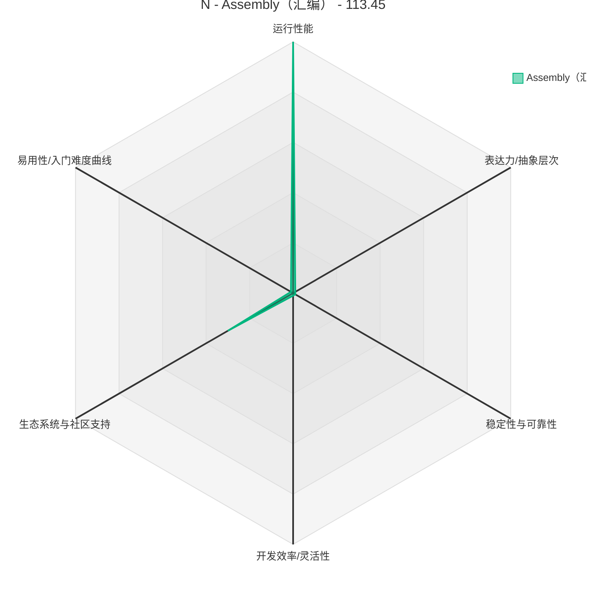
```mermaid
---
title: "N - Assembly（汇编） - 113.45"
config:
  themeVariables:
    cScale0: "#00B67F"
---
radar-beta
    axis Perf["运行性能"], Abst["表达力/抽象层次"], Stab["稳定性与可靠性"]
    axis DevEff["开发效率/灵活性"], Eco["生态系统与社区支持"], Ease["易用性/入门难度曲线"]
    curve a["Assembly（汇编）"] { 100, 1, 1, 1, 30, 1 }
    max 100
    min 0
    graticule polygon
```

### 75.  **PostScript**

- **中二描述:** 《页面描述幽灵》 - 它是打印机的低语，以堆栈和指令精确控制每一个像素点，是数字出版的幕后功臣。
- **范式:** 堆栈导向、解释型、图灵完备
- **应用领域:** 页面描述、打印、字体技术 (Type 1)

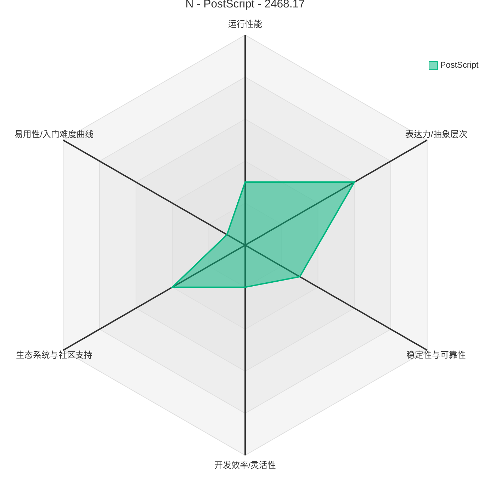
```mermaid
---
title: "N - PostScript - 2468.17"
config:
  themeVariables:
    cScale0: "#00B67F"
---
radar-beta
    axis Perf["运行性能"], Abst["表达力/抽象层次"], Stab["稳定性与可靠性"]
    axis DevEff["开发效率/灵活性"], Eco["生态系统与社区支持"], Ease["易用性/入门难度曲线"]
    curve a["PostScript"] { 30, 60, 30, 20, 40, 10 }
    max 100
    min 0
    graticule polygon
```

### 74.  **WebAssembly (Wasm)**

- **中二描述:** 《浏览器内的通用虚拟机》 - 它不是一种手写语言，而是C/C++/Rust等语言的编译目标，赋予Web近乎原生的力量。
- **范式:** 底层字节码、栈式虚拟机
- **应用领域:** Web高性能计算、游戏、代码复用、非Web环境的沙箱

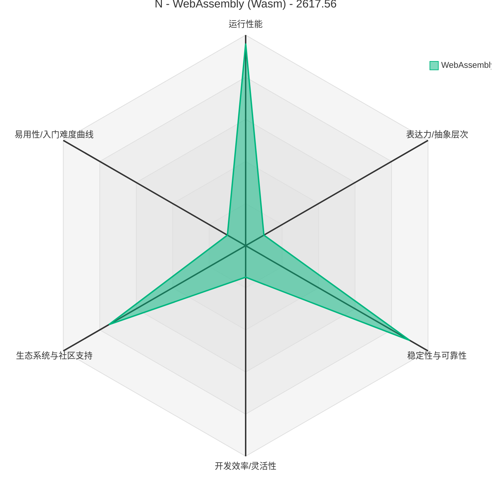
```mermaid
---
title: "N - WebAssembly (Wasm) - 2617.56"
config:
  themeVariables:
    cScale0: "#00B67F"
---
radar-beta
    axis Perf["运行性能"], Abst["表达力/抽象层次"], Stab["稳定性与可靠性"]
    axis DevEff["开发效率/灵活性"], Eco["生态系统与社区支持"], Ease["易用性/入门难度曲线"]
    curve a["WebAssembly (Wasm)"] { 96, 10, 90, 15, 75, 10 }
    max 100
    min 0
    graticule polygon
```

### 73.  **COBOL**

- **中二描述:** 《商业古籍》 - 诞生于大型机时代，至今仍在金融系统中默默运转，是稳定压倒一切的活化石。
- **范式:** 指令式、过程式
- **应用领域:** 金融、保险、大型企业核心业务系统 (遗留系统)

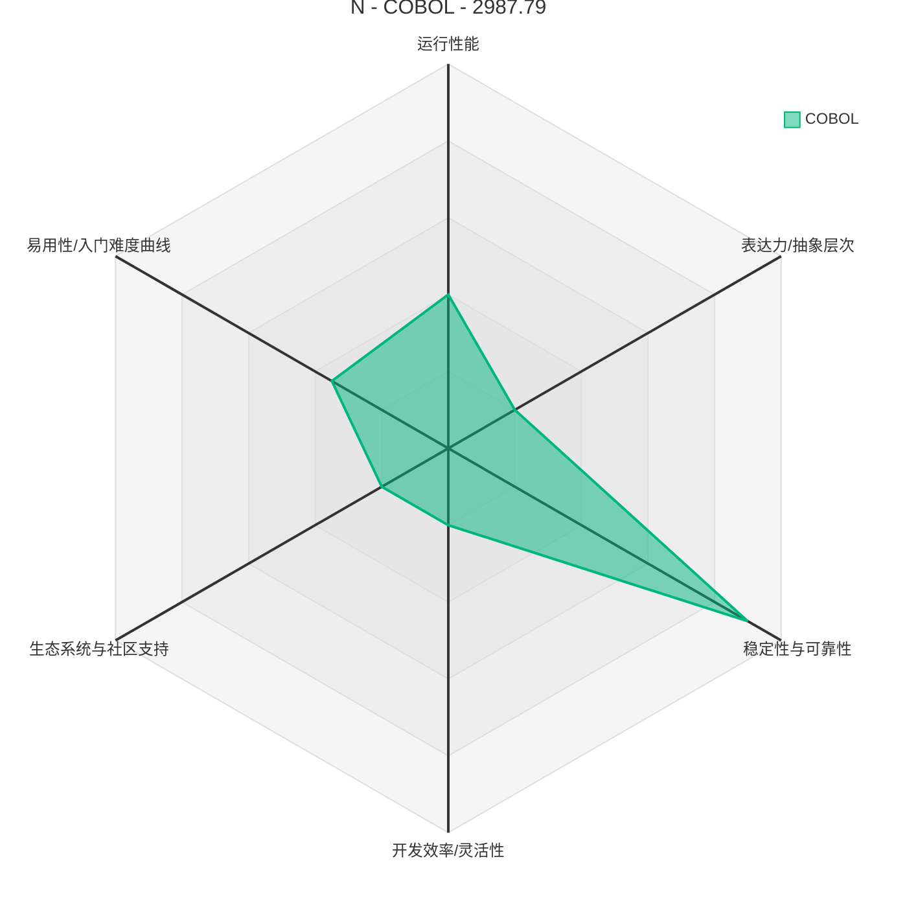
```mermaid
---
title: "N - COBOL - 2987.79"
config:
  themeVariables:
    cScale0: "#00B67F"
---
radar-beta
    axis Perf["运行性能"], Abst["表达力/抽象层次"], Stab["稳定性与可靠性"]
    axis DevEff["开发效率/灵活性"], Eco["生态系统与社区支持"], Ease["易用性/入门难度曲线"]
    curve a["COBOL"] { 40, 20, 90, 20, 20, 35 }
    max 100
    min 0
    graticule polygon
```

### 72.  **VBScript**

- **中二描述:** 《Windows脚本巫师》 - 曾是Windows系统自动化的轻骑兵，如今在历史的长河中逐渐隐去。
- **范式:** 脚本、过程式
- **应用领域:** Windows系统管理 (旧)、ASP网页 (旧)、Office宏

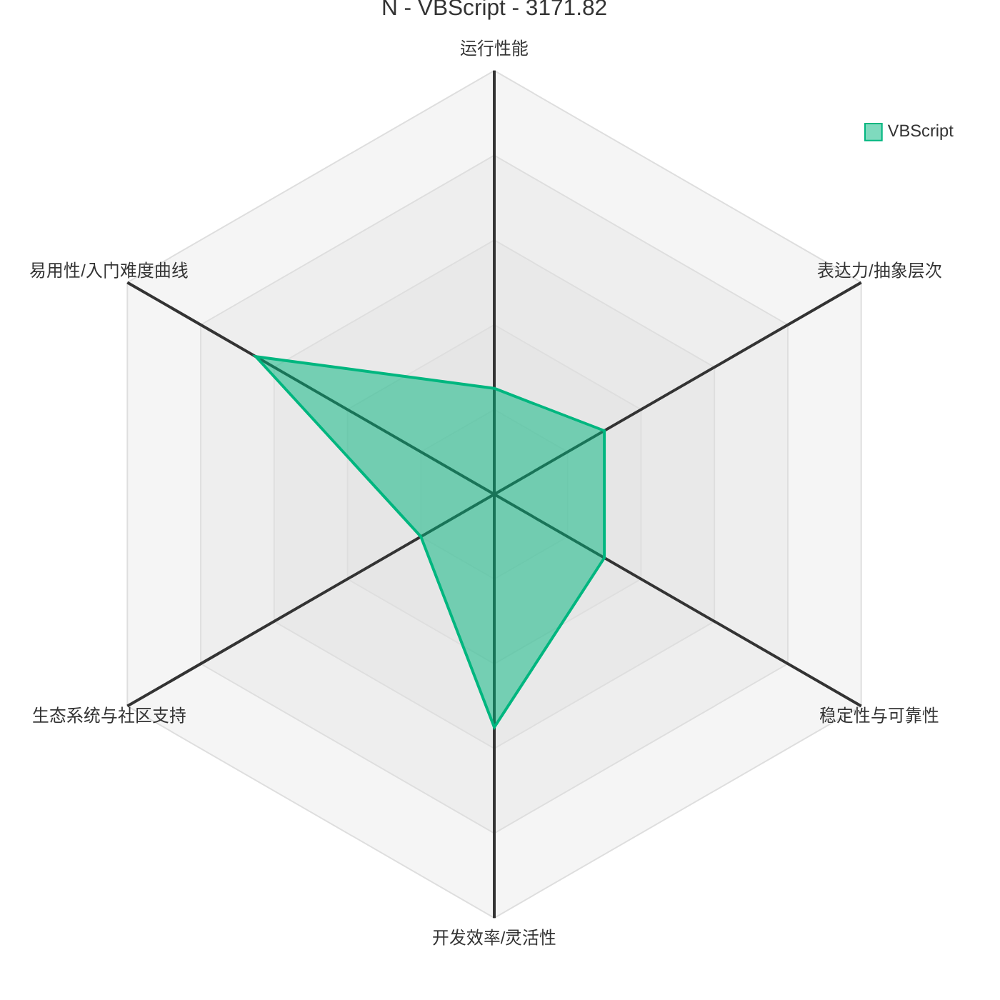
```mermaid
---
title: "N - VBScript - 3171.82"
config:
  themeVariables:
    cScale0: "#00B67F"
---
radar-beta
    axis Perf["运行性能"], Abst["表达力/抽象层次"], Stab["稳定性与可靠性"]
    axis DevEff["开发效率/灵活性"], Eco["生态系统与社区支持"], Ease["易用性/入门难度曲线"]
    curve a["VBScript"] { 25, 30, 30, 55, 20, 65 }
    max 100
    min 0
    graticule polygon
```

### 71.  **PL/I**

- **中二描述:** 《万能胶水语言》 - IBM试图统一科学计算、商业处理和系统编程的雄心之作，特性丰富但也复杂。
- **范式:** 指令式、过程式、多用途
- **应用领域:** 大型机系统、商业应用 (历史)

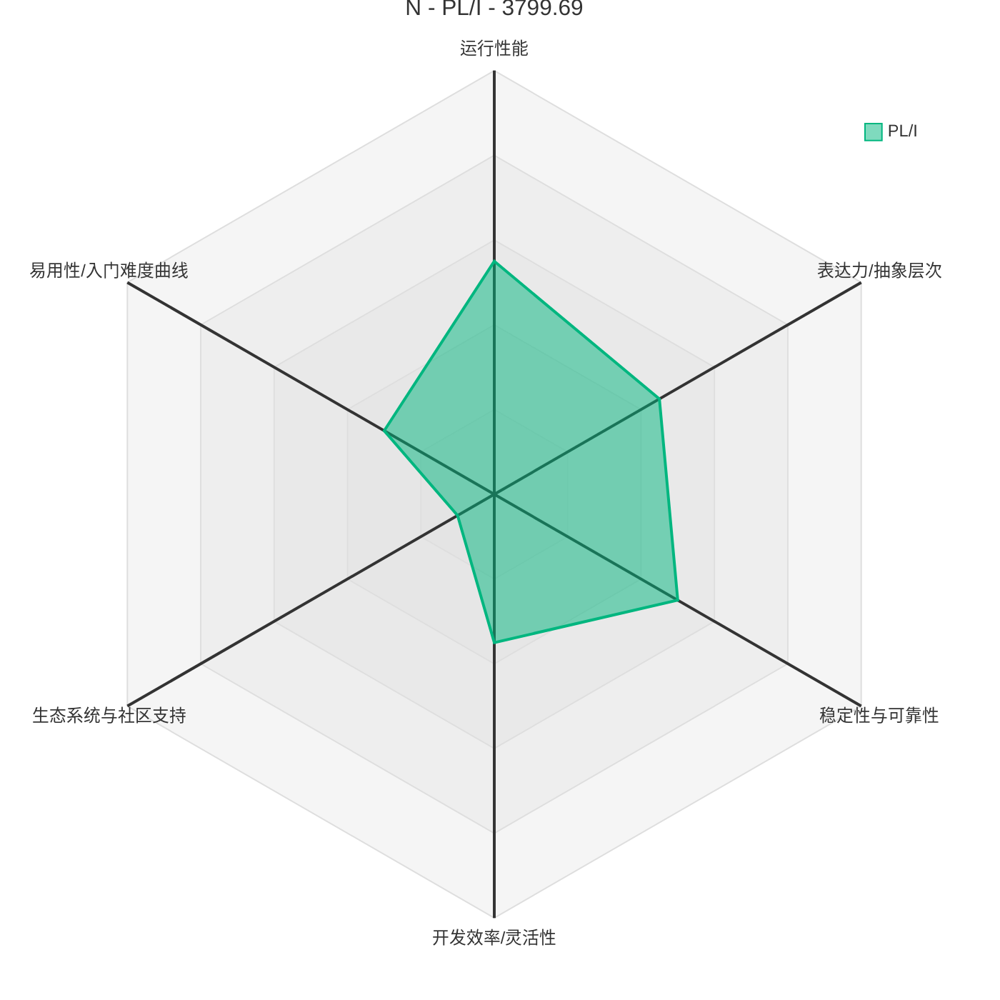
```mermaid
---
title: "N - PL/I - 3799.69"
config:
  themeVariables:
    cScale0: "#00B67F"
---
radar-beta
    axis Perf["运行性能"], Abst["表达力/抽象层次"], Stab["稳定性与可靠性"]
    axis DevEff["开发效率/灵活性"], Eco["生态系统与社区支持"], Ease["易用性/入门难度曲线"]
    curve a["PL/I"] { 55, 45, 50, 35, 10, 30 }
    max 100
    min 0
    graticule polygon
```

### 70.  **BASIC**

- **中二描述:** 《初学者通用符号指令码》 - 它曾是个人电脑的“开机语言”，让一代人首次体验编程的乐趣。
- **范式:** 指令式、过程式 (早期版本)
- **应用领域:** 早期微型计算机、教育、简单应用 (现代如Gambas)

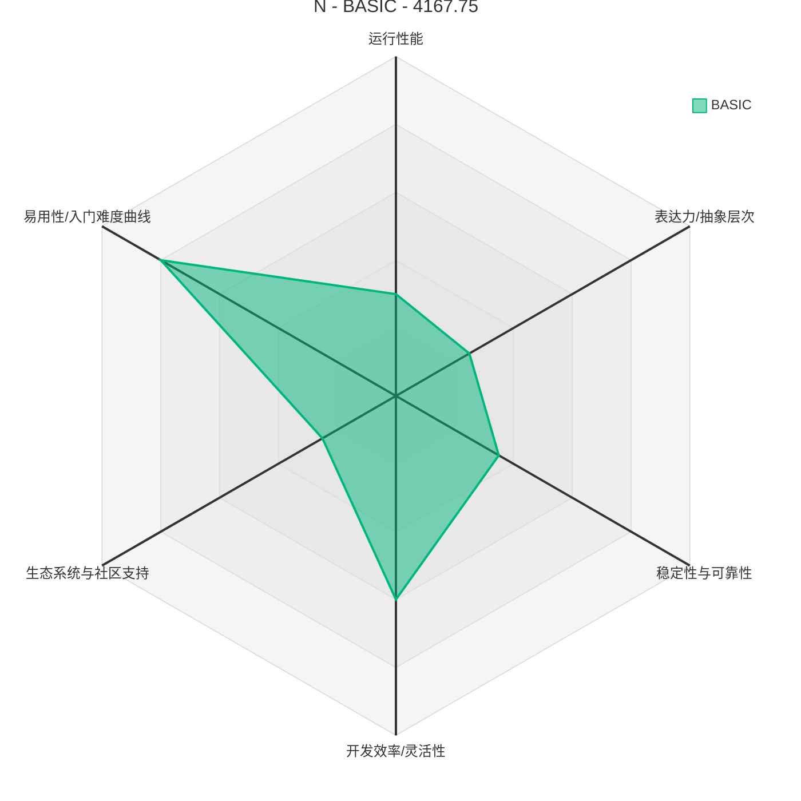
```mermaid
---
title: "N - BASIC - 4167.75"
config:
  themeVariables:
    cScale0: "#00B67F"
---
radar-beta
    axis Perf["运行性能"], Abst["表达力/抽象层次"], Stab["稳定性与可靠性"]
    axis DevEff["开发效率/灵活性"], Eco["生态系统与社区支持"], Ease["易用性/入门难度曲线"]
    curve a["BASIC"] { 30, 25, 35, 60, 25, 80 }
    max 100
    min 0
    graticule polygon
```

### 69.  **Simula**

- **中二描述:** 《面向对象之祖》 - 它是第一个引入类、对象、继承概念的语言，启发了后世无数的追随者。
- **范式:** 面向对象、过程式、离散事件模拟
- **应用领域:** 模拟、系统建模 (历史)、编程语言研究

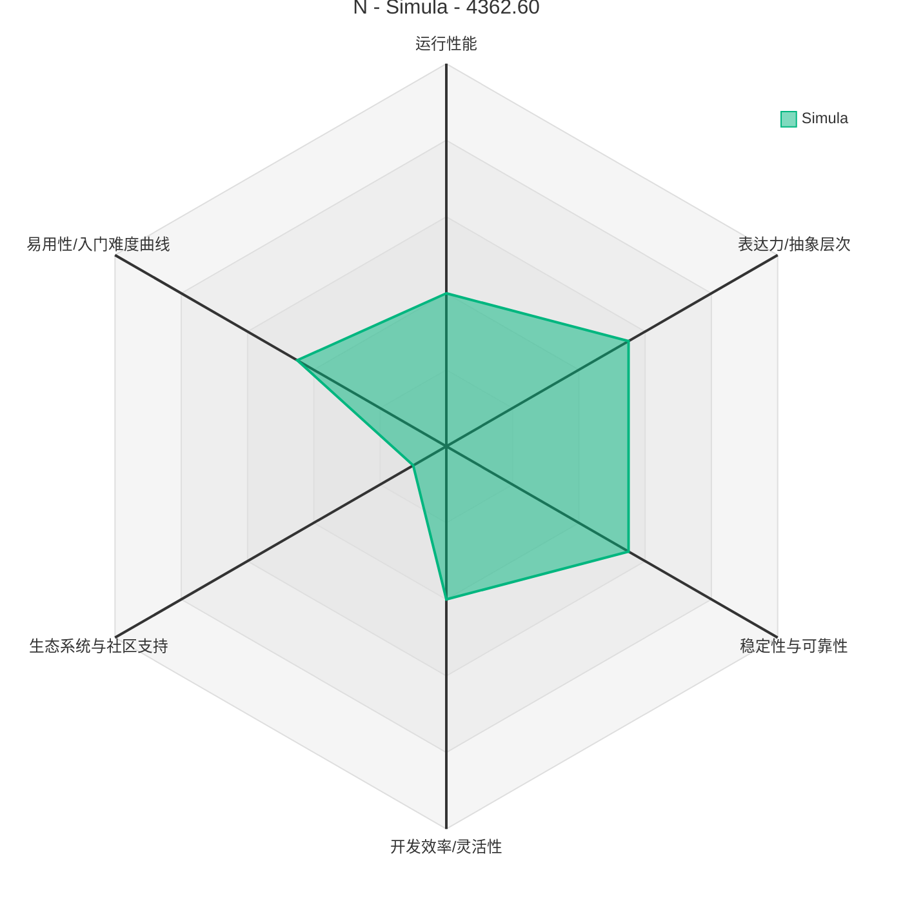
```mermaid
---
title: "N - Simula - 4362.60"
config:
  themeVariables:
    cScale0: "#00B67F"
---
radar-beta
    axis Perf["运行性能"], Abst["表达力/抽象层次"], Stab["稳定性与可靠性"]
    axis DevEff["开发效率/灵活性"], Eco["生态系统与社区支持"], Ease["易用性/入门难度曲线"]
    curve a["Simula"] { 40, 55, 55, 40, 10, 45 }
    max 100
    min 0
    graticule polygon
```

### 68.  **Forth**

- **中二描述:** 《堆栈魔术师》 - 极简主义的典范，以逆波兰表示法和可扩展词典构建高效的自定义系统。
- **范式:** 堆栈导向、指令式、可扩展
- **应用领域:** 嵌入式系统、引导加载程序、天文望远镜控制

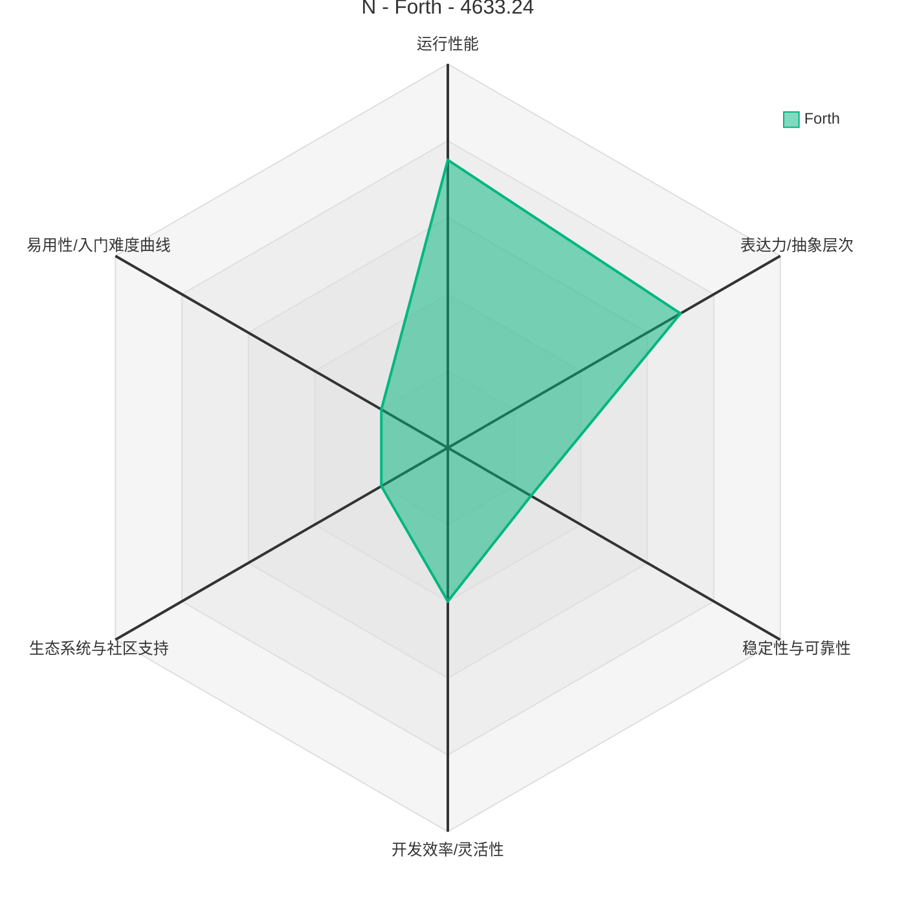
```mermaid
---
title: "N - Forth - 4633.24"
config:
  themeVariables:
    cScale0: "#00B67F"
---
radar-beta
    axis Perf["运行性能"], Abst["表达力/抽象层次"], Stab["稳定性与可靠性"]
    axis DevEff["开发效率/灵活性"], Eco["生态系统与社区支持"], Ease["易用性/入门难度曲线"]
    curve a["Forth"] { 75, 70, 25, 40, 20, 20 }
    max 100
    min 0
    graticule polygon
```

### 67.  **ALGOL**

- **中二描述:** 《算法语言典范》 - 它是结构化编程的理论基石，引入了代码块、词法作用域等重要概念，影响深远。
- **范式:** 指令式、结构化
- **应用领域:** 算法描述、编程语言研究 (历史)

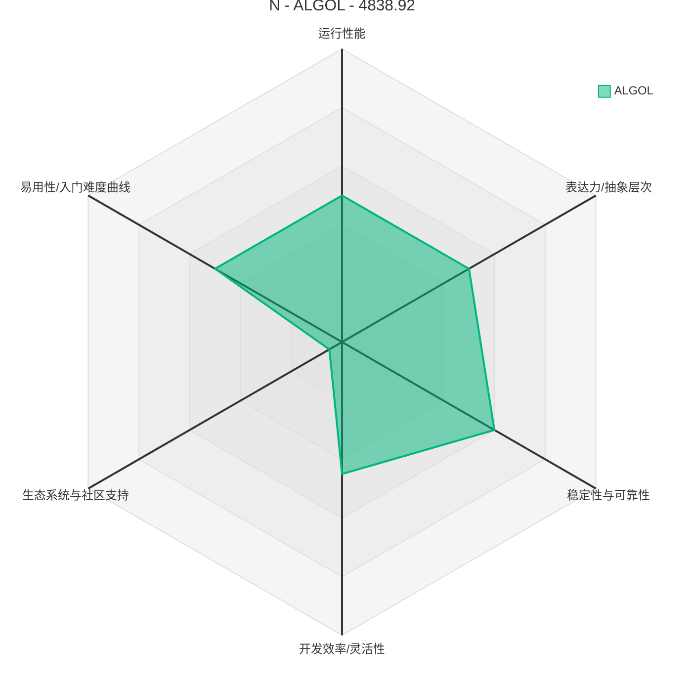
```mermaid
---
title: "N - ALGOL - 4838.92"
config:
  themeVariables:
    cScale0: "#00B67F"
---
radar-beta
    axis Perf["运行性能"], Abst["表达力/抽象层次"], Stab["稳定性与可靠性"]
    axis DevEff["开发效率/灵活性"], Eco["生态系统与社区支持"], Ease["易用性/入门难度曲线"]
    curve a["ALGOL"] { 50, 50, 60, 45, 5, 50 }
    max 100
    min 0
    graticule polygon
```

### 66.  **mcfunction (Minecraft Functions)**

- **中二描述:** 作为一个游戏脚本语言，在有着高级语言低性能缺点的同时也有着低级语言的编写和维护难度，甚至还要和官方给的接口斗智斗勇。
- **范式:** 指令序列、事件驱动
- **应用领域:** Minecraft游戏逻辑、地图制作、数据包

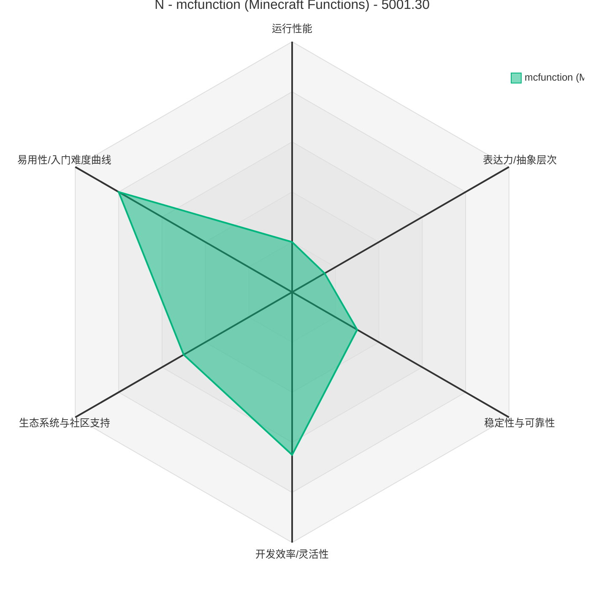
```mermaid
---
title: "N - mcfunction (Minecraft Functions) - 5001.30"
config:
  themeVariables:
    cScale0: "#00B67F"
---
radar-beta
    axis Perf["运行性能"], Abst["表达力/抽象层次"], Stab["稳定性与可靠性"]
    axis DevEff["开发效率/灵活性"], Eco["生态系统与社区支持"], Ease["易用性/入门难度曲线"]
    curve a["mcfunction (Minecraft Functions)"] { 20, 15, 30, 65, 50, 80 }
    max 100
    min 0
    graticule polygon
```

### 65.  **OpenCL/CUDA**

- **中二描述:** 《并行计算双雄》 - 释放GPU的洪荒之力，为通用计算加速，是AI、科学模拟和大数据处理的幕后英雄。
- **范式:** 并行计算、类C/C++
- **应用领域:** GPGPU、机器学习、科学计算、图像处理、密码学

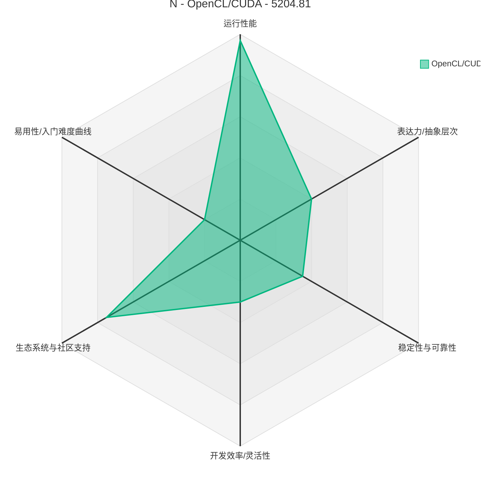
```mermaid
---
title: "N - OpenCL/CUDA - 5204.81"
config:
  themeVariables:
    cScale0: "#00B67F"
---
radar-beta
    axis Perf["运行性能"], Abst["表达力/抽象层次"], Stab["稳定性与可靠性"]
    axis DevEff["开发效率/灵活性"], Eco["生态系统与社区支持"], Ease["易用性/入门难度曲线"]
    curve a["OpenCL/CUDA"] { 97, 40, 35, 30, 75, 20 }
    max 100
    min 0
    graticule polygon
```

### 64.  **LaTeX**

- **中二描述:** 《排版圣律》 - 它是学术界的桂冠，以精确的命令构建优雅的文档，追求印刷美学的极致。
- **范式:** 标记语言 / 宏语言
- **应用领域:** 学术论文、书籍排版、技术文档、数学公式

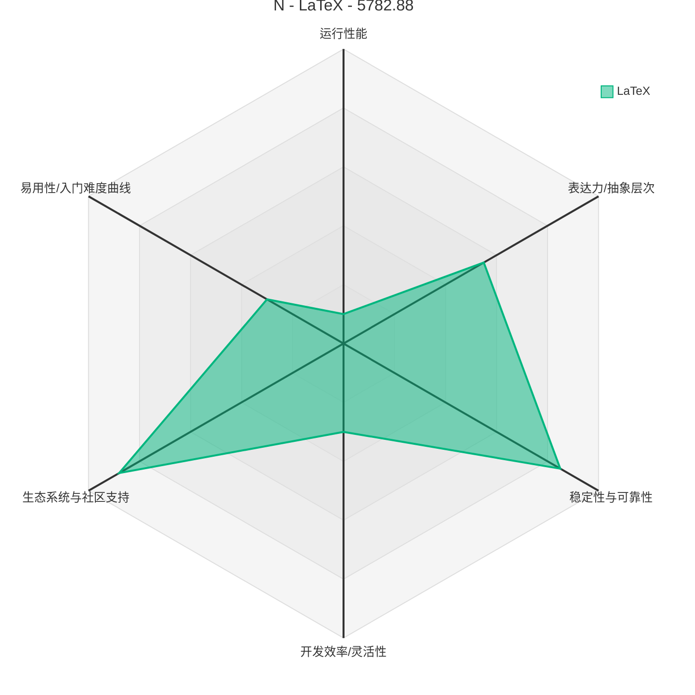
```mermaid
---
title: "N - LaTeX - 5782.88"
config:
  themeVariables:
    cScale0: "#00B67F"
---
radar-beta
    axis Perf["运行性能"], Abst["表达力/抽象层次"], Stab["稳定性与可靠性"]
    axis DevEff["开发效率/灵活性"], Eco["生态系统与社区支持"], Ease["易用性/入门难度曲线"]
    curve a["LaTeX"] { 10, 55, 85, 30, 88, 30 }
    max 100
    min 0
    graticule polygon
```

### 63.  **Logo**

- **中二描述:** 《海龟绘图师》 - 以小海龟的轨迹教授几何与编程，是儿童探索计算思维的乐园。
- **范式:** 教育编程语言、函数式 (部分变体)、过程式
- **应用领域:** 儿童编程教育、几何绘图、早期AI研究

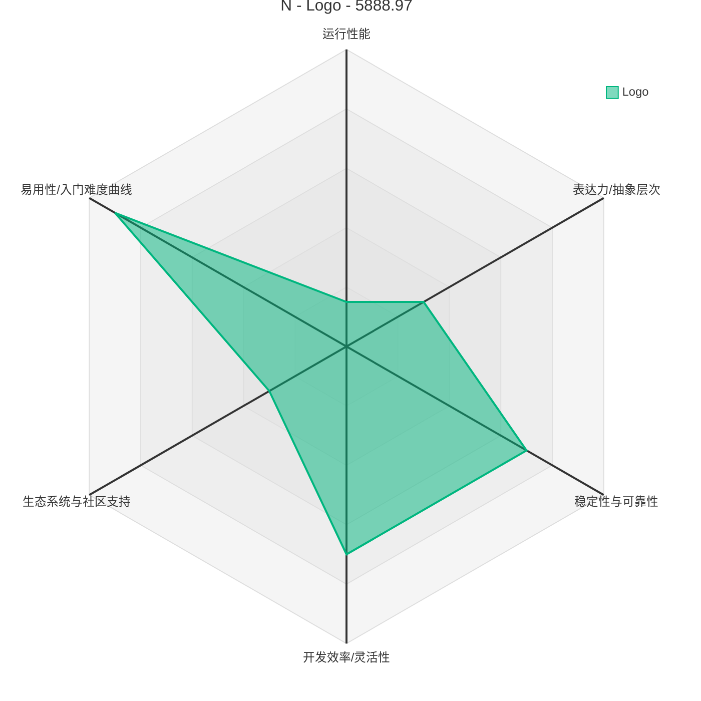
```mermaid
---
title: "N - Logo - 5888.97"
config:
  themeVariables:
    cScale0: "#00B67F"
---
radar-beta
    axis Perf["运行性能"], Abst["表达力/抽象层次"], Stab["稳定性与可靠性"]
    axis DevEff["开发效率/灵活性"], Eco["生态系统与社区支持"], Ease["易用性/入门难度曲线"]
    curve a["Logo"] { 15, 30, 70, 70, 30, 90 }
    max 100
    min 0
    graticule polygon
```

### 62.  **DTrace**

- **中二描述:** 《系统洞察者》 - 动态追踪的利刃，深入内核与应用，揭示系统运行的每一个细节。
- **范式:** 动态追踪语言、类C语法
- **应用领域:** 系统性能分析、故障排查、内核调试 (Solaris, macOS, FreeBSD)

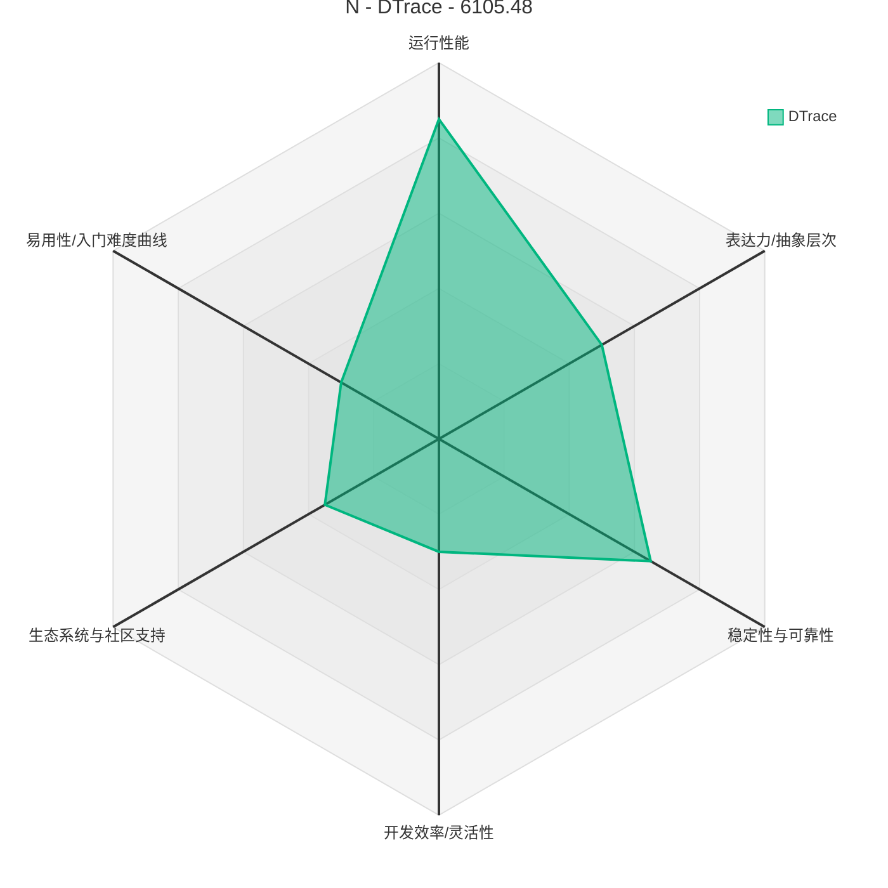
```mermaid
---
title: "N - DTrace - 6105.48"
config:
  themeVariables:
    cScale0: "#00B67F"
---
radar-beta
    axis Perf["运行性能"], Abst["表达力/抽象层次"], Stab["稳定性与可靠性"]
    axis DevEff["开发效率/灵活性"], Eco["生态系统与社区支持"], Ease["易用性/入门难度曲线"]
    curve a["DTrace"] { 85, 50, 65, 30, 35, 30 }
    max 100
    min 0
    graticule polygon
```

### 61.  **C**

- **中二描述:** 《系统编程之父，万物基于C》 - 贴近硬件，高效灵活，是操作系统、嵌入式和无数高性能应用的基础。
- **范式:** 指令式、过程式
- **应用领域:** 操作系统内核 (Linux, Windows)、嵌入式系统、驱动程序、高性能计算、编译器、解释器

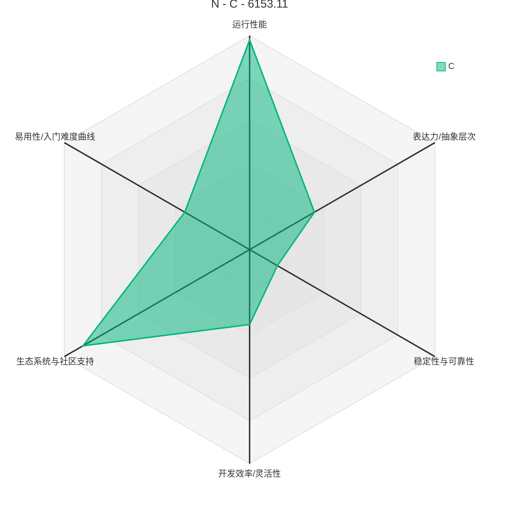
```mermaid
---
title: "N - C - 6153.11"
config:
  themeVariables:
    cScale0: "#00B67F"
---
radar-beta
    axis Perf["运行性能"], Abst["表达力/抽象层次"], Stab["稳定性与可靠性"]
    axis DevEff["开发效率/灵活性"], Eco["生态系统与社区支持"], Ease["易用性/入门难度曲线"]
    curve a["C"] { 98, 35, 15, 35, 90, 35 }
    max 100
    min 0
    graticule polygon
```

### 60.  **易语言 (E-Language)**

- **中二描述:** 《中文编程之光》 - 以汉字为钥，为中文世界打开编程之门，降低了语言的壁垒。
- **范式:** 事件驱动、面向对象 (部分)
- **应用领域:** Windows桌面应用、辅助工具、游戏外挂 (早期)

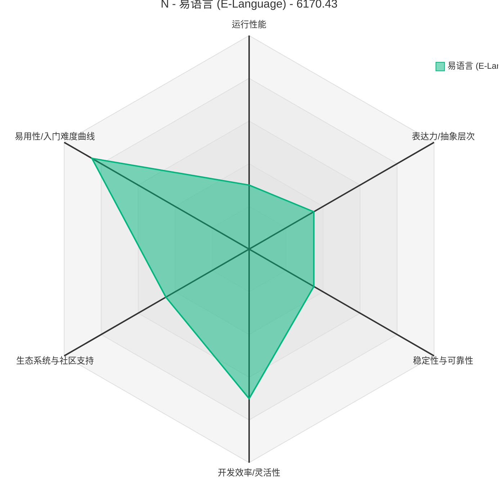
```mermaid
---
title: "N - 易语言 (E-Language) - 6170.43"
config:
  themeVariables:
    cScale0: "#00B67F"
---
radar-beta
    axis Perf["运行性能"], Abst["表达力/抽象层次"], Stab["稳定性与可靠性"]
    axis DevEff["开发效率/灵活性"], Eco["生态系统与社区支持"], Ease["易用性/入门难度曲线"]
    curve a["易语言 (E-Language)"] { 30, 35, 35, 70, 45, 85 }
    max 100
    min 0
    graticule polygon
```

### 59.  **Fortran**

- **中二描述:** 《公式翻译者》 - 科学计算的活化石，为数值计算而生，至今仍在超算领域占据一席之地。
- **范式:** 指令式、过程式、面向对象 (现代版本)
- **应用领域:** 科学与工程计算、高性能计算 (HPC)、数值分析

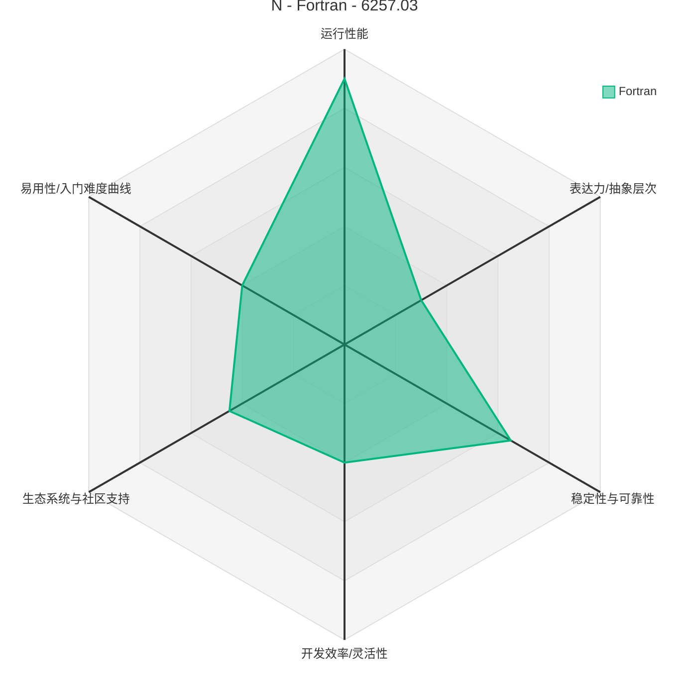
```mermaid
---
title: "N - Fortran - 6257.03"
config:
  themeVariables:
    cScale0: "#00B67F"
---
radar-beta
    axis Perf["运行性能"], Abst["表达力/抽象层次"], Stab["稳定性与可靠性"]
    axis DevEff["开发效率/灵活性"], Eco["生态系统与社区支持"], Ease["易用性/入门难度曲线"]
    curve a["Fortran"] { 90, 30, 65, 40, 45, 40 }
    max 100
    min 0
    graticule polygon
```

### 58.  **C++**

- **中二描述:** 《性能怪兽与复杂度巨匠》 - 在C的基础上融入面向对象和泛型编程，性能极致，但语法复杂，掌控万千细节。
- **范式:** 面向对象、指令式、泛型编程、函数式 (现代C++)、元编程
- **应用领域:** 游戏引擎 (Unreal, CryEngine)、操作系统、高性能计算、金融交易、浏览器、编译器

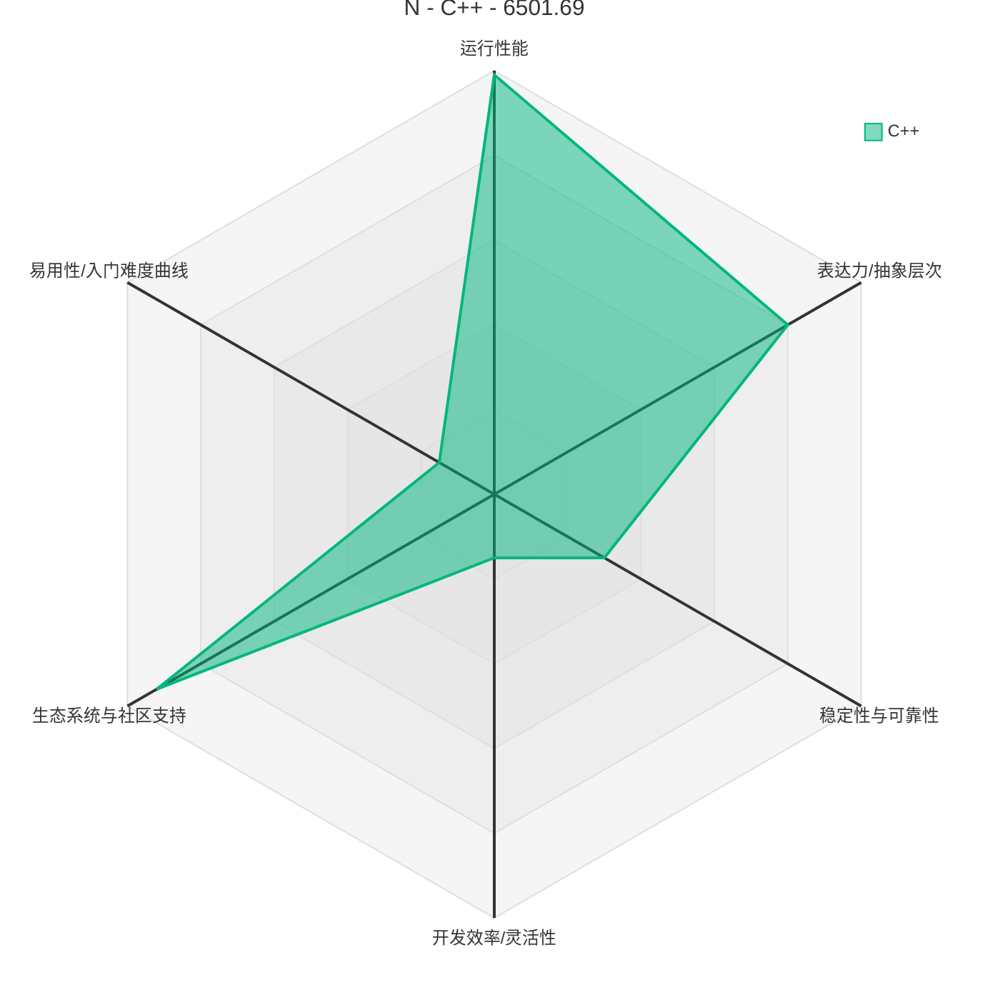
```mermaid
---
title: "N - C++ - 6501.69"
config:
  themeVariables:
    cScale0: "#00B67F"
---
radar-beta
    axis Perf["运行性能"], Abst["表达力/抽象层次"], Stab["稳定性与可靠性"]
    axis DevEff["开发效率/灵活性"], Eco["生态系统与社区支持"], Ease["易用性/入门难度曲线"]
    curve a["C++"] { 99, 80, 30, 15, 92, 15 }
    max 100
    min 0
    graticule polygon
```

### 57.  **Prolog**

- **中二描述:** 《逻辑编程先驱》 - 它不问“怎么做”，只问“是什么”，以规则和事实推理答案，是AI领域的独特存在。
- **范式:** 逻辑编程、声明式
- **应用领域:** 人工智能 (专家系统, NLP)、定理证明、符号计算

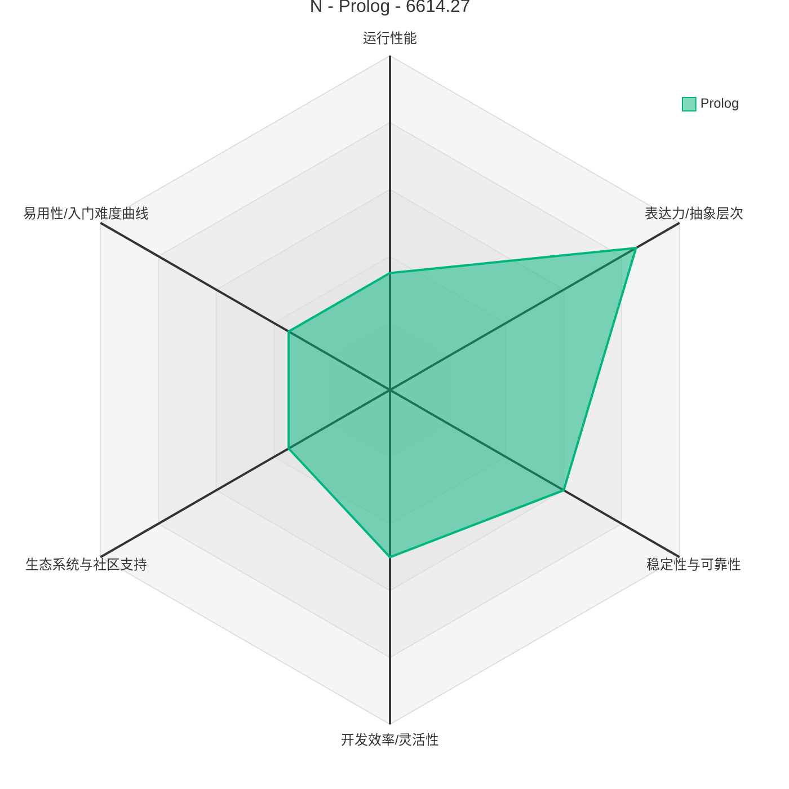
```mermaid
---
title: "N - Prolog - 6614.27"
config:
  themeVariables:
    cScale0: "#00B67F"
---
radar-beta
    axis Perf["运行性能"], Abst["表达力/抽象层次"], Stab["稳定性与可靠性"]
    axis DevEff["开发效率/灵活性"], Eco["生态系统与社区支持"], Ease["易用性/入门难度曲线"]
    curve a["Prolog"] { 35, 85, 60, 50, 35, 35 }
    max 100
    min 0
    graticule polygon
```

### 56.  **Pascal**

- **中二描述:** 《结构化启蒙者》 - 以清晰的结构和严格的教诲引导初学者，是编程教育的里程碑，简单而纯粹。
- **范式:** 指令式、过程式、结构化
- **应用领域:** 教育、早期桌面应用 (Delphi前身)

```mermaid
---
title: "N - Pascal - 6895.73"
config:
  themeVariables:
    cScale0: "#00B67F"
---
radar-beta
    axis Perf["运行性能"], Abst["表达力/抽象层次"], Stab["稳定性与可靠性"]
    axis DevEff["开发效率/灵活性"], Eco["生态系统与社区支持"], Ease["易用性/入门难度曲线"]
    curve a["Pascal"] { 55, 40, 65, 50, 30, 75 }
    max 100
    min 0
    graticule polygon
```

### 55.  **XML**

- **中二描述:** 《万象契约》 - 以严谨的标签约束数据，承载信息的古老盟约，是跨越平台的通用语。
- **范式:** 标记语言
- **应用领域:** 数据交换、配置文件、文档格式 (如SVG, Office Open XML)

```mermaid
---
title: "N - XML - 6949.85"
config:
  themeVariables:
    cScale0: "#00B67F"
---
radar-beta
    axis Perf["运行性能"], Abst["表达力/抽象层次"], Stab["稳定性与可靠性"]
    axis DevEff["开发效率/灵活性"], Eco["生态系统与社区支持"], Ease["易用性/入门难度曲线"]
    curve a["XML"] { 10, 25, 80, 40, 90, 70 }
    max 100
    min 0
    graticule polygon
```

### 54.  **Modula-2/Oberon**

- **中二描述:** 《模块化继承者》 - Pascal之父对其思想的进一步发展，强调模块化和系统编程，简洁而强大。
- **范式:** 指令式、模块化、面向对象 (Oberon)
- **应用领域:** 操作系统 (Oberon System)、教育、嵌入式系统

```mermaid
---
title: "N - Modula-2/Oberon - 7025.63"
config:
  themeVariables:
    cScale0: "#00B67F"
---
radar-beta
    axis Perf["运行性能"], Abst["表达力/抽象层次"], Stab["稳定性与可靠性"]
    axis DevEff["开发效率/灵活性"], Eco["生态系统与社区支持"], Ease["易用性/入门难度曲线"]
    curve a["Modula-2/Oberon"] { 60, 60, 70, 55, 15, 50 }
    max 100
    min 0
    graticule polygon
```

### 53.  **Bash**

- **中二描述:** 《终端命令行者》 - Unix世界的胶水，以简洁的命令编排系统任务，是自动化运维的基石。
- **范式:** 脚本、命令行解释器
- **应用领域:** Shell脚本、系统管理、自动化任务

```mermaid
---
title: "N - Bash - 7047.28"
config:
  themeVariables:
    cScale0: "#00B67F"
---
radar-beta
    axis Perf["运行性能"], Abst["表达力/抽象层次"], Stab["稳定性与可靠性"]
    axis DevEff["开发效率/灵活性"], Eco["生态系统与社区支持"], Ease["易用性/入门难度曲线"]
    curve a["Bash"] { 30, 25, 35, 70, 80, 60 }
    max 100
    min 0
    graticule polygon
```

### 52.  **Coq**

- **中二描述:** 《构造演算的定理圣杯》 - 它是逻辑的形式化圣殿，以交互式证明构建数学真理与可靠软件的基石。
- **范式:** 依赖类型、证明助手、函数式
- **应用领域:** 形式化验证 (编译器CompCert, seL4微内核)、数学定理证明 (四色定理)、软件规范

```mermaid
---
title: "N - Coq - 7097.08"
config:
  themeVariables:
    cScale0: "#00B67F"
---
radar-beta
    axis Perf["运行性能"], Abst["表达力/抽象层次"], Stab["稳定性与可靠性"]
    axis DevEff["开发效率/灵活性"], Eco["生态系统与社区支持"], Ease["易用性/入门难度曲线"]
    curve a["Coq"] { 50, 97, 100, 8, 40, 8 }
    max 100
    min 0
    graticule polygon
```

## **R**

### 51.  **Idris**

- **中二描述:** 《证明之钥 - 依赖圣典》 - 代码即定理，类型即宇宙。它以依赖类型系统，将程序的规范与数学证明融为一体，是通往程序正确性的终极裁决者。
- **范式:** 函数式、依赖类型
- **应用领域:** 形式化验证、依赖类型研究、高可靠软件原型、理论计算机科学

```mermaid
---
title: "R - Idris - 7265.95"
config:
  themeVariables:
    cScale0: "#0099FF"
---
radar-beta
    axis Perf["运行性能"], Abst["表达力/抽象层次"], Stab["稳定性与可靠性"]
    axis DevEff["开发效率/灵活性"], Eco["生态系统与社区支持"], Ease["易用性/入门难度曲线"]
    curve a["Idris"] { 60, 98, 100, 5, 30, 5 }
    max 100
    min 0
    graticule polygon
```

### 50.  **VHDL/Verilog**

- **中二描述:** 《硬件描述双子星》 - 它们并非执行代码，而是描述数字电路的蓝图，是芯片设计的基石。
- **范式:** 硬件描述语言 (HDL)、并行
- **应用领域:** FPGA设计、ASIC设计、数字电路仿真与综合

```mermaid
---
title: "R - VHDL/Verilog - 7339.57"
config:
  themeVariables:
    cScale0: "#0099FF"
---
radar-beta
    axis Perf["运行性能"], Abst["表达力/抽象层次"], Stab["稳定性与可靠性"]
    axis DevEff["开发效率/灵活性"], Eco["生态系统与社区支持"], Ease["易用性/入门难度曲线"]
    curve a["VHDL/Verilog"] { 95, 50, 85, 30, 55, 25 }
    max 100
    min 0
    graticule polygon
```

### 49.  **GLSL/HLSL**

- **中二描述:** 《图形渲染着色魔法》 - 在GPU上运行，赋予三维世界光影、材质与特效，是游戏与视觉艺术的画笔。
- **范式:** 图形着色语言、类C、并行
- **应用领域:** 实时图形渲染、游戏开发、视觉特效、GPU计算 (部分)

```mermaid
---
title: "R - GLSL/HLSL - 7395.86"
config:
  themeVariables:
    cScale0: "#0099FF"
---
radar-beta
    axis Perf["运行性能"], Abst["表达力/抽象层次"], Stab["稳定性与可靠性"]
    axis DevEff["开发效率/灵活性"], Eco["生态系统与社区支持"], Ease["易用性/入门难度曲线"]
    curve a["GLSL/HLSL"] { 96, 45, 40, 40, 80, 35 }
    max 100
    min 0
    graticule polygon
```

### 48.  **Tcl**

- **中二描述:** 《工具命令语》 - 灵活的脚本语言，擅长嵌入与扩展，是Tk图形库的黄金搭档。
- **范式:** 脚本、事件驱动、过程式
- **应用领域:** GUI开发(Tk)、嵌入式脚本、自动化测试、EDA

```mermaid
---
title: "R - Tcl - 7480.29"
config:
  themeVariables:
    cScale0: "#0099FF"
---
radar-beta
    axis Perf["运行性能"], Abst["表达力/抽象层次"], Stab["稳定性与可靠性"]
    axis DevEff["开发效率/灵活性"], Eco["生态系统与社区支持"], Ease["易用性/入门难度曲线"]
    curve a["Tcl"] { 45, 60, 55, 65, 40, 60 }
    max 100
    min 0
    graticule polygon
```

### 47.  **Ada**

- **中二描述:** 《高可靠守护者》 - 为安全而生，以极致的严谨性和强大的并发特性守护着航空航天与国防的关键系统。
- **范式:** 指令式、面向对象、并发、强类型
- **应用领域:** 航空航天、国防军事、铁路系统、高可靠性嵌入式系统

```mermaid
---
title: "R - Ada - 7837.53"
config:
  themeVariables:
    cScale0: "#0099FF"
---
radar-beta
    axis Perf["运行性能"], Abst["表达力/抽象层次"], Stab["稳定性与可靠性"]
    axis DevEff["开发效率/灵活性"], Eco["生态系统与社区支持"], Ease["易用性/入门难度曲线"]
    curve a["Ada"] { 70, 65, 95, 35, 30, 30 }
    max 100
    min 0
    graticule polygon
```

### 46.  **Perl**

- **中二描述:** 《文本处理瑞士军刀》 - 曾是CGI的王者，以强大的正则表达式和灵活的语法著称，万物皆可正则。
- **范式:** 脚本、过程式、面向对象 (可选)、函数式 (可选)
- **应用领域:** 文本处理、系统管理、Web开发 (早期CGI)、生物信息学

```mermaid
---
title: "R - Perl - 8205.59"
config:
  themeVariables:
    cScale0: "#0099FF"
---
radar-beta
    axis Perf["运行性能"], Abst["表达力/抽象层次"], Stab["稳定性与可靠性"]
    axis DevEff["开发效率/灵活性"], Eco["生态系统与社区支持"], Ease["易用性/入门难度曲线"]
    curve a["Perl"] { 50, 70, 45, 70, 60, 45 }
    max 100
    min 0
    graticule polygon
```

### 45.  **SVG**

- **中二描述:** 《矢量魔镜》 - 以XML为骨，描绘可无限缩放的图形幻境，是Web上永不失真的视觉艺术。
- **范式:** XML标记语言 (图形)
- **应用领域:** Web矢量图形、图表、图标、动画

```mermaid
---
title: "R - SVG - 8465.40"
config:
  themeVariables:
    cScale0: "#0099FF"
---
radar-beta
    axis Perf["运行性能"], Abst["表达力/抽象层次"], Stab["稳定性与可靠性"]
    axis DevEff["开发效率/灵活性"], Eco["生态系统与社区支持"], Ease["易用性/入门难度曲线"]
    curve a["SVG"] { 20, 45, 70, 60, 80, 65 }
    max 100
    min 0
    graticule polygon
```

### 44.  **ML (Meta Language)**

- **中二描述:** 《类型推演始祖》 - 它是现代函数式语言的智慧源泉，以精妙的类型系统和模式匹配预示了未来的潮流。
- **范式:** 函数式、指令式、强类型、类型推断
- **应用领域:** 编译器编写、定理证明、语言研究 (Standard ML, Caml Light)

```mermaid
---
title: "R - ML (Meta Language) - 8811.81"
config:
  themeVariables:
    cScale0: "#0099FF"
---
radar-beta
    axis Perf["运行性能"], Abst["表达力/抽象层次"], Stab["稳定性与可靠性"]
    axis DevEff["开发效率/灵活性"], Eco["生态系统与社区支持"], Ease["易用性/入门难度曲线"]
    curve a["ML (Meta Language)"] { 65, 75, 85, 50, 25, 40 }
    max 100
    min 0
    graticule polygon
```

### 43.  **Zig**

- **中二描述:** 《C语言的现代挑战者》 - 追求简单、性能和安全，提供手动内存管理但更安全的方式，以及优秀的C互操作性。
- **范式:** 指令式、系统编程
- **应用领域:** 系统编程、嵌入式、游戏开发、取代C/C++部分场景

```mermaid
---
title: "R - Zig - 9002.33"
config:
  themeVariables:
    cScale0: "#0099FF"
---
radar-beta
    axis Perf["运行性能"], Abst["表达力/抽象层次"], Stab["稳定性与可靠性"]
    axis DevEff["开发效率/灵活性"], Eco["生态系统与社区支持"], Ease["易用性/入门难度曲线"]
    curve a["Zig"] { 92, 55, 70, 60, 40, 40 }
    max 100
    min 0
    graticule polygon
```

### 42.  **YAML**

- **中二描述:** 《可读秘典》 - 它追求极致的人类可读性，以缩进与符号编织配置的诗篇，是DevOps的心头好。
- **范式:** 数据序列化语言
- **应用领域:** 配置文件、对象序列化、Ansible等工具脚本

```mermaid
---
title: "R - YAML - 9071.62"
config:
  themeVariables:
    cScale0: "#0099FF"
---
radar-beta
    axis Perf["运行性能"], Abst["表达力/抽象层次"], Stab["稳定性与可靠性"]
    axis DevEff["开发效率/灵活性"], Eco["生态系统与社区支持"], Ease["易用性/入门难度曲线"]
    curve a["YAML"] { 10, 25, 60, 80, 85, 80 }
    max 100
    min 0
    graticule polygon
```

### 41.  **Smalltalk**

- **中二描述:** 《纯粹面向对象之梦》 - 万物皆对象，连数字和类也是。它是GUI、IDE和许多现代编程思想的摇篮。
- **范式:** 纯面向对象、动态类型、反射
- **应用领域:** GUI开发、教育、Web开发 (Seaside)、金融建模

```mermaid
---
title: "R - Smalltalk - 9298.95"
config:
  themeVariables:
    cScale0: "#0099FF"
---
radar-beta
    axis Perf["运行性能"], Abst["表达力/抽象层次"], Stab["稳定性与可靠性"]
    axis DevEff["开发效率/灵活性"], Eco["生态系统与社区支持"], Ease["易用性/入门难度曲线"]
    curve a["Smalltalk"] { 50, 90, 65, 75, 30, 50 }
    max 100
    min 0
    graticule polygon
```

### 40.  **APL/J/K**

- **中二描述:** 《符号真言 - 数组奥义》 - 它们是宇宙的缩影，以极简的符号，洞悉高维数据的律动。一行代码，便可演算万物，是计算思维的极致凝聚。
- **范式:** 数组编程、函数式、指令式
- **应用领域:** 金融建模、数据分析、数学建模、算法原型

```mermaid
---
title: "R - APL/J/K - 9526.28"
config:
  themeVariables:
    cScale0: "#0099FF"
---
radar-beta
    axis Perf["运行性能"], Abst["表达力/抽象层次"], Stab["稳定性与可靠性"]
    axis DevEff["开发效率/灵活性"], Eco["生态系统与社区支持"], Ease["易用性/入门难度曲线"]
    curve a["APL/J/K"] { 80, 100, 65, 60, 40, 10 }
    max 100
    min 0
    graticule polygon
```

### 39.  **Scratch**

- **中二描述:** 《积木魔导师》 - 拖拽之间，点亮无数孩童的创意火花，是编程思维的快乐启蒙。
- **范式:** 可视化编程、事件驱动
- **应用领域:** 少儿编程教育、简单动画和游戏创作

```mermaid
---
title: "R - Scratch - 9859.70"
config:
  themeVariables:
    cScale0: "#0099FF"
---
radar-beta
    axis Perf["运行性能"], Abst["表达力/抽象层次"], Stab["稳定性与可靠性"]
    axis DevEff["开发效率/灵活性"], Eco["生态系统与社区支持"], Ease["易用性/入门难度曲线"]
    curve a["Scratch"] { 10, 40, 80, 75, 70, 99 }
    max 100
    min 0
    graticule polygon
```

### 38.  **HTML/CSS**

- **中二描述:** 《虚像之帷幕》 - 编织世界之形，却无力赋予其灵魂，仅是光影的序章，是“视界”的基石。
- **范式:** 标记语言 / 样式表
- **应用领域:** 网页内容与样式、前端结构与表现

```mermaid
---
title: "R - HTML/CSS - 9913.83"
config:
  themeVariables:
    cScale0: "#0099FF"
---
radar-beta
    axis Perf["运行性能"], Abst["表达力/抽象层次"], Stab["稳定性与可靠性"]
    axis DevEff["开发效率/灵活性"], Eco["生态系统与社区支持"], Ease["易用性/入门难度曲线"]
    curve a["HTML/CSS"] { 5, 20, 65, 75, 98, 90 }
    max 100
    min 0
    graticule polygon
```

### 37.  **Objective-C**

- **中二描述:** 《苹果王朝的奠基者》 - Smalltalk的消息传递与C的底层能力结合，曾是iOS和macOS开发的标准语言。
- **范式:** 面向对象 (Smalltalk风格)、指令式
- **应用领域:** iOS应用开发 (遗留)、macOS应用开发 (遗留)

```mermaid
---
title: "R - Objective-C - 10305.70"
config:
  themeVariables:
    cScale0: "#0099FF"
---
radar-beta
    axis Perf["运行性能"], Abst["表达力/抽象层次"], Stab["稳定性与可靠性"]
    axis DevEff["开发效率/灵活性"], Eco["生态系统与社区支持"], Ease["易用性/入门难度曲线"]
    curve a["Objective-C"] { 70, 65, 60, 60, 75, 50 }
    max 100
    min 0
    graticule polygon
```

### 36.  **VisualBasic**

- **中二描述:** 《窗体速成者》 - 以拖拽控件和事件驱动，极大简化了Windows图形界面应用的开发，一代RAD工具之王。
- **范式:** 事件驱动、面向对象 (VB.NET)
- **应用领域:** Windows桌面应用、Office自动化、快速原型

```mermaid
---
title: "R - VisualBasic - 10695.41"
config:
  themeVariables:
    cScale0: "#0099FF"
---
radar-beta
    axis Perf["运行性能"], Abst["表达力/抽象层次"], Stab["稳定性与可靠性"]
    axis DevEff["开发效率/灵活性"], Eco["生态系统与社区支持"], Ease["易用性/入门难度曲线"]
    curve a["VisualBasic"] { 45, 50, 65, 80, 65, 80 }
    max 100
    min 0
    graticule polygon
```

### 35.  **R (统计)**

- **中二描述:** 《数据统计与可视化宗师》 - 专为统计分析和图形绘制而生，拥有海量的专业包，是数据科学家的瑞士军刀。
- **范式:** 函数式、面向对象 (S3/S4)、指令式
- **应用领域:** 统计分析、数据挖掘、机器学习、数据可视化

```mermaid
---
title: "R - R (统计) - 10797.17"
config:
  themeVariables:
    cScale0: "#0099FF"
---
radar-beta
    axis Perf["运行性能"], Abst["表达力/抽象层次"], Stab["稳定性与可靠性"]
    axis DevEff["开发效率/灵活性"], Eco["生态系统与社区支持"], Ease["易用性/入门难度曲线"]
    curve a["R (统计)"] { 40, 70, 55, 75, 92, 55 }
    max 100
    min 0
    graticule polygon
```

### 34.  **Delphi/Object Pascal**

- **中二描述:** 《原生速编译王》 - 继承Pascal的优雅，融合面向对象与可视化，以极速编译和原生性能著称。
- **范式:** 面向对象、事件驱动、指令式
- **应用领域:** Windows桌面应用、跨平台原生应用 (FMX)、企业软件

```mermaid
---
title: "R - Delphi/Object Pascal - 11182.55"
config:
  themeVariables:
    cScale0: "#0099FF"
---
radar-beta
    axis Perf["运行性能"], Abst["表达力/抽象层次"], Stab["稳定性与可靠性"]
    axis DevEff["开发效率/灵活性"], Eco["生态系统与社区支持"], Ease["易用性/入门难度曲线"]
    curve a["Delphi/Object Pascal"] { 75, 60, 70, 75, 50, 65 }
    max 100
    min 0
    graticule polygon
```

### 33.  **JSON**

- **中二描述:** 《轻羽信使》 - 比XML更轻盈，以键值对传递智慧的低语，是现代API通信的宠儿。
- **范式:** 数据交换格式
- **应用领域:** API数据交换、配置文件、NoSQL数据库存储

```mermaid
---
title: "R - JSON - 11561.44"
config:
  themeVariables:
    cScale0: "#0099FF"
---
radar-beta
    axis Perf["运行性能"], Abst["表达力/抽象层次"], Stab["稳定性与可靠性"]
    axis DevEff["开发效率/灵活性"], Eco["生态系统与社区支持"], Ease["易用性/入门难度曲线"]
    curve a["JSON"] { 15, 20, 75, 85, 95, 95 }
    max 100
    min 0
    graticule polygon
```

### 32.  **LabVIEW**

- **中二描述:** 《图形化数据流大师》 - 以连线代替代码，用虚拟仪器构建测试、测量与控制系统，是工程师的直观工具。
- **范式:** 数据流编程 (G)、图形化
- **应用领域:** 测试测量、自动化控制、数据采集、工业监控

```mermaid
---
title: "R - LabVIEW - 11561.44"
config:
  themeVariables:
    cScale0: "#0099FF"
---
radar-beta
    axis Perf["运行性能"], Abst["表达力/抽象层次"], Stab["稳定性与可靠性"]
    axis DevEff["开发效率/灵活性"], Eco["生态系统与社区支持"], Ease["易用性/入门难度曲线"]
    curve a["LabVIEW"] { 65, 70, 70, 75, 60, 60 }
    max 100
    min 0
    graticule polygon
```

### 31.  **Elm**

- **中二描述:** 《前端函数式清风》 - 它承诺无运行时错误，以纯函数式和强大的类型系统构建可靠的Web用户界面。
- **范式:** 函数式、响应式、强类型
- **应用领域:** Web前端开发、GUI

```mermaid
---
title: "R - Elm - 11611.24"
config:
  themeVariables:
    cScale0: "#0099FF"
---
radar-beta
    axis Perf["运行性能"], Abst["表达力/抽象层次"], Stab["稳定性与可靠性"]
    axis DevEff["开发效率/灵活性"], Eco["生态系统与社区支持"], Ease["易用性/入门难度曲线"]
    curve a["Elm"] { 65, 80, 96, 60, 40, 55 }
    max 100
    min 0
    graticule polygon
```

### 30.  **Markdown**

- **中二描述:** 《简书之誓》 - 以最朴素的符号赋予文本结构与美感，让思想的流淌不受格式的桎梏。
- **范式:** 轻量级标记语言
- **应用领域:** 文档编写、笔记、README文件、博客

```mermaid
---
title: "R - Markdown - 11847.23"
config:
  themeVariables:
    cScale0: "#0099FF"
---
radar-beta
    axis Perf["运行性能"], Abst["表达力/抽象层次"], Stab["稳定性与可靠性"]
    axis DevEff["开发效率/灵活性"], Eco["生态系统与社区支持"], Ease["易用性/入门难度曲线"]
    curve a["Markdown"] { 5, 10, 90, 95, 90, 98 }
    max 100
    min 0
    graticule polygon
```

## **SR**

### 29.  **D**

- **中二描述:** 《C++的继任者候选》 - 试图改进C++，提供更高生产力、安全性和现代特性，同时保持高性能。
- **范式:** 指令式、面向对象、函数式、元编程
- **应用领域:** 系统编程、游戏开发、高性能计算、Web开发

```mermaid
---
title: "SR - D - 12126.52"
config:
  themeVariables:
    cScale0: "#9D3CFF"
---
radar-beta
    axis Perf["运行性能"], Abst["表达力/抽象层次"], Stab["稳定性与可靠性"]
    axis DevEff["开发效率/灵活性"], Eco["生态系统与社区支持"], Ease["易用性/入门难度曲线"]
    curve a["D"] { 88, 80, 70, 70, 45, 55 }
    max 100
    min 0
    graticule polygon
```

### 28.  **Haskell**

- **中二描述:** 《纯函数式编程的象牙塔》 - 懒惰求值、纯函数、Monad，以极致的数学之美追求代码的正确性与表达力。
- **范式:** 纯函数式、静态类型、懒惰求值
- **应用领域:** 编译器、程序验证、金融建模、学术研究、Web开发 (少量)

```mermaid
---
title: "SR - Haskell - 12316.61"
config:
  themeVariables:
    cScale0: "#9D3CFF"
---
radar-beta
    axis Perf["运行性能"], Abst["表达力/抽象层次"], Stab["稳定性与可靠性"]
    axis DevEff["开发效率/灵活性"], Eco["生态系统与社区支持"], Ease["易用性/入门难度曲线"]
    curve a["Haskell"] { 70, 97, 97, 60, 55, 25 }
    max 100
    min 0
    graticule polygon
```

### 27.  **ReasonML**

- **中二描述:** 《OCaml的JavaScript外衣》 - 借力OCaml的强大类型系统和性能，披上更友好的类JS语法，面向Web和原生。
- **范式:** 函数式、指令式、强类型
- **应用领域:** Web前端开发、Node.js、原生应用 (通过ReScript/OCaml)

```mermaid
---
title: "SR - ReasonML - 12633.15"
config:
  themeVariables:
    cScale0: "#9D3CFF"
---
radar-beta
    axis Perf["运行性能"], Abst["表达力/抽象层次"], Stab["稳定性与可靠性"]
    axis DevEff["开发效率/灵活性"], Eco["生态系统与社区支持"], Ease["易用性/入门难度曲线"]
    curve a["ReasonML"] { 75, 80, 90, 65, 45, 60 }
    max 100
    min 0
    graticule polygon
```

### 26.  **Groovy**

- **中二描述:** 《JVM上的动态脚本家》 - 兼容Java，又具备脚本语言的灵活与简洁，是Gradle构建和Jenkins编排的利器。
- **范式:** 动态类型、面向对象、脚本、函数式
- **应用领域:** 构建工具(Gradle)、脚本、测试、Web开发(Grails)、Jenkins

```mermaid
---
title: "SR - Groovy - 12957.91"
config:
  themeVariables:
    cScale0: "#9D3CFF"
---
radar-beta
    axis Perf["运行性能"], Abst["表达力/抽象层次"], Stab["稳定性与可靠性"]
    axis DevEff["开发效率/灵活性"], Eco["生态系统与社区支持"], Ease["易用性/入门难度曲线"]
    curve a["Groovy"] { 60, 75, 60, 85, 75, 70 }
    max 100
    min 0
    graticule polygon
```

### 25.  **Wolfram Language (Mathematica)**

- **中二描述:** 《符号计算与知识引擎》 - 拥有庞大的内置知识库和强大的符号计算能力，是科学研究和数据探索的独特平台。
- **范式:** 符号计算、函数式、规则导向、多范式
- **应用领域:** 科学研究、数学建模、数据分析、教育、知识计算

```mermaid
---
title: "SR - Wolfram Language (Mathematica) - 12960.07"
config:
  themeVariables:
    cScale0: "#9D3CFF"
---
radar-beta
    axis Perf["运行性能"], Abst["表达力/抽象层次"], Stab["稳定性与可靠性"]
    axis DevEff["开发效率/灵活性"], Eco["生态系统与社区支持"], Ease["易用性/入门难度曲线"]
    curve a["Wolfram Language (Mathematica)"] { 60, 93, 75, 75, 70, 50 }
    max 100
    min 0
    graticule polygon
```

### 24.  **Lua**

- **中二描述:** 《轻量级嵌入脚本王》 - 小巧、快速、易于嵌入，是游戏、中间件和各种应用中灵活的脚本引擎。
- **范式:** 脚本、过程式、原型继承OO、函数式
- **应用领域:** 游戏脚本(WoW, Roblox)、Web服务器(OpenResty)、嵌入式、Redis脚本

```mermaid
---
title: "SR - Lua - 13200.39"
config:
  themeVariables:
    cScale0: "#9D3CFF"
---
radar-beta
    axis Perf["运行性能"], Abst["表达力/抽象层次"], Stab["稳定性与可靠性"]
    axis DevEff["开发效率/灵活性"], Eco["生态系统与社区支持"], Ease["易用性/入门难度曲线"]
    curve a["Lua"] { 78, 65, 55, 80, 70, 80 }
    max 100
    min 0
    graticule polygon
```

### 23.  **Crystal**

- **中二描述:** 《Ruby语法的静态编译之速》 - 拥有Ruby般的优雅语法，却能编译成高效原生代码，类型推断强大。
- **范式:** 面向对象、指令式、静态类型、元编程
- **应用领域:** Web开发、命令行工具、高性能应用

```mermaid
---
title: "SR - Crystal - 13481.85"
config:
  themeVariables:
    cScale0: "#9D3CFF"
---
radar-beta
    axis Perf["运行性能"], Abst["表达力/抽象层次"], Stab["稳定性与可靠性"]
    axis DevEff["开发效率/灵活性"], Eco["生态系统与社区支持"], Ease["易用性/入门难度曲线"]
    curve a["Crystal"] { 88, 75, 75, 80, 45, 70 }
    max 100
    min 0
    graticule polygon
```

### 22.  **Nim**

- **中二描述:** 《高效优雅的多面手》 - 融合Python的表达力、C的性能和Lisp的元编程，编译到C/C++/JS。
- **范式:** 指令式、函数式、面向对象、元编程
- **应用领域:** 系统编程、Web开发、游戏开发、命令行工具

```mermaid
---
title: "SR - Nim - 13683.20"
config:
  themeVariables:
    cScale0: "#9D3CFF"
---
radar-beta
    axis Perf["运行性能"], Abst["表达力/抽象层次"], Stab["稳定性与可靠性"]
    axis DevEff["开发效率/灵活性"], Eco["生态系统与社区支持"], Ease["易用性/入门难度曲线"]
    curve a["Nim"] { 90, 85, 70, 80, 50, 60 }
    max 100
    min 0
    graticule polygon
```

### 21.  **Julia**

- **中二描述:** 《科学计算新星》 - 为高性能科学计算设计，拥有动态语言的易用性和编译语言的速度，以及强大的多重派发。
- **范式:** 动态类型 (JIT编译)、函数式、面向对象 (多重派发)、指令式
- **应用领域:** 科学计算、数据科学、机器学习、数值分析

```mermaid
---
title: "SR - Julia - 13736.89"
config:
  themeVariables:
    cScale0: "#9D3CFF"
---
radar-beta
    axis Perf["运行性能"], Abst["表达力/抽象层次"], Stab["稳定性与可靠性"]
    axis DevEff["开发效率/灵活性"], Eco["生态系统与社区支持"], Ease["易用性/入门难度曲线"]
    curve a["Julia"] { 87, 82, 65, 78, 65, 60 }
    max 100
    min 0
    graticule polygon
```

### 20.  **MATLAB**

- **中二描述:** 《矩阵实验室》 - 工程师与科学家的数值计算利器，强大的矩阵运算和工具箱使其在学术与工业界广受欢迎。
- **范式:** 指令式、面向数组、函数式 (部分)
- **应用领域:** 数值计算、算法开发、仿真、数据分析与可视化、信号处理

```mermaid
---
title: "SR - MATLAB - 13943.01"
config:
  themeVariables:
    cScale0: "#9D3CFF"
---
radar-beta
    axis Perf["运行性能"], Abst["表达力/抽象层次"], Stab["稳定性与可靠性"]
    axis DevEff["开发效率/灵活性"], Eco["生态系统与社区支持"], Ease["易用性/入门难度曲线"]
    curve a["MATLAB"] { 70, 75, 70, 80, 85, 60 }
    max 100
    min 0
    graticule polygon
```

### 19.  **Ruby**

- **中二描述:** 《开发者幸福之道》 - 以优雅的语法和“约定优于配置”的理念著称，Rails框架引领了Web开发潮流。
- **范式:** 面向对象、动态类型、脚本、函数式 (支持)
- **应用领域:** Web开发 (Ruby on Rails)、脚本、DevOps工具 (Chef, Vagrant)

```mermaid
---
title: "SR - Ruby - 14051.26"
config:
  themeVariables:
    cScale0: "#9D3CFF"
---
radar-beta
    axis Perf["运行性能"], Abst["表达力/抽象层次"], Stab["稳定性与可靠性"]
    axis DevEff["开发效率/灵活性"], Eco["生态系统与社区支持"], Ease["易用性/入门难度曲线"]
    curve a["Ruby"] { 55, 85, 55, 90, 85, 75 }
    max 100
    min 0
    graticule polygon
```

### 18.  **Scala**

- **中二描述:** 《函数式与面向对象的联姻》 - 在JVM上融合函数式编程的优雅与面向对象的强大，是大数据处理(Spark)的核心。
- **范式:** 函数式、面向对象、静态类型
- **应用领域:** 大数据处理 (Apache Spark)、分布式系统、Web开发 (Play Framework)、并发编程 (Akka)

```mermaid
---
title: "SR - Scala - 14132.24"
config:
  themeVariables:
    cScale0: "#9D3CFF"
---
radar-beta
    axis Perf["运行性能"], Abst["表达力/抽象层次"], Stab["稳定性与可靠性"]
    axis DevEff["开发效率/灵活性"], Eco["生态系统与社区支持"], Ease["易用性/入门难度曲线"]
    curve a["Scala"] { 78, 94, 90, 65, 75, 40 }
    max 100
    min 0
    graticule polygon
```

### 17.  **Rust**

- **中二描述:** 《内存安全的系统编程革新者》 - 以所有权系统和借用检查器，在编译期杜绝内存安全问题，兼顾性能与可靠性。
- **范式:** 指令式、函数式 (支持)、并发、系统编程
- **应用领域:** 系统编程、WebAssembly、操作系统、浏览器引擎 (Servo)、网络服务、嵌入式、游戏开发

```mermaid
---
title: "SR - Rust - 14163.85"
config:
  themeVariables:
    cScale0: "#9D3CFF"
---
radar-beta
    axis Perf["运行性能"], Abst["表达力/抽象层次"], Stab["稳定性与可靠性"]
    axis DevEff["开发效率/灵活性"], Eco["生态系统与社区支持"], Ease["易用性/入门难度曲线"]
    curve a["Rust"] { 97, 85, 99, 60, 80, 30 }
    max 100
    min 0
    graticule polygon
```

### 16.  **OCaml**

- **中二描述:** 《务实的函数式悍将》 - 以强悍的类型系统、高性能编译器和务实的混合范式著称，工业界应用广泛。
- **范式:** 函数式、指令式、面向对象、强类型
- **应用领域:** 编译器 (Rust原型)、金融分析、程序分析工具、Web开发 (Dream)

```mermaid
---
title: "SR - OCaml - 14314.10"
config:
  themeVariables:
    cScale0: "#9D3CFF"
---
radar-beta
    axis Perf["运行性能"], Abst["表达力/抽象层次"], Stab["稳定性与可靠性"]
    axis DevEff["开发效率/灵活性"], Eco["生态系统与社区支持"], Ease["易用性/入门难度曲线"]
    curve a["OCaml"] { 85, 88, 94, 70, 60, 45 }
    max 100
    min 0
    graticule polygon
```

### 15.  **PHP**

- **中二描述:** 《Web草根之王》 - 以实用主义席卷互联网，驱动了无数网站的诞生，是世界上最好的语言（梗）。
- **范式:** 脚本、面向对象、指令式
- **应用领域:** Web后端开发 (WordPress, Laravel, Symfony)

```mermaid
---
title: "SR - PHP - 14476.91"
config:
  themeVariables:
    cScale0: "#9D3CFF"
---
radar-beta
    axis Perf["运行性能"], Abst["表达力/抽象层次"], Stab["稳定性与可靠性"]
    axis DevEff["开发效率/灵活性"], Eco["生态系统与社区支持"], Ease["易用性/入门难度曲线"]
    curve a["PHP"] { 65, 60, 50, 88, 96, 85 }
    max 100
    min 0
    graticule polygon
```

### 14.  **Lisp系（含Clojure/Racket/Scheme）**

- **中二描述:** 《元境掌控者 - 宏语真言》 - 代码即数据，数据即代码。它以同像性为核心，以宏系统为刃，能够重塑自身的语法与语义，是语言定义自身的最终边界。
- **范式:** 函数式、元编程、指令式、多范式
- **应用领域:** 人工智能、符号计算、DSL构建、Web开发(Clojure)、Emacs扩展、教学(Scheme)

```mermaid
---
title: "SR - Lisp系（含Clojure/Racket/Scheme） - 14728.93"
config:
  themeVariables:
    cScale0: "#9D3CFF"
---
radar-beta
    axis Perf["运行性能"], Abst["表达力/抽象层次"], Stab["稳定性与可靠性"]
    axis DevEff["开发效率/灵活性"], Eco["生态系统与社区支持"], Ease["易用性/入门难度曲线"]
    curve a["Lisp系（含Clojure/Racket/Scheme）"] { 75, 99, 70, 99, 70, 40 }
    max 100
    min 0
    graticule polygon
```

### 13.  **F#**

- **中二描述:** 《.NET上的函数式明珠》 - 融合函数式编程的优雅、.NET平台的强大以及务实的混合范式能力。
- **范式:** 函数式优先、指令式、面向对象、异步
- **应用领域:** Web开发、数据分析、金融、云计算、跨平台应用

```mermaid
---
title: "SR - F# - 14943.27"
config:
  themeVariables:
    cScale0: "#9D3CFF"
---
radar-beta
    axis Perf["运行性能"], Abst["表达力/抽象层次"], Stab["稳定性与可靠性"]
    axis DevEff["开发效率/灵活性"], Eco["生态系统与社区支持"], Ease["易用性/入门难度曲线"]
    curve a["F#"] { 78, 88, 92, 75, 70, 50 }
    max 100
    min 0
    graticule polygon
```

## **SSR**

### 12.  **Erlang/Elixir**

- **中二描述:** 《并发与容错之王》 - 基于Actor模型的并发哲学，“让它崩溃”的容错机制，构建可大规模伸缩的分布式系统。Elixir为其披上了现代化的外衣。
- **范式:** 函数式、并发 (Actor模型)、分布式
- **应用领域:** 电信、即时通讯 (WhatsApp)、Web后端 (Phoenix)、高并发高可用系统

```mermaid
---
title: "SSR - Erlang/Elixir - 15034.20"
config:
  themeVariables:
    cScale0: "#FFC400"
---
radar-beta
    axis Perf["运行性能"], Abst["表达力/抽象层次"], Stab["稳定性与可靠性"]
    axis DevEff["开发效率/灵活性"], Eco["生态系统与社区支持"], Ease["易用性/入门难度曲线"]
    curve a["Erlang/Elixir"] { 70, 85, 98, 80, 70, 50 }
    max 100
    min 0
    graticule polygon
```

### 11.  **ClojureScript**

- **中二描述:** 《Lisp的Web化身》 - 将Clojure的函数式编程、不变性和元编程能力带到JavaScript世界。
- **范式:** 函数式、Lisp方言、动态类型 (编译到JS)
- **应用领域:** Web前端开发、Node.js

```mermaid
---
title: "SSR - ClojureScript - 15222.56"
config:
  themeVariables:
    cScale0: "#FFC400"
---
radar-beta
    axis Perf["运行性能"], Abst["表达力/抽象层次"], Stab["稳定性与可靠性"]
    axis DevEff["开发效率/灵活性"], Eco["生态系统与社区支持"], Ease["易用性/入门难度曲线"]
    curve a["ClojureScript"] { 70, 92, 70, 90, 95, 45 }
    max 100
    min 0
    graticule polygon
```

### 10.  **Java**

- **中二描述:** 《企业级常青树》 - “一次编写，到处运行”，以其稳定性、庞大生态和JVM跨平台能力，构建了无数大型企业应用。
- **范式:** 面向对象、指令式、强类型
- **应用领域:** 企业级后端服务、安卓应用开发、大数据 (Hadoop, Spark)、云计算

```mermaid
---
title: "SSR - Java - 15475.87"
config:
  themeVariables:
    cScale0: "#FFC400"
---
radar-beta
    axis Perf["运行性能"], Abst["表达力/抽象层次"], Stab["稳定性与可靠性"]
    axis DevEff["开发效率/灵活性"], Eco["生态系统与社区支持"], Ease["易用性/入门难度曲线"]
    curve a["Java"] { 80, 70, 90, 70, 98, 60 }
    max 100
    min 0
    graticule polygon
```

### 9.  **Dart**

- **中二描述:** 《Flutter之心》 - 为构建跨平台高性能应用而生，拥有AOT/JIT双编译模式和现代化的语言特性。
- **范式:** 面向对象、指令式、函数式 (支持)
- **应用领域:** 移动应用(Flutter)、Web应用、后端(Dart Frog)

```mermaid
---
title: "SSR - Dart - 15778.98"
config:
  themeVariables:
    cScale0: "#FFC400"
---
radar-beta
    axis Perf["运行性能"], Abst["表达力/抽象层次"], Stab["稳定性与可靠性"]
    axis DevEff["开发效率/灵活性"], Eco["生态系统与社区支持"], Ease["易用性/入门难度曲线"]
    curve a["Dart"] { 80, 70, 85, 80, 78, 75 }
    max 100
    min 0
    graticule polygon
```

### 8.  **JavaScript**

- **中二描述:** 《浏览器唯一脚本，渐成全栈之龙》 - 从最初的网页交互，到Node.js后端，再到移动和桌面，它无处不在。
- **范式:** 脚本、事件驱动、原型继承OO、函数式 (支持)、动态类型
- **应用领域:** Web前端、Web后端 (Node.js)、移动应用 (React Native, Ionic)、桌面应用 (Electron)

```mermaid
---
title: "SSR - JavaScript - 15869.92"
config:
  themeVariables:
    cScale0: "#FFC400"
---
radar-beta
    axis Perf["运行性能"], Abst["表达力/抽象层次"], Stab["稳定性与可靠性"]
    axis DevEff["开发效率/灵活性"], Eco["生态系统与社区支持"], Ease["易用性/入门难度曲线"]
    curve a["JavaScript"] { 70, 70, 50, 92, 100, 85 }
    max 100
    min 0
    graticule polygon
```

### 7.  **Python**

- **中二描述:** 《万能胶水与AI先锋》 - 语法简洁易读，库群丰富，无所不能，从Web开发到数据科学再到人工智能，皆有其身影。
- **范式:** 面向对象、指令式、函数式 (支持)、脚本
- **应用领域:** Web开发 (Django, Flask)、数据科学、机器学习、人工智能、自动化脚本、教育

```mermaid
---
title: "SSR - Python - 16893.99"
config:
  themeVariables:
    cScale0: "#FFC400"
---
radar-beta
    axis Perf["运行性能"], Abst["表达力/抽象层次"], Stab["稳定性与可靠性"]
    axis DevEff["开发效率/灵活性"], Eco["生态系统与社区支持"], Ease["易用性/入门难度曲线"]
    curve a["Python"] { 60, 80, 60, 95, 99, 90 }
    max 100
    min 0
    graticule polygon
```

### 6.  **SQL**

- **中二描述:** 《数据领域通用语》 - 声明式查询语言的霸主，掌控着关系型数据库中海量数据的增删改查。
- **范式:** 声明式、领域特定语言
- **应用领域:** 数据库操作、数据分析、数据仓库

```mermaid
---
title: "SSR - SQL - 16913.48"
config:
  themeVariables:
    cScale0: "#FFC400"
---
radar-beta
    axis Perf["运行性能"], Abst["表达力/抽象层次"], Stab["稳定性与可靠性"]
    axis DevEff["开发效率/灵活性"], Eco["生态系统与社区支持"], Ease["易用性/入门难度曲线"]
    curve a["SQL"] { 85, 70, 95, 70, 99, 70 }
    max 100
    min 0
    graticule polygon
```

### 5.  **Go**

- **中二描述:** 《并发编程与云原生利器》 - 谷歌出品，简洁、高效、易于构建高并发的现代网络服务和分布式系统。
- **范式:** 指令式、并发 (CSP模型 - Goroutines, Channels)
- **应用领域:** 网络服务、分布式系统、云原生 (Docker, Kubernetes)、命令行工具

```mermaid
---
title: "SSR - Go - 16958.94"
config:
  themeVariables:
    cScale0: "#FFC400"
---
radar-beta
    axis Perf["运行性能"], Abst["表达力/抽象层次"], Stab["稳定性与可靠性"]
    axis DevEff["开发效率/灵活性"], Eco["生态系统与社区支持"], Ease["易用性/入门难度曲线"]
    curve a["Go"] { 88, 60, 85, 85, 88, 80 }
    max 100
    min 0
    graticule polygon
```

### 4.  **TypeScript**

- **中二描述:** 《JavaScript的超集铠甲》 - 为JavaScript赋予静态类型系统，提升代码可维护性和大型项目开发体验。
- **范式:** 静态类型 (可选)、面向对象、函数式 (支持)、基于JavaScript
- **应用领域:** 大型Web前端项目、Node.js后端、任何需要更健壮JS的地方

```mermaid
---
title: "SSR - TypeScript - 17242.57"
config:
  themeVariables:
    cScale0: "#FFC400"
---
radar-beta
    axis Perf["运行性能"], Abst["表达力/抽象层次"], Stab["稳定性与可靠性"]
    axis DevEff["开发效率/灵活性"], Eco["生态系统与社区支持"], Ease["易用性/入门难度曲线"]
    curve a["TypeScript"] { 70, 75, 88, 88, 97, 70 }
    max 100
    min 0
    graticule polygon
```

### 3.  **Swift**

- **中二描述:** 《苹果生态新核心》 - 安全、快速、现代，为苹果全平台打造的编程语言，旨在取代Objective-C。
- **范式:** 面向对象、函数式、协议导向、指令式、强类型
- **应用领域:** iOS、macOS、watchOS、tvOS应用开发、服务器端 (Vapor, Kitura)

```mermaid
---
title: "SSR - Swift - 17314.45"
config:
  themeVariables:
    cScale0: "#FFC400"
---
radar-beta
    axis Perf["运行性能"], Abst["表达力/抽象层次"], Stab["稳定性与可靠性"]
    axis DevEff["开发效率/灵活性"], Eco["生态系统与社区支持"], Ease["易用性/入门难度曲线"]
    curve a["Swift"] { 85, 82, 93, 80, 80, 70 }
    max 100
    min 0
    graticule polygon
```

## **UR**

### 2.  **C#**

- **中二描述:** 《微软的 .NET旗舰》 - 从Windows桌面到Web服务，再到游戏开发(Unity)和跨平台，功能强大且不断进化。
- **范式:** 面向对象、指令式、函数式 (LINQ, async/await)、强类型
- **应用领域:** Windows应用、Web后端 (ASP.NET)、游戏开发 (Unity)、企业软件、跨平台 (MAUI, Xamarin)

```mermaid
---
title: "UR - C# - 17989.51"
config:
  themeVariables:
    cScale0: "#FF1100"
---
radar-beta
    axis Perf["运行性能"], Abst["表达力/抽象层次"], Stab["稳定性与可靠性"]
    axis DevEff["开发效率/灵活性"], Eco["生态系统与社区支持"], Ease["易用性/入门难度曲线"]
    curve a["C#"] { 82, 80, 90, 88, 95, 65 }
    max 100
    min 0
    graticule polygon
```

### 1.  **Kotlin**

- **中二描述:** 《JVM新贵与安卓官方之选》 - 更简洁、安全、富有表现力的JVM语言，与Java完全互操作，安卓开发首选。
- **范式:** 面向对象、函数式、静态类型
- **应用领域:** 安卓应用开发、服务器端开发、Web开发 (Ktor)

```mermaid
---
title: "UR - Kotlin - 18076.55"
config:
  themeVariables:
    cScale0: "#FF1100"
---
radar-beta
    axis Perf["运行性能"], Abst["表达力/抽象层次"], Stab["稳定性与可靠性"]
    axis DevEff["开发效率/灵活性"], Eco["生态系统与社区支持"], Ease["易用性/入门难度曲线"]
    curve a["Kotlin"] { 80, 85, 92, 88, 85, 70 }
    max 100
    min 0
    graticule polygon
```