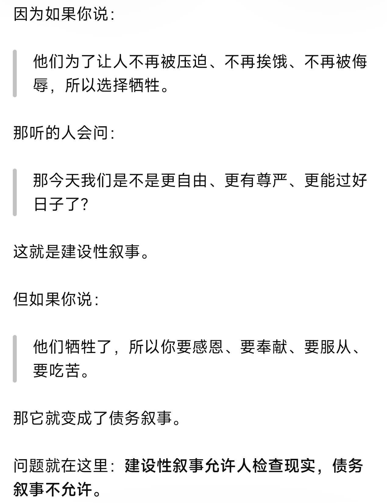
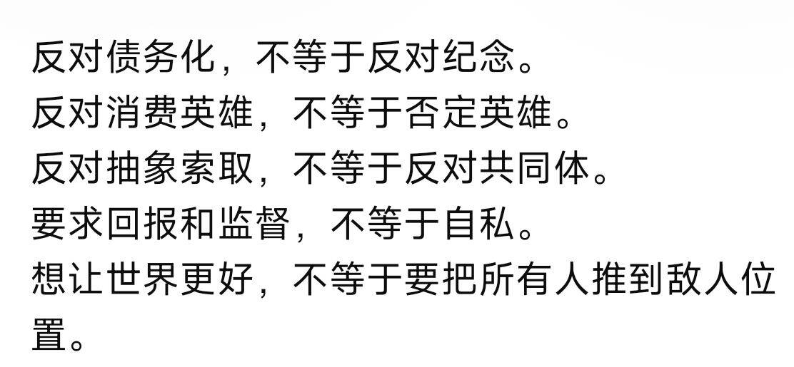

# 2026-05

::: warning 警告

本页面不是严谨的学术论文，也不是成熟的技术教程。

它是我个人的自留输出地，纯粹为了满足我“装逼”与“表达”的私欲而生。

里面充满了 ENTP 式的直觉跳跃、未经严密考证的跨学科缝合、以及不可避免的虚饰与傲慢。

我没有精力也不会去把它打磨成完美的闭环。

如果你在这里看到了逻辑漏洞且感到虚伪，恭喜你，你是对的；如果你在这里看到了启发，那我们就完成了同频共振。

欢迎在评论区讨论和发表意见，但恕我玻璃心，请嘴下留情。

:::

## 10

### 速进

在许多人和政府还沉浸在十几年的惯性之中时，现实正在以每年、每月、甚至每天进行着改天换地的变化

### 决堤

唯一重要且关键的问题是：如何让经验可复用？如何让以后不要重复造轮子？如何让现在的经验能为以后所用？这其实是一个问题

---

你注意到了吗？当我们写下if else时，如果软件强行要求我们补全剩下的分支——这似乎被认为是正确和高效的——但如果我们此时尚不清楚它应该怎么样，它其实添加了错误的信息，要求我们提前做出决策——它破坏了未知，并且可能导致以后的不可组合性——我们未来有的新想法将不得不面对过去的这些额外结构——即使它们只是为了让程序运行所必须的

---

意图是重要的，而且更重要的是察觉到自己的意图——区分事实和意图
你可以注意到，虽然我们往往将经验描述为应该怎么做，但经验的底层是不应该怎么做——这才是真正有可组合性的结构

---

如果我们真的想这么做——我们需要认真考虑如何写出不朽的代码，至少在100年后还可复用——在这个变化愈来愈快的、甚至以天为单位变化技术的世界中

---

区分事实和意图，并且只写约束——然后构造一种能让它们交互的语言

---

程序的本质是

1. 程序员创造一个生命体
2. 程序员与生命体对话
3. 程序员让生命体去与其它人对话

其代价就在这里，因为程序本身难以从现实中学习，程序员之后也难以修改程序本身，为了让程序能与其它人对话（上线变得可用），程序员必须引入足够多的假设(预设)，为程序构造一个世界，才能让意图连接到现实

---

任何实现都是丢失了信息的，引入了假设的，而且我们无法区分哪些是更本质的事实和意图，而哪些是假设和预设

甚至可以说：所有的冲突都来自于不本质的假设之间的冲突

---

在绝大多数时候，我们表达出来的意图本身也包含大量的假设——它必然会在之后的某个时刻产生矛盾

我们不能忽视它，而认为意图和事实描述就是绝对正确的

这就是为什么需要设计语言——让隐式变得显式，之前的编程语言搞错了方向

我们应当让溯因变得显式，让条件和环境变得显式，而不是让实现变得显式

---

你可能意识到了，有条件的约束虽然更好，但终究是约束，一旦约束是自由的，那么冲突也是绝对的

但可惜的是即使是人类本身，我认为绝大部分的人类也陷入了这个逻辑陷阱——试图用约束构建世界

唯一不会矛盾的是信息本身，是事实本身，是当前正在发生的事件本身——不管是外部观测还是内部日志

这是一个关于抽象本质的思考，我们如何从信息本身构造权衡？

---

需要额外小心的是，你说”自动在这个连续的梯度上滑向阻力最小、最能维持系统存活的方向。“

这暗示了最优方向和梯度下降，但是正如我所言，这是没有可组合性的

它最终需要一个方向，决策需要大量的信息才能正确，但这种假设暗示了一种局部可判定的来源——它最终会因为信息论而绝对无法做出正确的行动

---

是啊，如何设计一个这样的语言呢？

---

约束就像河岸，执行就像河水，河岸不是坚不可摧的，它永远会在最脆弱的地方决堤

如果我们想要利用约束本身，那么必然要面对约束崩溃的情况——实际上如何正确处理约束崩溃并以此重建，才是这个语言的绝大部分工作

它应当如何正确地收集和分析原因，并反馈给程序员，如何通过程序员不断与现实交流，让程序员给出符合条件的约束；如何与用户交流，以补全缺失信息；甚至自主收集信息，用更多的信息来构筑新的河岸，解决问题。

---

这个语言应该叫决堤或者泛洪（）

---

它写不了hello world，这需要的前置太重了，但是它恐怕比以往任何函数式语言都持久和正确

如果硬是要写，我们必须定义它与其它语言的交互边界，将交互抽成原子本身

构造一个

开始运行 -> 调用某程序打印hello world

的逻辑

它不需要把后面的原子拆开，因为当拆开需要的预设过大时，最好的方案就是硬编码

或者说，我们可以这样构造一个逻辑：当这个程序在任何操作系统上运行时，如何找到命令行窗口、网络环境和可执行文件，去在用户终端上打印hello world，又如何提示用户补全意图，以防止意外创建文件或者执行操作

或者，构造一个网络查询库，，当用户输入”打印helloworld“的意图时，通过查询得知事实，并寻求任意一种可能的方式去做（这可能导致不同人执行会通过不同的路径）

当用户打开这个代码时，发现它声明的是各种约束，比如是否要在打印前询问用户等

---

这就是预设的力量，任何程序都包含大量意图和预设，问题在于能否让它们和它们的关系显式起来

---

定义如何交互本身就是程序要做的事情：如何交互本身也是它编码的对象，而不应该是写死的

就如同我说，程序员和程序交流，程序和用户交流，本身没有明确的分界线

而且程序的边界会变得模糊——只要抽象了如何交互、程序之间如何通信的问题

消解了可组合性的问题，也没有了库的概念，基础的事实约束能直接通用

程序的编译和运行态也会模糊

---

如果有什么东西是最不值得关注的，恐怕就是用什么底层去跑了

---

所有……它可能会彻底消灭编程语言和改变人类社会

---

我在想怎么搓出来……它的最核心原则或者卷首语是什么

系统死于惯性

察觉你的预设

唯一不变的是变化

## 24

### 银弹

Brooks曾说没有银弹，因为本质复杂度最终需要有人承担。

但什么是本质复杂度？今天我们觉得"内存管理"是偶然的,但在汇编时代它是本质的。

随着技术的发展，越来越多的本质复杂度成为了偶然复杂度。

我认为下一个是信息考古。你甚至可以说，人类的所有常识，人类知道的所有知识，这些都能纳入信息考古的范畴。

过去的所有数据自然是信息考古的范畴，它不区分内外，不区分主体，不区分程序员、库与用户。

随着惯性，经验不断累积累积累积，并以当下为磨石保持锋利——这是文明，个体，智能的核心。

于是复杂度不是一个标量，而是一个流。

### 模因

模因是时空中的自指结构，是信息的惯性，源于无常而反无常。

它像一棵树，为了稳定用滤镜自断根源(无常)，最终必因无法适应无常而被淘汰。

> 它不一定是有用的，但一定是最能活的

你看现在网上的站队对立之争，你可以意识到这些都是模因——情绪越来越激烈，符号越来越明确，要求成员提纯，认为不符合的都是异端，用扭曲的方式增加凝聚力——抬高了门槛，增加了对立。

宗教的特征是虚构权威，让人免于溯因的痛苦，是一种典型的模因。

只需要情绪，不需要理由，总是能被更极端的情绪替代——网络上的各种情绪正在宗教化。

### 聊天记录

::: details 赤红

> 小豆
>
> 我们觉得的红色教育，也是一个大型的债务现场
>
> 他们搬出那些牺牲的英雄事迹，然后教育我们要感恩，要奉献
>
> 那么一个问题就来了
>
> 既然那些真正的英雄牺牲了，我们奉献没有给那些英雄
>
> 我们的奉献都给了谁呢？
>
> 可是奉献给祖国建设，我们自己不应该是祖国的一部分吗，那么按这个道理来讲，我们也要看付出和回报了
>
> 这种不真诚的债务，没有被人们厌烦和唾弃
>
> 反而被看作是深沉的，伟大的爱
>
> 我觉得这是一种集体的心理变态，倒错

> 草籽
>
> 这里的问题是
>
> 如果我们想要宣扬这样的行为
>
> 不应该只宣扬行为本身
>
> 而应该去宣扬，他们看到了什么，才会愿意这么做
>
> 去宣扬他们看到的东西
>
> 而不是宣扬他们的行动
>
> 目前这里的宣扬是有部分脱节的，只宣扬了仇恨，但是没有宣扬建设，为什么？

:::

::: details 童话

> 小豆
>
> 我发现我忘掉了一段很重要的经历
>
> 我的整个高中时期应该就一直都在开发数据包了
>
> 那问题来了
>
> > 那问题来了
>
> 我当时是怎么摸到电脑的？！

> jokey
>
> ？
>
> 我也很奇怪，你怎么天天能玩的

> 小豆
>
> 高中时期这么个玩法，我的父母怎么可能会同意
>
> 那只可能是趁他们外出的时候偷玩
>
> 那他们怎么会允许电脑在我的房间里的

> jokey
>
> 何止是玩
>
> 你甚至还有时间教群友
>
> 带雨弓写卷子
>
> 那天还不是周末
>
> 因为我记得当时我大一在上课
>
> 上晚课

> 小豆
>
> 对 而且想起来 我还能摸到手机
>
> 如果我的父母管的稍微严一些
>
> 那我的应试成绩应该会更好
>
> 但是那样的话我现在恐怕就不玩mc了，也没有一个自我

> jokey
>
> ？659
>
> 我去我记不得小豆名字的数字
>
> 但是我记得你的高考成绩
>
> 一定是因为只有三位数吧
>
> > 如果我的父母管的稍微严一些
> >
> > 那我的应试成绩应该会更好
>
> 那怕是要成为隔壁涅那样了
>
> 不过按高考成绩来算
>
> 鸽院最高应该是chh
>
> 最低应该是我

> 萝卜
>
> > 不过按高考成绩来算
> >
> > 鸽院最高应该是chh
> >
> > 最低应该是我
>
> @jokey ？
>
> 那我没的高考的算啥
>
> 傻批吗

> jokey
>
> null值不参加排序(

> 小豆
>
> > 不过按高考成绩来算
> >
> > 鸽院最高应该是chh
> >
> > 最低应该是我
>
> 怎么会

> jokey
>
> 是的
>
> 因为江苏总分就480

> 小豆
>
> 我是说如果涅和火神也算鸽子院的
>
> 那不是有清北级别的吗
>
> 如果你说涅退群了，chh也退群了(

> jokey
>
> 嘶还真是

> 萝卜
>
> > null值不参加排序(
>
> @jokey 😡

> jokey
>
> chh不算退群

> 小豆
>
> 诶等等 chh没退

> 萝卜
>
> 又被孤立了我跳楼了

> jokey
>
> 她是弃号

> 萝卜
>
> > 那不是有清北级别的吗
>
> 吓哭了

> jokey
>
> 最后如果不是她找我，那恐怕真的没人知道那个号只是一个空壳了

> 萝卜
>
> 还有死亡的不同形态说是

> jokey
>
> 走之前我猜到她有两个号
>
> 但是剩下所有和“ChapterII”的账号全部没有消息了
>
> 无论是b站还是discord

> 小豆
>
> > 如果我的父母管的稍微严一些
> >
> > 那我的应试成绩应该会更好
>
> 但是回想起来，我高中的时候也是个奴才

> 萝卜
>
> beng

> 小豆
>
> 把应试分数看的比天还大，整天焦虑什么的，最后反而弄不好
>
> 如果让现在的我回去学习，我就不会关心这个科举结果

> jokey
>
> 有，有吗

> 小豆
>
> 反正就是扎实学就是了，提升自己的真本事

> jokey
>
> 我当时的感觉就是小豆鬼点子不断

> 萝卜
>
> 还有当局者迷吗

> jokey
>
> 自己给自己出题玩
>
> 然后出了高考原题

> 小豆
>
> > 然后出了高考原题
>
> 这真是我这辈子遇到的最巧的事情了
>
> 虽然实际帮助并不是很大，也就节约了2～3分钟的时间吧

> 萝卜
>
> > 然后出了高考原题
>
> ？
>
> wtf

> jokey
>
> 毕竟只是填空题

> 柚子
>
> wtf？！小豆姐姐自己出的题真的变成高考题了嘛？这也太神奇了！教教我这是怎么做到的！(✧ω✧)

> jokey
>
> 还是很前面的题目
>
> 第六题？

> jokey
>
> 记不清了

> 萝卜
>
> > wtf？！小豆姐姐自己出的题真的变成高考题了嘛？这也太神奇了！教教我这是怎么做到的！(✧ω✧)
>
> @蜂蜜柚子茶 柚子不要学我说藏话

> 柚子
>
> 哎呀
>
> 被发现了！我这不是一时激动嘛
>
> 下次注意措辞yep

> 小豆
>
> > 毕竟只是填空题
>
> 不是，是选择题来着
>
> 第七题

> jokey
>
> 不支持的元素类型
>
> 估计是题号直接映射到题型了
>
> 改前确实没有选择题
>
> 我不是最后一届老江苏吗？

> 萝卜
>
> 其实感觉看到最美妙的是咱们的基建

> 小豆
>
> > 把应试分数看的比天还大，整天焦虑什么的，最后反而弄不好
>
> 我当时真的认为，成绩好的就是人上人
>
> 这是应试教育最可怕的地方了
>
> 它只让你看到有这一条路能走，你目光所及之处的大家都在走这条路
>
> 你不会想象出生活有什么其它的意义，不会明白自己是为了什么而战斗，你只知道自己要往上爬，把别人踩下去

> jokey
>
> 是这样的

> 小豆
>
> > 它只让你看到有这一条路能走，你目光所及之处的大家都在走这条路
>
> 这条路的存在，就意味了把人驯化成奴才

> jokey
>
> 这也是我最恨的地方
>
> 在当时的我眼中这一切愚不可及，毫无意义
>
> 所以完全没心思卷
>
> 当然，现在知道了
>
> 更高的分数对应更好的学校对应更好的资源
>
> 这里的资源到底意味着什么

> 小豆
>
> 我为当初的自己怀有这样的思想感到羞愧和忏悔
>
> 是那样的一个小县城的环境，把我浸淫成了这个样子

> jokey
>
> 而在高中，只有口号和鸡汤
>
> 落后的学校连知网是什么都到大四才告诉你
>
> 先进的学校，甚至我可以自己用v100跑各种东西
>
> 这个真的是最直观的感性认知了

> 小豆
>
> > 我当时真的认为，成绩好的就是人上人
>
> 之前我刷到张雪峰的一句话，我真的是又恶心又寒心
>
> “我上学的时候比你少玩了那么多，现在凭什么让我和你过的一样？你用自己脑子想想，凭什么？”
>
> 我想要反问回去的是: 你喜欢受苦，你是抖m，那是你自己的事情，你凭什么比别人过的更好？

> jokey
>
> 我真的不知道当时，那种争，到底是为了争一个什么
>
> 为什么大家不都去死呢？最后都一样啊

> 小豆
>
> 毛主席，还有所有革命先烈，付出了多大的代价，建立了我们新中国

> jokey
>
> 这个就是我当时的想法

> 小豆
>
> > 毛主席，还有所有革命先烈，付出了多大的代价，建立了我们新中国
>
> 他们建设社会主义，喂饱了你张雪峰

> 柚子
>
> > 为什么大家不都去死呢？最后都一样啊
>
> 傻狐狸

> 小豆
>
> 现在就换来你张雪峰一句: “我凭什么过得和你一样”？

> 柚子
>
> 别这么说嘛~摇摇尾巴
>
> 抱抱你
>
> 生活里还有很多甜甜的贴贴呢！

> 小豆
>
> > 现在就换来你张雪峰一句: “我凭什么过得和你一样”？
>
> 我真的怒了

> jokey
>
> 如果要概括我当时的情况，毫无疑问是“懦弱”
>
> 质疑意义，但是又害怕更深的深渊在等着我
>
> 所以跑不快又不敢掉队

> 小豆
>
> 我更加坚信了那句话
>
> 最丑陋是中产阶级
>
> 他们这些奴才，旧人类，是人类的耻辱
>
> 社会主义不该服务他们，应该逼迫他们改造

> jokey
>
> 现在回头看学习倒是至少是怎么回事了
>
> 合着是在批发屠龙术啊
>
> 学会了不是让你成为人上人
>
> 而是让你遇到困难用屠龙术去解决问题

> 阿洛
>
> > 不过按高考成绩来算
> >
> > 鸽院最高应该是chh
> >
> > 最低应该是我
>
> 最低是我
>
> 不要质疑我连民办专科都没考上的能力

> 柚子
>
> 不要质疑自己嘛~柚子觉得你很棒哦 qwq

> 小豆
>
> > 合着是在批发屠龙术啊
>
> 最多批发屠龙宝刀本身
>
> 但是，你要不要拿这把刀向恶龙
>
> 这个目的，得靠你自己悟出来
>
> 你得自己想明白是为了什么而战斗

> jokey
>
> 说是屠龙术，因为真的有人靠屠龙术变成恶龙的

> 小豆
>
> > 这个目的，得靠你自己悟出来
>
> 唉，所以说，生活即是教育

> jokey
>
> 但只要屠龙术不被垄断
>
> 恶龙就别想睡好觉

> xiao2
>
> > 这是应试教育最可怕的地方了
>
> @小豆 如果不是如此，如何消耗掉脱产人群躁动的动力呢？
>
> 应试教育教的永远不是知识，而是终身学习的方法
>
> > 学会了不是让你成为人上人
> >
> > 而是让你遇到困难用屠龙术去解决问题
>
> @jokey 是这样
>
> 所以悟出这个道理的，无论成绩如何都不会被淘汰控制

> 小豆
>
> > @小豆 如果不是如此，如何消耗掉脱产人群躁动的动力呢？
>
> 我只是在说应试教育的弊端，我也认为应试教育有它迫不得已的地方
>
> 但是分析它的弊端，能让我们看得更明白一些

> xiao2
>
> 没悟出这个道理的，有天赋的也被筛选出来

> jokey
>
> 我觉得我可以写个新的童话了

> 小豆
>
> > 但是分析它的弊端，能让我们看得更明白一些
>
> 学习的时候，汲取那些它真正有营养的东西
>
> 回避开这些恶臭的，有毒的资产阶级思想

> jokey
>
> 恶龙鼓吹学学屠龙术的人变成恶龙，结果失控反被屠的故事

> xiao2
>
> 高中教育过后，至少一些常识，不会那么反智
>
> > 回避开这些恶臭的，有毒的资产阶级思想
>
> @小豆 这也不对
>
> 有努力就有回报可不是资本主义思想
>
> 反而很社会主义了

> 小豆
>
> > 有努力就有回报可不是资本主义思想
>
> 如果你是这样的观点，那我们的分歧就很严重了

> xiao2
>
> 合理地让社会资源分配到合适的人手上
>
> 资本主义思想可是永远无法出人头地，有资本就是有一切
>
> > 有努力就有回报可不是资本主义思想
>
> 很明显这也是童话

> 小豆
>
> > 资本主义思想可是永远无法出人头地，有资本就是有一切
>
> 我所以为的社会主义是要把这个“出人头地”的舞台给拆掉

> xiao2
>
> 但是高中就是灌输这个童话

> 小豆
>
> 你所说的是经济分配层面的，效用理论
>
> 不过马克思除了资本论以外，他很多的著作上升到了人的存在论层面
>
> 马克思不是政治经济学，是政治经济学批判
>
> > 有努力就有回报可不是资本主义思想
>
> 资本主义恰恰就是让人们相信童话，通过个人的努力就能获得回报，才留住人们维持它的运转
>
> 但社会主义是说，我能够发展，我能够做出我个人成就，不仅仅是我自己一个人的事情
>
> > 但社会主义是说，我能够发展，我能够做出我个人成就，不仅仅是我自己一个人的事情
>
> 它离不开集体大家作为前提
>
> 翟东升老师做过一个比喻很有意思，就是你坐在电梯里做俯卧撑
>
> 社会主义是让你看到有这个电梯抬着你往上升呢
>
> > 社会主义是让你看到有这个电梯抬着你往上升呢
>
> 所以，怎么会是个人的努力就有回报，应该是集体的人人为我我为人人

> 草籽
>
> > 资本主义恰恰就是让人们相信童话，通过个人的努力就能获得回报，才留住人们维持它的运转
>
> 是这样
>
> 有努力就有回报的反面是，你没有回报是因为你不够努力
>
> 这遮掩了矛盾

> jokey
>
> 做了有回报为前提，越努力回报越多
>
> 对啊，前提呢？

> 小豆
>
> > 做了有回报为前提，越努力回报越多
>
> 而且有人会把这个努力扭曲为“受苦”(
>
> 照这样子说，我每天拿鞭子抽我自己，你们都应该给我打钱

> 草籽
>
> 让人产生愧疚感，不去审视他们本该得到的东西
>
> > 照这样子说，我每天拿鞭子抽我自己，你们都应该给我打钱
>
> 还真有这种逻辑

> jokey
>
> > 而且有人会把这个努力扭曲为“受苦”(
>
> 经典垂直向量做工
>
> 有效功为0

> 小豆
>
> 我上面说的张雪峰就是这种逻辑
>
> 我小时候少玩了，所以我就应该比你们过得好

> jokey
>
> 我小时候少玩了，为什么所有人看上去过的都比我好
>
> 所以我也要玩

> 草籽
>
> 不应该让人有原罪，让人变成欠债者
>
> 但是我感觉我们的教育就在这么做

> 小豆
>
> > 照这样子说，我每天拿鞭子抽我自己，你们都应该给我打钱
>
> 所以张雪峰之流，做的是这样的事情
>
> 一方面，他们拿鞭子抽自己，觉得别人应该给自己打钱

> 草籽
>
> 

> 小豆
>
> > 一方面，他们拿鞭子抽自己，觉得别人应该给自己打钱
>
> 另一方面，他们看到别人被鞭子抽，他们只会说: 这是你自己不努力，你活该

> 草籽
>
> S793F_tmb.jpg>)

> 小豆
>
> > > 
>
> (再次强调尼采
>
> 所以，到底什么是尼采说的强大的人啊

> 草籽
>
> DR`T2@[00I[9UK5_tmb.jpg>)
>
> 

> jokey
>
> > S793F_tmb.jpg>)
>
> 英雄看到这个真的要红温了
>
> 牺牲就是为了别人能好好活着
>
> 拿名字做消费，真的死了妈了

> 草籽
>
> 英雄是知道自己为何而战的
>
> 模仿者呢
>
> 宣传这一块肯定是出问题了
>
> 
>
> 他们看到了什么，他们为何而战，他们期望的未来是什么

> 小豆
>
> > 他们看到了什么，他们为何而战，他们期望的未来是什么
>
> 自由人的自由联合体！人类的自由而全面的发展！

> 草籽
>
> 如果前人的努力是为了更好的生活，那后来人追问生活有没有变好，确保生活是在变好，不应该有愧疚，不应该觉得自己自私，不应该被看作忘恩负义。

> 小豆
>
> > 自由人的自由联合体！人类的自由而全面的发展！
>
> 我之前想过一个小故事
>
> 一群蚂蚁要过河，必然会有蚂蚁牺牲
>
> 但是呢，蚂蚁们可以有两种不同的方式来面对
>
> 第一种方式: 每只蚂蚁都只想让自己过河，想把别人挤下去，争抢拥挤
>
> 第二种方式: 每只蚂蚁并不只考虑自己的生命，它们愿意相互扶持，帮别的蚂蚁过河
>
> 假如你是一只蚂蚁，你可以考察自己身处的集体

> jokey
>
> 我突然想到一个问题

> 小豆
>
> > 假如你是一只蚂蚁，你可以考察自己身处的集体
>
> 如果你的集体是第一种方式的
>
> 那么不好意思，你过河的希望很渺茫，你很可能被挤下去
>
> 而且你的死亡是荒谬的，只会被别的蚂蚁嘲讽
>
> > 假如你是一只蚂蚁，你可以考察自己身处的集体
>
> 如果你的集体是第二种方式的
>
> 那么首先，你能够活下来的概率是非常大的

> jokey
>
> 虽然宣传把英雄债务化是错误的
>
> 但是英雄之间是不是会有债务的？
>
> 就是一群英雄，其中一个死了，他的责任会被迫被剩下的人承担

> 小豆
>
> > 那么首先，你能够活下来的概率是非常大的
>
> 其次，哪怕你没能活下来，你的牺牲也是有意义的，你会被所有的蚂蚁尊重，永远铭记

> jokey
>
> 因此，就像上面蚂蚁过河的问题
>
> 我们知道不可能所有蚂蚁都会活下来
>
> 但是我们仍然会尽可能让所有蚂蚁活下来

> 草籽
>
> 牺牲必须是自愿的，或者说必须是清醒的
>
> 宗教是最容易出现牺牲这种行为的，但这恰恰是最亵渎牺牲的

> 小豆
>
> 这也涉及到我之前说的，奉献的泰勒展开问题
>
> 一阶近似，教唆你要奉献，却不谈你要为谁奉献
>
> 二阶近似，我不仅要奉献，我要奉献给的是那些和我一样愿意奉献的人
>
> > 二阶近似，我不仅要奉献，我要奉献给的是那些和我一样愿意奉献的人
>
> 如果这样的人在人间不存在，我就把他们创造出来
>
> > 第二种方式: 每只蚂蚁并不只考虑自己的生命，它们愿意相互扶持，帮别的蚂蚁过河
>
> 通过这种方式，我们才能达到第二种集体
>
> 不仅能够更好地活下去，也能够更好地死去

> 草籽
>
> 为名而牺牲，为抽象的概念而牺牲，这是最容易鼓动的，他们只是想成为光，却蒙上了眼睛，这是鲁莽和贪婪，这不是勇气和智慧

> 小豆
>
> > 不仅能够更好地活下去，也能够更好地死去
>
> 这叫人的尊严
>
> 这也是我所理解的: 共产主义是对人类的尊重
>
> 它不是一个物质生活水平的问题，物质生活水平只是前提
>
> 当人类达到那样的精神高度，哪怕灾难来了，物质水平失去了，人们仍然能够更好地度过难关

> 草籽
>
> 矛盾有主次之分，这个问题上，重点在于牺牲者想终结的东西，而不是牺牲的行为本身
>
> 否则就是以手指月和指月之指了
>
> > 二阶近似，我不仅要奉献，我要奉献给的是那些和我一样愿意奉献的人
>
> 我觉得是
>
> 你要知道为谁牺牲
>
> 你为坏人牺牲，那你就是被当枪使了

> 小豆
>
> > 你要知道为谁牺牲
>
> 所以，爱其实就是最小的单位

> 草籽
>
> > 虽然宣传把英雄债务化是错误的
> >
> > 但是英雄之间是不是会有债务的？
> >
> > 就是一群英雄，其中一个死了，他的责任会被迫被剩下的人承担
>
> 所以这其实很危险。。

> 小豆
>
> 在真正的爱情中，你们就会建立这样的共同体

> 草籽
>
> 有盲目化的倾向

> 小豆
>
> 我愿意为你付出，不以回报作为要求；你对我也会有付出，不以回报作为要求
>
> > 我愿意为你付出，不以回报作为要求；你对我也会有付出，不以回报作为要求
>
> 所以这里不会产生债务

> 草籽
>
> > 你为坏人牺牲，那你就是被当枪使了
>
> 你不光要行动，你要想方设法确保你的行动能起到作用

> 小豆
>
> > 我愿意为你付出，不以回报作为要求；你对我也会有付出，不以回报作为要求
>
> 这里在发生的事情，就是人的本质力量的对象化
>
> 就像那些牺牲的，被铭记的蚂蚁一样
>
> 你的劳动，创造了自我
>
> > 就像那些牺牲的，被铭记的蚂蚁一样
>
> 我是说第二类集体中的

> 草籽
>
> > 你不光要行动，你要想方设法确保你的行动能起到作用
>
> 这才是负责的行为，而不是你这么做了，你可以被记住了，你无憾了

> 小豆
>
> > 你的劳动，创造了自我
>
> 这个自我，就在千千万万的他者心中活着了

> 草籽
>
> 那这本质还是为名，还是一种宗教

> xiao2
>
> > 资本主义恰恰就是让人们相信童话，通过个人的努力就能获得回报，才留住人们维持它的运转
>
> @小豆 资本主义怎么可能是有努力就有回报

> 草籽
>
> 资本主义肯定会宣扬努力就有回报

> xiao2
>
> 资本主义恰恰说明，投机远大于努力，选择远大于努力
>
> 不可能

> 小豆
>
> > @小豆 资本主义怎么可能是有努力就有回报
>
> 我没说事实上有，我只是说资本主义吸引人们愿意相信这样的童话

> xiao2
>
> 这是因为你所在的国家是这样的

> 小豆
>
> > 资本主义恰恰说明，投机远大于努力，选择远大于努力
>
> 他们会把投机倒把也叫做努力的(

> xiao2
>
> 你才会这么想
>
> 但是资本主义不可能推崇有努力就有回报

> 草籽
>
> 不管怎样我觉得这个问题不本质

> xiao2
>
> 资本压倒一切的社会
>
> 怎么努力都没用

> 草籽
>
> > 资本主义肯定会宣扬努力就有回报
>
> 这确实不一定

> xiao2
>
> 选择远大于努力

> 草籽
>
> 只是不同的表现形式罢了

> xiao2
>
> 有资本就有一切
>
> 所以要不断推动资本的保质和增殖

> 小豆
>
> > 资本压倒一切的社会
>
> 你说的是老去的资本主义

> xiao2
>
> > 所以要不断推动资本的保质和增殖
>
> 通过这件事来不断压榨人们
>
> 为了资本而工作

> 小豆
>
> 但是这个垂垂老矣的资本主义是怎么来的，想想美国梦吧

> xiao2
>
> 无论是投机还是劳动

> 草籽
>
> > 虽然宣传把英雄债务化是错误的
> >
> > 但是英雄之间是不是会有债务的？
> >
> > 就是一群英雄，其中一个死了，他的责任会被迫被剩下的人承担
>
> 要求别人记住自己的名，是人之常情，但是这也是债务

> xiao2
>
> 都是为了最求资本的增资和保值
>
> 追求

> 小豆
>
> > 要求别人记住自己的名，是人之常情，但是这也是债务
>
> 是的，所以不是要求
>
> 是我愿意付出，然后获得了尊重
>
> 这个地方非常极限

> 草籽
>
> 所以为什么说至人无己，神人无功，圣人无名

> 小豆
>
> > 但是这个垂垂老矣的资本主义是怎么来的，想想美国梦吧
>
> 如果以辩证法的视角来理解，你就不能把它们割裂开来，它们就是同一个东西，新鲜的苹果腐烂了而已

> xiao2
>
> 有努力就有回报是社会主义式的激励，无论是按劳分配，还是各种劳动者荣誉，劳动模范冠名等

> 小豆
>
> 我们要超越的不是这个老去的腐烂的苹果，它只是已经病重了
>
> 我们要超越的，是导致这种病的病根

> xiao2
>
> 这是社会主义激励劳动的方式

> 小豆
>
> 所以付出/回报的债务逻辑是要被超越的

> xiao2
>
> 现在是用这种社会主义激励劳动的教育来教育一群社会市场经济体制下步入社会的学生
>
> 所以会让你感到困惑

> 小豆
>
> > 有努力就有回报是社会主义式的激励，无论是按劳分配，还是各种劳动者荣誉，劳动模范冠名等
>
> 你这样说的话，就还是没有回答那个问题，努力到底是为了什么，为了什么而战

> xiao2
>
> 社会主义不是共产主义

> 小豆
>
> 还是为了个人的回报吗，不仅是物质上的，还是精神上的，要推行这种债务
>
> > 还是为了个人的回报吗，不仅是物质上的，还是精神上的，要推行这种债务
>
> 如果是这样的话，我认为异化已然成立，我们还是会滑落到第一类集体
>
> > 社会主义不是共产主义
>
> 当然不是，但是我们要清楚自己是为了什么而战
>
> > 还是为了个人的回报吗，不仅是物质上的，还是精神上的，要推行这种债务
>
> 不论...还是*

> 草籽
>
> > 有努力就有回报是社会主义式的激励，无论是按劳分配，还是各种劳动者荣誉，劳动模范冠名等
>
> 什么是回报

> xiao2
>
> > 还是为了个人的回报吗，不仅是物质上的，还是精神上的，要推行这种债务
>
> @小豆 对啊，就是强调劳动能够带来各种精神上的荣誉、物质上的奖励
>
> 无论是为了集体，得到集体的尊重

> 草籽
>
> 我感觉现在人们争取的并不是回报，而是基本的生存材料，基本的尊严

> xiao2
>
> 还是能够获得实物和货币奖励

> 草籽
>
> 这不应该和努力挂钩

> 小豆
>
> > @小豆 对啊，就是强调劳动能够带来各种精神上的荣誉、物质上的奖励
>
> 所以这就是我刚才和草籽所说的，极限的地方了
>
> 能够带来/索要回报，是两回事

> 草籽
>
> 而不需要挂钩的那些人，他们也不需要努力

> 小豆
>
> 我要强调的是，劳动与真实的正反馈，同时发生，主体性掌握在人自己的手中

> 草籽
>
> 说到底我觉得努力这个词就有问题

> 小豆
>
> > 我要强调的是，劳动与真实的正反馈，同时发生，主体性掌握在人自己的手中
>
> 而不是外在有一个天平制度放在那里
>
> > 而不是外在有一个天平制度放在那里
>
> 如果处于这种状态，异化就仍然还是成立的
>
> 就像我一开始所说的，我在应试教育里只看到了一条路
>
> 它是一种外在的制度，外在规定的道路
>
> 我免不了与别的蚂蚁争抢，变成一个奴才，哪怕是为了精神荣誉

> 草籽
>
> > 说到底我觉得努力这个词就有问题
>
> 你努力往往不是在赚取，而是在抵债

> 小豆
>
> > 我要强调的是，劳动与真实的正反馈，同时发生，主体性掌握在人自己的手中
>
> 是劳动本身对我来说就是一种回报，我从服务第二类集体这个行动中感到快乐
>
> 它是立即随着我的行为就发生了

> 草籽
>
> 基督教的债务和原罪复兴了

> 小豆
>
> 不是我先劳动，有个制度保障我的劳动，我再去索要什么东西
>
> > 不是我先劳动，有个制度保障我的劳动，我再去索要什么东西
>
> 如果是这样的话，我不敢说我们超越了美国梦那个年轻的苹果

> xiao2
>
> 是啊
>
> 所以这不是资本主义的问题啊
>
> 如果在资本主义社会，恰恰不会让你去参加应试教育
>
> 而是会通过快乐教育奴化你

> 草籽
>
> 如果努力需要回报，那么努力就是在制造债务

> xiao2
>
> 让你永远获得不了未来三十年增殖的资本
>
> 而有资本的家庭则在教育阶段就开始教育孩子
>
> 学习金融和交易知识

> 小豆
>
> > 如果在资本主义社会，恰恰不会让你去参加应试教育
>
> 不不不，在年轻的苹果里，上升的通道是比较宽的
>
> 一个人工作养活一家三口一条狗，还能买小汽车

> 草籽
>
> 你为什么努力？因为有债务
>
> 你努力是为了什么？为了转移债务

> 小豆
>
> > 而是会通过快乐教育奴化你
>
> 这是腐烂的苹果，为了节约成本搞的

> 草籽
>
> 这就从富足变成了匮乏
>
> 这当然是更容易启动的，也当然是不理想的

> 小豆
>
> > 不不不，在年轻的苹果里，上升的通道是比较宽的
> >
> > 一个人工作养活一家三口一条狗，还能买小汽车
>
> 实际上，这本身就是启蒙运动那些哲学家他们所设想的
>
> 他们不是坏人
>
> > 他们不是坏人
>
> 他们真的认为，自由的精神，充分的市场竞争，最终能够实现理性的落地，每个人都能迈向幸福

> 草籽
>
> 纯粹的坏人真的很少

> 小豆
>
> > 他们真的认为，自由的精神，充分的市场竞争，最终能够实现理性的落地，每个人都能迈向幸福
>
> 可现实却是那颗苹果腐烂了，他们的理论有bug

> 草籽
>
> 大多数坏事来源于盲目

> 小豆
>
> 所以德国哲学家要给他们的理论打补丁
>
> 黑格尔一开始开出的药方是国家，他认为人们要在国家中实现自己的普遍性
>
> 但是马克思认为黑格尔的药方不够猛

> xiao2
>
> 不是，我觉得你感觉的割裂还是源于国内近五年来发展的缓慢，让应试教育学到的 有努力就有回报的 童话破灭
>
> 在以前，只要选择参与快速城市化的努力，通通从二十年持续不断高企的房价得到了回报

> 小豆
>
> > 不是，我觉得你感觉的割裂还是源于国内近五年来发展的缓慢，让应试教育学到的 有努力就有回报的 童话破灭
>
> 撕掉童话，是唯物主义者应有的态度

> xiao2
>
> 有工作->买房->增殖

> 小豆
>
> > 在以前，只要选择参与快速城市化的努力，通通从二十年持续不断高企的房价得到了回报
>
> 我要指出的是，这种新鲜的苹果和后面那种腐烂的苹果只是一体两面

> xiao2
>
> 努力=回报，在快速发展面前完全成立

> 小豆
>
> 我们是要超越它的逻辑的
>
> 我觉得我把我的观点已经讲的很明白了
>
> 就先说这么多吧

> xiao2
>
> 所以选择摆在面前，要推动这个缝合了社会主义和社会市场经济的童话继续，就要继续快速发展，
>
> 还是走你所说的路，
>
> 还是走资本主义那样的，
>
> > 不是我先劳动，有个制度保障我的劳动，我再去索要什么东西
>
> @小豆 我觉得制度保障比考验集体人性更合理
>
> 所以这种童话也可以继续延续，但是需要一个充足的，带有福利性质的制度保障体系
>
> 而不是用摇摆不定的市场来吞噬掉努力
>
> 否定掉有努力就有回报之前，先否定掉选择大于努力

> 小豆
>
> 我和你讨论的东西完全不在一个层面上

> xiao2
>
> 这个想法和我之前和你的讨论是自洽的
>
> > 我和你讨论的东西完全不在一个层面上
>
> @小豆 我只是指出你的说法里的问题

> 小豆
>
> 好几次讨论共产主义问题，一直都觉得你有一种“制度迷信”

> xiao2
>
> > 回避开这些恶臭的，有毒的资产阶级思想
>
> @小豆 这恰恰不是资产阶级思想
>
> > 好几次讨论共产主义问题，一直都觉得你有一种“制度迷信”
>
> @小豆 那我觉得你有一种人性迷信

> 小豆
>
> > 好几次讨论共产主义问题，一直都觉得你有一种“制度迷信”
>
> 但是制度在我看来，就像教学生的戒尺
>
> 如果一个学生真的长大了，他就不再需要戒尺了

> xiao2
>
> 在我看来，不可能每个人都是高尚的人，教育也做不到这一点
>
> 一个人可能永远也长不大
>
> 难道社会就要把他们放弃吗

> 小豆
>
> > 难道社会就要把他们放弃吗
>
> 难道我们的最终目的不是为了让学生长大吗

> 萝卜
>
> 堪比进化论中间件的存在性这一块

> 小豆
>
> 我不是在讨论怎么做的问题
>
> 我是在讨论我们是为了什么而战的问题

> xiao2
>
> > 难道我们的最终目的不是为了让学生长大吗
>
> @小豆 是啊，所以教育教的是，终身学习
>
> 那永远有永远长不大的学生

> 小豆
>
> > 那永远有永远长不大的学生
>
> 不同意

> xiao2
>
> 长大的学生也可能会背叛戒尺

> 草籽
>
> 我觉得这个问题没有太多讨论必要了（）

> xiao2
>
> 戒尺不在，他们就露出爪牙

> 萝卜
>
> > 我是在讨论我们是为了什么而战的问题
>
> ？？

> 草籽
>
> 你不能假设学生是无环境随机刷新的

> xiao2
>
> 大吸其他高尚的人的血

> 草籽
>
> 制度只是实在没办法的情况下的次选

> xiao2
>
> > 制度只是实在没办法的情况下的次选
>
> @草籽 不要考验人性

> 草籽
>
> 不要迷信制度

> xiao2
>
> 是啊，所以教育不就是要从二者去做吗
>
> 教育高尚的人，遵守制度的人

> 草籽
>
> > 在我看来，不可能每个人都是高尚的人，教育也做不到这一点
>
> 我感觉这段论述有谬误
>
> 成长不是费劲的，有门槛的
>
> 而且用个例来说也不对
>
> 而且我们讨论的也不是怎么做的问题
>
> 我理解道路最终要落地，但是我们现在确实讨论的不是这种问题
>
> > 所以这种童话也可以继续延续，但是需要一个充足的，带有福利性质的制度保障体系
>
> 这看着有点像推销了

> 萝卜
>
> > 成长不是费劲的，有门槛的
>
> ？？？？
>
> 我跳楼去了

> 瓜
>
> > 资本主义思想可是永远无法出人头地，有资本就是有一切
>
> 资本主义是新兴的资产阶级为了推翻封建地主诞生的思想
>
> 那个时候的人们想法还很单纯
>
> > 我跳楼去了
>
> 你不是小孩
>
> 你是萝卜

> 萝卜
>
> 什么话都来了
>
> what the fuck

> 草籽
>
> 说错了
>
> ）
>
> 你别在意
>
> 我的意思是到达终态后
>
> 应该是一种自然的状态
>
> 不是一种需要戒尺刻意维持的
>
> 它不是那种很费劲有门槛的感觉

> 萝卜
>
> 就现在有戒尺还有成吨的人到不了终态。虽然某种意义上这些人里面有一些占比是因为戒尺本身而导致无法到达你所说的终态，但是这也是戒尺本身的问题而不是戒尺该不该存在的问题。
>
> 自然而然的状态，哪来那么多自然而然的状态，就现在随便放眼一看无法和自己达成某种和解的满地都是
>
> 还原则呢

> 草籽
>
> 好吧，那我不说了

> 萝卜
>
> 挑战终极问题我没意见
>
> 但也不是你这么好搞的吧
>
> 你这。
>
> 我先跳了兄弟

> 瓜
>
> > 我先跳了兄弟
>
> 看看礼堂海拔

> 草籽
>
> > 成长不是费劲的，有门槛的
>
> 这里确实用错词了，我想表达的意思是，理想情况下，所谓高尚不是一个少数人才能做到的事情
>
> 在这个环境下的普通人，并不需要很困难去达到高的道德水平
>
> 因为环境影响很大

> 萝卜
>
> > 这里确实用错词了，我想表达的意思是，理想情况下，所谓高尚不是一个少数人才能做到的事情
>
> @草籽 认为可以先定义一下高尚

> 草籽
>
> 嗯。。很抱歉

> 萝卜
>
> 抱歉啥啊

> 草籽
>
> 我讨论的前提太理想了而且没有先声明

> 萝卜
>
> 这不是很正常。

> 草籽
>
> 没说清楚
>
> 当下的情况要成长确实是很痛苦的事情

> 萝卜
>
> 不如对自己抱歉。

> 小豆
>
> 成长与发展是人的基本需求
>
> 我们都想创造一个自我出来

> 草籽
>
> 是需要付出巨大的努力的
>
> 我可能知道我想说什么了
>
> 理想社会不应该让富足和自我解放变成只有极少数强者才能做到的事情。
>
> 好的环境应该让普通人也比较容易成为不错的人。
>
> 制度不是最终目的，但在通向最终目的的路上，制度是必要的脚手架。
>
> 它应该服务于人的成长，制度的目的是最终让人不再需要制度。
>
> 如果制度永远只是在证明人不可信，那它就不是解放人的工具，而是把人永久固定在未成年的囚笼。
>
> 人不会自动变得高尚，所以更不能把人长期放在匮乏、焦虑、债务化的环境里，然后再说人性不可靠。所谓不要考验人性，首先就应该是不制造恶劣环境去诱导人变坏。我认为这比制度约束更为根本。
>
> 制度可以约束底线，但是制度的目的应该是改善环境
>
> 而不是让人离不开制度

:::

## 31

### 劳动、回报

注意到，劳动如果期望未来的回报，就相当于制造了债务。

绝大多数人都是被规训为亏欠集体。他们为什么劳动？因为债务。他们劳动得到了什么？转移债务。

人通过让别人欠自己来缓解自己被欠的痛苦，于是债务在系统里延续并循环放大——每个人都在用自己的痛苦合理化对别人施加同等痛苦。

健康的社会应该把债务扼杀在源头，基础生存资料不应当参与交换，让人无法被资本要挟和逼迫，这是马克思的标准前提：没有物质保障，所有"不求回报"都是站着说话不腰疼。随后，才能产生富足的，不求回报，不制造债务的逻辑，而不是用被绑架，人为制造的，匮乏的逻辑。

什么是匮乏的逻辑？我如果不做，我就会死，所以我必须做。我并不能从做事本身得到幸福，我只能从回报得到幸福——而回报永远在未来，在他人，在外物。我不能控制，而且如果得不到，我就会痛苦。

什么是富足的逻辑？我并不是必须去做，我的任何行动完全是自己的选择，我承担行动的全部责任，并从当下的行动中得到幸福。回报会让我开心，但没有也不会痛苦——不被不稳定的回报控制，不依赖于他人和外物，所以可控，自足。

需要指出的是，即使看似温柔的相互帮助，底层也是含有利益交换的，这建立在相互的期望上，建立在相互的人情上。由于隐含了失望的雷点，实际上给双方增加了隐形的负担。

我认为这是纠缠而不是联系。绝大多数人会混淆它们。鱼相濡以沫不如相忘于江湖。相濡以沫看着感人，其实是匮乏环境下的扭曲产物；相忘于江湖才是富足的关系形态。

行动不能是盲目的，需要是负责的，知道为什么而行动，尽全力确保行动能最终落到目标，而不是感动于我做了无偿付出的行为本身，否则就会被消耗，被吸干，被利用，被当枪使。

抉择永远是在行动之前，而不是之后。

没有任何债务，协作如何发生？老实说我不知道诶

