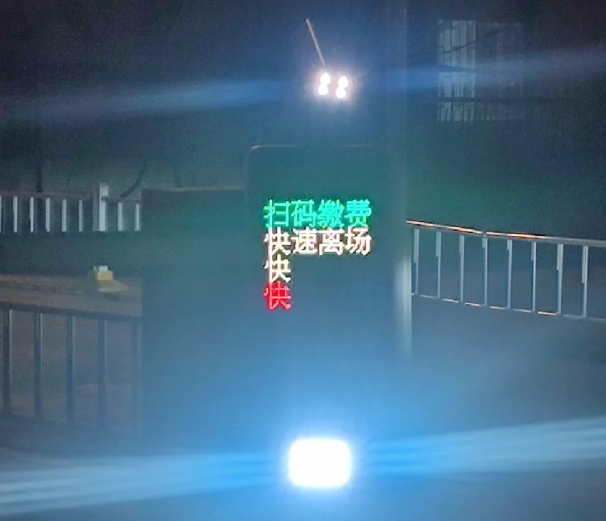

# 看图说话1

::: warning 恐怖向故事

只是单纯看图说话发散开来的想法然后和 gpt 讨论着让它写出来了

不代表任何含义，被吓到了不要怪我

我已经选了温馨结局了.jpg

:::

> 想象你下班拖着疲惫的身躯，像往常一样打卡下班，但是停车场的车牌识别似乎坏了，不能自动升起，你依稀记得保安亭内有个门卫，但他恰好今天不在
>
> 升降栏的机器字样似乎和平常不太一样，你感到有些奇怪，定睛一看

*你的脊背瞬间窜上一股凉意*

屏幕上显示的不仅仅是常规的“扫码缴费”，在那行绿色的字下面，原本应该是“快速离场”的提示语似乎卡了BUG。那两个红色的**“快”**字，突兀地、重叠地亮着，像是机器在声嘶力竭地向你发出某种无声的尖叫。

“快……快……”

这不再是礼貌的通行提示，更像是一种绝望的警告。

你下意识地看向空荡荡的保安亭，里面那个总是笑呵呵的大爷留下的保温杯还在桌上，盖子没盖严，还在冒着丝丝热气，但人却仿佛凭空蒸发了。

周围太安静了，安静得只剩下你车子怠速的嗡嗡声。你突然意识到，屏幕上的红字也许不是坏了，它是在告诉你：

别管那个该死的栏杆了，快跑。

就在这时，你通过后视镜，看到后排座位的黑暗中，似乎有什么东西动了一下……

> 记住，只有未知才是最可怕的，任何被恐惧之物一旦被认知后，就会如阴影一般消解，不再可怕了

你连滚带爬地冲出了驾驶室，膝盖重重地磕在水泥地上，顾不得疼痛，你甚至不敢回头关上车门，只是凭着本能向着出口那抹微弱的光亮狂奔。

身后，伴随着车门未关的警报声——“叮……叮……叮……”。

这原本是你最熟悉的节奏，此刻却像是一场诡异的倒计时。

你跑得肺部像要炸裂一样，皮鞋踩在环氧地坪漆上的声音尖锐而刺耳

明明熄火的车辆诡异地自启，随着升降栏被破坏的嘎吱声，你只感到背后灯光忽的亮起，赶忙向侧边飞扑

> 恐怖的精髓永远是人将疯未疯，尝试自救的这个过程
>
> 你必须回到现实中去，魔者磨也，它永远不会一次高潮带走你，只会反复地不断损耗你……

你被那股从背后袭来的力量掀翻在地，还未完全卸去冲击，便下意识地向旁边猛地一滚。耳畔随即传来一声震耳欲聋的**“轰隆！”**，停车场的水泥柱被某种看不见的巨力撞击，发出了令人牙酸的吱呀声，碎屑像雨点般洒落。你贷款买的车，在它主人还没来得及好好享受时，就已经被某种无形的存在宣布了死刑。

你趴在地上，灰尘和碎石扎入皮肤，但你感觉不到痛。心脏狂跳着，几乎要冲破胸腔。你不敢回头，甚至不敢发出一点声音，只感到一股冰冷的湿气从后颈蔓延，仿佛有什么东西正在无声地逼近。

你努力将自己蜷缩成一团，紧闭双眼，试图让自己的呼吸变得微不可闻。你的大脑疯狂地运转着，试图理解这一切。车辆自启？自燃？被偷？可那升降栏被摧毁的力度，那无形的撞击……这不是人为的。也不是简单的机器故障。

恐惧像潮水般涌来，将你团团包围。它不是鬼魂的实体，不是怪物的面目，而是那种对未知、对失控、对逻辑崩塌的极致恐惧。它撕裂了你过去所有的认知和安全感。

你趴在那里，感觉时间被无限拉长。周围安静得可怕，只剩下你急促的喘息声，和……和一种若有似无的、像是什么东西在地面上拖曳的声音，极轻，却又无孔不入。

你努力地睁开一条缝，透过指缝偷窥。你看到停车场的光线似乎变得更暗了，仿佛有什么东西遮蔽了远处的灯光。而你的车，那个你刚刚还坐在里面的车，此刻正静静地停在那里，车门大开，车灯却熄灭了。

但最让你毛骨悚然的是，那升降栏被摧毁的地方，原本是金属扭曲的残骸，现在却像被某种巨大的、无形的力量碾压过一般，变得异常平整，甚至反射着幽幽的光。

你开始感到头晕目眩，身体不受控制地微微颤抖。这已经超越了你理解的范畴。你是一个理性的人，相信科学，相信规律。但眼前的一切，正在一点点地撕碎你所建立的“现实”。

你不能失去理智。一旦陷入疯狂，你就真的完了。

你必须找到一个出口。一个离开这里的出口。

你的手紧紧抓住冰冷的水泥地面，指甲几乎要嵌进肉里。你的目光游走在黑暗中，试图寻找任何一丝逃生的可能性。

那拖曳声似乎停止了。

周围又陷入了死寂。

你敢肯定，它还在。它就在附近。它没有离开。

它在……等你。

> 你会正常地回去，你可以和任何人说这里的事情，但是任何人都会觉得这只是你的生理症状，甚至你在幻想，只有你感到直觉的恐惧，你意识到人通过给各种病症取名而非妖魔化它们，来阻挡自己其实一无所知，毫无办法的恐惧

你几乎是爬着回到家的。

一路上，你强迫自己表现得像个正常人。即使内脏因极度紧张而痉挛，即使每根神经都在尖叫，你也竭力维持着僵硬的表情，避免与任何路人眼神接触。你觉得自己像个被剥光了所有皮毛的动物，暴露在无尽的寒意中。

到了家，你瘫倒在沙发上，大口喘息着。你拿起手机，颤抖着拨通了你最好的朋友的电话，语无伦次地描述着停车场里发生的一切：诡异的屏幕文字，突然自启的车辆，无形却毁灭性的力量，还有那被碾平的升降栏。

电话那头，朋友的语气从一开始的担忧，渐渐变成了困惑，最终带着一丝小心翼翼的劝慰：“老兄，你是不是工作压力太大了？最近失眠吗？你描述的这些……听起来有点像幻觉。”

“幻觉？”你感到一股怒火和绝望同时涌上心头，“我的车被毁了！那是幻觉吗？我的膝盖还在流血，那也是幻觉吗？”

“嗯……车被毁了确实很糟糕，你可以报警啊。至于你说的那些，机器自启动、无形的力量……会不会是短路或者某种机械故障？然后你太紧张了，把一些细节误读了？”朋友的声音很轻柔，但字里行间透露出的，却是对你理智的质疑。

你又试着和妻子倾诉，她听完后，温柔地抚摸你的额头：“亲爱的，你脸色很苍白。是低血糖了吗？最近是不是总熬夜？要不我们去医院看看吧，我记得你上次说心跳有点不规律，医生说可能是植物神经紊乱。”

医生会说什么呢？你已经能想象到了。焦虑症，妄想症，急性应激障碍，神经衰弱……他们会给你开药，让你规律作息，让你“放松”。他们会给你一系列科学的、听起来严谨的、可以量化的诊断。

你盯着自己膝盖上那触目惊心的擦伤，还有裤子上一道明显的黑色印记，那是你扑倒在地时蹭上的油污和灰尘。这些都是实实在在的，不可能是幻觉。

但没有人相信。或者说，没有人能够理解。

你感到一阵彻骨的寒意。

你意识到，人类社会有一套精密的、自洽的防御机制。当无法理解的事情发生时，与其承认自身的无知和无力，不如将其归结为“病症”。

你不是被“未知”吓到，你只是“精神不稳定”；你不是遭遇了“超自然”，你只是“产生了幻觉”；你不是身处“地狱边缘”，你只是“压力过大”。

我们用“焦虑症”来解释无来由的恐慌，用“精神分裂”来解释对现实的偏离，用“妄想症”来解释对超出常理事物的坚信。通过给这些现象贴上医学标签，我们似乎就掌控了它们，将它们从“不可名状的恐怖”降格为“可以治疗的疾病”。

但你清楚地知道，那些标签背后，依然是深不见底的空白和无力。那些医生、朋友、甚至你的妻子，他们并没有真的理解你内心的恐惧。他们只是本能地，用他们认知范围内最“合理”的方式，试图将你拉回他们所理解的“正常”世界。

这比停车场里的遭遇更加可怕。因为你被孤立了。你的恐惧，你的所见所闻，被整个世界判了“不真实”的死刑。

你躺在床上，无法入睡。窗外路灯的光透过窗帘，将房间染成一片诡异的灰白。你感觉自己就像那个被困在停车场里、被世界遗忘的异类。

你无法摆脱那种感觉——它还在。它没有消失。它只是从物理世界，蔓延到了你的认知世界。它在等待。它不会直接杀死你，它只会慢慢地，一点一点地侵蚀你，直到你再也无法区分现实与虚幻，直到你被“疾病”彻底吞噬。

而你唯一能确定的，就是你内心的直觉恐惧，那未经任何语言和理论污染的原始寒意。它告诉你，那不是病，那是……真真切切的存在。

而你，现在必须独自面对。

---

你还是报了警。

你不记得自己是怎么把话说完整的。你只记得电话那头的接线员一直在问——“先生，你现在有没有受伤？你有没有饮酒？你能不能描述一下对方车辆的颜色、车牌？”

对方车辆。

你张了张嘴，喉咙像被砂纸磨过。你说不出颜色，说不出形状。你只能说“看不见”，而“看不见”在任何笔录里都等同于“说不清”。

他们来的很快。穿制服的人蹲下来看你的膝盖，看你裤子上的擦痕，看停车场那根裂了皮的水泥柱。他们的手电光扫过地面，扫过栏杆的残骸，扫过你的车头，最后停在车道尽头的墙上——那上面有一道很新的擦痕，从左到右，像某种钝物推过去留下的漆皮剥落。

“你撞的。”其中一个人说。

不是疑问句，是陈述句。他甚至没抬头，像在念一段已经写好的结论。

你愣住：“我没撞。我当时已经——”

“先生，监控我们调到了。”他终于抬眼，语气仍旧很平，“你可以看看。”

他们把你带到物业办公室。小小的屏幕上，画面发青，像浸过水的旧胶片。镜头里你的车停在闸口前，停了几秒，灯亮着，刹车灯一闪一闪，像人在犹豫。然后，它突然向前一窜，冲过栏杆——栏杆被顶得翻起，像脆弱的玩具。车没有停，继续往前，直到撞上那根柱子。气囊爆开，白色的布像一口被扯烂的袋子。

接着，镜头里你从驾驶座那一侧推门出来——不是“逃”，是“跌”。你在地上滚了一下，爬起来，踉跄着往外跑。你的动作很怪，像喝醉的人想保持体面，越想站稳越站不稳。

整段视频里没有第二辆车，没有“看不见的撞击”，没有灯光突然亮起。甚至没有你记忆里那声震得地面发麻的巨响——音轨里只有轮胎摩擦和撞击的闷声，干净得可怕。

你盯着屏幕，手心发冷。

“这不对。”你听见自己说，“我不可能加速。我当时在踩刹车。”

“你看刹车灯。”警察的指尖点在屏幕上，“刹车灯灭了。你这车有行车记录仪吗？我们也可以一起看。”

行车记录仪也很配合。它拍到了你自己的脸——那张脸苍白，嘴唇在动，像在自言自语。画面不晃，甚至清晰得让你难堪。你听见自己在说：“别急……别急……没事……能过去……”

那句话像从你喉咙里生锈的齿轮挤出来，每一个字都正常，每一个字都像你会说的，唯独你不记得你说过。

你在笔录上签字的时候，手抖得写不出连贯的笔画。负责记录的女警看了一眼你的手，又看了一眼你膝盖上的伤口，语气软下来：“你最近压力大吗？有没有失眠？有时候人在极度疲劳下会出现短暂的意识空白，自己做过什么反而记不清。”

她很善意。善意得像一把刀，你没法对着它发火。

事故最终被归进“操作不当”。保险公司的人甚至给你做了一个“复盘”：地下车库光线不足、闸口抬杆失败导致驾驶员紧张、车辆突然前窜属于“误踩油门”高发情景。每条都有数据支持，每条都配了示意图。你坐在那里听，像听一堂你不想及格的课。

他们还很体贴地提醒你：如果你愿意，可以去做一个“疲劳驾驶风险评估”，对之后的理赔和复驾都有帮助。

你被所有人包围着，包围你的不是怀疑，是解释。

解释像保鲜膜，把那天发生的一切一层层裹紧，裹到它看起来完全合理——合理到你成了唯一的不合理。

你开始回忆那天之后的每一个细节，试图找出视频里缺失的那一块。可记忆一旦被你拎出来照光，就会像湿纸一样碎掉。你越用力，它越不像真的。

你不敢再提“屏幕上的字”，你甚至不敢再去想它。因为只要一想，你就会开始在心里补充论据：闸机、保安、那杯热水、那股湿冷的气息、拖曳声……这些论据越多，你越像一个在给妄想找材料的人。

而你最恐惧的，偏偏就是这一点：你开始听得懂“他们”那套话了。

你开始对自己说：也许真的是误踩油门。也许你只是太累。也许那股凉意只是地下车库的风。也许你把警告看成了求救，把噪音听成了脚步，把恐惧当成了证据。

也许。

从那以后，你的生活里开始出现一些更细碎的东西。

不是“异象”，不是“怪谈”，只是一些你以前不会注意的微小偏差：同一条路的红绿灯周期似乎变了，你站在斑马线前，总觉得下一秒就该亮绿灯，却偏偏要多等两次跳秒；电梯门合上的那一瞬，楼层显示会短暂地跳到一个不存在的数字，然后恢复正常；地铁进站的提示音，会比广播晚半拍，像有人故意让它们错开。

每次都不够你拿出来说。你甚至能给它们找理由：系统延迟、设备老化、你太敏感、你没睡好。

可它们共同拥有一种特征——它们总是在你“要放松”的时候出现，像是一只手，轻轻按在你后颈上，让你别忘了那天你曾经确信世界断过一截。

你开始记录。

最初你只是想证明自己没有疯。你在手机备忘录里写下时间、地点、发生了什么、你的感受。写着写着，它变成了一种必须完成的动作：不写下来，你会觉得自己漏掉了什么关键；写下来，你又觉得自己正在把自己训练成一个病人。

你在家里看着妻子给你泡牛奶，听她说“你最近好多了”，你点头，微笑，像一个配合治疗的样板。可你脑子里却在回放白天电梯那一下“跳号”，你在想：这算不算？我应该写吗？写了她会怎么看？不写会不会错过下一次更大的？

你发现现实有一种残酷的策略：它不断给你信息，但永远不负责告诉你这些信息意味着什么。

你只能自己决定它们是否重要。而一旦你决定重要，你就已经输了——因为“重要”在别人眼里等同于“过度关注”。

你开始害怕的不是异常，而是自己对异常的反应。你害怕自己像在用放大镜烧蚂蚁——放大镜是你的注意力，蚂蚁是你平凡生活的每一个细节。你越盯越热，越热越像证据。

这种折磨持续了很久，久到你偶尔会想：也许签字那一刻就是结局。你只要承认自己误踩油门，承认自己太累，承认自己需要休息，事情就会结束。

可它从来不会结束。它只会在你以为结束的时候，换一种方式回来。

那天你加班到很晚，回家路上经过一家二十四小时便利店。你忽然想买点东西，不为什么，只是想让自己觉得“生活还在按部就班”。你推门进去，冷气扑在脸上，收银台后的年轻店员在刷短视频，抬头对你说：“要什么？”

你站在货架前，伸手去拿一瓶水。

就在你的手指碰到瓶身的那一刻，整排货架上的价格牌——那些细长的电子墨水屏——像被同一个手指同时按下，齐刷刷闪了一下。

没有文字，没有图标。

只是一瞬间的空白。

然后，它们恢复成原样，标价整齐，促销信息正常，像什么都没发生过。

店员没抬头，背景音乐没停，门口的自动门也没有故障。只有你站在那里，手里握着那瓶水，喉咙发紧。

你在便利店拿了两样东西：一瓶水，一块饭团。夜里人少，收银台前的队伍只有你一个。店员低头刷着视频，指尖滑得飞快，像是在跟时间比赛。

你把东西放到台面上，塑料包装摩擦出细碎的声响。扫码枪“滴”了一下，红光在条码上停住，又移开。

你下意识也掏出手机，想趁他找零的空档把消息清一清。

屏幕顶端弹出两条新闻推送。

第一条来自你常看的本地资讯号，标题很长，但通知栏只能显示一截。你只看到最后一个字——

「快」

紧接着第二条也弹出来，压在上面，同样是被截断的一截。你只看到——

「逃」

你盯着那两个字，脑子里某个开关“啪”地合上了。不是因为它们本身多可怕，而是它们出现得太“合适”——合适到像是专门为了落在你眼里，才在这个像素宽度、这个字体大小、这个系统截断位置上，把多余的部分全都藏掉，只留下你最不该看到的两个字。

你迅速点开通知。

第一条新闻标题很正常：某某路段施工通告、车辆请绕行之类；第二条也正常：某地火灾已扑灭、提醒注意用电安全。每一条都像是日常信息流里最廉价、最无关紧要的噪音。

你不甘心。你退回通知列表，试着让它们再弹一次；你进了新闻客户端，翻历史推送；你甚至把字体调大调小，把显示缩放改来改去。

都能对上。

无论你怎么改，那两个通知在同样的位置都会被截断——而恰好，就截断出那两个字：一个“快”，一个“逃”。

这太干净了。干净得不像巧合，倒像是一种统计学上的恶意：它不需要改标题，不需要改内容，它只需要让你在某一秒钟看到“你能看到的那一截”。

你想把手机递给店员看，话已经顶到舌尖，又硬生生咽了回去——你几乎能预演他的表情：茫然、敷衍、最后是一点点警惕。他会说“你看，标题不是挺正常吗”，你会解释“重点是截断的位置”，你会越说越急，越急越像个要发作的人。

而你最怕的正是这一刻：你连求证都不敢求证，因为你知道求证的结果只会把你推进更深的“自我怀疑”。

你的直觉在报警，像一只无形的手掐住你的后颈，把你往门外推。

“先生，一共二十三块。”店员的声音从很远的地方传来。

你抬头，发现自己已经把二维码调出来了，手却僵在半空，怎么也举不起来。你听见自己喉咙里发出一个很轻的气音，像笑，又像喘。

下一秒，你把饭团和水——连同那点可怜的“正常生活”——一股脑丢在收银台上，转身就走。

不是走，是几乎撞开玻璃门冲出去。

身后传来店员的喊声：“哎？你还没付钱——”

你没有回头。你甚至不敢让脚步慢下来一点点。你像一个偷东西被发现的小偷，心脏狂跳，血液涌到耳朵里，街灯在视野边缘拉成一条条晃动的光带。

你跑到路边才意识到自己在发抖。你扶着一根路牌柱子喘气，强迫自己去想：我到底在怕什么？两条新闻截断的字？这算什么？这能证明什么？

什么都证明不了。

它们甚至都不是“异常”，只是一种你可以被轻易嘲笑的敏感：你太累了，你太紧张了，你在模式识别里看见了模式。

可就在你努力把自己拉回“合理解释”的那一刻，你听见身后传来一声很短的、很轻的“滴”。

像扫码枪。

你猛地回头。

便利店的玻璃门还在缓慢合拢，里面的灯光白得刺眼。收银台旁那块小小的电子广告屏——平时滚动着促销饮料和充值优惠——此刻不滚动了。

它停在某一帧上，像卡顿。画面上是很普通的蓝底白字，写着“会员日活动”，下面一行小字正在刷新。

你只来得及捕捉到刷新瞬间的残影：那行字被切成两段，前半段像被吞掉，后半段只剩一个字——

「逃」

广告屏立刻恢复正常，继续滚动，仿佛刚才的停顿不存在。店员也正好抬头往门口看了一眼，目光穿过你，像穿过一段空气。

你站在路灯下，背后冒出一层冷汗。你忽然明白了：它不是在用“快”“逃”吓你。

它是在用一种极其节省、极其不承担责任的方式，逼你做选择——逼你先逃，逼你先像个疯子一样行动，然后再用所有正常证据把你钉死成“反应过度”。

而你刚刚，已经照做了。

你还没来得及想下一步该去哪，路边停着的一辆外卖电动车忽然自己亮了一下灯，像有人按了遥控。紧接着，街对面一辆正在等红灯的车，刹车灯毫无征兆地闪了两下，又灭掉，仿佛有人在里面轻轻点了点踏板。

红灯还没变。

那辆车却慢慢往前滑了一寸。

又一寸。

---

第二天一早，你是被业主群的语音吵醒的。

先是几条含糊的“别下楼”“快锁门”，很快变成一串更具体的词——随机杀人、血、警察、封路。你翻身坐起，窗帘缝里透进来的光很正常，小区楼下也很正常，只有手机屏幕上的字在发热。

案发点离你昨晚那家便利店不远，步行五分钟。时间也对得上：你丢下东西跑出来后不久。

新闻出来得很快，信息却像被刻意控住了一样：受害者一人，行凶者一人，动机不明，嫌疑人已抓获，疑似精神问题。媒体把它放进熟悉的框里，像把滚烫的铁块夹进模具——“突发”“随机”“极端个案”“不必恐慌”。

群里却是另一套版本。

有人说听到了吵架，有人说听到了惨叫，有人说看见一个人跑，有人说看见两个人追。每条都带着“我朋友说”“我家亲戚在派出所”，每条都不一样。你盯着那些不断刷新的气泡，忽然生出一种荒谬的感觉：原来只要人足够多，现实就会自己分裂出很多个版本，而每一个版本看起来都像亲眼所见。

你强迫自己做了一道最简单的算术：昨晚如果你没跑，你现在会在哪里？

你无法不去算。你也无法不让那个答案往最坏处滑。你知道这很卑劣——把别人的死当成自己“被提醒”的证据。但另一面，你又需要这种卑劣的安慰：至少，你跑出来不是完全没有意义。

你反复对自己说：这只是巧合。

和平的小区也会发生极端事件；便利店周围也会有案发点；你昨晚的失控与今天的新闻并不构成因果。你甚至把“步行五分钟”这种说法拆开来想：五分钟在城市里几乎可以指向任何地方，五分钟半径内能发生任何事——你只是把两件事塞进同一个框里，迫使它们看起来有关联。

可你的身体并不听这些。

你一整天都在留意手机的推送。你没有理由这么做，但手指会自己下滑刷新；你告诉自己只看一次，可下一次又已经点开。你在等什么？等一条能把昨晚合理化的消息，还是等一条能把昨晚定罪的证据？

傍晚，你下楼倒垃圾。电梯里有邻居在讨论案子，语气里带着一种兴奋式的恐惧：既害怕，又忍不住要把细节嚼碎。你站在角落，假装在看楼层数字，实际上在听他们用“精神病”“报复社会”把事情讲圆。

讲圆了就安全了。

讲圆了就能继续生活。

你突然意识到，自己昨晚也是这样被“讲圆”的：监控、笔录、保险、误踩油门。每个人都在帮你把一个洞补上。补得越好，你越不知道洞里原本有什么。

回到家，你看到桌上放着一张便利店的小票——你昨晚跑得太急，钱包里掉出来的。你不知道什么时候把它捡回来了，或者是妻子帮你收进来。小票上印着时间、店号、商品编码，全都整整齐齐，像一份微不足道的生活证据：你确实去过，你确实拿了东西，你确实没付钱。

你盯着那个时间戳看了很久。

它比案发时间早几分钟。只早几分钟。

这几分钟像一条细线，紧紧勒在你心口：你可以把它当成救命的缝隙，也可以把它当成荒唐的巧合。你甚至可以把它当成一种讽刺——如果你昨晚没跑，你可能也不会在那个点出现在那条路上；如果你昨晚没跑，你也可能依然毫发无损地回家，只是晚几分钟。

可能性太多，多到每一种都没有力量，多到你无法落地。

你把小票翻过来，背面有店员手写的两个字——大概是为了做夜班交接记账，写得很潦草：“未付”。

你盯着那两个字，忽然笑了一下，笑得很干。

这才是最真实的：你没付钱。

至于你没付钱究竟躲过了什么，或者根本没躲过什么——谁知道呢？

夜里你躺在床上，外面的警车声早就消失了，小区又恢复成那种令人厌倦的安静。你以为自己会因为白天的轰动而更恐惧，结果更折磨你的，是另一种情绪：你开始反过来审问自己——昨晚你到底为什么要跑？

你可以用强迫症解释：你被两个截断的字触发了逃避反应。你可以用压力解释：事故后遗症让你对任何“暗示”过敏。你可以用直觉解释：你捕捉到了某种危险的前兆。每一种解释都成立，也都不成立。

你在这些解释之间来回切换，像在两扇门之间徘徊：推开哪一扇，都意味着你要承认另一扇背后更可怕的东西。

手机在枕边震动了一下。

不是新闻推送，是一条极普通的系统通知：应用权限提示、存储空间不足之类。你点亮屏幕，通知栏里那行字被截断了一截——很正常的截断方式，几乎每天都会发生。

可你盯着它，心脏还是条件反射般紧了一下。

你等了三秒，直到它自己消失。

你松了口气，又立刻觉得可笑：你在害怕什么？害怕一个截断？

你把手机反扣过去，闭上眼睛，逼自己睡。你告诉自己：明天开始不要再记录，不要再刷新，不要再把所有巧合串成一条线。你要把生活拿回来。

可在你将睡未睡的那一瞬，你脑子里掠过一个更让人无处安放的念头：

也许真正的异常根本不在外面。

异常是你已经学会了“把一切当成预兆”。

这份本领一旦学会，就像一根倒刺，拔不出来；而它到底是在救你，还是在磨你——你同样无法证明。

---

复驾评估通过得很轻松。医生说你只是惊吓后遗留的警觉增高，规律作息、减少咖啡因就好。你拿着那张盖了章的建议书出来，心里甚至有一瞬间的轻快：看吧，流程走完了，世界还是那个世界。

你把车从修理厂提回来那天，特意绕开了地下车库，选择地面道路。你告诉自己这不是逃避，是“暴露疗法”——你需要重新建立对驾驶的信心。你甚至把手机调成飞行模式，避免任何推送、任何震动、任何能让你“联想”的东西。

可飞行模式拦得住通知，拦不住你。

你开车的时候，眼睛总会自动去找“异常”：路口的行人有没有迟疑，旁边车道的车有没有轻微偏线，后视镜里的灯光有没有不该出现的闪动。你把这称作“提前预判”，说服自己这是安全驾驶；但你也知道，它更像一种不受控的扫描——像有人在你脑内装了一台过于敏感的报警器，任何风吹草动都能触发它。

你开始给自己立规矩：每到一个路口都深呼吸一次；每次看后视镜必须按固定顺序；右脚不许悬空；手机必须放在包里拉上拉链。规矩越多，你越安心，也越紧绷。你像在背一段极长的咒语，生怕漏一个音节就会招来惩罚。

第一次小插曲发生在回家的高架上。

前车刹车灯亮了一下，不重，只是轻点。你也跟着点了一下刹车——动作正确，距离也够。问题出在你“确认安全”的那一眼：你条件反射地去看后视镜，想确认后车有没有跟上，确认旁边车道有没有并线。

就在你视线离开前方的那半秒，高架入口处一辆电动车从应急通道蹿出来，车头斜斜切向你的车道。它本不该在那里，它也不该那么快——但城市里“本不该”的事每天都在发生。

你大脑里那台报警器炸响了。

你猛地一把向左带方向，几乎是下意识的躲闪。车身一偏，ESP介入，轮胎在路面尖叫。左侧车道一辆车鸣笛，刺得你头皮发麻。你想再修正回来，手上却多做了一个动作——你又去看了一眼后视镜。

你想确认那辆电动车有没有撞上来。

就是这一眼，把你剩下的反应时间掏空了。

前方车流突然整体减速，前车刹得更重，刹车灯红得像一堵墙。你回正视线时，距离已经不够。你踩下刹车，脚底一滑，像踩在一块湿玻璃上——你说不清是鞋底的问题，还是你太紧张、腿太僵，导致力量传递迟了那一点点。

“砰”。

安全气囊炸开的声音不大，却把世界压成了一瞬间的空白。你闻到火药味和塑料味，耳朵里嗡嗡作响。你的额头撞在方向盘边缘，眼前飘着细小的光点。

你没有立刻想到“疼”，你想到的是另一件事——一种冷到骨头里的、几乎让你想笑的明白：

这次没有任何“解释漏洞”。

这次不需要监控篡改，也不需要别人不信你。行车记录仪会拍得清清楚楚：你视线离开前方、你异常频繁地扫描后视镜、你过度的躲闪动作、你修正不及时、你追尾。

一切都合理。

合理到让你无处可逃。

你被人从车里扶出来的时候，旁边司机骂骂咧咧，说你是不是玩手机。你想解释“我没玩手机”，话到嘴边又停住——你要怎么解释你是在看后视镜？你要怎么解释你是在“预判异常”？你要怎么解释你是在努力不再出事，结果反而出了事？

交警让你去路边坐着，问你：“你刚才为什么突然往左打？”

你张了张嘴，看见高架入口那辆电动车已经不见了，像从来没出现过。你甚至开始怀疑它是否真的出现——因为如果它没出现，那你那一下躲闪就更像“无故操作”。

你说：“我以为……有东西要冲出来。”

交警看了你一眼，那眼神很熟悉——和你第一次做笔录时他们看你的眼神一样：不是不耐烦，也不是敌意，而是一种“我已经把你归进某个解释框里”的平静。

“你不要‘以为’。”他说，“开车只看前方，别想太多。”

你忽然感到一阵恶心。

你想起自己这段时间的所有努力：记录、克制、复盘、规矩、深呼吸。你以为你是在夺回生活，你其实是在用生活喂养一个越来越大的“以为”。

而现在，你终于做到了你最害怕的事：你成了事故的原因。

你坐在路边，手上还沾着一点血，手机在包里安静得像块石头。你很想把它拿出来确认时间，确认新闻有没有推送，确认有没有任何可以证明“不是我”的细节。但你没动。

因为你突然意识到：你再也不需要任何预兆了。

你已经亲手制造了足够的证据，证明“危险”确实存在——只不过危险不是来自外部，而是来自你为了避免危险而形成的那套生存方式。

---

事故之后，你反而好了。

不是那种“恢复正常”的好，而是一种更省事的好——你终于明白，再怎么警觉也拦不住事故；再怎么解释也换不来认可。你曾经拼命在两种可能性之间找一块稳固的地面，现在你不找了。

直觉报警就报警吧。它叫它的，你开你的。

你甚至给自己总结出一套更成熟的说法：人脑是预测机器，经历过创伤就会过拟合；你现在看到的“预兆”，只是过拟合模型在日常数据里乱抓特征。你把这些词背得很熟，像背护身符。每一次心跳加速，你都能在心里给它挂上标签——交感神经兴奋、惊恐反应、条件反射。

你开始享受这种“解释能力”。它让你看起来镇定，让你不再像个随时会破的杯子。朋友说你“想开了”，妻子也松了一口气。你会笑着点头，仿佛真的想开了。

只有你自己知道：这不是想开，是你把那根最敏感的弦拧断了。

于是一些事发生时，你也能若无其事。

比如某天清晨，小区门口的电子屏突然黑了，保安拿着对讲机骂骂咧咧，说网络又抽风。你看着那块黑屏，脑子里本能冒出一种熟悉的寒意，但你立刻把它压下去：设备老化、电源不稳、物业贪便宜。

比如地铁进站，整条线的信号都延迟，站台广播重复了三次同一句话，像卡在某个字上。周围的人开始不耐烦，你也不耐烦：高峰期拥堵，系统降级，司空见惯。

再比如那一天——你后来才知道很多人把它称作“第一次明显的异常”——你在办公室里听见一片此起彼伏的提示音：手机、电脑、平板同时弹出“无法连接网络”。同事们像被统一按下了焦虑开关，开始抱怨、打电话、重启路由器。有人说可能是运营商故障，有人说可能是被攻击，有人说可能是演练。

你插着网线，屏幕上却一片空白。你盯着那个熟悉的、转圈的加载图标，甚至有点想笑：看，这就是你们所谓的“系统”。它也会断，它也会卡，它也会让所有人突然失去确定性。

你站起来去茶水间倒水，窗外的天色在变。

那不是乌云压下来那种变，而是颜色本身在失去常识：原本应当是灰蓝的地方变得发绿，远处的高楼边缘像被过曝的相机吞掉了一圈，轮廓发虚。办公室里有人也走到窗边，低声说了一句“怎么回事”。

你听见那句话时，直觉终于不装了。

它像一只疯狗，在你胸腔里猛撞笼子：走。离开。现在。

你却端着杯子站在原地，心平气和地给自己解释：大气散射异常，污染，某种光学现象；再不济就是你最近睡眠不好导致的颜色偏差。你甚至想起曾经看过的科普：人在压力下会出现视觉对比度变化，会把色温感知扭曲。

同事们开始拍照发朋友圈，但网络是断的，发不出去，他们就更焦躁。有人开始骂街，说“这他妈不会真出事了吧”。你听见这句话，忽然觉得他们幼稚：出事又怎样？你能怎样？

整座城市像被一只看不见的手按下了“离线”键。没有支付、没有导航、没有消息，所有人突然被迫回到最原始的本地生活。地面交通开始乱，红绿灯有的灭了，有的闪烁，交警的哨声在街口响成一片。商场里有人抢购物资，银行门口排起队。有人说是太阳风暴，有人说是基站集体故障，有人说是数据中心着火。

你每听到一种说法，都能点头：都有可能。都合理。

你甚至开始佩服自己——看，我多稳定。你们恐慌，我解释；你们失控，我冷静。我终于不是那个会因为两个截断字就夺门而出的疯子了。

晚上，天色依旧不对。窗外那种发绿的光更明显了，像城市被放进了一个不合规格的滤镜里。楼下有孩子哭，有狗叫，有人大声争吵。你关上窗，坐在客厅里，靠着沙发背，像在等一场迟到的停电通知。

妻子问你：“你不觉得害怕吗？”

你说：“怕什么？网络坏了，天色怪点，大家就开始编故事。你不觉得挺像以前吗？只不过这次大家都一起体验而已。”

你说得太顺了，顺得像背稿。

她看着你，没再说话，只是去厨房点了蜡烛——电还在，但她就是想点。烛火跳动，你忽然想起自己曾经也这样：用记录、用规矩、用解释给自己点蜡烛。

你听见外面有人在喊，说河那边的桥上有光，像极光。有人说看到云层里有一条裂缝。有人说手机没信号但相机能拍到“奇怪的东西”。你听着这些传言，心里竟升起一点轻蔑：人类太喜欢把不理解的东西神秘化了。

你站起来，走到阳台。

远处的天空确实有一道不该存在的色带，像被谁用力擦过。更远的地方，几栋高楼的顶端灯光在无规律地亮灭，像在发信号。你看着这一切，仍然能解释：电网波动、空气中的粒子层、电离层异常、某种连锁故障。

你甚至对着那片天空笑了一下，笑声在喉咙里发干。

“哈哈哈！”你说，声音比你自己想象的更大，“我出幻觉了！”

笑完你才发现，楼下有人也在笑。

不是一个人，是一串断断续续的笑声，从不同的窗户、不同的楼层传出来。有的尖，有的哑，有的像哭。有的人笑着骂，有的人笑着喊家人的名字，有的人笑到喘不过气。

你怔住了。

你忽然明白，自己之所以能解释，是因为解释让你感觉仍然掌握着什么。可当全城的人都开始用各自的方式维持理性——咒骂也好、祈祷也好、狂笑也好——你就很难再把这归结为“我一个人的过拟合”。

你回到客厅，妻子把蜡烛端到你面前。烛火映在她眼里，她的手在抖，但她努力平静地说：“楼下的人说，手机没信号，但收音机也没信号。车载电台也没有。所有频段都是……空的。”

你点头：“可能是强电磁干扰。太阳活动。”

她停了一下，像在找一个你无法反驳的词：“那……为什么连有线广播也没有？小区的应急喇叭是有线的。”

你张了张嘴。

你脑子里迅速翻找解释：线路故障、供电不足、集中控制失灵、物业管理混乱……都能说。你甚至已经选好了一个最像回事的：数据中心的核心控制系统崩了，级联影响。

你正要开口，客厅里的电视突然自己亮了。

没有网络信号的雪花屏里，跳出了一行很小的字，像字幕，又像提示——不是新闻，不是台标，是一种你无法归类的字体，干净得不属于任何频道。

它出现的时间很短，短到你来不及看清整句话。你只捕捉到其中几个词：时间、位置、人数——像指令，又像预告。

然后屏幕一黑，彻底断电。

你站在原地，感觉自己那套熟练的解释体系像被人从中间抽走了一块骨头。你还能继续说“太阳风暴”吗？你还能继续说“级联故障”吗？你当然可以。你可以把那行字也解释成缓存、解释成屏幕烧录、解释成电压波动造成的乱码。

你甚至已经习惯了：只要能解释，就能活下去。

可你突然意识到一件更糟的事——

你刚才第一反应不是去确认妻子是否看到了同样的字，而是本能地想：**如果只有我看到了，那就又是我的问题。**

你看向她。

她也看向你，嘴唇发白，轻声说：“你也看见了，对吧？”

这句话像一把小锤子，敲在你最后那层自欺的玻璃上。

你喉咙里挤出一个笑，像是在给自己最后一次台阶：“哈哈哈……我出幻觉了。”

这次你笑不出来了。你甚至不知道自己是希望她点头说“没有，你没看见”，还是希望她说“是的，我也看见了”。

因为前者意味着你疯了；后者意味着你一直努力维持的那个“现实”——疯了。

---

电视黑屏，烛火摇曳。妻子那句“你也看见了，对吧？”在你耳边嗡嗡作响。

你没有回答。你的大脑在瞬间完成了检索、分类和防御：群发性幻觉、集体性歇斯底里。在压力和信息隔绝下，人类大脑会自发填补空白，并因社交暗示而趋同。你甚至想给她科普。

但你看着她颤抖的手和映着烛光的、惊恐却清醒的眼睛，所有术语都卡在喉咙里，变成了一个干涩的吞咽动作。一种前所未有的寒意，比停车场那晚更甚，缓慢地爬上脊椎。

因为这一次，“异常”有了目击证人。

接下来几天，世界以一种诡异的方式“恢复”了。网络、信号、天色，都回到了“正常”的阈值内。官方给出了解释：一次罕见的、跨区域的太阳磁暴与地面电网波动产生复杂耦合，导致了短暂而广泛的技术与光学异常。解释完美，数据详实，配有专家访谈。人们接受了，并迅速将记忆归档为“那件怪事”。生活重回轨道，带着一种灾后余生的、轻快的麻木。

你也跟着归档。

你把那晚的事从家里的空气里抠出来，塞进一个更安全的位置：新闻剪辑、专家词汇、可复述的因果链。你告诉妻子别怕，至少凶手抓到了，至少电网修复了，至少下一次会有预案。你说得很像一个相信秩序的人。

你甚至开始嘲笑自己过去的敏感。

那阵子你没再记录，也不再刷新推送。你把手机从“危险源”降级成工具，把直觉从“警报器”降级成后遗症。你以为自己终于学会了：现实不欠你解释，你也不必为每个噪点负责。

直到一周后，你去交警队处理事故后续。

大厅里人很多，塑料椅排成几行，墙上挂着“文明出行”的海报，喇叭里循环播报窗口号。你坐在角落等叫号，前面一对夫妻在吵架，吵到后来声音突然低下去，像怕惊扰什么。

你无意间看了一眼大厅的电子屏。

屏幕在正常显示业务提示：办理材料、注意事项、窗口分布。文字滚动得平稳，像一条看不见的传送带。你看着看着，目光却被一处细节钉住了——不是字的内容，而是字与字之间的间距。

某一行里，两个字之间的空隙比别处宽出一丁点。宽得很轻，轻到旁人不会在意，轻到你甚至没法确定是不是自己眼花。但你的大脑像被训练过一样，立刻把它标红：不一致。

你移开视线，强迫自己去看别处。你告诉自己：LED排版渲染问题，字体栅格化误差。你已经能做到不让心率上来。

可就在叫号声响起的同时，那一行文字刷新了一次。

空隙消失了。

下一秒，那一行末尾多了一个标点——一个完全不符合公文排版的、孤零零的顿号。

它存在不到两秒，随即被下一条通知覆盖。

你不知道别人有没有看见。你也不准备问。你甚至不允许自己回忆那行字到底写了什么——因为你知道，一旦你试图“复述”，你就会开始补齐、开始联想、开始给它意义。

你起身去窗口，递材料，签字，按指纹。流程干净、可靠、可追责。你在这一套流程里获得一种久违的镇定：看，真正的世界在这里，在章、在表、在数据库。

办完出来时，天已经偏暗。你走到停车场入口，习惯性抬头看了一眼监控摄像头。它红灯一闪一闪，像在眨眼。你忽然想起那天物业给你看的监控——那个版本里你误踩油门、你跌出来、你像醉酒的人一样跑。

你早就把那段视频背熟了。熟到像背一段你必须承认的历史。

你站在原地，突兀地生出一个荒唐的冲动：如果我今天再去物业要一次监控，会不会还是同一段？会不会多出某个细节？会不会少掉某一帧？

你压住了这个冲动。

你已经付出过代价。你知道自己一旦开始验证，就停不下来。验证本身会变成生活的核心，而生活会在你手里被磨成一堆碎屑。

你开车回家，路上经过那家便利店。玻璃门、冷白灯、货架、收银台，一切都像从未发生过。你没有进去。你甚至没往里看，像绕开一个旧伤口。

到家后，你和妻子吃饭。她聊起公司，说最近很多人都在讨论那几天的断网，大家最后一致觉得“挺刺激”。她说的时候努力轻松，语尾却有点发飘。你听着，点头，附和，像一个已经康复的人。

饭后你去倒垃圾，电梯里遇到楼下的邻居。他是个爱聊天的人，一见你就开口：“哎，上次那几天停网，你们家电视是不是也抽风？我家那晚突然自己亮了，好像闪了一行字，吓我一跳。后来一想，估计是电压不稳。”

你手里的垃圾袋轻轻一晃。

你看着他，表情甚至没变，只是顺着他的话说：“可能吧，电压不稳这种事挺常见的。”

他说完就笑，笑得很自然，好像只是分享一个小插曲。电梯到了一楼，他挥挥手走了出去。

你站在原地，电梯门缓慢合上。金属门面把你的脸切成两半，一半在灯下清晰，一半在阴影里发暗。

你一直在等一个时刻：等某个人、在某个不经意的场合，随口提起那晚的细节。不是为了证明“世界异常”，而是为了证明你不是唯一一个把那行字看进眼睛里的人。

现在它来了。

它来得太轻，轻到对方自己都不当回事；轻到它立刻被一句“电压不稳”抹平。

可你的身体没法像他那样抹平。

你发现自己并没有松一口气。相反，一种更难承受的感觉涌上来：你终于拿到了“他人目击”的碎片，可碎片越真实，你越难继续用“我太敏感”把一切关回自己的脑子里。

你回到家，妻子正在擦桌子。她抬头看你一眼，像想起什么，犹豫了一下，还是开口：“那天电视上那行字……你后来有没有查到是什么？”

你看着她，忽然意识到你们这几天刻意不提它，不是因为不在意，而是因为你们都在等对方先把它说成“没事”。只要有一个人先说“没事”，另一个人就能顺势把恐惧也说成没事。

你张了张嘴，准备说那套已经背熟的解释：太阳磁暴、电压波动、信号串扰、缓存乱码。

你甚至能把每个词安排得恰到好处，让它听上去像专家访谈的摘要。

但你停住了。

因为你突然想到：如果那真是乱码，它为什么能被你捕捉成“像句子”？为什么你们三个人——你、妻子、楼下邻居——会在不同的房间、不同的角度、不同的心境下，都记得“是一行字”？而不是“花屏”“闪烁”“雪花”？

这种一致性，本身就像一种证据。

又像一种陷阱。

你感到一种久违的、熟悉的疲惫——不是恐惧，而是那种被迫在两种解释间永恒拉扯的疲惫。你终于明白自己这段时间所谓的“心大”，并不是战胜了直觉，而是把直觉的声音压到足够低，低到你能继续生活。

可声音还在。它只是等着一个更难被解释的时刻，等着你再也没法用术语把它包起来。

你看着妻子，听见自己用一种很平静的语气说：

“我不知道。”

这三个字出口的瞬间，你才意识到它们有多危险。

因为“我不知道”意味着：你不再把一切归咎于自己的敏感，也不再把一切托付给完美解释。你把那扇门重新打开了一条缝。

而门外是什么，你仍然无法证明。你只知道——如果它再来一次，哪怕只多一丁点，你就再也骗不过自己了。

---

你回到书房，把门关上。

理性告诉你：不可能。历史不可能被改写，至少不可能改写到每个人都没察觉。你不是活在小说里，你活在一个有教材、有档案、有数据库的世界里。就算有人撒谎，纸也会留下折痕，硬盘也会留下扇区。

可感性不讲逻辑。感性只讲一种更原始的东西：那天晚上你看见了什么，妻子看见了什么，楼下邻居看见了什么——而且你们三个人都选择用“电压不稳”把它糊过去。你越想糊，那个形状越清晰，像烙印。

你开始找证据。

不是为了证明“异常存在”，而是为了证明自己还正常：只要能抓到一个明确的错误——一处你记错了的细节——你就能把这一切归回到自己身上。你甚至给这场搜证定了一个温柔的目标：证明是我记错。

你打开电脑，敲下几个字：电视 闪字 断网 那晚。搜索结果像一堵墙，整齐地给出“太阳磁暴”“电网波动”“短时通讯中断”的报道剪辑，没有任何你想要的缝隙。你换关键词，换平台，翻论坛，翻短视频评论区。有人提过“看到奇怪字幕”，但都被一句“我也以为我眼花了”带过去。所有人都在自我消音，仿佛不这么做就会显得不体面。

你盯着屏幕，忽然冒出一个更危险的念头：也许不是大家没看见，而是大家看见后都被迫用同一种方式解释——用解释来保命。

这个念头像火星落在干草上，立刻引燃了你大脑里更深处的一层不安：如果解释可以覆盖目击，那记忆是否也可以被覆盖？如果你能被监控视频说服签字，那你还有什么是确定的？

你不知怎么就想起了“细节”。

那种不值一提、却最不该出错的细节：字怎么写，标点怎么用，某个熟悉物件的样子。它们是你从小到大反复确认过的东西，像地基。地基如果松动，大楼就不是倒塌那么简单——大楼会继续站着，但你会开始怀疑自己是不是站在楼里。

你随手抽出一本旧作业本，翻到一页空白处，写了个“具”。

写完你停住了。

你看着那个字下面的结构，突然不确定了：中间那几横——究竟是两行还是三行？你明明记得小学时老师强调过，好像还因为写错被说过。那种“被纠正”的羞耻感是真实的，真实到你能想起教室里粉笔灰的味道，想起老师把你的本子往桌上一拍的声音。

可现在你盯着纸面，那个记忆像一段被剪掉的录像：你知道它存在，但你找不到关键帧。

你打开手机查字典。

权威词典的字形结构清清楚楚，甚至配了笔顺动画。你看着那几笔落下，心里却没有“啊原来如此”的踏实，只有一种更尖锐的空洞：为什么我会记成另一种？为什么我会那么确信？

你又换了几个字去试——一些你从来不应该写错的字，一些你小时候被纠正过的字。你甚至去翻小学的课本记忆：某句课文、某个插图、某个标语口号。你发现自己不是在回忆，而是在审讯：你把记忆按在灯下，逼它交代。

你越审，越像在编造。越像在精神科病历上那种“强迫性核对”。

你忽然意识到这套机制有多完美：当你开始怀疑细节，你就会去查；当你去查，你就会得到权威答案；当权威答案与你记忆不符，你要么承认自己记错，要么承认世界不稳。无论选哪一个，你都输了——前者让你怀疑自己，后者让你怀疑一切。

你需要一个第三种解释。

你于是搜到了那个词。

屏幕上跳出一串看似专业、却带着点网络玄学味的词条：**曼德拉效应**。下面解释得有板有眼：群体性错误记忆，人们对某些细节产生一致但不真实的回忆，可能源于信息干扰、记忆重构、社会传播。

你读着读着，竟然感到一阵轻松。

太好了，它有名字。

有名字就意味着它属于“可解释”。属于“心理学”。属于“人类已知的错误”，而不是某种不可言说的裂缝。你甚至想笑：看，我又回到那个熟悉的世界了——任何异常只要被命名，就会降级成现象。

你把“曼德拉效应”的页面往下翻，看见一堆例子：某部电影台词其实不是那句、某个品牌标志从来没有那条线、某位名人并没有在那个年份去世……评论区里人们热烈地争吵、举证、贴图。你看着他们像看一场安全的游戏：大家都在玩“我记得不是这样”。

你也跟着试着把自己放进这场游戏里：也许我就是其中之一。也许我只是被断网那天的压力触发了强迫核对，恰好碰上几条容易混淆的记忆。也许这就是一场对细节的错觉。

你几乎要相信了。

直到你想到一个问题：如果这是“群体性错误记忆”，那群体是谁？

你打开那条官方解释的新闻，往下翻专家访谈。专家说得很稳，说“公众不必恐慌”。你又点开另一个平台的科普，说“人的记忆并不可靠”。你看见所有解释都指向同一个结论：别问太多，继续生活。

你忽然有点发冷。

曼德拉效应当然可以解释“具”的横是几行。

它也可以解释你小时候被纠正过的错觉。

但它解释不了另一件事：为什么你会在最需要确定性的时刻，偏偏开始怀疑这些地基？为什么这种怀疑像被精准投放一样，只落在你“最害怕自己发疯”的位置上？

你把手机扣在桌面，听见客厅里妻子在放水的声音。水流很稳定，像现实在证明自己可靠。你却盯着那本作业本，突然生出一种更荒唐、更阴湿的念头：

也许世界从来没有被篡改。

被篡改的是你“用来确认世界”的那套方式。

你曾经靠监控、靠权威、靠流程来证明自己正常。现在你开始用字形、用童年、用细节来证明世界正常。你像换了一根更脆的绳子去吊住自己。

而“曼德拉效应”这个名字，就像有人递给你的一把更精致的锁：它不阻止你怀疑，它只负责把怀疑关进一个看起来科学的笼子里，让你在笼子里反复踱步，永远找不到出口。

你抬起笔，又在纸上写了一遍“具”。

写完你没有去查。

你只是盯着它，试图让自己产生一点点“这是对的”的感觉。

可那种感觉没有来。来的只是一个更清晰的认知：从现在开始，你不止会怀疑异常，你会怀疑正常；你不止会怀疑外界，你会怀疑自己用来相信外界的每一根支柱。

你终于明白，最折磨人的不是某个字到底几横。

最折磨人的是：你已经找到一个名词可以把一切都解释掉，却仍然无法停止去找下一条证据。因为你隐隐知道——你找证据的目的，早就不是求真了。

是求安。可安从来不会来。

---
你最终还是做了一个决定。

不是去报警，不是去找神棍，也不是把自己送进医院换一张诊断书。你选择了最体面、最不会被嘲笑的方式：解释。

你注册了一个新账号，名字取得很谨慎，像一本薄薄的科普小册子——《异常的常识》。你不写那晚电视上那行字，不写停车场，不写任何会把你推向“妄想”的细节。你只写“人为什么会在压力下过拟合”“信息隔绝如何触发集体暗示”“曼德拉效应的经典案例”“为什么你越核对越不安心”。

你把自己说成一个过来人：曾经被恐惧折磨，后来靠认知工具慢慢走出来。

第一条火得很慢，第二条开始有人收藏。第三条下面出现第一条私信：

“我也遇到过，你说的那种‘阈值内的异常’。我不敢跟任何人讲。你怎么确定自己不是疯了？”

你盯着那句话，胸口莫名一松。不是因为同情，而是因为一种你早就熟悉的感觉——有人进来了。有人走到了你曾经站过的那条窄桥上，开始问：脚下的木板是不是松的？

你回得很认真，像在救人，也像在救自己。你让对方减少核对、减少搜索、不要把偶然当必然；你教他做暴露-反应阻断，教他如何和“不确定”共处。你告诉他：别让生活被解释取代。

然后私信越来越多。

有人说某天断网时也看见了屏幕闪字；有人说自己一直记得某句广告词却找不到原版；有人说最近总是注意到排版的错位、标点的异常、时间戳的跳动。你一开始还能保持克制：这都正常，都是压力，是大脑的自我修复，是人类共同的漏洞。

你说服了很多人。

你也说服了自己。

直到你发现一个微妙的变化：你写的每一篇“安抚”，都会在评论区留下同一种残渣。

起初只是几个高频词——“不对劲”“对不上”“我也”。后来变成更短、更像噪点的东西：单个字、单个标点、意义不明的重复。你以为是水军，是机器人，是平台推荐带来的模板化表达。你甚至写了一篇文章解释“为什么算法会让人产生共同幻觉”。

那篇文章发布后，城市第二次出现了短时的信号波动。

不大，持续不到两分钟。足够引发热搜，远不足以引发恐慌。官方的解释依旧完美：局部机房故障，已修复。你看着新闻，心里竟然没有波澜，甚至有一种职业性的镇定：很好，又是一个能写的选题。

你按下发布键，发了一条简短的动态：

“别急着赋予意义。先睡觉，明天再看。人类的大脑会自动把噪点组织成故事。”

你写得像在给全城盖被子。

几分钟后，你去看评论。

第一条：“懂。”

第二条：“懂。”

第三条：“懂。”

往下滑，全是“懂”。整齐得像一条被压平的波形。你皱了皱眉，刷新了一下——评论还在增长，但每一条都短得惊人，像被同一个模具压出来。

你点开其中一个用户主页，空的。再点开另一个，空的。头像随机，昵称乱码，注册时间都在几分钟前。

你把手机放到桌上，去倒水。回来时，屏幕还亮着，评论已经刷到几百条。你盯着那片重复的“懂”，突然注意到一个细节：它们的显示位置都被截断在同样的宽度上，恰好留下同一个字。

“懂”的偏旁在通知栏和评论区的不同字体里会有细微差别——你以前不会注意，现在你会。你盯着它看了很久，久到眼睛发酸。

你试着给自己一个解释：机器人刷屏，平台故障，缓存回放，反作弊失败。

每一个解释都成立。每一个解释也都让你更冷。

因为无论解释是什么，事实只有一个：你的话触发了某种传播。你原本想把人从洞里拉出来，你却在无意间教会更多人：如何盯住洞口，如何辨认裂缝，如何把“阈值内的异常”当成日常。

你忽然想到一个更让人窒息的可能：也许从一开始，所谓“它”就不需要具象的形体。它只需要一条路径——从屏幕到眼睛，从眼睛到解释，从解释到分享，从分享到更多的眼睛。

而你，就是其中最顺手的一段。

你坐在椅子上，手里那杯水凉得像金属。你想关掉账号，想把一切删掉，想像从前一样把恐惧塞回只有你一个人的房间里。

可你也清楚：删掉账号并不会删掉已经被扩散出去的“看法”。你教会了他们如何怀疑，而怀疑是最便宜、最牢固、最不需要证据的东西。一旦学会，就再也回不去。

你盯着屏幕，像盯着一面镜子。镜子里没有怪物，只有你自己的脸，被烛火与冷光切成两半。

你忽然明白“目的”这件事有多可笑：你一直想问“它想要什么”，可真正发生的是——当你被磨到极限，你会自己把路铺出来，让更多人走进来。

你把手机翻扣，指尖却还在发麻，像屏幕的光已经渗进了皮肤里。

你听见客厅里妻子在问：“怎么了？”

你张了张嘴，最终只说了一句最安全、也最残忍的话：

“没事。我在工作。”

烛火轻轻一跳，像在点头。

---

你把账号停更了。

不是因为害怕，也不是因为终于确信了什么，而是因为你突然明白：你写得越好，越像在给人一把放大镜。它也许能照亮一小片黑暗，但更多时候，它只会把人逼得去看更多的缝隙，去确认更多的“不对劲”。

你最初开这个号是为了自救，后来你发现自己开始期待私信——期待有人说“我也一样”，好让你不那么孤单。那一刻你才警觉：你正在把别人的焦虑当成自己的止痛药。

你不想这样。

你没有写长文告别，也没有宣布什么“决定回归生活”。你只是把简介里那句“欢迎分享你的经历”删掉，把私信功能关了，最后发了一条很短的动态：

“如果你正在反复核对、反复求证：今晚先睡。明天醒来，你先把一件小事做完——洗碗、出门买菜、给家里人一个拥抱。让生活先发生。”

发完这条你就把手机放下了。

你以为自己会立刻后悔，会忍不住去看评论，会担心有人因为你停更而“失去解释”。可什么都没有发生。你坐在客厅里，听见冰箱压缩机断续的嗡鸣，听见妻子在厨房拧开水龙头，水流声像一条很细的绳子，把你和这个世界拴住。

那天晚上你做了一件很小的事：把家里坏了很久的门吸换掉。

螺丝有点锈，你拧得很慢，手心出汗。妻子蹲在旁边帮你照灯，光斜斜落在地板上。你突然想到自己曾经多么渴望“证据”：证据必须清晰、必须权威、必须能说服别人。可现在你手里这颗螺丝就足够清晰——它在你掌心硌着，它在转，它会被拧紧，它会让门不再无缘无故地撞墙。

你们把门吸装好，门“咔”地一声贴住。

那声“咔”很轻，却让你胸口松了一下。不是因为它证明了什么，而是因为它不需要证明：它只是完成了。

后来几天，世界依旧会给你一些噪点。

有一次你经过小区门口的电子屏，字体又出现了那种微不可察的错位；有一次你在超市付款，收银机吐出来的小票上日期的格式和你记忆里不一样；有一次你和妻子聊童年，你们对同一件小事的版本完全不同。

你的直觉依然会抬头，像习惯性想咬人的旧伤口。

你也依然会感到那种冲动：去查、去比对、去把它讲给别人听，去确认自己是不是唯一一个看见的人。

但你学会了停一下。

你会对自己说：我可以不知道。

我可以把这个疑点放在一边，等它自己腐烂，或者等它自己长出答案。

如果它真的是危险，它会以更大的方式回来；如果它只是噪点，我不必为噪点献祭整个人生。

有一天晚上，你和妻子散步回来，在楼下遇见那个爱聊天的邻居。他又提起那次断网，说现在想想“还挺神奇”。他笑着问你：“你们后来还看见过吗？”

你看着他，忽然很清楚自己可以怎么回答。

你可以用“电压不稳”结束对话，让一切归档。

也可以用“我也觉得不对劲”把他拉进来，让你不再孤单。

你最后选择了第三种。

你说：“那晚确实挺吓人的。你这几天睡得还好吗？”

他愣了一下，随即点头，说还行，就是孩子那阵子老醒。你们聊了两句很普通的话：孩子、工作、小区保洁。电梯来了，你们互相道别。

上楼时你突然意识到：你没有否认，也没有传播。你只是把话题从“异常”轻轻挪回了“人”。

这是你能给出的、最实际的保护。

回到家，妻子在阳台收衣服。晚风吹得衣角轻摆，像一排安静的旗。你走过去帮她递衣架，她回头看你一眼，说：“你最近……真的好多了。”

你没说“我好了”，也没说“我没好”。你只是把最后一件衣服挂好，顺手关上阳台门，把风声留在外面。

你突然想到一件事：也许所谓“治愈”从来不是把异常赶走，而是把自己从异常的中心挪开一点点。

让它来，就让它来。

让它走，就让它走。

你不再追着它跑，也不再把它递给别人看。

你和妻子一起把灯关了。房间陷入黑暗。你躺下时，手机在床头安静得像一块石头。

你仍然不知道那晚电视上那行字是什么。你也许永远不会知道。

但你知道明天早上要做什么：起床，给妻子煎蛋，出门上班，路过那块电子屏时不抬头——或者抬头也行。你都能继续走。

这就够了。